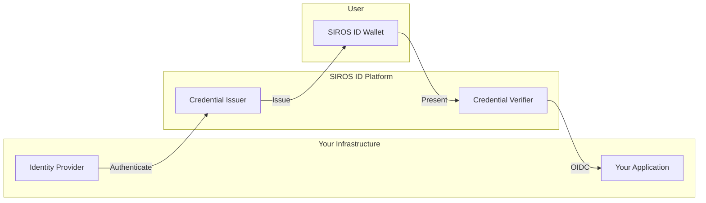

SIROS Developer Docs
====================

## Available Scripts


| Command                     | Description                                      |
|-----------------------------|--------------------------------------------------|
| npm run docusaurus          | Run Docusaurus commands.                         |
| npm start                   | Start the development server.                    |
| npm run build               | Build the static site for production.            |
| npm run swizzle             | Customize Docusaurus components.                 |
| npm run deploy              | Deploy the site to your hosting service.         |
| npm run clear               | Clear the build output directory.                |
| npm run serve               | Serve the built site locally.                    |
| npm run write-translations | Extract translation messages.                    |
| npm run write-heading-ids  | Generate heading IDs for markdown files.         |
| npm run typecheck           | Run TypeScript type checking.                    |

---

## Usage

### Start the Development Server
Run the following command to start the development server:
npm start

This will start a local server, usually at [http://localhost:3000](http://localhost:3000).

---

### Build the Site
To build the site for production, run:
npm run build

This generates static content in the `build` directory.

---

### Deploy the Site
To deploy the site, run:
npm run deploy

This will build and deploy your site to your configured hosting service.

---

### Customize Components
To customize Docusaurus components, run:
npm run swizzle

Follow the prompts to select the component you want to customize.

---

### Type Checking
To run TypeScript type checking, use:
npm run typecheck

---

## Diagram Style Guide

This section documents the visual standards for diagrams in SIROS documentation.

### Mermaid Diagrams

The documentation uses [Mermaid](https://mermaid.js.org/) for diagrams, integrated with Docusaurus.

**Pros:**
- ✅ Version-controlled (text-based)
- ✅ No external dependencies
- ✅ Automatic dark/light mode support
- ✅ Easy to maintain

**Cons:**
- ⚠️ Limited styling options compared to dedicated tools

### Brand Colors

| Purpose | Light Mode | Dark Mode |
|---------|-----------|-----------|
| Primary (SIROS) | `#3B82F6` | `#60A5FA` |
| Success | `#10B981` | `#34D399` |
| Warning | `#F59E0B` | `#FBBF24` |
| Background | `#F3F4F6` | `#374151` |
| Border | `#D1D5DB` | `#4B5563` |
| Text | `#1F2937` | `#F9FAFB` |

### Mermaid Theme Configuration

The custom theme is configured in `docusaurus.config.ts`:

```typescript
mermaid: {
  theme: {
    light: 'base',
    dark: 'dark',
  },
  options: {
    themeVariables: {
      primaryColor: '#EFF6FF',
      primaryTextColor: '#1E40AF',
      primaryBorderColor: '#3B82F6',
      secondaryColor: '#F0FDF4',
      secondaryTextColor: '#166534',
      secondaryBorderColor: '#22C55E',
      tertiaryColor: '#F9FAFB',
      tertiaryTextColor: '#374151',
      tertiaryBorderColor: '#D1D5DB',
      fontFamily: 'Inter, system-ui, -apple-system, sans-serif',
      fontSize: '14px',
      lineColor: '#6B7280',
      nodeTextColor: '#1F2937',
      nodeBorder: '#3B82F6',
      // ...see docusaurus.config.ts for full config
    },
  },
},
```

### Diagram Best Practices

1. **Use subgraphs** to group related components
2. **Add descriptive edge labels** for clarity
3. **Keep diagrams focused** – split complex flows into multiple diagrams
4. **Use consistent naming** – match terminology across diagrams

### Example Diagram



### Alternative Tools (For Complex Diagrams)

For architecture diagrams requiring more polish:

- **[Excalidraw](https://excalidraw.com/)** – Hand-drawn style, export as SVG
- **[D2](https://d2lang.com/)** – Modern diagram scripting language
- **[PlantUML](https://plantuml.com/)** – Extensive theming support

Store exported SVGs in `docs/sirosid/diagrams/` and reference with:
```markdown

```
