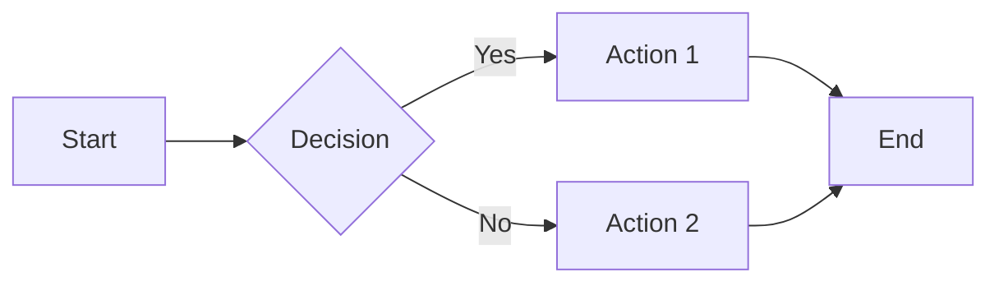
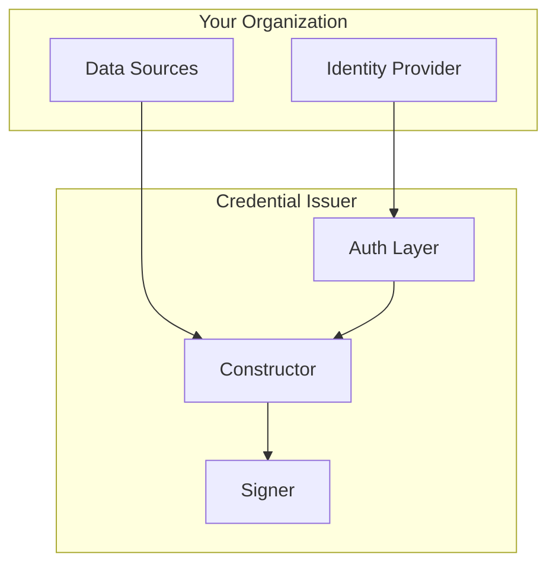
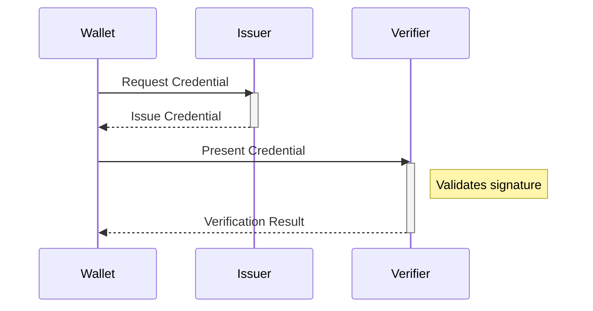
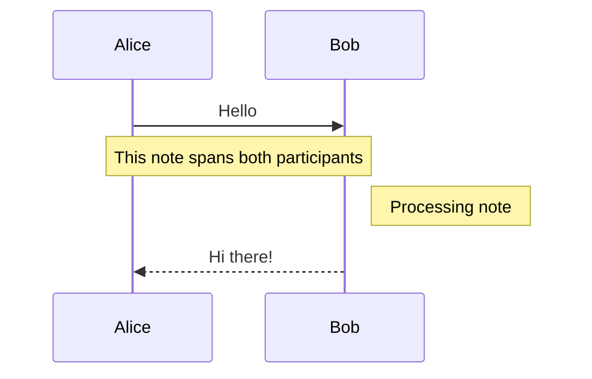
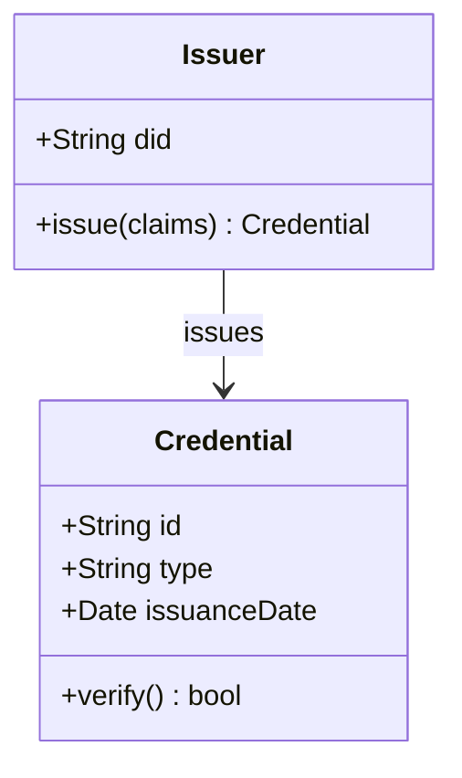
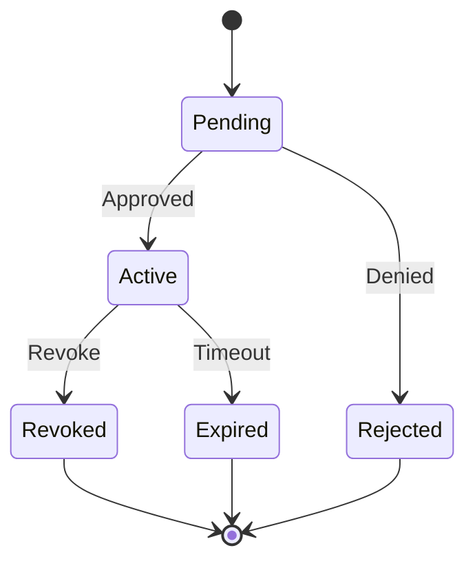
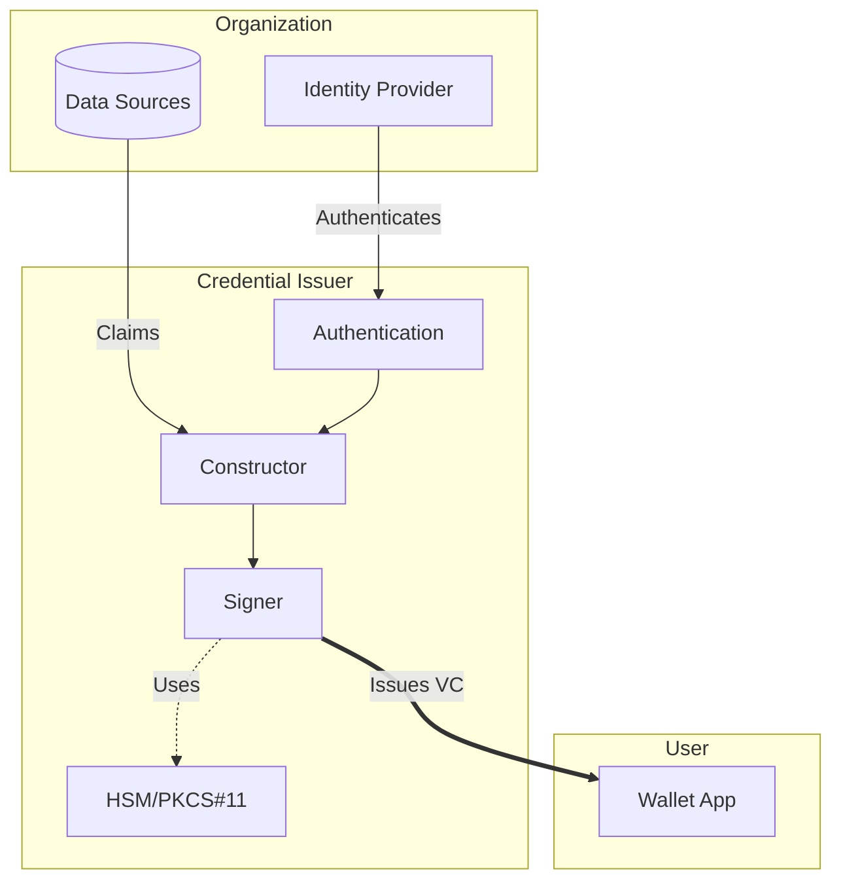

# Mermaid Diagram Style Guide

This guide defines the standard styling conventions for mermaid diagrams in the SIROS documentation. Following these conventions ensures visual consistency across all documentation.

## Color Palette

All diagrams use the **SIROS Brand Blue** (`#1C4587`) as the foundation, with complementary colors for contrast and readability.

### Primary Colors (SIROS Blue Family)

| Usage | Color | Hex |
|-------|-------|-----|
| Light background |  | `#E8EEF7` |
| Medium background |  | `#D4E2F4` |
| **Brand primary** |  | `#1C4587` |
| Dark accent |  | `#14366B` |

### Complement Colors (Orange - for Notes & Highlights)

| Usage | Color | Hex |
|-------|-------|-----|
| Note background |  | `#FFF3E0` |
| Note border |  | `#C75A11` |
| Note text |  | `#7C3A00` |

### Secondary Colors (Teal - for Variety)

| Usage | Color | Hex |
|-------|-------|-----|
| Success/Secondary bg |  | `#E6F4F1` |
| Success border |  | `#198754` |
| Success text |  | `#0F5132` |

## Global Theme Configuration

The theme is configured globally in `docusaurus.config.ts`. Individual diagrams **do not need** frontmatter configuration—the theme applies automatically.

## Flowchart Diagrams

### Basic Structure

### With Subgraphs (Grouping)

Use subgraphs to visually group related components:

### Node Shape Guidelines

| Shape | Syntax | Usage |
|-------|--------|-------|
| Rectangle | `[Text]` | Standard process/action |
| Rounded | `(Text)` | Start/End points |
| Diamond | `{Text}` | Decision points |
| Hexagon | `{{Text}}` | Preparation steps |
| Parallelogram | `[/Text/]` | Input/Output |
| Circle | `((Text))` | Connectors |
| Stadium | `([Text])` | Terminal states |

## Sequence Diagrams

### Basic Structure

### Arrow Types

| Arrow | Syntax | Meaning |
|-------|--------|---------|
| Solid line, solid head | `->>` | Synchronous request |
| Solid line, open head | `->` | Synchronous message |
| Dotted line, solid head | `-->>` | Response |
| Dotted line, open head | `-->` | Async response |

### Notes

Use notes sparingly for important clarifications:

## Class Diagrams

## State Diagrams

## Best Practices

### DO ✅

- **Use meaningful participant aliases** in sequence diagrams (`participant W as Wallet` not just `participant Wallet`)
- **Group related items** using subgraphs in flowcharts
- **Use activation boxes** to show when a participant is processing
- **Keep diagrams focused** on one concept per diagram
- **Use consistent terminology** across diagrams

### DON'T ❌

- Don't add custom colors via `style` directives (use the global theme)
- Don't make diagrams too complex (split into multiple if needed)
- Don't use notes for every message (only for important clarifications)
- Don't mix different arrow types inconsistently

### Sizing Guidelines

- **Max 7±2 participants** in sequence diagrams
- **Max 10-12 nodes** in flowcharts before splitting
- **Keep text concise** in nodes (use abbreviations if needed)

## Accessibility

- The theme is designed with WCAG 2.1 AA contrast ratios
- Blue/orange complement provides good color-blind accessibility
- All diagrams have hover states for interactive feedback
- Dark mode is automatically supported

## Example: Complete Credential Issuance Flow

## Troubleshooting

### Diagram not rendering?

1. Check for syntax errors (use [Mermaid Live Editor](https://mermaid.live))
2. Ensure proper closing of subgraphs
3. Avoid special characters in labels (use quotes if needed: `["Label with (parens)"]`)

### Colors look different?

The global theme handles colors automatically. Avoid using `style` directives.
