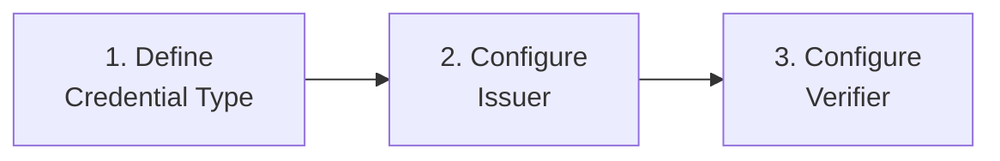

# How to Add a Custom SD-JWT Credential Type

This guide walks through the end-to-end process of defining a new verifiable credential type and integrating it with a SIROS ID issuer and verifier. It covers creating the credential type metadata, configuring issuance, and enabling verification.

The example throughout this guide uses a fictional **Employee Badge** credential issued by an organization to its employees.

## Prerequisites

- A GitHub account (for publishing credential type metadata)
- Access to a SIROS ID issuer (hosted or self-hosted)
- Access to a SIROS ID verifier (hosted or self-hosted)
- A test wallet — open [id.siros.org](https://id.siros.org) and create one if you haven't already

## Overview

Adding a custom credential type involves three phases:



1. **Define** the credential type by creating a VCTM (Verifiable Credential Type Metadata) file and publishing it
2. **Configure** an issuer to construct and sign credentials of this type
3. **Configure** a verifier to request and validate presentations of this type

## Phase 1: Define the Credential Type (VCTM)

A VCTM file defines everything wallets and verifiers need to know about your credential type: the claims it contains, how it should be displayed, and which claims support selective disclosure.

### Option A: Use the VCTM Template Repository (Recommended)

The easiest way to create and publish a VCTM is to use the [vctm-template](https://github.com/sirosfoundation/vctm-template) repository, which automatically generates metadata files from markdown and publishes them to the [SIROS Credential Type Registry](https://registry.siros.org).

#### 1. Create Your Repository

Click **"Use this template"** on the [vctm-template](https://github.com/sirosfoundation/vctm-template) repository to create your own copy.

#### 2. Add a Credential Definition

Create a markdown file in the `credentials/` directory. For the Employee Badge example:

```markdown title="credentials/employee-badge.md"
---
vct: https://example.com/credentials/employee-badge
background_color: "#1a365d"
text_color: "#ffffff"
---

# Employee Badge

An employee identification credential issued by an organization
to verify employment status and role.

## Claims

- `given_name` (string): Employee's given name [mandatory] [sd=always]
- `family_name` (string): Employee's family name [mandatory] [sd=always]
- `email` (string): Employee's work email address [mandatory] [sd=always]
- `employee_id` (string): Employee identifier [mandatory] [sd=always]
- `department` (string): Department name [sd=always]
- `role` (string): Job title or role [sd=always]
- `hire_date` (date): Date of hire [sd=always]

## Images


```

Key elements:

| Element | Purpose |
|---------|---------|
| `vct` (front matter) | Unique identifier for this credential type. Used in OID4VCI and OID4VP protocols. |
| `background_color`, `text_color` | Display hints for wallets rendering the credential card. |
| `[mandatory]` | Marks a claim as required in every issued credential. |
| `[sd=always]` | Enables selective disclosure — the holder can choose whether to share this claim. |

:::tip Choosing a VCT Identifier
The `vct` value is a URI that uniquely identifies your credential type. Use a domain you control. For EU-regulated credentials, URN-based identifiers following the `urn:eudi:` scheme are conventional (e.g., `urn:eudi:pid:arf-1.8:1`).
:::

#### 3. Push and Publish

Push your changes to the `main` branch. The included GitHub Action ([mtcvctm](https://github.com/sirosfoundation/mtcvctm)) will:

1. Parse the markdown and generate a `.vctm.json` file on the `vctm` branch
2. Create a `.well-known/vctm-registry.json` registry index
3. Make the metadata available for discovery by [registry.siros.org](https://registry.siros.org)

After the action completes, your VCTM is available at:

```
https://github.com/<your-org>/<your-repo>/raw/vctm/employee-badge.vctm.json
```

### Option B: Write the VCTM JSON Directly

If you prefer not to use the template repository, you can author a VCTM JSON file manually following the [SD-JWT VC Type Metadata specification](https://datatracker.ietf.org/doc/draft-ietf-oauth-sd-jwt-vc/). A minimal example:

```json title="employee-badge.vctm.json"
{
  "vct": "https://example.com/credentials/employee-badge",
  "name": "Employee Badge",
  "description": "Employee identification credential",
  "display": [
    {
      "lang": "en",
      "name": "Employee Badge",
      "description": "Verifies employment status and role",
      "rendering": {
        "simple": {
          "logo": {
            "uri": "https://example.com/logo.svg",
            "alt_text": "Example Corp"
          },
          "background_color": "#1a365d",
          "text_color": "#ffffff"
        }
      }
    }
  ],
  "claims": [
    {
      "path": ["given_name"],
      "display": [{"lang": "en", "label": "Given Name"}],
      "sd": "always"
    },
    {
      "path": ["family_name"],
      "display": [{"lang": "en", "label": "Family Name"}],
      "sd": "always"
    },
    {
      "path": ["email"],
      "display": [{"lang": "en", "label": "Email"}],
      "sd": "always"
    },
    {
      "path": ["employee_id"],
      "display": [{"lang": "en", "label": "Employee ID"}],
      "sd": "always"
    },
    {
      "path": ["department"],
      "display": [{"lang": "en", "label": "Department"}],
      "sd": "always"
    },
    {
      "path": ["role"],
      "display": [{"lang": "en", "label": "Role"}],
      "sd": "always"
    },
    {
      "path": ["hire_date"],
      "display": [{"lang": "en", "label": "Hire Date"}],
      "sd": "always"
    }
  ]
}
```

Host this file at a stable URL accessible to your issuer. If you want it discoverable through the SIROS registry, see [Credential Type Registry](../sirosid/reference/vctm-registry).

## Phase 2: Configure the Issuer

With the credential type defined, configure the SIROS ID issuer to construct and sign credentials of this type. The issuer needs to know:

- Where to find the VCTM
- How to authenticate users
- How to map identity claims to credential claims

### 2.1 Place the VCTM File

Make the VCTM file available to the issuer. For Docker deployments, mount it into the container:

```yaml title="docker-compose.yml (snippet)"
services:
  issuer:
    volumes:
      - ./metadata/employee-badge.vctm.json:/metadata/vctm_employee_badge.json:ro
```

### 2.2 Add the Credential Constructor

Add an entry to the `credential_constructor` section of your issuer configuration. The `auth_method` determines how users authenticate before receiving the credential.

#### Using OIDC Authentication

If your organization has an OIDC identity provider (Keycloak, Azure AD, Okta, etc.):

```yaml title="config.yaml (snippet)"
credential_constructor:
  employee_badge:
    vctm_file_path: "/metadata/vctm_employee_badge.json"
    auth_method: oidc
    format: "dc+sd-jwt"

apigw:
  oidcrp:
    enabled: true
    client_id: "issuer-client"
    client_secret: "${OIDC_CLIENT_SECRET}"
    provider_metadata_url: "https://keycloak.example.com/realms/corp/.well-known/openid-configuration"
    scopes:
      - openid
      - profile
      - email
    credential_config_id: "employee_badge"
```

The issuer maps OIDC claims from the ID token to credential claims automatically when claim names match (e.g., `given_name` → `given_name`). For non-matching names, configure explicit mappings.

#### Using SAML Authentication

For organizations with SAML-based identity federations:

```yaml title="config.yaml (snippet)"
credential_constructor:
  employee_badge:
    vctm_file_path: "/metadata/vctm_employee_badge.json"
    auth_method: saml
    format: "dc+sd-jwt"

apigw:
  saml:
    enabled: true
    entity_id: "https://issuer.example.com/sp"
    acs_endpoint: "https://issuer.example.com/saml/acs"
    certificate_path: "/pki/sp-cert.pem"
    private_key_path: "/pki/sp-key.pem"
    credential_mappings:
      - credential_config_id: "employee_badge"
        entity_ids:
          - "https://idp.example.com/idp"
        attributes:
          "urn:oid:2.5.4.42":
            claim: "given_name"
            required: true
          "urn:oid:2.5.4.4":
            claim: "family_name"
            required: true
          "urn:oid:0.9.2342.19200300.100.1.3":
            claim: "email"
            required: true
```

#### Using Pre-Authorized Code (API Integration)

For server-to-server issuance where your backend pushes credential data directly:

```yaml title="config.yaml (snippet)"
credential_constructor:
  employee_badge:
    vctm_file_path: "/metadata/vctm_employee_badge.json"
    auth_method: basic
    format: "dc+sd-jwt"

issuer:
  pre_authorized_code:
    enabled: true
    pin_required: false
    code_ttl: 300
```

Then issue credentials using the REST API:

```bash
# Push document data and get a pre-authorized code
curl -X POST https://issuer.example.com/api/v1/documents \
  -H "Authorization: Bearer ${API_TOKEN}" \
  -H "Content-Type: application/json" \
  -d '{
    "credential_config_id": "employee_badge",
    "claims": {
      "given_name": "Alice",
      "family_name": "Smith",
      "email": "alice.smith@example.com",
      "employee_id": "EMP-12345",
      "department": "Engineering",
      "role": "Senior Developer",
      "hire_date": "2023-03-15"
    }
  }'
```

The response includes a credential offer URI that can be delivered to the user as a QR code or deep link.

See [API Integration](../sirosid/issuers/api-integration) for the full API reference.

### 2.3 Choosing an Auth Method

| Auth Method | When to Use |
|-------------|-------------|
| `oidc` | Your organization uses an OIDC identity provider (Keycloak, Azure AD, Okta) |
| `saml` | Your organization participates in a SAML federation (eduGAIN, national eID) |
| `basic` | Your backend system has verified user data and pushes it via API |
| `openid4vp` | Users must present an existing credential to prove eligibility |

For the `openid4vp` method, you also specify which credential types and claims the user must present:

```yaml
credential_constructor:
  employee_badge:
    vctm_file_path: "/metadata/vctm_employee_badge.json"
    auth_method: openid4vp
    auth_scopes: ["pid_1_8"]
    auth_claims: ["given_name", "family_name", "birthdate"]
    format: "dc+sd-jwt"
```

## Phase 3: Configure the Verifier

The verifier needs to know which credential types it accepts and how to map credential claims into the OIDC ID tokens it produces for your application.

### 3.1 Register Credential Scopes

Map an OIDC scope to your credential type so applications can request it:

```yaml title="config.yaml (snippet)"
verifier:
  openid4vp:
    supported_credentials:
      - vct: "https://example.com/credentials/employee-badge"
        scopes: ["employee"]
```

Applications then include `employee` in their OIDC `scope` parameter to trigger a presentation request for this credential.

### 3.2 Configure DCQL Queries (Optional)

For more granular control over which claims are requested, define a [DCQL](https://openid.net/specs/openid-4-verifiable-presentations-1_0.html#name-digital-credentials-query-l) query:

```yaml title="presentation_request.yaml"
credentials:
  - id: employee_badge
    format: vc+sd-jwt
    meta:
      vct_values:
        - "https://example.com/credentials/employee-badge"
    claims:
      - path: ["given_name"]
      - path: ["family_name"]
      - path: ["employee_id"]
      - path: ["department"]
```

### 3.3 Map Claims to OIDC ID Token

Configure how credential claims appear in the OIDC ID token returned to your application:

```yaml title="config.yaml (snippet)"
verifier:
  claim_mapping:
    given_name: "$.vc.credentialSubject.given_name"
    family_name: "$.vc.credentialSubject.family_name"
    email: "$.vc.credentialSubject.email"
    employee_id: "$.vc.credentialSubject.employee_id"
    department: "$.vc.credentialSubject.department"
```

Your application then receives these claims in a standard OIDC ID token:

```json
{
  "iss": "https://verifier.example.org",
  "sub": "pairwise-user-id",
  "aud": "your-client-id",
  "given_name": "Alice",
  "family_name": "Smith",
  "email": "alice.smith@example.com",
  "employee_id": "EMP-12345",
  "department": "Engineering"
}
```

### 3.4 Register the Verifier Client

If your application doesn't already have a client registration with the verifier, register one:

```bash
curl -X POST https://verifier.example.org/register \
  -H "Content-Type: application/json" \
  -d '{
    "client_name": "My Application",
    "redirect_uris": ["https://my-app.example.com/callback"],
    "token_endpoint_auth_method": "client_secret_post",
    "grant_types": ["authorization_code"],
    "response_types": ["code"],
    "scope": "openid profile employee"
  }'
```

## Phase 4: Establish Trust

For the verifier to accept credentials from your issuer, the issuer must be trusted. SIROS ID supports several trust frameworks — choose the one that fits your deployment:

| Trust Framework | Use Case | Documentation |
|----------------|----------|---------------|
| **URL Whitelist** | Development and small deployments | Simple list of trusted issuer URLs |
| **ETSI Trust Status Lists** | EU-regulated environments | [Trust Infrastructure](../sirosid/trust/) |
| **Lists of Trusted Entities (LoTE)** | JSON-based trust lists | [LoTE Publishing](../sirosid/trust/lote-publishing) |
| **OpenID Federation** | Dynamic, federated trust | [OpenID Federation](../sirosid/trust/openid-federation) |

For development, a URL whitelist is the simplest approach. For production, use the trust framework required by your regulatory environment.

See [Trust Services](../sirosid/trust/) for detailed setup instructions.

## Testing the Full Flow

### 1. Issue a Test Credential

1. Open the [SIROS ID Credential Manager](https://id.siros.org) (or any OID4VCI-compatible wallet)
2. Navigate to **Add Credential** and select your issuer
3. Authenticate with your identity provider
4. Accept the credential — it should appear in your wallet with the display properties you defined in the VCTM

### 2. Verify the Credential

1. In your application, trigger a login that uses the verifier as identity provider
2. The verifier displays a QR code (or uses the W3C Digital Credentials API if supported by the browser)
3. Scan the QR code with your wallet
4. Review the claims being requested and approve
5. Your application receives the mapped claims in the OIDC ID token

### 3. Verify Selective Disclosure

Test that selective disclosure works correctly:

1. Configure the verifier to request only a subset of claims (e.g., `given_name` and `department`)
2. Verify that the wallet only asks the user to share those specific claims
3. Confirm the ID token contains only the requested claims

## Troubleshooting

| Symptom | Likely Cause | Fix |
|---------|-------------|-----|
| Credential not appearing in wallet | VCTM not found or invalid | Check that the VCTM file is mounted correctly and valid JSON |
| Authentication fails during issuance | IdP misconfiguration | Verify redirect URIs, client credentials, and scopes |
| Verifier rejects credential | Issuer not trusted | Add the issuer to the trust framework (see Phase 4) |
| Claims missing in ID token | Claim mapping mismatch | Check `claim_mapping` paths against actual credential structure |
| Wallet shows raw claim names | Missing VCTM display metadata | Add `display` entries for each claim in the VCTM |

## Next Steps

- [Issuer Configuration](../sirosid/issuers/issuer) — Full issuer configuration reference
- [Verifier Configuration](../sirosid/verifiers/verifier) — Full verifier configuration reference
- [API Integration](../sirosid/issuers/api-integration) — Server-to-server credential issuance
- [Trust Services](../sirosid/trust/) — Trust framework setup
- [Credential Type Registry](../sirosid/reference/vctm-registry) — Publishing credential metadata
