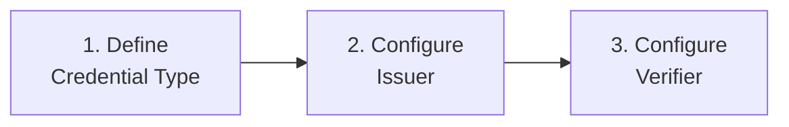

# How to Add a Custom SD-JWT Credential Type

This guide walks through the end-to-end process of defining a new verifiable credential type and integrating it with a SIROS ID issuer and verifier. It covers creating the credential type metadata, configuring issuance, and enabling verification.

The example throughout this guide uses a fictional **Employee Badge** credential issued by an organization to its employees.

## Prerequisites

- A GitHub account (for publishing credential type metadata)
- Access to a SIROS ID issuer (hosted or self-hosted)
- Access to a SIROS ID verifier (hosted or self-hosted)
- A test wallet — open [id.siros.org](https://id.siros.org) and create one if you haven't already

## Overview

Adding a custom credential type involves three phases:


```mermaid
flowchart LR
    A["1. Define\nCredential Type"] --> B["2. Configure\nIssuer"]
    B --> C["3. Configure\nVerifier"]
```

1. **Define** the credential type by creating a VCTM (Verifiable Credential Type Metadata) file and publishing it
2. **Configure** an issuer to construct and sign credentials of this type
3. **Configure** a verifier to request and validate presentations of this type

## Phase 1: Define the Credential Type (VCTM)

A VCTM file defines everything wallets and verifiers need to know about your credential type: the claims it contains, how it should be displayed, and which claims support selective disclosure.

### Step 1: Author the Credential Definition

Create a markdown file describing your credential. For the Employee Badge example:

```markdown title="credentials/employee-badge.md"
---
vct: https://example.com/credentials/employee-badge
background_color: "#1a365d"
text_color: "#ffffff"
---

# Employee Badge

An employee identification credential issued by an organization
to verify employment status and role.

## Claims

- `given_name` (string): Employee's given name [mandatory] [sd=always]
- `family_name` (string): Employee's family name [mandatory] [sd=always]
- `email` (string): Employee's work email address [mandatory] [sd=always]
- `employee_id` (string): Employee identifier [mandatory] [sd=always]
- `department` (string): Department name [sd=always]
- `role` (string): Job title or role [sd=always]
- `hire_date` (date): Date of hire [sd=always]

## Images


```

Key elements:

| Element | Purpose |
|---------|---------|
| `vct` (front matter) | Unique identifier for this credential type. Used in OID4VCI and OID4VP protocols. |
| `background_color`, `text_color` | Display hints for wallets rendering the credential card. |
| `[mandatory]` | Marks a claim as required in every issued credential. |
| `[sd=always]` | Enables selective disclosure — the holder can choose whether to share this claim. |

#### Nested claims

Claims that contain sub-fields can be expressed using Markdown sub-lists. Use `(object)` for structured data and `(array)` for repeating items:

```markdown
## Claims

- `employee_id` (string): Employee identifier [mandatory] [sd=always]
- `department` (object): Department details
    - `name` (string): Department name [mandatory]
    - `code` (string): Department code
    - `location` (string): Office location
- `certifications` (array): Professional certifications
    - `name` (string): Certification name [mandatory]
    - `issuer` (string): Certifying body
    - `date` (date): Date obtained
```

See the [registry-cli nested claims reference](../sirosid/registry/registry-cli#nested-claims) for how each output format represents nested structures.

#### Per-credential format selection

By default, registry-cli generates metadata in all supported formats (SD-JWT VCTM, mDOC MDDL, W3C VCDM 2.0, JSON Schema). To restrict which formats are generated for a specific credential, add a `formats` field to the front matter:

```markdown
---
vct: https://example.com/credentials/employee-badge
formats: sd-jwt, w3c
background_color: "#1a365d"
text_color: "#ffffff"
---
```

See the [registry-cli format override reference](../sirosid/registry/registry-cli#per-credential-formats) for supported format names and aliases.

:::tip Choosing a VCT Identifier
The `vct` value is a URI that uniquely identifies your credential type. Use a domain you control. For EU-regulated credentials, URN-based identifiers following the `urn:eudi:` scheme are conventional (e.g., `urn:eudi:pid:arf-1.8:1`).
:::

You can also write a `.vctm.json` file directly instead of markdown (see [Alternative: Write the VCTM JSON Directly](#alternative-write-the-vctm-json-directly) below).

### Step 2: Publish to a Credential Type Registry

Once you have your credential definition, you need to publish it so issuers, verifiers, and wallets can discover it. There are two approaches:

#### Option A: Publish to registry.siros.org (Recommended for Public Credentials)

[registry.siros.org](https://registry.siros.org) is the public SIROS Credential Type Registry. It is built automatically by [registry-cli](https://github.com/sirosfoundation/registry-cli) and hosted on GitHub Pages. **GitHub is the write API** — there are no PUT/DELETE endpoints. Instead, you publish credentials by pushing to a GitHub repository, and the registry discovers them automatically.

**How registry.siros.org works:**

1. A [`sources.yaml`](https://github.com/sirosfoundation/registry.siros.org/blob/main/sources.yaml) file declares which GitHub repositories to scan
2. Repositories tagged with the `vctm` GitHub topic are **autodiscovered** — no manual registration needed
3. A GitHub Actions workflow runs `registry-cli build` every 6 hours, cloning all source repositories and detecting credential definitions
4. The built site is deployed to GitHub Pages at `https://registry.siros.org`

**To get your credential listed on registry.siros.org:**

1. Fork or copy the [vctm-template](https://github.com/sirosfoundation/vctm-template) repository to create your own
2. Place your credential markdown file(s) in the `credentials/` directory
3. Push to the `main` branch — `registry-cli` will automatically convert your markdown to credential metadata during the next registry build cycle
4. Tag your repository with the `vctm` GitHub topic so the registry autodiscovers it

After the next registry build cycle (up to 6 hours), your credential appears at:

```
https://registry.siros.org/<your-org>/<slug>.vctm.json
```

The registry also provides a TS11-compliant API with JWS-signed responses:

```
https://registry.siros.org/api/v1/schemas.json          # All schemas
https://registry.siros.org/api/v1/schemas/<id>.json      # Individual schema
```

:::info Authorization on registry.siros.org
Since GitHub is the write API, access control is handled through GitHub's standard mechanisms: repository permissions, branch protection rules, and pull request reviews. To add or update a credential, you push a commit. To remove one, you delete or untag the repository.
:::

#### Option B: Run Your Own Registry (For Private or On-Premise Deployments)

If you need a private credential catalogue, want full control over the build pipeline, or operate in an air-gapped environment, you can run [registry-cli](https://github.com/sirosfoundation/registry-cli) yourself. A Docker image is published to `ghcr.io/sirosfoundation/registry-cli` for every release.

**Key differences from registry.siros.org:**

| | registry.siros.org | Self-hosted registry |
|---|---|---|
| **Hosting** | GitHub Pages (static) | You choose: any static file server, S3, Caddy, nginx, etc. |
| **Source discovery** | GitHub topic autodiscovery | Any mix of GitHub topics, explicit git URLs, or local directories |
| **Build trigger** | GitHub Actions (every 6 hours) | You decide: cron, CI/CD, manual |
| **Access control** | GitHub repository permissions | Your infrastructure's access controls |
| **JWS signing** | PKCS#11 with production HSM | Dev keys, SoftHSM, or your own HSM |
| **Credential sources** | Public GitHub repositories only | Git repos (public or private), local directories (`file://`) |

**Quick start with Docker Compose:**

1. Create a `sources.yaml`:

```yaml title="sources/sources.yaml"
defaults:
  branch: vctm

sources:
  # Autodiscover from your GitHub org
  - "github:topic/vctm?org=your-org"

  # Explicit private repository
  - "git:https://github.com/your-org/private-credentials.git"

  # Local directory (useful for air-gapped environments)
  - url: "file:///data/sources/local-creds"
    organization: "MyOrg"
```

2. Run with Docker Compose:

```yaml title="docker-compose.yml"
services:
  registry:
    image: ghcr.io/sirosfoundation/registry-cli:latest
    ports:
      - "8080:8080"
    volumes:
      - ./sources:/data/sources
      - ./output:/data/output
    environment:
      - GITHUB_TOKEN=${GITHUB_TOKEN:-}
```

```bash
docker compose up
# Open http://localhost:8080
```

Set `GITHUB_TOKEN` if your sources include GitHub topic searches or private repositories. Mount `./sources` read-write: for a local `file://` source registry-cli writes the generated files (`.vctm.json`, `.mdoc.json`, …) next to your markdown.

3. For production, build the static site and deploy it to your web server:

```bash
docker run --rm \
  -v ./sources:/data/sources \
  -v ./output:/data/output \
  -e GITHUB_TOKEN="${GITHUB_TOKEN}" \
  ghcr.io/sirosfoundation/registry-cli:latest \
  build \
    --sources /data/sources/sources.yaml \
    --output /data/output \
    --base-url https://registry.your-org.com
```

Then serve the `./output` directory with any static file server.

See the [registry-cli documentation](https://github.com/sirosfoundation/registry-cli) for full configuration options including JWS signing, SoftHSM setup, and TS11 compliance testing.

### Alternative: Write the VCTM JSON Directly

If you prefer not to use the markdown authoring workflow, you can write a VCTM JSON file directly following the [SD-JWT VC Type Metadata specification](https://datatracker.ietf.org/doc/draft-ietf-oauth-sd-jwt-vc/). A minimal example:

```json title="employee-badge.vctm.json"
{
  "vct": "https://example.com/credentials/employee-badge",
  "name": "Employee Badge",
  "description": "Employee identification credential",
  "display": [
    {
      "locale": "en",
      "name": "Employee Badge",
      "description": "Verifies employment status and role",
      "rendering": {
        "simple": {
          "logo": {
            "uri": "https://example.com/logo.svg",
            "alt_text": "Example Corp"
          },
          "background_color": "#1a365d",
          "text_color": "#ffffff"
        }
      }
    }
  ],
  "claims": [
    {
      "path": ["given_name"],
      "display": [{"locale": "en", "label": "Given Name"}],
      "sd": "always"
    },
    {
      "path": ["family_name"],
      "display": [{"locale": "en", "label": "Family Name"}],
      "sd": "always"
    },
    {
      "path": ["email"],
      "display": [{"locale": "en", "label": "Email"}],
      "sd": "always"
    },
    {
      "path": ["employee_id"],
      "display": [{"locale": "en", "label": "Employee ID"}],
      "sd": "always"
    },
    {
      "path": ["department"],
      "display": [{"locale": "en", "label": "Department"}],
      "sd": "always"
    },
    {
      "path": ["role"],
      "display": [{"locale": "en", "label": "Role"}],
      "sd": "always"
    },
    {
      "path": ["hire_date"],
      "display": [{"locale": "en", "label": "Hire Date"}],
      "sd": "always"
    }
  ]
}
```

Host this file at a stable URL accessible to your issuer, or place it in a repository that your registry discovers. Both registry.siros.org and self-hosted registries detect `.vctm.json` files automatically.

## Phase 2: Configure the Issuer

With the credential type defined, configure the SIROS ID issuer to construct and sign credentials of this type. The issuer needs to know:

- Where to find the VCTM
- How to authenticate users
- How to map identity claims to credential claims

### 2.1 Place the VCTM File

Make the VCTM file available to the issuer. For Docker deployments, mount it into the container:

```yaml title="docker-compose.yml (snippet)"
services:
  apigw:
    volumes:
      - ./metadata/employee-badge.vctm.json:/metadata/vctm_employee_badge.json:ro
```

### 2.2 Declare the Credential Type and Its Data Source

This takes two config sections:

- `common.credential_metadata.<scope>` declares the type — which VCTM describes
  it and which format to issue.
- `apigw.data_sources.<category>.scopes.<scope>` says where the data comes from
  (`assertion`, `datastore` or `external_api`) and which `auth_provider`
  authenticates the user.

#### Using OIDC Authentication

If your organization has an OIDC identity provider (Keycloak, Azure AD, Okta, etc.):

```yaml title="config.yaml (snippet)"
common:
  credential_metadata:
    employee_badge:
      vctm_file_path: "/metadata/vctm_employee_badge.json"
      format: "dc+sd-jwt"

apigw:
  auth_providers:
    oidc:
      enable: true
      issuer_url: "https://keycloak.example.com/realms/corp"
      redirect_uri: "https://issuer.example.com/oidcrp/callback"
      registration:
        preconfigured:
          enable: true
          client_id: "issuer-client"
          client_secret: "the-client-secret"
      scopes:
        - openid
        - profile
        - email

  # Bind the scope to OIDC: the ID token's claims are the credential data
  data_sources:
    assertion:
      scopes:
        employee_badge:
          auth_provider: oidc
```

The issuer maps OIDC claims from the ID token to credential claims automatically when claim names match (e.g., `given_name` → `given_name`). For non-matching names, configure `apigw.auth_providers.oidc.attribute_mapping`. Claims that the credential needs but the ID token does not carry (for example expiry dates) can be supplied with `defaults` and `expiry_duration` on the `data_sources.assertion.scopes.<scope>` entry.

#### Using SAML Authentication

For organizations with SAML-based identity federations:

```yaml title="config.yaml (snippet)"
common:
  credential_metadata:
    employee_badge:
      vctm_file_path: "/metadata/vctm_employee_badge.json"
      format: "dc+sd-jwt"

apigw:
  auth_providers:
    saml:
      enable: true
      entity_id: "https://issuer.example.com/sp"
      acs_endpoint: "https://issuer.example.com/saml/acs"
      certificate_path: "/pki/sp-cert.pem"
      private_key_path: "/pki/sp-key.pem"
      # Exactly one IdP metadata source is required: mdq_server or static_idp_metadata
      mdq_server: "https://md.example.org/entities/"           # must end with /
      metadata_signing_cert_path: "/pki/mdq-signing-cert.pem"  # MDQ/URL metadata must be signed
      attribute_mapping:
        "urn:oid:2.5.4.42":
          claim: "given_name"
          required: true
        "urn:oid:2.5.4.4":
          claim: "family_name"
          required: true
        "urn:oid:0.9.2342.19200300.100.1.3":
          claim: "email"
          required: true

  data_sources:
    assertion:
      scopes:
        employee_badge:
          auth_provider: saml
```

Instead of an MDQ server you can point the issuer at a single IdP with `static_idp_metadata` (`entity_id` plus `metadata_path` or `metadata_url`). Unsigned MDQ/URL metadata is only accepted with `allow_unsigned_metadata: true`, which is insecure and for development only.

Attribute mapping is per auth provider, not per credential type — one SAML
`attribute_mapping` normalises the assertion for every scope that uses it.

#### Using Pre-Authorized Code (API Integration)

For server-to-server issuance where your backend pushes credential data directly:

```yaml title="config.yaml (snippet)"
common:
  credential_metadata:
    employee_badge:
      vctm_file_path: "/metadata/vctm_employee_badge.json"
      format: "dc+sd-jwt"

apigw:
  auth_providers:
    preauth:
      # true adds a numeric transaction code the wallet must present
      enable_pin: false

  data_sources:
    datastore:
      scopes:
        employee_badge:
          # Required: /api/v1/datastore/preauth_offer refuses any scope whose
          # datastore auth_provider is not "preauth", so that it cannot be
          # used to bypass a SAML/OIDC/OpenID4VP flow declared elsewhere.
          auth_provider: preauth
```

Your backend uploads the document and then creates the offer with
`POST /api/v1/datastore/preauth_offer` — see [API Integration](../sirosid/issuers/api-integration).

Then issue credentials using the REST API:

```bash
# 1. Create an identity mapping (if not already created)
curl -X POST https://issuer.example.com/api/v1/identity/mapping \
  -H "Authorization: Bearer ${JWT_TOKEN}" \
  -H "Content-Type: application/json" \
  -d '{
    "authentic_source": "hr.example.org",
    "authentic_source_person_id": "EMP-12345",
    "attributes": {
      "family_name": "Smith",
      "given_name": "Alice",
      "birth_date": "1990-05-15"
    }
  }'
# The response is {"authentic_source_person_id": "EMP-12345"}; this person id
# is what the next step references in identity_mapping_ids

# 2. Upload document data to the datastore
curl -X POST https://issuer.example.com/api/v1/datastore \
  -H "Authorization: Bearer ${JWT_TOKEN}" \
  -H "Content-Type: application/json" \
  -d '{
    "meta": {
      "authentic_source": "hr.example.org",
      "scope": "employee_badge",
      "document_id": "emp-badge-001"
    },
    "identity_mapping_ids": ["EMP-12345"],
    "document_data": {
      "given_name": "Alice",
      "family_name": "Smith",
      "email": "alice.smith@example.com",
      "employee_id": "EMP-12345",
      "department": "Engineering",
      "role": "Senior Developer",
      "hire_date": "2023-03-15"
    }
  }'

# 3. Create the pre-authorized credential offer for the uploaded document
curl -X POST https://issuer.example.com/api/v1/datastore/preauth_offer \
  -H "Authorization: Bearer ${JWT_TOKEN}" \
  -H "Content-Type: application/json" \
  -d '{
    "authentic_source": "hr.example.org",
    "scope": "employee_badge",
    "document_id": "emp-badge-001"
  }'
```

The reply contains `credential_offer`, `credential_offer_url` and, when `enable_pin` is true, a `tx_code` that you must deliver to the user out-of-band. Deliver the offer (for example as a QR code or deep link) to the user so they can receive the credential in their wallet.

See [API Integration](../sirosid/issuers/api-integration) for the full API reference.

### 2.3 Choosing an Auth Method

| Auth Method | When to Use |
|-------------|-------------|
| `oidc` | Your organization uses an OIDC identity provider (Keycloak, Azure AD, Okta) |
| `saml` | Your organization participates in a SAML federation (eduGAIN, national eID) |
| `preauth` | Your backend system has verified user data and pushes it via API (pre-authorized code) |
| `openid4vp` | Users must present an existing credential to prove eligibility |

For the `openid4vp` method, you also specify which credential types and claims the user must present:

```yaml
common:
  credential_metadata:
    employee_badge:
      vctm_file_path: "/metadata/vctm_employee_badge.json"
      format: "dc+sd-jwt"

apigw:
  data_sources:
    datastore:
      scopes:
        employee_badge:
          auth_provider: openid4vp
          # Identity-mapping namespace the lookup runs in
          authentic_source: "hr.example.org"
          # Credential types the user may present to authenticate (any one of
          # them), each with the claims taken from it for the identity lookup
          auth_scopes:
            pid:
              auth_claims: [given_name, family_name, birth_date]
```

The valid `auth_provider` values depend on the data source: `datastore` accepts `oidc`, `saml`, `openid4vp` and `preauth`; `assertion` and `external_api` accept `saml` and `oidc`. A further data source type, `presentation`, derives the credential from a credential presented by the user (`openid4vp`).

## Phase 3: Configure the Verifier

The verifier needs to know which credential types it accepts and how to map credential claims into the OIDC ID tokens it produces for your application.

### 3.1 Register Credential Scopes

Map an OIDC scope to your credential type so applications can request it:

```yaml title="config.yaml (snippet)"
verifier:
  inbound:
    openid4vp:
      token_endpoint: "https://verifier.example.org/token"
      presentation_requests_dir: "/presentation_requests"
      clients:
        my-app:
          type: "public"
          redirect_uri: "https://my-app.example.com/callback"
          scopes: ["employee"]
      supported_credentials:
        - vct: "https://example.com/credentials/employee-badge"
          scopes: ["employee"]
  outbound:
    oidc_provider:
      issuer: "https://verifier.example.org"
      subject_type: "public"
      subject_salt: "change-me"
      code_duration: 300
      session_duration: 3600
      access_token_duration: 3600
      id_token_duration: 3600
      refresh_token_duration: 86400
```

Applications then include `employee` in their OIDC `scope` parameter to trigger a presentation request for this credential. The configuration is validated at startup: every scope used by a configured client must be listed in `supported_credentials`, and every scope in `supported_credentials` must be used by at least one client. The `outbound.oidc_provider` section is the OIDC provider that issues the ID tokens described below; claim mappings and the `/register` endpoint exist only when it is configured.

### 3.2 Configure DCQL Queries (Optional)

For more granular control over which claims are requested, define a [DCQL](https://openid.net/specs/openid-4-verifiable-presentations-1_0.html#name-digital-credentials-query-l) query:

```yaml title="presentation_requests/employee.yaml"
templates:
  - id: "employee_badge"
    name: "Employee Badge"
    version: "1.0"
    oidc_scopes: ["employee"]
    dcql:
      credentials:
        - id: employee_badge
          format: dc+sd-jwt
          meta:
            vct_values:
              - "https://example.com/credentials/employee-badge"
          claims:
            - path: ["given_name"]
            - path: ["family_name"]
            - path: ["email"]
            - path: ["employee_id"]
            - path: ["department"]
    claim_mappings:
      "*": "*"
    enabled: true
```

### 3.3 Map Claims to OIDC ID Token

How credential claims appear in the OIDC ID token is part of the same
presentation-request template, under `claim_mappings` — it is not a separate
config-file section. Replace the `"*": "*"` pass-through above when you want to
rename or drop claims:

```yaml title="presentation_requests/employee.yaml (snippet)"
    claim_mappings:
      given_name: "given_name"
      family_name: "family_name"
      email: "email"
      employee_id: "employee_id"
      department: "department"
```

Your application then receives these claims in a standard OIDC ID token:

```json
{
  "iss": "https://verifier.example.org",
  "sub": "subject-id",
  "aud": "your-client-id",
  "given_name": "Alice",
  "family_name": "Smith",
  "email": "alice.smith@example.com",
  "employee_id": "EMP-12345",
  "department": "Engineering"
}
```

### 3.4 Register the Verifier Client

If your application doesn't already have a client registration with the verifier, register one:

```bash
curl -X POST https://verifier.example.org/register \
  -H "Content-Type: application/json" \
  -d '{
    "client_name": "My Application",
    "redirect_uris": ["https://my-app.example.com/callback"],
    "token_endpoint_auth_method": "client_secret_post",
    "grant_types": ["authorization_code"],
    "response_types": ["code"],
    "scope": "openid profile employee"
  }'
```

`POST /register` is open by default; to require a bearer token or a signed JWT set `verifier.outbound.oidc_provider.dynamic_registration_auth` (see [Verifier Configuration](../sirosid/verifiers/verifier)). A client with fixed credentials can instead be listed under `outbound.oidc_provider.static_clients`.

## Phase 4: Establish Trust

For the verifier to accept credentials from your issuer, the issuer must be trusted. SIROS ID supports several trust frameworks — choose the one that fits your deployment:

| Trust Framework | Use Case | Documentation |
|----------------|----------|---------------|
| **URL Whitelist** | Development and small deployments | Simple list of trusted issuer URLs |
| **ETSI Trust Status Lists** | EU-regulated environments | [Trust Infrastructure](../sirosid/trust/) |
| **Lists of Trusted Entities (LoTE)** | JSON-based trust lists | [LoTE Publishing](../sirosid/trust/lote-publishing) |
| **OpenID Federation** | Dynamic, federated trust | [OpenID Federation](../sirosid/trust/openid-federation) |

For development, a URL whitelist is the simplest approach. For production, use the trust framework required by your regulatory environment.

:::caution A PDP is required
Every trust framework above is applied by a PDP such as [go-trust](../sirosid/trust/go-trust), which the verifier reaches through `verifier.trust.pdp_url` (and the issuer through `apigw.trust.pdp_url`). A PDP is required for production use. Without `pdp_url` trust is allow-all and only local `did:key`/`did:jwk` keys can be resolved — use that for testing and development only.
:::

See [Trust Services](../sirosid/trust/) for detailed setup instructions.

## Testing the Full Flow

### 1. Issue a Test Credential

1. Open the [SIROS ID Credential Manager](https://id.siros.org) (or any OID4VCI-compatible wallet)
2. Navigate to **Add Credential** and select your issuer
3. Authenticate with your identity provider
4. Accept the credential — it should appear in your wallet with the display properties you defined in the VCTM

### 2. Verify the Credential

1. In your application, trigger a login that uses the verifier as identity provider
2. The verifier displays a QR code (or uses the W3C Digital Credentials API if supported by the browser)
3. Scan the QR code with your wallet
4. Review the claims being requested and approve
5. Your application receives the mapped claims in the OIDC ID token

### 3. Verify Selective Disclosure

Test that selective disclosure works correctly:

1. Configure the verifier to request only a subset of claims (e.g., `given_name` and `department`)
2. Verify that the wallet only asks the user to share those specific claims
3. Confirm the ID token contains only the requested claims

## Troubleshooting

| Symptom | Likely Cause | Fix |
|---------|-------------|-----|
| Credential not appearing in wallet | VCTM not found or invalid | Check that the VCTM file is mounted correctly and valid JSON |
| Authentication fails during issuance | IdP misconfiguration | Verify redirect URIs, client credentials, and scopes |
| Verifier rejects credential | Issuer not trusted | Add the issuer to the trust framework (see Phase 4) |
| Claims missing in ID token | Claim mapping mismatch | Check the template's `claim_mappings` keys against the claim names the credential actually discloses |
| Wallet shows raw claim names | Missing VCTM display metadata | Add `display` entries for each claim in the VCTM |

## Next Steps

- [registry-cli](https://github.com/sirosfoundation/registry-cli) — Self-hosted credential type registry
- [registry.siros.org](https://registry.siros.org) — Public SIROS Credential Type Registry
- [Issuer Configuration](../sirosid/issuers/issuer) — Full issuer configuration reference
- [Verifier Configuration](../sirosid/verifiers/verifier) — Full verifier configuration reference
- [API Integration](../sirosid/issuers/api-integration) — Server-to-server credential issuance
- [Trust Services](../sirosid/trust/) — Trust framework setup
- [Credential Type Registry](../sirosid/reference/vctm-registry) — Publishing credential metadata
