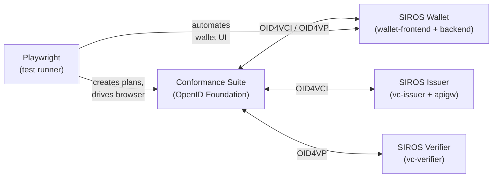

# Running Conformance Tests

SIROS ID components are tested against the [OpenID Foundation Conformance Suite](https://www.certification.openid.net/).
Results are published automatically to [sirosfoundation.github.io/siros-conformance](https://sirosfoundation.github.io/siros-conformance/).

## Triggering from a Pull Request

The fastest way to run conformance tests is to comment on any PR in a repo that has the conformance workflow installed (e.g. `go-wallet-backend`, `wallet-frontend`):

```
@conformance
```

This triggers the wallet conformance profile using the golden-release baseline images.
A rocket reaction confirms the trigger, and a summary comment is posted
with a link to the running workflow.

:::note
Only organisation members, collaborators, and owners can trigger `@conformance`. The comment must **start** with `@conformance`.
:::

### Specifying a Profile

Run a single profile instead of all three:

```
@conformance wallet
@conformance issuer
@conformance verifier
```

### Filtering by Variant

Append `/<filter>` to a profile to run only matching variants. The filter is matched as a substring against variant names:

```
@conformance wallet/mdoc
@conformance wallet/haip
@conformance wallet/authorization_code
@conformance wallet/deferred
@conformance issuer/sd_jwt_vc
@conformance verifier/x509_san_dns
```

Available variant dimensions depend on the profile — see [Understanding Variants](#understanding-variants) below.

:::tip
To see all variant names, look at the test spec files in [siros-conformance/specs/conformance/](https://github.com/sirosfoundation/siros-conformance/tree/main/specs/conformance).
:::

### Image Overrides

Test a specific build by appending `service:tag` pairs. The tag is resolved to a Docker image automatically:

```
@conformance wallet-frontend:pr-111
@conformance go-wallet-backend:sha-abc123
@conformance wallet vc-issuer:pr-42 go-trust:sha-def456
```

When no profile is specified explicitly, the profile is auto-detected from the overridden services. For example, `vc-issuer:pr-42` implies the `issuer` profile.

Recognised service names: `wallet-frontend`, `go-wallet-backend`, `vc-issuer`, `vc-verifier`, `vc-apigw`, `vc-registry`, `vc-mockas`, `go-trust`.

Full image references also work:

```
@conformance ghcr.io/sirosfoundation/go-wallet-backend:pr-42
```

### What Happens

1. The repo's `conformance.yml` workflow fires on the PR comment
2. It checks out `parse-comment.mjs` from `siros-conformance` and parses the comment
3. A `repository_dispatch` event is sent to `siros-conformance` for each profile
4. The conformance suite runs against the specified (or golden-release baseline) images
5. Results are published to GitHub Pages and posted back as a PR comment

### Installing the Workflow

The conformance workflow is available as an organisation workflow template. To enable `@conformance` in a new repo:

1. Go to **Actions → New workflow** in the target repo
2. Find **"Conformance Tests"** under the organisation templates
3. Click **Configure**, review, and commit

The workflow requires a `CONFORMANCE_DISPATCH_TOKEN` secret — a fine-grained PAT with Contents read/write on `sirosfoundation/siros-conformance`.

## CI Automation

Conformance tests also run automatically without manual comments:

- **On push to `main`** in the conformance repo (when relevant files change)
- **On a weekly schedule** (Monday 06:00 UTC)
- **Via workflow dispatch** with optional image overrides
- **Via repository dispatch** from other repos

### Triggering from CI

To trigger conformance tests after a deployment, add a dispatch step:

```yaml
- name: Trigger conformance tests
  uses: peter-evans/repository-dispatch@v3
  with:
    token: ${{ secrets.CONFORMANCE_DISPATCH_TOKEN }}
    repository: sirosfoundation/siros-conformance
    event-type: conformance-wallet
    client-payload: |
      {
        "image-overrides": {"wallet-frontend": "${{ github.sha }}"},
        "target-repo": "${{ github.repository }}",
        "target-pr": "${{ github.event.pull_request.number }}"
      }
```

### Workflow Dispatch

```bash
gh workflow run wallet.yml \
  -f image-overrides='{"wallet-frontend":"pr-123"}' \
  -f target-repo="sirosfoundation/wallet-frontend" \
  -f target-pr="123"
```

Additional inputs:

- `golden-release` — name of a release baseline from `golden-releases.yaml` (default: the file's `default` key)
- `variant-filter` — Playwright `--grep` pattern to run only matching variants (e.g. `mdoc`, `haip`)

## Reading the Results

After a test run, results are:

1. **Published to GitHub Pages** at [sirosfoundation.github.io/siros-conformance](https://sirosfoundation.github.io/siros-conformance/) — includes an index of all runs, per-run detail pages with pass/fail bars, and exported conformance suite HTML reports
2. **Posted as a PR comment** (if `target-repo` and `target-pr` were provided) — a summary table with pass/fail counts per module

| Result | Meaning |
|--------|---------|
| PASSED | All conditions met |
| WARNING | Passed with non-critical warnings |
| FAILED | One or more conditions failed |
| REVIEW | Manual review needed |
| SKIPPED | Module was skipped (usually due to variant mismatch) |

## Understanding Variants

Each test plan runs with one or more **variants** — combinations of protocol parameters. For example, a VCI wallet test variant specifies:

- **Credential format**: `sd_jwt_vc` or `mdoc`
- **Grant type**: `pre_authorization_code` or `authorization_code`
- **Issuance mode**: `immediate` or `deferred`
- **Offer delivery**: `by_value` or `by_reference`

A VP wallet test variant specifies:

- **Credential format**: `sd_jwt_vc` or `iso_mdl`
- **Response mode**: `direct_post` or `direct_post.jwt`
- **Client ID scheme**: `x509_san_dns` or `redirect_uri`
- **Request method**: `request_uri_signed`
- **VP profile**: `plain_vp` or `haip`

The full variant reference is maintained in the [siros-conformance repo docs](https://github.com/sirosfoundation/siros-conformance/blob/main/docs/variant-reference.md).

## Running Locally

For local development setup (prerequisites, quick start, Make targets, variant
filtering, and image overrides), see the
[siros-conformance README](https://github.com/sirosfoundation/siros-conformance#readme).

## Adding a New Variant

See the [adding-variants guide](https://github.com/sirosfoundation/siros-conformance/blob/main/docs/adding-variants.md) in the conformance repo.

## Architecture



The Playwright test runner:
1. Creates a test plan on the conformance suite via its REST API
2. For each test module, creates and starts the test
3. When the suite is WAITING for the wallet, extracts the credential offer or authorization request URL
4. Navigates the wallet SPA to that URL, simulating what a user would do
5. Waits for the suite to report FINISHED
6. Collects results and exports the HTML report
