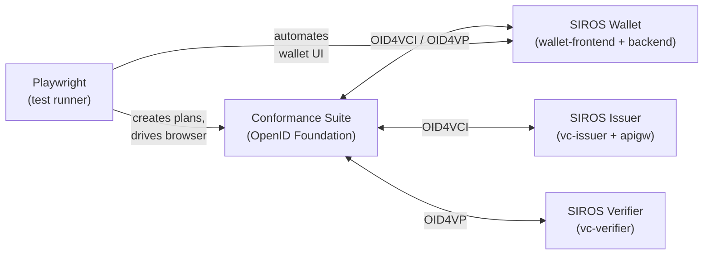

# How to Run Conformance Tests

This guide explains how to run OpenID conformance tests against the SIROS ID wallet, issuer, and verifier using the [OpenID Foundation Conformance Suite](https://openid.net/certification/).

Conformance results are published automatically to [sirosfoundation.github.io/siros-conformance](https://sirosfoundation.github.io/siros-conformance/).

## Prerequisites

- Docker and Docker Compose
- Node.js 20+
- An `/etc/hosts` entry:
  ```
  127.0.0.1 localhost.emobix.co.uk
  ```

## Quick Start

Clone the conformance repo and install dependencies:

```bash
git clone https://github.com/sirosfoundation/siros-conformance.git
cd siros-conformance
make install
```

### Run Wallet Tests

The wallet profile tests both VCI (credential issuance) and VP (credential presentation):

```bash
make up-wallet     # Start all services (wallet, VC services, conformance suite)
make test-wallet   # Run VCI + VP wallet conformance tests
make down          # Tear down
```

### Run Issuer Tests

Tests the SIROS ID issuer against the conformance suite acting as a wallet:

```bash
make up-issuer
make test-issuer
make down
```

### Run Verifier Tests

Tests the SIROS ID verifier against the conformance suite acting as a wallet:

```bash
make up-verifier
make test-verifier
make down
```

## Understanding Variants

Each test plan runs with one or more **variants** — combinations of protocol parameters. For example, a VCI wallet test variant specifies:

- **Credential format**: `sd_jwt_vc` or `mdoc`
- **Grant type**: `pre_authorization_code` or `authorization_code`
- **Issuance mode**: `immediate` or `deferred`
- **Offer delivery**: `by_value` or `by_reference`

A VP wallet test variant specifies:

- **Credential format**: `sd_jwt_vc` or `iso_mdl`
- **Response mode**: `direct_post`, `direct_post.jwt`, `dc_api`, or `dc_api.jwt`
- **Client ID scheme**: `x509_san_dns`, `redirect_uri`, `pre_registered`, etc.
- **VP profile**: `plain_vp` or `haip`

The full variant reference is maintained in the [siros-conformance repo docs](https://github.com/sirosfoundation/siros-conformance/blob/main/docs/variant-reference.md).

## Running a Specific Variant

Use Playwright's `--grep` flag to run a single variant by name:

```bash
# Run only the authorization_code variant
npx playwright test specs/conformance/oid4vci-wallet.spec.ts \
  --grep "authorization_code"

# Run only the HAIP VP variant
npx playwright test specs/conformance/oid4vp-wallet.spec.ts \
  --grep "haip"

# Run only mdoc VCI variant
npx playwright test specs/conformance/oid4vci-wallet.spec.ts \
  --grep "mdoc"
```

## CI / GitHub Actions

Conformance tests run automatically:

- **On push to `main`** in the conformance repo (when relevant files change)
- **On a weekly schedule** (Monday 06:00 UTC)
- **Via workflow dispatch** with optional image overrides
- **Via repository dispatch** from other repos (e.g., when wallet-frontend or go-wallet-backend pushes a new image)

### Triggering from Another Repo

To trigger conformance tests after a deployment, dispatch from your CI:

```yaml
- name: Trigger conformance tests
  uses: peter-evans/repository-dispatch@v3
  with:
    token: ${{ secrets.CONFORMANCE_DISPATCH_TOKEN }}
    repository: sirosfoundation/siros-conformance
    event-type: conformance-wallet
    client-payload: |
      {
        "image-overrides": {"wallet-frontend": "${{ github.sha }}"},
        "target-repo": "${{ github.repository }}",
        "target-pr": "${{ github.event.pull_request.number }}"
      }
```

### Image Overrides

Override specific Docker image tags via the `image-overrides` input:

```bash
# Via workflow dispatch
gh workflow run wallet.yml \
  -f image-overrides='{"wallet-frontend":"pr-123"}' \
  -f target-repo="sirosfoundation/wallet-frontend" \
  -f target-pr="123"
```

## Reading the Results

After a test run, results are:

1. **Published to GitHub Pages** at [sirosfoundation.github.io/siros-conformance](https://sirosfoundation.github.io/siros-conformance/) — includes an index of all runs, per-run detail pages with pass/fail bars, and exported conformance suite HTML reports
2. **Posted as a PR comment** (if `target-repo` and `target-pr` were provided) — a summary table with pass/fail counts per module

### Result States

| Result | Meaning |
|--------|---------|
| PASSED | All conditions met |
| WARNING | Passed with non-critical warnings |
| FAILED | One or more conditions failed |
| REVIEW | Manual review needed |
| SKIPPED | Module was skipped (usually due to variant mismatch) |

## Adding a New Variant

See the [adding-variants guide](https://github.com/sirosfoundation/siros-conformance/blob/main/docs/adding-variants.md) in the conformance repo for step-by-step instructions.

In brief:

1. Add an entry to `VCI_VARIANTS` or `VP_VARIANTS` in the spec file
2. If the variant needs different keys or endpoints, create a new config file in `configs/conformance/` and add `configPath` to the variant entry
3. Run locally with `make up-wallet && make test-wallet`
4. Open a PR

## Architecture



The Playwright test runner:
1. Creates a test plan on the conformance suite via its REST API
2. For each test module, creates and starts the test
3. When the suite is WAITING for the wallet, extracts the credential offer or authorization request URL
4. Navigates the wallet SPA to that URL, simulating what a user would do
5. Waits for the suite to report FINISHED
6. Collects results and exports the HTML report
