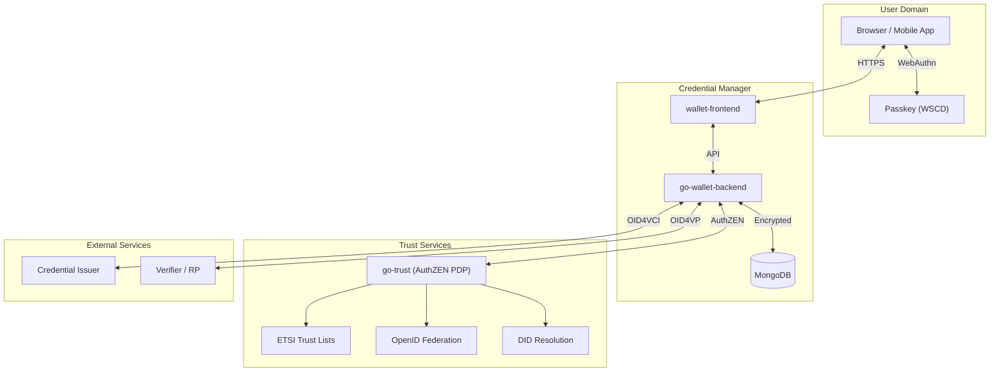
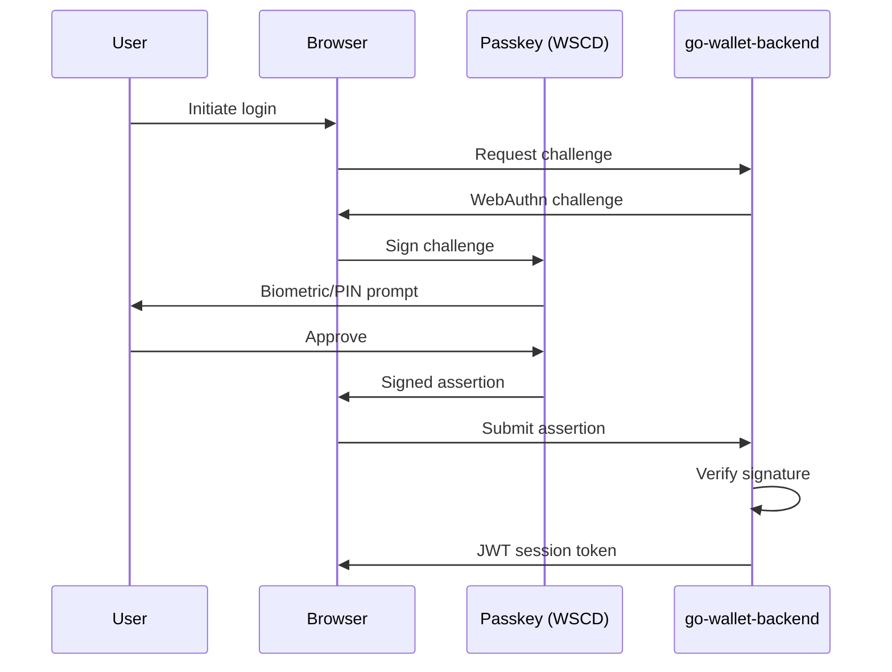
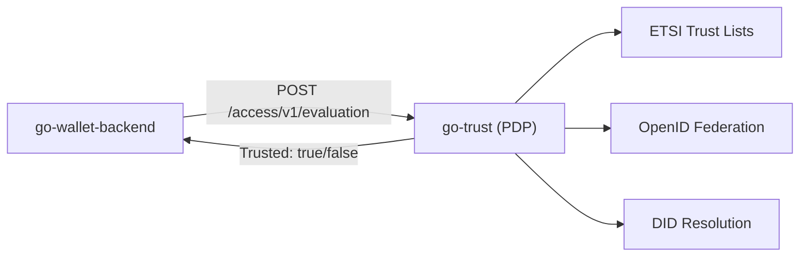

# Security Architecture

This page describes the security architecture of SIROS ID, including trust boundaries, authentication model, and cryptographic practices.

## Architecture Overview

SIROS ID is a multi-tenant digital identity platform for issuing, storing, and verifying Verifiable Credentials in accordance with EU Digital Identity (EUDI/eIDAS 2.0) standards.

## Core Components

| Component | Technology | Security Function |
|-----------|------------|-------------------|
| **Credential Manager (CM)** | wallet-frontend (React) + go-wallet-backend (Go) | User's wallet for credential storage and presentation |
| **Trust Evaluation** | go-trust (Go) | AuthZEN-based Policy Decision Point for trust decisions |
| **Issuer** | SUNET/vc (Go) | Creates and signs credentials via OID4VCI |
| **Verifier** | SUNET/vc (Go) | Validates presentations via OID4VP |

## Zero-Knowledge Architecture

The Credential Manager is designed so that **the platform operator cannot identify users or read their credentials**:

1. **No accounts** — Users are identified only by their passkey, not by email or username
2. **Client-side encryption** — All credentials are encrypted before being sent to the server
3. **Passkey-derived keys** — Encryption keys are derived from the passkey using WebAuthn PRF extension
4. **No password recovery** — There is no "forgot password" flow because there are no passwords

This means that even with full database access, an operator cannot:
- Link a wallet to a real identity
- Read stored credentials
- Impersonate a user

## Authentication Model

### Passkey-Only Authentication

SIROS ID uses **FIDO2/WebAuthn passkeys exclusively** for authentication. There are no passwords.

### Passkey as Wallet Secure Cryptographic Device (WSCD)

The passkey functions as a **Wallet Secure Cryptographic Device**:

- Private keys **never leave the user's device**
- Hardware-backed storage on supporting platforms (iOS Secure Enclave, Android StrongBox, TPM)
- Biometric or PIN required for each cryptographic operation
- Platform sync (iCloud Keychain, Google Password Manager) available for recovery

### Session Management

- JWT tokens with configurable expiration
- Token blacklist support for explicit logout
- Tenant context embedded in JWT (authoritative source)
- Rate limiting with lockout on authentication endpoints

## Cryptographic Practices

### Key Derivation

Credential encryption uses passkey-derived keys:

1. **WebAuthn PRF extension** extracts a secret from the passkey
2. **PBKDF2** with 600,000 iterations (OWASP recommendation) stretches the key
3. **AES-KW** wraps individual credential keys
4. **JWE** encapsulates the encrypted credential container

### Supported Algorithms

| Purpose | Algorithm |
|---------|-----------|
| Credential signing (Issuer) | ES256, ES384, ES512 (ECDSA), EdDSA |
| Key wrapping | AES-KW (A256KW) |
| Content encryption | AES-GCM (A256GCM) |
| Key derivation | PBKDF2-SHA256 |
| DPoP proofs | ES256 |

### Hardware Security Module (HSM) Support

Issuer signing keys can be stored in:

- **Software** — For development/testing only
- **PKCS#11 HSM** — For production deployments
- **QSCD** — For eIDAS-qualified signatures

## Trust Evaluation

### AuthZEN Integration

Trust decisions are made by the **go-trust** service, which implements the [AuthZEN](https://openid.github.io/authzen/) protocol:

### Fail-Closed Design

If the PDP is not configured or unreachable, the system operates in **fail-closed mode**:

- All trust evaluations return `Trusted: false`
- No credentials can be issued or verified
- Clear error message: "Trust evaluation not configured - no PDP endpoint available"

This ensures that misconfiguration cannot lead to accepting untrusted credentials.

### Trust Sources

| Source | Standard | Purpose |
|--------|----------|---------|
| ETSI Trust Lists | TS 119 612 | EU Trusted Service Providers |
| OpenID Federation | OIDF | Dynamic federation trust |
| DID Resolution | did:web, did:webvh | Decentralized identifiers |
| X.509 | RFC 5280 | Certificate chain validation |

## Multi-Tenancy Security

### Tenant Isolation

Each tenant operates in an isolated data domain:

- **Database isolation** — All queries include tenant ID filter
- **JWT enforcement** — Tenant context from JWT is authoritative (not HTTP headers)
- **Separate trust config** — Each tenant can configure independent PDP endpoints
- **URL namespacing** — Tenants addressed via `id.siros.org/<tenant>`

### Administrative Access

The Admin API provides tenant management capabilities:

- Separate network port (recommended: internal network only)
- Bearer token authentication with constant-time comparison
- Supports secrets management integration (Kubernetes Secrets, HashiCorp Vault)

## Network Security

### Required Controls

| Control | Requirement |
|---------|-------------|
| TLS | All public endpoints must use HTTPS |
| CORS | Explicit origin allowlist (no wildcards in production) |
| CSP | Content-Security-Policy headers recommended |
| Network segmentation | Admin API must not be publicly accessible |

### Rate Limiting

Authentication endpoints implement rate limiting:

- Sliding window algorithm
- Lockout after threshold exceeded
- Doubled token cost on failed attempts
- Configurable limits per endpoint

## Credential Security

### Token Status Lists

Credential revocation uses Token Status Lists:

- Issuer publishes status list at stable URL
- Verifiers check status during presentation validation
- Caching recommended to reduce latency and improve resilience

### Credential Formats

| Format | Standard | Use Case |
|--------|----------|----------|
| SD-JWT VC | IETF draft | Selective disclosure credentials |
| mDL/mDoc | ISO 18013-5 | Mobile driving licenses |
| JWT VC | W3C VC Data Model | General credentials |

## Security Monitoring

### Recommended Logging

Security-relevant events that should be logged and monitored:

- Authentication failures (rate limit triggers, invalid passkeys)
- Administrative actions (tenant creation, configuration changes)
- Trust evaluation decisions (especially denials)
- Token blacklist additions

### SBOM and Dependency Tracking

All releases include Software Bill of Materials (SBOM) in CycloneDX format. See the [SBOM documentation](./sbom) for details on downloading and analyzing SBOMs.

## Deployment Models

| Model | Description | Security Responsibility |
|-------|-------------|------------------------|
| **Hosted (SaaS)** | SIROS Foundation operates on EU/EES infrastructure | SIROS Foundation |
| **Self-Hosted** | Organization operates in own infrastructure | Customer |
| **Hybrid** | Combination of hosted and self-hosted components | Shared |

For self-hosted deployments, organizations must conduct their own security assessment and maintain security controls as documented in this section.
