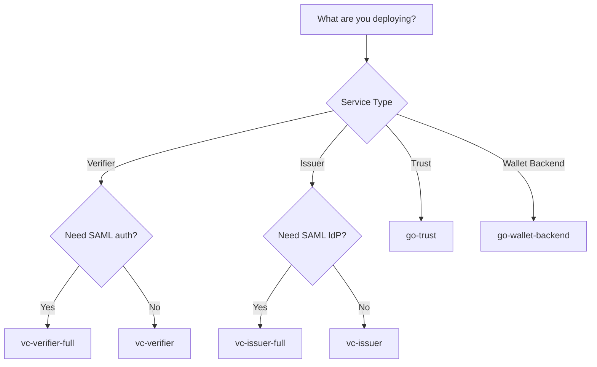

# Docker Images

This page documents all Docker container images provided by the SIROS Foundation for the SIROS ID platform.

## Container Registry

All images are published to the GitHub Container Registry (GHCR):

```
ghcr.io/sirosfoundation/<image-name>
```

## VC Platform Images

The Verifiable Credentials (VC) platform provides multiple services, each with standard and full variants.

### Image Naming Convention

| Image | Description |
|-------|-------------|
| `ghcr.io/sirosfoundation/vc-<service>` | Standard build |
| `ghcr.io/sirosfoundation/vc-<service>-full` | Full build with SAML and VC 2.0 support |

### Available Services

| Service | Standard Image | Full Image |
|---------|---------------|------------|
| **Verifier** | `ghcr.io/sirosfoundation/vc-verifier` | `ghcr.io/sirosfoundation/vc-verifier-full` |
| **Issuer** | `ghcr.io/sirosfoundation/vc-issuer` | `ghcr.io/sirosfoundation/vc-issuer-full` |
| **API Gateway** | `ghcr.io/sirosfoundation/vc-apigw` | `ghcr.io/sirosfoundation/vc-apigw-full` |
| **Registry** | `ghcr.io/sirosfoundation/vc-registry` | — |
| **Persistent** | `ghcr.io/sirosfoundation/vc-persistent` | — |
| **Mock AS** | `ghcr.io/sirosfoundation/vc-mockas` | — |
| **UI** | `ghcr.io/sirosfoundation/vc-ui` | — |

### Build Variants

#### Standard Build

The standard build provides core OID4VC functionality:
- OpenID for Verifiable Credentials (OID4VCI, OID4VP)
- SD-JWT VC credential format
- OIDC authentication for issuers
- Basic trust evaluation

#### Full Build (`-full` suffix)

The full build includes additional features via Go build tags:

| Build Tag | Feature |
|-----------|---------|
| `saml` | SAML 2.0 Service Provider support for issuer authentication |
| `vc20` | W3C Verifiable Credentials Data Model 2.0 support |

**Use the full build when:**
- Integrating with SAML-based Identity Providers (eduGAIN, InCommon, etc.)
- Issuing credentials in W3C VC 2.0 format
- Supporting both SD-JWT VC and VC 2.0 credential formats

### Version Tags

Images are tagged with multiple version identifiers:

| Tag Pattern | Description | Example |
|-------------|-------------|---------|
| `latest` | Latest build from main branch | `vc-verifier:latest` |
| `main` | Current main branch | `vc-verifier:main` |
| `v{version}` | Semantic version release | `vc-verifier:v1.2.3` |
| `v{major}.{minor}` | Minor version (latest patch) | `vc-verifier:v1.2` |
| `v{major}` | Major version (latest minor) | `vc-verifier:v1` |
| `{sha}` | Git commit SHA | `vc-verifier:abc1234` |
| `YYYYMMDD_HHmmss` | Timestamp build | `vc-verifier:20260107_143052` |

**Recommended for production:** Use semantic version tags (e.g., `v1.2.3`) for reproducible deployments.

## Trust Service Images

### go-trust

AuthZEN-compliant trust evaluation service.

| Image | Description |
|-------|-------------|
| `ghcr.io/sirosfoundation/go-trust` | Trust evaluation service |

**Tags:** Same tagging scheme as VC images (`latest`, `main`, `v{version}`, `{sha}`)

```bash
docker pull ghcr.io/sirosfoundation/go-trust:latest
```

## Wallet Backend Images

### go-wallet-backend

Backend service for the SIROS ID wallet application.

| Image | Description |
|-------|-------------|
| `ghcr.io/sirosfoundation/go-wallet-backend` | Wallet backend service |

**Tags:** Same tagging scheme as VC images (`latest`, `main`, `v{version}`, `{sha}`)

```bash
docker pull ghcr.io/sirosfoundation/go-wallet-backend:latest
```

## Pulling Images

### Authentication

Public read access is available for all images. For pulling rate-limited scenarios, authenticate with a GitHub token:

```bash
# Login to GHCR
echo $GITHUB_TOKEN | docker login ghcr.io -u USERNAME --password-stdin
```

### Pull Examples

```bash
# Standard verifier (latest)
docker pull ghcr.io/sirosfoundation/vc-verifier:latest

# Full verifier with SAML support (specific version)
docker pull ghcr.io/sirosfoundation/vc-verifier-full:v1.2.3

# Standard issuer
docker pull ghcr.io/sirosfoundation/vc-issuer:latest

# Full issuer with SAML support
docker pull ghcr.io/sirosfoundation/vc-issuer-full:latest

# Trust service
docker pull ghcr.io/sirosfoundation/go-trust:latest

# Wallet backend
docker pull ghcr.io/sirosfoundation/go-wallet-backend:latest
```

## Platforms

All images are built for multiple architectures:

| Architecture | Platform |
|--------------|----------|
| `linux/amd64` | x86_64 (Intel/AMD) |
| `linux/arm64` | ARM64 (Apple Silicon, AWS Graviton, etc.) |

Docker automatically selects the correct platform for your system.

## Choosing the Right Image

### Decision Tree



### Common Deployment Scenarios

| Scenario | Verifier Image | Issuer Image |
|----------|---------------|--------------|
| Basic OID4VC deployment | `vc-verifier` | `vc-issuer` |
| Academic federation (eduGAIN) | `vc-verifier-full` | `vc-issuer-full` |
| Government identity (SAML) | `vc-verifier-full` | `vc-issuer-full` |
| Enterprise OIDC only | `vc-verifier` | `vc-issuer` |
| Multi-format credentials | `vc-verifier-full` | `vc-issuer-full` |

## Example Docker Compose

### Standard Deployment

```yaml
services:
  verifier:
    image: ghcr.io/sirosfoundation/vc-verifier:latest
    restart: always
    ports:
      - "8080:8080"
    volumes:
      - ./config.yaml:/config.yaml:ro
    environment:
      - VC_CONFIG_YAML=config.yaml

  issuer:
    image: ghcr.io/sirosfoundation/vc-issuer:latest
    restart: always
    ports:
      - "8081:8080"
    volumes:
      - ./issuer-config.yaml:/config.yaml:ro
    environment:
      - VC_CONFIG_YAML=config.yaml

  trust:
    image: ghcr.io/sirosfoundation/go-trust:latest
    restart: always
    ports:
      - "8082:8081"
    command: ["serve"]

  mongo:
    image: mongo:7
    restart: always
    volumes:
      - mongo-data:/data/db

volumes:
  mongo-data:
```

### Full SAML Deployment

```yaml
services:
  verifier:
    image: ghcr.io/sirosfoundation/vc-verifier-full:latest
    restart: always
    ports:
      - "8080:8080"
    volumes:
      - ./config.yaml:/config.yaml:ro
      - ./saml-metadata:/saml-metadata:ro
    environment:
      - VC_CONFIG_YAML=config.yaml

  issuer:
    image: ghcr.io/sirosfoundation/vc-issuer-full:latest
    restart: always
    ports:
      - "8081:8080"
    volumes:
      - ./issuer-config.yaml:/config.yaml:ro
      - ./idp-metadata:/idp-metadata:ro
    environment:
      - VC_CONFIG_YAML=config.yaml

  mongo:
    image: mongo:7
    restart: always
    volumes:
      - mongo-data:/data/db

volumes:
  mongo-data:
```

## Source Code & CI/CD

| Component | Repository | Workflow |
|-----------|------------|----------|
| VC Services | [sirosfoundation/vc](https://github.com/sirosfoundation/vc) | `docker-publish.yaml` |
| go-trust | [sirosfoundation/go-trust](https://github.com/sirosfoundation/go-trust) | `docker-publish.yml` |
| go-wallet-backend | [sirosfoundation/go-wallet-backend](https://github.com/sirosfoundation/go-wallet-backend) | `docker-publish.yml` |

## Next Steps

- [Verifier Configuration](./integrations/verifiers/verifier)
- [Issuer Configuration](./integrations/issuers/issuer)
- [Trust Services](./integrations/trust/)
