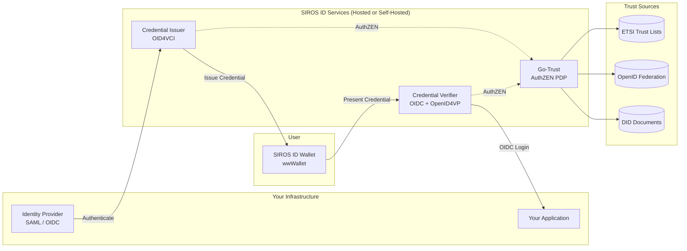

# Integrations

Integrate your applications with the SIROS ID platform to issue and verify digital credentials. You can use the **hosted SIROS ID services** or **deploy your own infrastructure**.

## Architecture Overview

**How it works:**

1. **Issuance**: Your identity provider authenticates users, and the issuer creates digital credentials stored in user wallets.

2. **Verification**: When users access your application, they present credentials from their wallet. The verifier validates them and returns standard OIDC tokens to your app.

3. **Trust**: Go-Trust provides unified trust evaluation via AuthZEN, querying ETSI Trust Lists, OpenID Federation, and DID documents.

## Deployment Options

| Option | Description | Best For |
|--------|-------------|----------|
| **Hosted** | Use SIROS ID cloud services | Quick start, SaaS model |
| **Self-Hosted** | Deploy in your infrastructure | Data sovereignty, on-premise |
| **Hybrid** | Mix hosted and self-hosted | Flexible requirements |

## Getting Started

**[Quick Start Guide](./quickstart)** – Get up and running in under 15 minutes

## Integration Guides

### Credential Issuance

Issue digital credentials to authenticated users.

| Guide | Description |
|-------|-------------|
| **[Issuing Credentials](./issuers/issuer)** | Core guide for credential issuance |
| **[SAML IdP](./issuers/saml-idp)** | Connect SAML identity providers (federation environments) |
| **[OpenID Connect Provider](./issuers/oidc-op)** | Connect OIDC providers (recommended for modern IdPs) |
| **[Keycloak](./issuers/keycloak_issuer)** | Keycloak-specific setup |

### Credential Verification

Add credential verification to your applications.

| Guide | Description |
|-------|-------------|
| **[Verifying Credentials](./verifiers/verifier)** | Core guide for credential verification |
| **[OpenID Connect RP](./verifiers/oidc-rp)** | Integrate with any OIDC-compatible application |
| **[Keycloak](./verifiers/keycloak_verifier)** | Keycloak-specific setup |

### Trust Services

Configure trust frameworks for your deployment.

| Guide | Description |
|-------|-------------|
| **[Trust Services](./trust/)** | Overview of trust frameworks |
| **[Go-Trust AuthZEN](./trust/go-trust)** | Deploy the trust abstraction layer |

## Development Resources

### Demo Environment

A SIROS ID demo environment is available for testing:

| Service | URL |
|---------|-----|
| Wallet | [id.siros.org](https://id.siros.org) |
| Demo Verifier | `https://main.demo.verifier.id.siros.org` |
| Demo Issuer | `https://main.demo.issuer.id.siros.org` |

:::info Hosted Service URL Pattern
SIROS ID hosted services use subdomain-based multi-tenancy:
- **Wallet**: `https://id.siros.org/<tenant>`
- **Verifiers**: `https://<instance>.<tenant>.verifier.id.siros.org`
- **Issuers**: `https://<instance>.<tenant>.issuer.id.siros.org`
:::

### API Documentation

- **Verifier Swagger**: `https://verifier.example.org/swagger/index.html`
- **Issuer Swagger**: `https://issuer.example.org/swagger/index.html`
- **AuthZEN Spec**: [draft-johansson-authzen-trust](https://leifj.github.io/draft-johansson-authzen-trust/)

### Source Code

For advanced integrations and self-hosting:

- **Issuer/Verifier**: [github.com/SUNET/vc](https://github.com/SUNET/vc)
- **Wallet**: [github.com/wwWallet](https://github.com/wwWallet)

## Support

For integration support:

- 📧 **Email**: support@siros.org
-  **GitHub Issues**: For technical issues and feature requests
