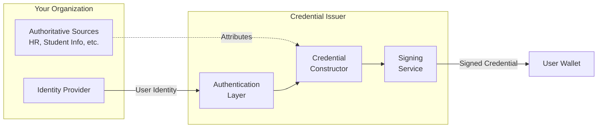
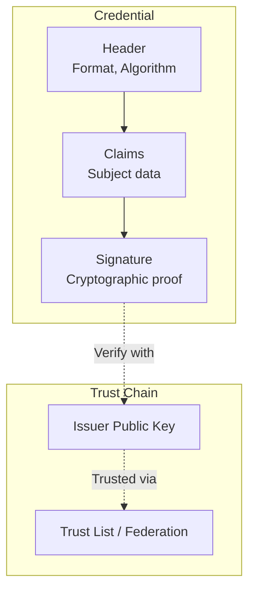
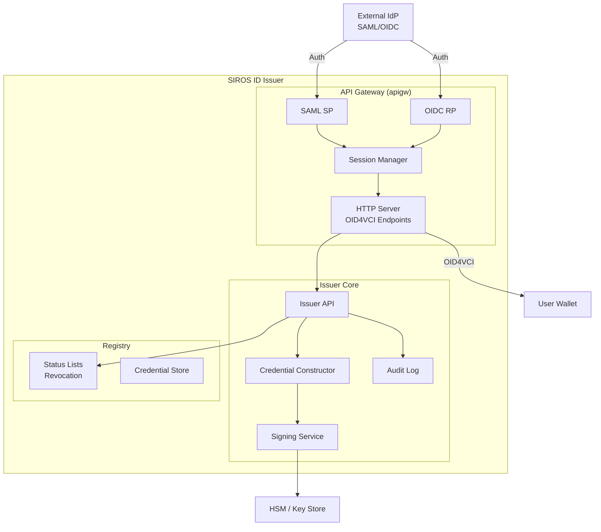
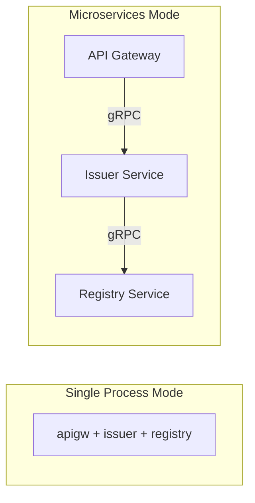
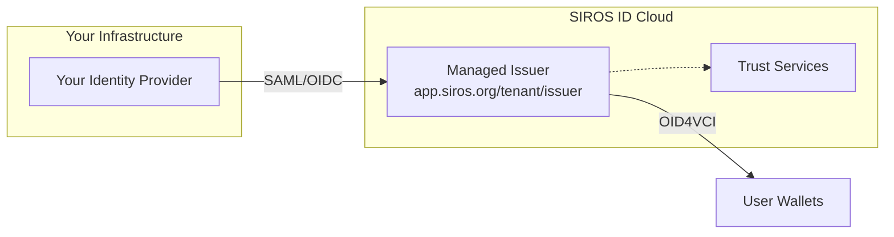
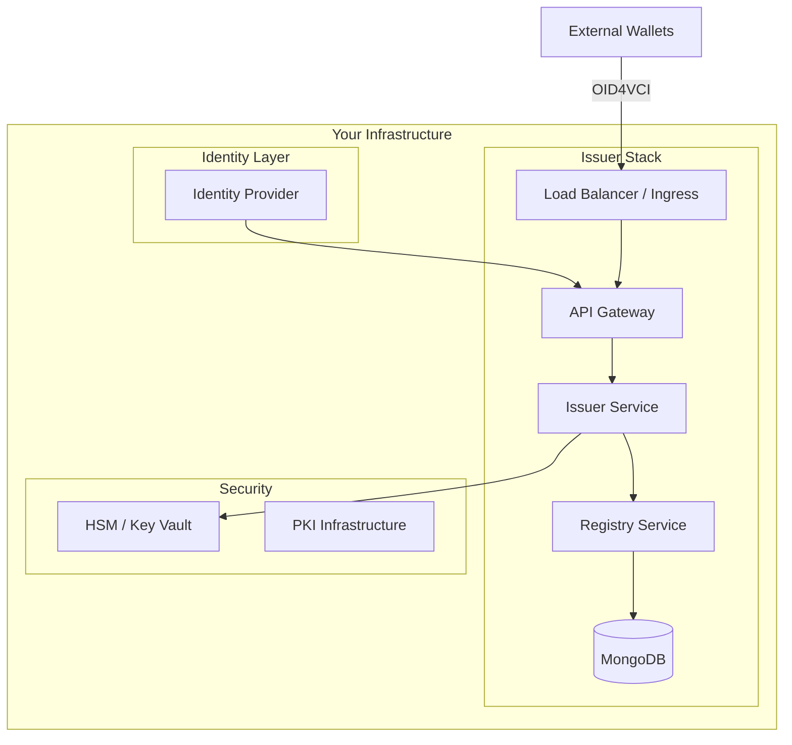
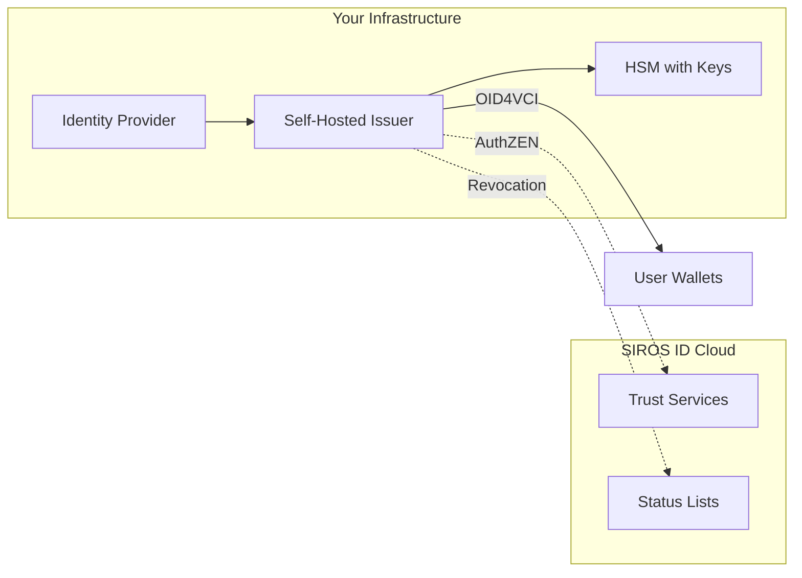
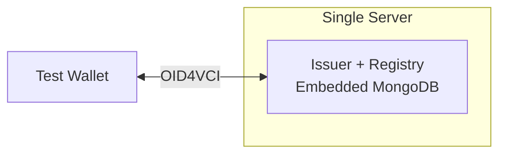
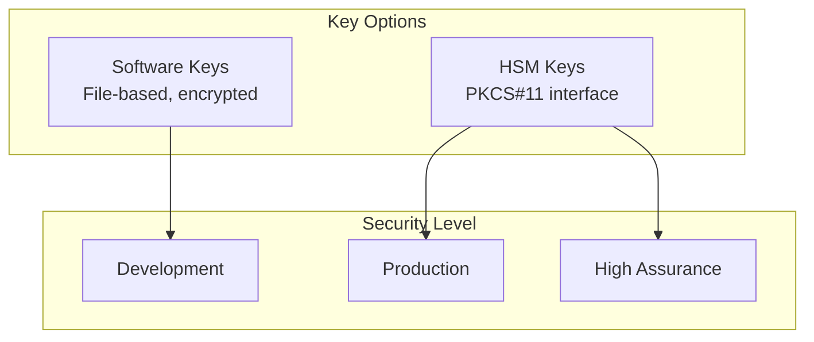

# Issuer Concepts & Architecture

This document provides a conceptual introduction to the SIROS ID Issuer, explaining key concepts, components, and deployment models. For hands-on configuration, see [Issuing Credentials](./issuer).

## What is a Credential Issuer?

A **credential issuer** is a service that creates digitally signed credentials and delivers them to user wallets. The issuer acts as a bridge between your existing identity infrastructure and the emerging world of verifiable credentials.



The issuer:
- **Authenticates** users via existing identity providers (SAML, OIDC)
- **Collects** claims from your authoritative sources
- **Constructs** credentials following standardized schemas
- **Signs** credentials using cryptographic keys
- **Delivers** credentials to user wallets via OID4VCI protocol

## Core Concepts

### Verifiable Credentials

A **verifiable credential** is a tamper-evident digital document that makes claims about a subject (typically a person). Like a physical credential (passport, ID card, diploma), it contains:

| Component | Description | Example |
|-----------|-------------|---------|
| **Issuer** | Who issued the credential | `https://issuer.example.org` |
| **Subject** | Who the credential is about | The holder's identifier |
| **Claims** | Statements about the subject | Name, birth date, etc. |
| **Proof** | Cryptographic signature | Digital signature + public key |
| **Validity** | When the credential is valid | Issue date, expiration |



### Credential Formats

The SIROS ID Issuer supports multiple credential formats to meet different use cases:

| Format | Standard | Best For | Selective Disclosure |
|--------|----------|----------|---------------------|
| **SD-JWT VC** | [IETF SD-JWT VC](https://datatracker.ietf.org/doc/draft-ietf-oauth-sd-jwt-vc/) | EU Digital Identity, general use | ✅ Yes |
| **mDL/mDoc** | [ISO 18013-5](https://www.iso.org/standard/69084.html) | Mobile driving licenses | ✅ Yes |
| **JWT VC** | [W3C VC Data Model](https://www.w3.org/TR/vc-data-model/) | Legacy systems | ❌ No |

:::tip Recommended Format
**SD-JWT VC** is the recommended format for new deployments. It provides selective disclosure (users can share only necessary claims) and is the format specified by the EU Digital Identity Wallet Architecture Reference Framework (ARF).
:::

### Credential Types

A **credential type** defines the schema and semantics of a credential. Each type specifies:

- **VCT (Verifiable Credential Type)**: A unique identifier (URN or URL)
- **Claims**: What information the credential contains
- **Display**: How to present the credential in wallets
- **Trust framework**: Which authorities can issue it

```mermaid
graph LR
    subgraph "Credential Type Definition (VCTM)"
        VCT[VCT Identifier<br/>"urn:eudi:pid:1"]
        Claims[Claim Schema<br/>given_name, family_name, ...]
        Display[Display Rules<br/>Labels, logos, templates]
    end

    VCT --> Claims
    VCT --> Display

    subgraph "Issued Credential"
        Instance[Credential Instance<br/>with actual values]
    end

    Claims -->|instantiate| Instance
```

#### VCTM (Verifiable Credential Type Metadata)

Each credential type is defined by a **VCTM file** that specifies:

```json
{
  "vct": "urn:eudi:pid:1",
  "name": "Person Identification Data",
  "description": "EU Person Identification Data credential",
  "display": [
    {
      "lang": "en-US",
      "name": "PID",
      "rendering": {
        "svg_templates": [...]
      }
    }
  ],
  "claims": [
    {
      "path": ["given_name"],
      "mandatory": true,
      "sd": "always",
      "display": [{"lang": "en-US", "label": "First name"}]
    }
  ]
}
```

#### Built-in Credential Types

SIROS ID includes pre-configured types based on EU standards:

| Type | VCT | Description |
|------|-----|-------------|
| **PID** | `urn:eudi:pid:1` | Person Identification Data (EU ARF) |
| **EHIC** | `urn:eudi:ehic:1` | European Health Insurance Card |
| **PDA1** | `urn:eudi:pda1:1` | Portable Document A1 |
| **Diploma** | `urn:eudi:diploma:1` | Educational credentials |
| **ELM** | `urn:eudi:elm:1` | European Learning Model |
| **Microcredential** | (configurable) | Short learning achievements |

### Credential Constructor

The **credential constructor** is the component that transforms user identity data into credential claims. It:

1. Receives authenticated user attributes (from SAML/OIDC)
2. Maps external attributes to credential claims
3. Applies transformations and defaults
4. Validates against the VCTM schema
5. Produces the claim set for signing

```yaml
# Example: Map SAML attributes to PID claims
credential_constructor:
  pid:
    vct: "urn:eudi:pid:1"
    vctm_file_path: "/metadata/vctm_pid.json"
    attributes:
      given_name:
        source: ["$.claims.given_name", "$.saml.urn:oid:2.5.4.42"]
      family_name:
        source: ["$.claims.family_name", "$.saml.urn:oid:2.5.4.4"]
      birthdate:
        source: ["$.claims.birthdate"]
        transform: "date_iso8601"
```

## Issuer Components

The SIROS ID Issuer is built as a modular system with distinct components:



### Component Descriptions

| Component | Purpose | Protocol/Standard |
|-----------|---------|-------------------|
| **HTTP Server** | Exposes OID4VCI endpoints | OpenID4VCI |
| **SAML SP** | Service Provider for SAML federations | SAML 2.0 |
| **OIDC RP** | Relying Party for OIDC providers | OpenID Connect |
| **Session Manager** | OAuth2 session and state management | OAuth 2.0 |
| **Issuer API** | Core credential operations | gRPC + REST |
| **Credential Constructor** | Builds credentials from claims | Internal |
| **Signing Service** | Cryptographic signing (SW or HSM) | JWS, COSE |
| **Status Lists** | Revocation status tracking | Token Status List |
| **Audit Log** | Compliance and monitoring | Internal |

### Service Architecture

The issuer can run as a single process or as separate microservices:



## Deployment Models

Choose a deployment model based on your requirements:

### Model 1: SIROS ID Hosted (SaaS)

Use the SIROS ID cloud platform with minimal configuration.



| Aspect | Details |
|--------|---------|
| **Setup** | Minutes – configure via SIROS ID portal |
| **Maintenance** | Fully managed by SIROS |
| **Data location** | SIROS ID cloud infrastructure |
| **Customization** | Credential types, branding |
| **Best for** | Quick deployment, SaaS model |

### Model 2: Self-Hosted (On-Premise)

Deploy the full issuer stack in your own infrastructure.



| Aspect | Details |
|--------|---------|
| **Setup** | Hours to days – deploy containers/VMs |
| **Maintenance** | Your operations team |
| **Data location** | Your infrastructure |
| **Customization** | Full control over all components |
| **Best for** | Data sovereignty, compliance, custom integrations |

### Model 3: Hybrid

Combine hosted and self-hosted components.



| Aspect | Details |
|--------|---------|
| **Setup** | Variable |
| **Maintenance** | Shared responsibility |
| **Data location** | Credentials on-premise, trust in cloud |
| **Customization** | Selective control |
| **Best for** | Regulated environments with external trust requirements |

### Model 4: Standalone Issuer

Minimal deployment for testing or air-gapped environments.



| Aspect | Details |
|--------|---------|
| **Setup** | Minutes – single Docker container |
| **Maintenance** | Minimal |
| **Data location** | Local |
| **Customization** | Development/testing |
| **Best for** | Development, demos, isolated testing |

## Deployment Decision Matrix

| Requirement | Hosted | Self-Hosted | Hybrid | Standalone |
|-------------|:------:|:-----------:|:------:|:----------:|
| Quick setup | ✅ | ❌ | ⚠️ | ✅ |
| Data sovereignty | ❌ | ✅ | ⚠️ | ✅ |
| HSM key storage | ⚠️ | ✅ | ✅ | ❌ |
| Custom trust | ⚠️ | ✅ | ✅ | ❌ |
| High availability | ✅ | ⚠️ | ⚠️ | ❌ |
| Zero maintenance | ✅ | ❌ | ⚠️ | ✅ |
| GDPR compliance | ⚠️ | ✅ | ✅ | ✅ |

Legend: ✅ Excellent | ⚠️ Possible with effort | ❌ Not recommended

## Security Considerations

### Key Management

The issuer's signing keys are the most critical security asset:



| Environment | Recommended Key Storage |
|-------------|------------------------|
| Development | Software keys (encrypted file) |
| Production | HSM via PKCS#11 |
| High Assurance | Certified HSM (eIDAS QSCD) |

### Trust Chain

Credentials are only valuable if verifiers can trust them:


See [Trust Services](../trust/) for configuring trust frameworks.

## Next Steps

Now that you understand the concepts:

1. **[Issuing Credentials](./issuer)** – Configure and deploy your issuer
2. **[SAML IdP Integration](./saml-idp)** – Connect SAML federations
3. **[OIDC Provider Integration](./oidc-op)** – Connect OIDC providers
4. **[Trust Services](../trust/)** – Configure trust frameworks
