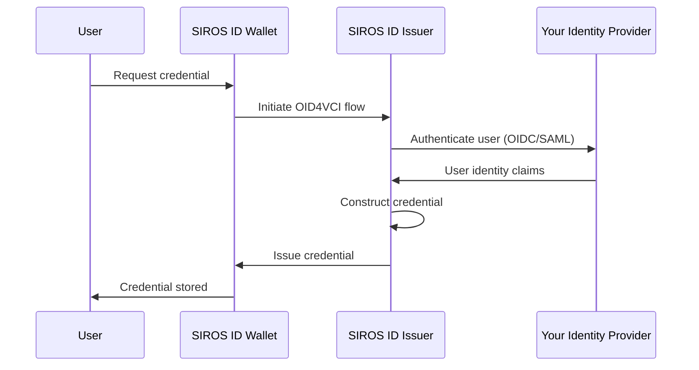

# Issuing Credentials

This guide explains how to issue digital credentials to users of the SIROS ID credential manager (wallet). You can use the **SIROS ID hosted issuer service** or **deploy your own issuer** in your infrastructure. After reading this guide, you will understand how to:

- Connect your identity provider to the issuer
- Configure credential types
- Issue credentials to wallets
- Deploy your own issuer (optional)

## Multi-Tenancy

SIROS ID uses path-based multi-tenancy. The first path component after the domain identifies your tenant:

```
https://issuer.siros.org/<tenant>/...
```

For example, if your tenant ID is `acme-corp`:

| Endpoint | URL |
|----------|-----|
| Credential Offer | `https://issuer.siros.org/acme-corp/credential-offer` |
| Token | `https://issuer.siros.org/acme-corp/token` |
| Credential | `https://issuer.siros.org/acme-corp/credential` |
| Metadata | `https://issuer.siros.org/acme-corp/.well-known/openid-credential-issuer` |

:::info Tenant Isolation
Each tenant has isolated configuration, credential types, and signing keys. The tenant ID is included in the `iss` claim of issued credentials.
:::

## Deployment Options

| Option | Best For | Requirements |
|--------|----------|-------------|
| **SIROS ID Hosted** | Quick start, SaaS model | API credentials only |
| **Self-Hosted (Docker)** | On-premise, data sovereignty | Docker, MongoDB |
| **Self-Hosted (Binary)** | Custom infrastructure | Go 1.25+, MongoDB |

:::tip Recommendation
Start with the hosted service for development and testing. Move to self-hosted when you need data sovereignty or custom integrations.
:::

## Overview

The SIROS ID issuer implements the [OpenID for Verifiable Credential Issuance (OID4VCI)](https://openid.net/specs/openid-4-verifiable-credential-issuance-1_0.html) specification. This allows any SIROS ID compatible wallet to receive credentials from your issuer.



## Authentication Methods

The SIROS ID issuer supports multiple ways to authenticate users before issuing credentials:

### 1. OpenID Connect (OIDC)

Connect any OIDC-compliant identity provider to issue credentials:

```yaml
# Example OIDC configuration
issuer:
  authentication:
    type: oidc
    client_id: "your-client-id"
    client_secret: "your-client-secret"
    issuer_url: "https://your-idp.example.com"
    scopes:
      - openid
      - profile
      - email
```

### 2. SAML 2.0

Use existing SAML identity federations:

```yaml
issuer:
  authentication:
    type: saml
    metadata_url: "https://idp.example.com/metadata"
    entity_id: "https://issuer.siros.org/sp"
```

### 3. Client Credentials

For server-to-server issuance (e.g., automated credential provisioning):

```yaml
issuer:
  authentication:
    type: client_credentials
    clients:
      - id: "your-system-id"
        secret: "your-system-secret"
        scopes:
          - ehic
          - diploma
```

## Supported Credential Types

SIROS ID supports issuing credentials in multiple formats:

| Format | Description | Use Case |
|--------|-------------|----------|
| **SD-JWT VC** | SD-JWT Verifiable Credential | EU Digital Identity, general VCs |
| **mDL/mDoc** | ISO 18013-5 mobile document | Mobile driving licenses |
| **JWT VC** | JWT-encoded credential | Legacy systems |

### Built-in Credential Types

The SIROS ID platform includes preconfigured schemas for common EU credential types:

| Credential | VCT | Description |
|------------|-----|-------------|
| **PID** | `urn:eudi:pid:1` | Person Identification Data (ARF 1.5/1.8) |
| **EHIC** | `urn:eudi:ehic:1` | European Health Insurance Card |
| **PDA1** | `urn:eudi:pda1:1` | Portable Document A1 |
| **Diploma** | `urn:eudi:diploma:1` | Educational credentials |
| **ELM** | `urn:eudi:elm:1` | European Learning Model |

## Integration Steps

### Step 1: Configure Your Identity Provider

Configure your IdP to allow SIROS ID issuer as a client:

**For OIDC IdPs:**
1. Register a new OIDC client
2. Set redirect URI to: `https://<your-issuer>.siros.org/callback`
3. Enable required scopes (openid, profile, email, etc.)

**For SAML IdPs:**
1. Import SIROS ID issuer SP metadata
2. Configure attribute release (name, email, etc.)

### Step 2: Map Identity Claims to Credential Attributes

Configure how user identity maps to credential claims:

```yaml
credential_constructor:
  ehic:
    vct: "urn:eudi:ehic:1"
    claim_mapping:
      # Map IdP claims to credential claims
      given_name: "$.claims.given_name"
      family_name: "$.claims.family_name"
      birth_date: "$.claims.birthdate"
      personal_id: "$.claims.national_id"
      # Static values
      document_type: "EHIC"
```

### Step 3: Configure Trust

Establish trust with the SIROS ID ecosystem. See [Trust Services](../trust/) for details on:

- ETSI TSL registration
- OpenID Federation
- X.509 certificate chains

### Step 4: Test the Integration

1. **Obtain a test wallet**: Use the SIROS ID web app at [app.siros.org](https://app.siros.org)
2. **Trigger issuance**: Navigate to your issuer's credential offer page
3. **Scan QR code**: Use the wallet to scan and accept the credential
4. **Verify**: Check that the credential appears in the wallet

## Credential Offer Methods

### QR Code

Generate a QR code containing a credential offer (replace `your-tenant` with your tenant ID):

```
openid-credential-offer://?credential_offer_uri=https://issuer.siros.org/your-tenant/offers/abc123
```

### Deep Link

For mobile apps, use a deep link:

```
openid-credential-offer://issuer.siros.org/your-tenant/offers/abc123
```

### Pre-authorized Flow

For server-initiated issuance (e.g., when user completes registration):

```yaml
credential_offer:
  type: pre_authorized
  pin_required: true  # Optional: require PIN confirmation
```

## API Reference

The issuer exposes OpenID4VCI-compliant endpoints:

| Endpoint | Description |
|----------|-------------|
| `/.well-known/openid-credential-issuer` | Credential issuer metadata |
| `/.well-known/oauth-authorization-server` | OAuth2 metadata |
| `/authorize` | Authorization endpoint |
| `/token` | Token endpoint |
| `/credential` | Credential endpoint |
| `/batch_credential` | Batch credential endpoint |

### Swagger Documentation

Full API documentation is available at:
```
https://<your-issuer>.siros.org/swagger/index.html
```

## Security Considerations

1. **Key Management**: The issuer signs credentials with keys managed in secure HSMs
2. **Revocation**: Configure status lists for credential revocation
3. **Audit Logging**: All issuance events are logged for compliance

## Self-Hosted Deployment

If you need to run the issuer in your own infrastructure, you can deploy it using Docker or as a standalone binary.

### Docker Deployment (Recommended)

The issuer is available as a Docker image:

```bash
# Pull the latest image
docker pull docker.sunet.se/dc4eu/issuer:latest
```

#### Docker Compose

Create a `docker-compose.yaml`:

```yaml
services:
  issuer:
    image: docker.sunet.se/dc4eu/issuer:latest
    restart: always
    ports:
      - "8080:8080"
    volumes:
      - ./config.yaml:/config.yaml:ro
      - ./pki:/pki:ro
      - ./metadata:/metadata:ro
    environment:
      - VC_CONFIG_YAML=config.yaml
    depends_on:
      - mongo

  mongo:
    image: mongo:7
    restart: always
    volumes:
      - mongo-data:/data/db
    ports:
      - "27017:27017"

volumes:
  mongo-data:
```

#### Issuer Configuration

Create `config.yaml`:

```yaml
issuer:
  api_server:
    addr: :8080
    tls:
      enabled: false  # Use reverse proxy for TLS in production
  
  external_url: "https://issuer.example.com"
  
  # Signing key for credentials
  signing:
    key_path: "/pki/issuer_key.pem"
    algorithm: "ES256"
  
  # Authentication backend
  authentication:
    type: oidc
    client_id: "issuer-client"
    client_secret: "${OIDC_CLIENT_SECRET}"
    issuer_url: "https://your-idp.example.com"
    scopes:
      - openid
      - profile

  # Trust configuration
  trust:
    authzen_endpoint: "http://go-trust:8081"  # Optional: go-trust service

common:
  mongo:
    uri: mongodb://mongo:27017
  production: true
```

#### Start the Service

```bash
# Start all services
docker compose up -d

# Check logs
docker compose logs -f issuer

# Verify health
curl http://localhost:8080/health
```

### Binary Deployment

For non-Docker environments:

```bash
# Clone the repository
git clone https://github.com/dc4eu/vc.git
cd vc

# Build the issuer
make build-issuer

# Run
export VC_CONFIG_YAML=config.yaml
./bin/vc_issuer
```

### Kubernetes Deployment

For production Kubernetes deployments:

```yaml
apiVersion: apps/v1
kind: Deployment
metadata:
  name: issuer
spec:
  replicas: 2
  selector:
    matchLabels:
      app: issuer
  template:
    metadata:
      labels:
        app: issuer
    spec:
      containers:
        - name: issuer
          image: docker.sunet.se/dc4eu/issuer:latest
          ports:
            - containerPort: 8080
          env:
            - name: VC_CONFIG_YAML
              value: /config/config.yaml
          volumeMounts:
            - name: config
              mountPath: /config
            - name: pki
              mountPath: /pki
          livenessProbe:
            httpGet:
              path: /health
              port: 8080
            initialDelaySeconds: 10
          readinessProbe:
            httpGet:
              path: /health
              port: 8080
      volumes:
        - name: config
          configMap:
            name: issuer-config
        - name: pki
          secret:
            secretName: issuer-pki
```

## Next Steps

- [Configure Trust Services](../trust/)
- [Set up Credential Verification](../verifiers/verifier)
- [Keycloak Verifier Integration](../verifiers/keycloak_verifier)
