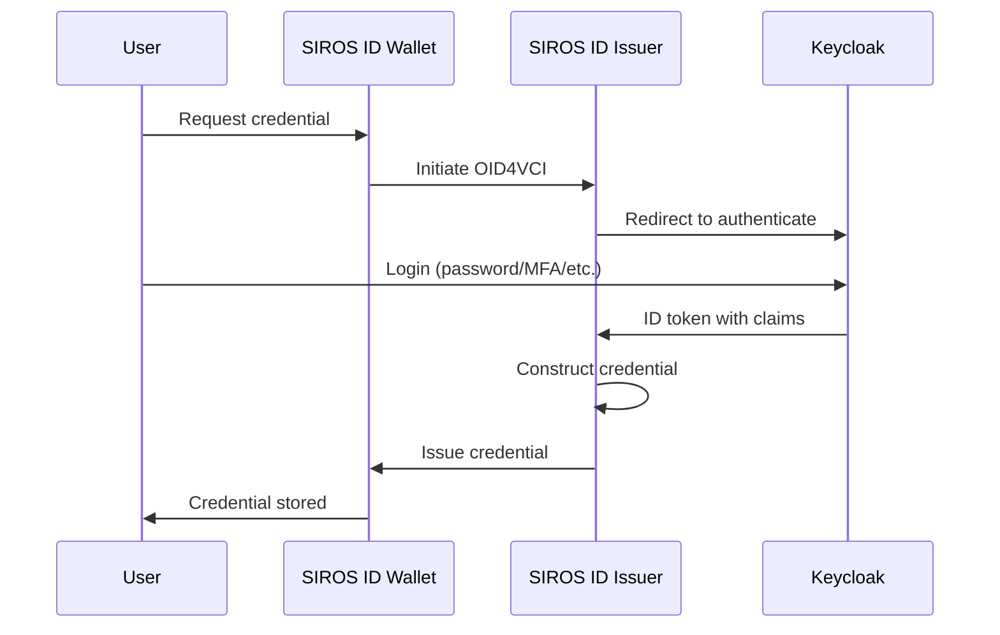

# Keycloak Issuer Integration

This guide explains how to use Keycloak as the identity provider for credential issuance, allowing authenticated Keycloak users to receive digital credentials in their SIROS ID wallet. After reading this guide, you will understand how to:

- Configure Keycloak as the authentication backend for credential issuance
- Map Keycloak user attributes to credential claims
- Set up OIDC or SAML integration
- Trigger credential issuance from Keycloak workflows

## Overview

When using Keycloak as the identity provider for credential issuance, users authenticate through Keycloak first, then receive credentials based on their verified identity attributes. This is ideal for organizations that already manage user identities in Keycloak.



:::tip Hosted or Self-Hosted
This guide works with both the **SIROS ID hosted issuer** (`app.siros.org/<tenant>/<issuer>`) and **self-hosted deployments**. Simply replace the issuer URL as needed. See [Issuer Deployment Options](./issuer.md#deployment-options) for more information.
:::

## Prerequisites

- Keycloak 22+ installed and running
- Admin access to your Keycloak realm
- A SIROS ID issuer (hosted or self-hosted)
- Users with attributes you want to include in credentials

## Step 1: Register the Issuer as a Keycloak Client

Create an OIDC client in Keycloak for the SIROS ID issuer.

1. Open **Keycloak Admin Console**
2. Select your realm
3. Navigate to **Clients** → **Create client**

### Client Configuration

| Setting | Value | Description |
|---------|-------|-------------|
| **Client type** | `OpenID Connect` | Protocol type |
| **Client ID** | `siros-issuer` | Identifier for the issuer |
| **Name** | `SIROS ID Credential Issuer` | Display name |
| **Always display in UI** | OFF | Hide from account console |

### Capability Config

| Setting | Value |
|---------|-------|
| **Client authentication** | ON |
| **Authorization** | OFF |
| **Authentication flow** | ✅ Standard flow |

### Access Settings

Replace `your-tenant` and `your-issuer` with your assigned values:

| Setting | Value |
|---------|-------|
| **Root URL** | `https://app.siros.org/your-tenant/your-issuer` |
| **Valid redirect URIs** | `https://app.siros.org/your-tenant/your-issuer/callback` |
| **Valid post logout redirect URIs** | `https://app.siros.org/your-tenant/your-issuer` |
| **Web origins** | `https://app.siros.org` |

For self-hosted issuers, replace with your issuer URL.

### Credentials

After creating the client, go to the **Credentials** tab and copy the **Client secret**.

## Step 2: Configure User Attributes

Ensure Keycloak users have the attributes needed for credential claims.

### Built-in Attributes

These attributes are available by default:

| Keycloak Attribute | OIDC Claim | Description |
|--------------------|------------|-------------|
| `username` | `preferred_username` | User's username |
| `email` | `email` | Email address |
| `firstName` | `given_name` | First name |
| `lastName` | `family_name` | Last name |

### Custom User Attributes

For credential-specific claims (birthdate, nationality, etc.):

1. Navigate to **Users** → Select a user → **Attributes**
2. Add custom attributes:

| Key | Example Value |
|-----|---------------|
| `birthdate` | `1990-01-15` |
| `nationality` | `SE` |
| `personal_id` | `199001150123` |

### Bulk Import Attributes

For existing users, use the Admin REST API:

```bash
curl -X PUT "https://keycloak.example.com/admin/realms/myrealm/users/{user-id}" \
  -H "Authorization: Bearer ${ADMIN_TOKEN}" \
  -H "Content-Type: application/json" \
  -d '{
    "attributes": {
      "birthdate": ["1990-01-15"],
      "nationality": ["SE"],
      "personal_id": ["199001150123"]
    }
  }'
```

## Step 3: Configure Client Scopes

Create scopes to expose user attributes as OIDC claims.

### Create a Credential Scope

1. Navigate to **Client scopes** → **Create client scope**
2. Configure:

| Setting | Value |
|---------|-------|
| **Name** | `credential-claims` |
| **Type** | `Default` |
| **Display on consent screen** | ON |
| **Consent screen text** | `Share identity attributes for credential issuance` |

### Add Attribute Mappers

In the new scope, go to **Mappers** → **Configure a new mapper** → **User Attribute**

#### Birthdate Mapper

| Setting | Value |
|---------|-------|
| **Name** | `birthdate` |
| **User Attribute** | `birthdate` |
| **Token Claim Name** | `birthdate` |
| **Claim JSON Type** | `String` |
| **Add to ID token** | ON |
| **Add to access token** | OFF |
| **Add to userinfo** | ON |

#### Nationality Mapper

| Setting | Value |
|---------|-------|
| **Name** | `nationality` |
| **User Attribute** | `nationality` |
| **Token Claim Name** | `nationality` |
| **Claim JSON Type** | `String` |
| **Add to ID token** | ON |
| **Add to access token** | OFF |
| **Add to userinfo** | ON |

#### Personal ID Mapper

| Setting | Value |
|---------|-------|
| **Name** | `personal_id` |
| **User Attribute** | `personal_id` |
| **Token Claim Name** | `personal_id` |
| **Claim JSON Type** | `String` |
| **Add to ID token** | ON |
| **Add to access token** | OFF |
| **Add to userinfo** | ON |

### Assign Scope to Client

1. Go to **Clients** → **siros-issuer** → **Client scopes**
2. Click **Add client scope**
3. Select `credential-claims` → **Add** → **Default**

## Step 4: Configure the SIROS ID Issuer

Configure the issuer to use Keycloak as its authentication backend.

### For Hosted Issuer

Contact SIROS ID support to configure your Keycloak as an IdP, providing:

- Keycloak realm URL: `https://keycloak.example.com/realms/myrealm`
- Client ID: `siros-issuer`
- Client Secret: *(from Step 1)*
- Required scopes

### For Self-Hosted Issuer

Create or update `config.yaml`:

```yaml
issuer:
  api_server:
    addr: :8080
  external_url: "https://issuer.example.com"

  # Keycloak OIDC configuration
  authentication:
    type: oidc
    client_id: "siros-issuer"
    client_secret: "${KEYCLOAK_CLIENT_SECRET}"
    issuer_url: "https://keycloak.example.com/realms/myrealm"
    scopes:
      - openid
      - profile
      - email
      - credential-claims
    
    # Optional: additional OIDC settings
    response_type: "code"
    use_pkce: true
    
  # Claim mapping for credentials
  credential_constructor:
    pid:
      vct: "urn:eudi:pid:1"
      claim_mapping:
        given_name: "$.claims.given_name"
        family_name: "$.claims.family_name"
        birth_date: "$.claims.birthdate"
        nationality: "$.claims.nationality"
        personal_id: "$.claims.personal_id"

common:
  mongo:
    uri: mongodb://mongo:27017
```

### Docker Compose with Keycloak

```yaml
services:
  issuer:
    image: ghcr.io/sirosfoundation/vc-issuer:latest  # or vc-issuer-full for SAML support
    restart: always
    ports:
      - "8080:8080"
    environment:
      - VC_CONFIG_YAML=config.yaml
      - KEYCLOAK_CLIENT_SECRET=${KEYCLOAK_CLIENT_SECRET}
    volumes:
      - ./config.yaml:/config.yaml:ro
      - ./pki:/pki:ro
    depends_on:
      - mongo

  mongo:
    image: mongo:7
    restart: always
    volumes:
      - mongo-data:/data/db

volumes:
  mongo-data:
```

## Step 5: Configure Credential Types

Map Keycloak claims to specific credential types.

### Person Identification Data (PID)

```yaml
credential_constructor:
  pid:
    vct: "urn:eudi:pid:1"
    format: "vc+sd-jwt"
    validity_days: 365
    claim_mapping:
      # Required PID claims
      given_name: "$.claims.given_name"
      family_name: "$.claims.family_name"
      birth_date: "$.claims.birthdate"
      
      # Optional PID claims
      nationality: "$.claims.nationality"
      resident_country: "$.claims.resident_country"
      gender: "$.claims.gender"
      
      # Issuer-specific
      issuance_date: "$.now"
      issuing_authority: "Example Authority"
      issuing_country: "SE"
```

### European Health Insurance Card (EHIC)

```yaml
credential_constructor:
  ehic:
    vct: "urn:eudi:ehic:1"
    format: "vc+sd-jwt"
    validity_days: 730
    claim_mapping:
      given_name: "$.claims.given_name"
      family_name: "$.claims.family_name"
      birth_date: "$.claims.birthdate"
      personal_id: "$.claims.personal_id"
      
      # EHIC-specific (from external system or Keycloak attributes)
      card_number: "$.claims.ehic_card_number"
      institution_id: "$.claims.ehic_institution"
      institution_country: "SE"
```

## Step 6: Test the Integration

### Using the Demo Wallet

1. Go to [app.siros.org](https://app.siros.org) and create a wallet
2. Navigate to **Add Credential**
3. Enter your issuer URL or scan the QR code
4. Authenticate with your Keycloak credentials
5. Approve the credential issuance
6. Verify the credential contains correct claims

### Direct Testing

Test the OIDC flow manually:

```bash
# 1. Start authorization (opens browser)
open "https://issuer.example.com/authorize?client_id=wallet&redirect_uri=https://app.siros.org/callback&scope=openid%20pid&response_type=code"

# 2. After authentication, check the issued credential
```

### Verify Claim Mapping

Check that Keycloak claims appear correctly:

```bash
# Get a token from Keycloak directly
TOKEN=$(curl -s -X POST \
  "https://keycloak.example.com/realms/myrealm/protocol/openid-connect/token" \
  -d "client_id=siros-issuer" \
  -d "client_secret=${CLIENT_SECRET}" \
  -d "grant_type=password" \
  -d "username=testuser" \
  -d "password=testpassword" \
  -d "scope=openid profile credential-claims" | jq -r '.id_token')

# Decode and inspect claims
echo $TOKEN | cut -d'.' -f2 | base64 -d | jq
```

## Advanced Configuration

### SAML Integration

If your organization uses SAML instead of OIDC:

```yaml
issuer:
  authentication:
    type: saml
    entity_id: "https://issuer.example.com/sp"
    metadata_url: "https://keycloak.example.com/realms/myrealm/protocol/saml/descriptor"
    
    # Attribute mapping from SAML assertions
    attribute_mapping:
      given_name: "urn:oid:2.5.4.42"
      family_name: "urn:oid:2.5.4.4"
      email: "urn:oid:0.9.2342.19200300.100.1.3"
      birthdate: "urn:oid:1.3.6.1.5.5.7.9.1"
```

### Conditional Credential Issuance

Issue different credentials based on user roles or groups:

```yaml
issuer:
  credential_policies:
    # Only users with 'employee' role get employee credentials
    employee_id:
      required_roles:
        - "employee"
      vct: "urn:example:employee:1"
      
    # Healthcare workers get EHIC credentials
    ehic:
      required_groups:
        - "/healthcare"
      vct: "urn:eudi:ehic:1"
```

In Keycloak, configure role/group mappers to include these in tokens.

### Multi-Realm Support

Support users from multiple Keycloak realms:

```yaml
issuer:
  authentication:
    type: oidc
    providers:
      - name: "employees"
        issuer_url: "https://keycloak.example.com/realms/employees"
        client_id: "siros-issuer-emp"
        client_secret: "${KC_EMP_SECRET}"
        
      - name: "customers"
        issuer_url: "https://keycloak.example.com/realms/customers"
        client_id: "siros-issuer-cust"
        client_secret: "${KC_CUST_SECRET}"
```

### Automated Credential Provisioning

Automatically issue credentials when users are created or updated:

```java
// Keycloak Event Listener SPI
public class CredentialProvisioningListener implements EventListenerProvider {
    
    @Override
    public void onEvent(AdminEvent event, boolean includeRepresentation) {
        if (event.getResourceType() == ResourceType.USER && 
            event.getOperationType() == OperationType.CREATE) {
            
            // Trigger credential issuance via API
            issuerClient.createCredentialOffer(
                event.getResourcePath(),
                "urn:eudi:pid:1"
            );
        }
    }
}
```

### Pre-Authorized Code Flow

For server-initiated issuance (e.g., batch provisioning):

```bash
# Create a pre-authorized credential offer
curl -X POST "https://issuer.example.com/offers" \
  -H "Authorization: Bearer ${SERVICE_TOKEN}" \
  -H "Content-Type: application/json" \
  -d '{
    "credential_type": "urn:eudi:pid:1",
    "user_id": "keycloak-user-uuid",
    "pre_authorized": true,
    "pin_required": false
  }'
```

The response contains a credential offer URL that can be sent to users via email or displayed as a QR code.

## Troubleshooting

### Authentication Fails

**Error**: `invalid_client` or `unauthorized_client`

**Solutions**:
1. Verify client ID matches exactly
2. Check client secret is correct
3. Ensure **Client authentication** is ON in Keycloak
4. Verify redirect URI matches configured values

### Claims Missing from Token

**Symptoms**: Credential issued but missing attributes

**Solutions**:
1. Verify user has the attributes set in Keycloak
2. Check mapper configuration in client scope
3. Ensure scope is assigned to client as **Default**
4. Verify **Add to ID token** is ON for each mapper
5. Test with userinfo endpoint:

```bash
curl -H "Authorization: Bearer ${ACCESS_TOKEN}" \
  "https://keycloak.example.com/realms/myrealm/protocol/openid-connect/userinfo"
```

### Credential Has Wrong Values

**Symptoms**: Credential contains incorrect or default values

**Solutions**:
1. Check claim mapping JSONPath expressions
2. Verify Keycloak attribute names match mapper configuration
3. Enable issuer debug logging to see raw claims
4. Test token claims directly from Keycloak

### CORS Errors

**Error**: Browser blocks cross-origin requests

**Solutions**:
1. Add issuer URL to Keycloak client **Web origins**
2. Configure CORS headers on issuer reverse proxy
3. Verify both HTTP and HTTPS origins if needed

## Configuration Reference

### Complete Keycloak Client JSON

Import this client configuration:

```json
{
  "clientId": "siros-issuer",
  "name": "SIROS ID Credential Issuer",
  "enabled": true,
  "clientAuthenticatorType": "client-secret",
  "redirectUris": [
    "https://issuer.example.com/callback"
  ],
  "webOrigins": [
    "https://issuer.example.com"
  ],
  "standardFlowEnabled": true,
  "directAccessGrantsEnabled": false,
  "serviceAccountsEnabled": false,
  "publicClient": false,
  "protocol": "openid-connect",
  "defaultClientScopes": [
    "openid",
    "profile",
    "email",
    "credential-claims"
  ],
  "optionalClientScopes": []
}
```

### Complete Issuer Configuration

```yaml
issuer:
  api_server:
    addr: :8080
    tls:
      enabled: false
      
  external_url: "https://issuer.example.com"
  
  # Keycloak authentication
  authentication:
    type: oidc
    client_id: "siros-issuer"
    client_secret: "${KEYCLOAK_CLIENT_SECRET}"
    issuer_url: "https://keycloak.example.com/realms/myrealm"
    scopes:
      - openid
      - profile
      - email
      - credential-claims
    use_pkce: true
    
  # Signing configuration
  signing:
    key_path: "/pki/issuer_key.pem"
    algorithm: "ES256"
    
  # Credential types
  credential_constructor:
    pid:
      vct: "urn:eudi:pid:1"
      format: "vc+sd-jwt"
      validity_days: 365
      claim_mapping:
        given_name: "$.claims.given_name"
        family_name: "$.claims.family_name"
        birth_date: "$.claims.birthdate"
        nationality: "$.claims.nationality"
        
  # Trust configuration (optional)
  trust:
    authzen_endpoint: "http://go-trust:8081"
    enabled: true

common:
  mongo:
    uri: mongodb://mongo:27017
  production: true
```

## Next Steps

- [Issuer Configuration](./issuer.md) – Full issuer documentation
- [Trust Services](../trust/) – Configure trust framework integration
- [Keycloak Verifier Integration](../verifiers/keycloak_verifier) – Use credentials for Keycloak login
- [Quick Start Guide](../quickstart) – Get started in 15 minutes
