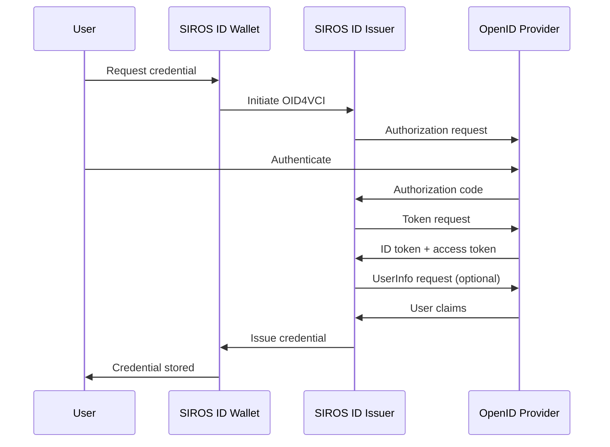

# OpenID Connect Provider Integration

This guide explains how to connect any [OpenID Connect](https://openid.net/specs/openid-connect-core-1_0.html) provider (OP) to the SIROS ID issuer for credential issuance. After reading this guide, you will understand how to:

- Configure OIDC authentication for the issuer
- Register the issuer as an OIDC client
- Map OIDC claims to credential claims
- Handle different grant types and flows

## Overview

OpenID Connect is the recommended integration method for most identity providers. Users authenticate through their existing OIDC provider, and the issuer uses the identity claims to construct digital credentials via [OID4VCI](https://openid.net/specs/openid-4-verifiable-credential-issuance-1_0.html).



:::tip When to Use OIDC
Use OIDC integration when:
- Your identity provider supports OpenID Connect
- You want the simplest integration path
- You need to leverage OIDC-specific features (PKCE, dynamic registration)
:::

## Prerequisites

- An OpenID Connect compliant identity provider
- Admin access to register OIDC clients
- A SIROS ID issuer (hosted or self-hosted)

## Step 1: Register the Issuer as OIDC Client

### Manual Registration

Register the issuer with your OpenID Provider:

| Setting | Value |
|---------|-------|
| **Client Type** | Confidential |
| **Redirect URI** | `https://issuer.example.com/callback` |
| **Grant Types** | `authorization_code` |
| **Response Types** | `code` |
| **Token Auth Method** | `client_secret_post` or `client_secret_basic` |

Save the issued `client_id` and `client_secret`.

### Dynamic Client Registration

If your OP supports [RFC 7591](https://datatracker.ietf.org/doc/html/rfc7591) dynamic registration:

```bash
curl -X POST "https://op.example.com/register" \
  -H "Content-Type: application/json" \
  -d '{
    "client_name": "SIROS ID Credential Issuer",
    "redirect_uris": ["https://issuer.example.com/callback"],
    "grant_types": ["authorization_code"],
    "response_types": ["code"],
    "token_endpoint_auth_method": "client_secret_post",
    "scope": "openid profile email"
  }'
```

## Step 2: Configure the Issuer

### Basic Configuration

```yaml
issuer:
  api_server:
    addr: :8080
  external_url: "https://issuer.example.com"
  
  authentication:
    type: oidc
    
    # OpenID Provider discovery
    issuer_url: "https://op.example.com"
    
    # Client credentials
    client_id: "siros-issuer"
    client_secret: "${OIDC_CLIENT_SECRET}"
    
    # Scopes to request
    scopes:
      - openid
      - profile
      - email
```

### With Explicit Endpoints

If your OP doesn't support discovery:

```yaml
issuer:
  authentication:
    type: oidc
    
    # Explicit endpoint configuration
    endpoints:
      authorization: "https://op.example.com/authorize"
      token: "https://op.example.com/token"
      userinfo: "https://op.example.com/userinfo"
      jwks: "https://op.example.com/.well-known/jwks.json"
    
    client_id: "siros-issuer"
    client_secret: "${OIDC_CLIENT_SECRET}"
    scopes:
      - openid
      - profile
      - email
```

### Security Options

```yaml
issuer:
  authentication:
    type: oidc
    issuer_url: "https://op.example.com"
    client_id: "siros-issuer"
    client_secret: "${OIDC_CLIENT_SECRET}"
    
    # Security settings
    security:
      # Use PKCE (recommended)
      use_pkce: true
      pkce_method: "S256"
      
      # State parameter (always enabled)
      state_length: 32
      
      # Nonce for ID token replay protection
      use_nonce: true
      
      # Token endpoint authentication
      token_auth_method: "client_secret_post"  # or client_secret_basic, private_key_jwt
      
      # Response mode
      response_mode: "query"  # or fragment, form_post
```

## Step 3: Claim Mapping

Map OIDC claims to credential claims.

### Standard Claims

OpenID Connect defines standard claims:

| OIDC Claim | Description |
|------------|-------------|
| `sub` | Subject identifier |
| `given_name` | First name |
| `family_name` | Last name |
| `email` | Email address |
| `email_verified` | Email verification status |
| `birthdate` | Birth date (YYYY-MM-DD) |
| `address` | Address object |
| `phone_number` | Phone number |

### Configuration

```yaml
issuer:
  authentication:
    type: oidc
    issuer_url: "https://op.example.com"
    client_id: "siros-issuer"
    client_secret: "${OIDC_CLIENT_SECRET}"
    scopes:
      - openid
      - profile
      - email
      - address
    
    # Claim sources
    claim_sources:
      # Claims from ID token (default)
      - type: id_token
      # Additional claims from userinfo
      - type: userinfo
    
    # Claim mapping (optional transformations)
    claim_mapping:
      # Direct mapping (no transformation)
      given_name: "given_name"
      family_name: "family_name"
      email: "email"
      birthdate: "birthdate"
      
      # Custom claim names
      personal_id: "custom:personal_id"
      
      # Nested claims
      country: "address.country"
      
      # Transformation
      full_name:
        source: ["given_name", "family_name"]
        transform: "concat"
        separator: " "

  credential_constructor:
    pid:
      vct: "urn:eudi:pid:arf-1.8:1"
      claim_mapping:
        given_name: "$.oidc.given_name"
        family_name: "$.oidc.family_name"
        birth_date: "$.oidc.birthdate"
        email: "$.oidc.email"
```

### Custom Scopes and Claims

Request provider-specific claims:

```yaml
issuer:
  authentication:
    type: oidc
    issuer_url: "https://op.example.com"
    client_id: "siros-issuer"
    client_secret: "${OIDC_CLIENT_SECRET}"
    
    # Standard + custom scopes
    scopes:
      - openid
      - profile
      - email
      - custom:employee_info    # Provider-specific scope
      - custom:department       # Provider-specific scope
    
    # Request specific claims via claims parameter
    claims:
      id_token:
        birthdate:
          essential: true
        nationality:
          essential: false
      userinfo:
        employee_id: null
        department: null
```

## Provider-Specific Examples

### Azure AD / Entra ID

```yaml
issuer:
  authentication:
    type: oidc
    issuer_url: "https://login.microsoftonline.com/{tenant-id}/v2.0"
    client_id: "${AZURE_CLIENT_ID}"
    client_secret: "${AZURE_CLIENT_SECRET}"
    scopes:
      - openid
      - profile
      - email
      - User.Read
    
    # Azure-specific settings
    extra_params:
      prompt: "select_account"
```

### Google

```yaml
issuer:
  authentication:
    type: oidc
    issuer_url: "https://accounts.google.com"
    client_id: "${GOOGLE_CLIENT_ID}"
    client_secret: "${GOOGLE_CLIENT_SECRET}"
    scopes:
      - openid
      - profile
      - email
```

### Okta

```yaml
issuer:
  authentication:
    type: oidc
    issuer_url: "https://{your-domain}.okta.com"
    client_id: "${OKTA_CLIENT_ID}"
    client_secret: "${OKTA_CLIENT_SECRET}"
    scopes:
      - openid
      - profile
      - email
      - groups  # Get group membership
```

### Auth0

```yaml
issuer:
  authentication:
    type: oidc
    issuer_url: "https://{your-domain}.auth0.com/"
    client_id: "${AUTH0_CLIENT_ID}"
    client_secret: "${AUTH0_CLIENT_SECRET}"
    scopes:
      - openid
      - profile
      - email
    
    # Auth0-specific: audience for API access
    extra_params:
      audience: "https://your-api.example.com"
```

### Generic Self-Hosted (Authelia, Authentik, etc.)

```yaml
issuer:
  authentication:
    type: oidc
    issuer_url: "https://auth.example.com"
    client_id: "siros-issuer"
    client_secret: "${OIDC_CLIENT_SECRET}"
    scopes:
      - openid
      - profile
      - email
      - groups
```

## Advanced Configuration

### Multiple Providers

Support authentication from multiple OPs:

```yaml
issuer:
  authentication:
    type: oidc
    
    providers:
      - name: "corporate"
        display_name: "Corporate Login"
        issuer_url: "https://idp.corporate.example.com"
        client_id: "${CORP_CLIENT_ID}"
        client_secret: "${CORP_CLIENT_SECRET}"
        scopes: ["openid", "profile", "email"]
        
      - name: "partner"
        display_name: "Partner Login"
        issuer_url: "https://idp.partner.example.org"
        client_id: "${PARTNER_CLIENT_ID}"
        client_secret: "${PARTNER_CLIENT_SECRET}"
        scopes: ["openid", "profile"]
    
    # Provider selection
    discovery:
      type: user_choice  # or email_domain
```

### Private Key JWT Authentication

For enhanced security:

```yaml
issuer:
  authentication:
    type: oidc
    issuer_url: "https://op.example.com"
    client_id: "siros-issuer"
    
    # Private key JWT authentication (RFC 7523)
    security:
      token_auth_method: "private_key_jwt"
      private_key_path: "/pki/client-key.pem"
      key_id: "issuer-key-1"
      algorithm: "RS256"  # or ES256
```

### Refresh Tokens

For long-lived sessions or token refresh:

```yaml
issuer:
  authentication:
    type: oidc
    issuer_url: "https://op.example.com"
    client_id: "siros-issuer"
    client_secret: "${OIDC_CLIENT_SECRET}"
    scopes:
      - openid
      - profile
      - offline_access  # Request refresh token
    
    token_handling:
      use_refresh_tokens: true
      refresh_threshold: 300  # Refresh when < 5 min remaining
```

## Docker Deployment

```yaml
services:
  issuer:
    image: ghcr.io/sirosfoundation/vc-issuer:latest  # or vc-issuer-full for VC 2.0 support
    restart: always
    ports:
      - "8080:8080"
    environment:
      - VC_CONFIG_YAML=config.yaml
      - OIDC_CLIENT_SECRET=${OIDC_CLIENT_SECRET}
    volumes:
      - ./config.yaml:/config.yaml:ro
      - ./pki:/pki:ro
    depends_on:
      - mongo

  mongo:
    image: mongo:7
    restart: always
    volumes:
      - mongo-data:/data/db

volumes:
  mongo-data:
```

## Troubleshooting

### Invalid Client

**Error**: `invalid_client`

**Solutions**:
1. Verify client_id and client_secret are correct
2. Check token_auth_method matches OP configuration
3. Ensure client is not expired or disabled

### Invalid Redirect URI

**Error**: `redirect_uri_mismatch`

**Solutions**:
1. Verify redirect URI exactly matches registered URI
2. Check for trailing slashes
3. Ensure HTTPS is used (required by most OPs)

### Claims Missing

**Symptoms**: Credential missing expected claims

**Solutions**:
1. Verify scopes include the claims you need
2. Check if claims come from userinfo (add userinfo to claim_sources)
3. Verify claim names match OP's claim structure
4. Test with OP's token inspection endpoint

### Token Signature Verification Failed

**Error**: `invalid_token` or signature verification error

**Solutions**:
1. Verify issuer_url matches the token's `iss` claim
2. Check JWKS endpoint is accessible
3. Ensure server time is synchronized

## Configuration Reference

### Complete Example

```yaml
issuer:
  api_server:
    addr: :8080
  external_url: "https://issuer.example.com"
  
  authentication:
    type: oidc
    issuer_url: "https://op.example.com"
    client_id: "siros-issuer"
    client_secret: "${OIDC_CLIENT_SECRET}"
    
    scopes:
      - openid
      - profile
      - email
    
    security:
      use_pkce: true
      pkce_method: "S256"
      use_nonce: true
      token_auth_method: "client_secret_post"
    
    claim_sources:
      - type: id_token
      - type: userinfo
    
    claim_mapping:
      given_name: "given_name"
      family_name: "family_name"
      email: "email"
      birthdate: "birthdate"
  
  signing:
    key_path: "/pki/issuer_key.pem"
    algorithm: "ES256"
  
  credential_constructor:
    pid:
      vct: "urn:eudi:pid:arf-1.8:1"
      format: "vc+sd-jwt"
      validity_days: 365
      claim_mapping:
        given_name: "$.oidc.given_name"
        family_name: "$.oidc.family_name"
        birth_date: "$.oidc.birthdate"
        email: "$.oidc.email"

common:
  mongo:
    uri: mongodb://mongo:27017
```

## Next Steps

- [Issuer Configuration](./issuer.md) – Full issuer documentation
- [SAML IdP Integration](./saml-idp.md) – Use SAML instead of OIDC
- [Keycloak Issuer Integration](./keycloak_issuer.md) – Keycloak-specific guide
- [Trust Services](../trust/) – Configure trust framework integration
