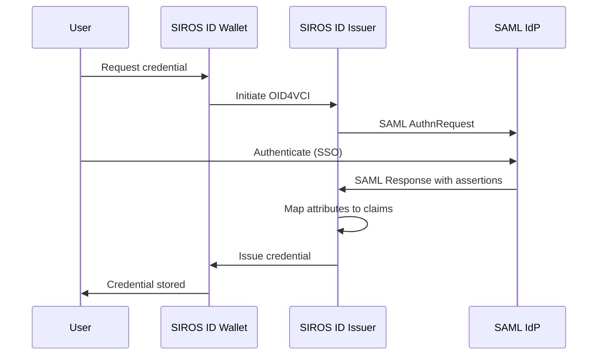

# SAML Identity Provider Integration

This guide explains how to connect a SAML 2.0 identity provider to the SIROS ID issuer for credential issuance. After reading this guide, you will understand how to:

- Configure SAML authentication for the issuer
- Map SAML attributes to credential claims
- Set up metadata exchange (manual or MDQ)
- Handle federation scenarios

## Overview

SAML integration allows organizations with existing SAML identity federations to issue digital credentials to their users. Users authenticate through their familiar SAML login, then receive credentials based on the attributes released by the IdP.



:::tip When to Use SAML
Use SAML integration when:
- Your organization is part of a SAML federation (e.g., eduGAIN, InCommon, SWAMID)
- Users already have accounts in a SAML IdP
- You need to leverage existing attribute release policies
:::

## Prerequisites

- A SAML 2.0 compliant identity provider
- IdP metadata (URL or file)
- A SIROS ID issuer built with SAML support (\`vc-issuer-full\` or \`vc-apigw-full\` image)

:::important Full Image Required
SAML support requires the \`-full\` image variant which includes the \`saml\` build tag:
- \`ghcr.io/sirosfoundation/vc-issuer-full\`
- \`ghcr.io/sirosfoundation/vc-apigw-full\`
:::

## Configuration

SAML authentication is configured in the \`apigw.saml\` section of your configuration file.

### Basic Configuration

```yaml
apigw:
  saml:
    # Enable SAML support
    enabled: true
    
    # Service Provider entity ID (your issuer's identifier)
    entity_id: "https://issuer.example.org/sp"
    
    # Assertion Consumer Service endpoint (where IdP sends responses)
    acs_endpoint: "https://issuer.example.org/saml/acs"
    
    # SP signing/encryption certificates
    certificate_path: "/pki/sp-cert.pem"
    private_key_path: "/pki/sp-key.pem"
    
    # Session duration in seconds (default: 3600)
    session_duration: 3600
    
    # Credential mappings (see below)
    credential_mappings:
      pid:
        credential_config_id: "urn:eudi:pid:arf-1.8:1"
        attributes:
          "urn:oid:2.5.4.42":
            claim: "given_name"
            required: true
          "urn:oid:2.5.4.4":
            claim: "family_name"
            required: true
```

### IdP Metadata Configuration

You must configure either MDQ or static IdP metadata (but not both).

#### Option 1: MDQ (Metadata Query Protocol)

For federation environments with many IdPs, use [MDQ](https://datatracker.ietf.org/doc/draft-young-md-query/) to fetch metadata on-demand:

```yaml
apigw:
  saml:
    enabled: true
    entity_id: "https://issuer.example.org/sp"
    acs_endpoint: "https://issuer.example.org/saml/acs"
    certificate_path: "/pki/sp-cert.pem"
    private_key_path: "/pki/sp-key.pem"
    
    # MDQ configuration
    mdq_server: "https://mds.swamid.se/entities/"
    
    # Cache TTL in seconds (default: 3600)
    metadata_cache_ttl: 3600
    
    credential_mappings:
      # ...
```

**Federation MDQ Endpoints:**

| Federation | MDQ Endpoint |
|------------|--------------|
| **SWAMID** | \`https://mds.swamid.se/entities/\` |
| **InCommon** | \`https://mdq.incommon.org/entities/\` |

:::note eduGAIN Metadata
eduGAIN provides aggregate metadata intended for national federations. For individual entity queries, use your national federation's MDQ service.
:::

#### Option 2: Static IdP Metadata

For single IdP setups or testing:

```yaml
apigw:
  saml:
    enabled: true
    entity_id: "https://issuer.example.org/sp"
    acs_endpoint: "https://issuer.example.org/saml/acs"
    certificate_path: "/pki/sp-cert.pem"
    private_key_path: "/pki/sp-key.pem"
    
    # Static IdP configuration (mutually exclusive with mdq_server)
    static_idp_metadata:
      entity_id: "https://idp.example.org"
      # Use file path OR URL (not both)
      metadata_path: "/metadata/idp-metadata.xml"
      # metadata_url: "https://idp.example.org/metadata"
    
    credential_mappings:
      # ...
```

## Attribute Mapping

Configure how SAML attributes map to credential claims using the \`credential_mappings\` section.

### Standard Attribute Names

SAML uses OID-based attribute names. Common mappings:

| Credential Claim | SAML Attribute (OID) | Friendly Name |
|------------------|---------------------|---------------|
| \`given_name\` | \`urn:oid:2.5.4.42\` | \`givenName\` |
| \`family_name\` | \`urn:oid:2.5.4.4\` | \`sn\` |
| \`email\` | \`urn:oid:0.9.2342.19200300.100.1.3\` | \`mail\` |
| \`personal_id\` | \`urn:oid:1.3.6.1.4.1.5923.1.1.1.6\` | \`eduPersonPrincipalName\` |
| \`affiliation\` | \`urn:oid:1.3.6.1.4.1.5923.1.1.1.1\` | \`eduPersonAffiliation\` |

### Credential Mappings Configuration

Each entry in \`credential_mappings\` maps a credential type to its configuration:

```yaml
credential_mappings:
  # Key matches credential_constructor scope
  pid:
    # OpenID4VCI credential configuration ID
    credential_config_id: "urn:eudi:pid:arf-1.8:1"
    
    # Optional: default IdP for this credential type
    default_idp: "https://idp.example.org"
    
    # Attribute mappings: SAML attribute -> credential claim
    attributes:
      "urn:oid:2.5.4.42":
        claim: "given_name"
        required: true
      "urn:oid:2.5.4.4":
        claim: "family_name"
        required: true
      "urn:oid:0.9.2342.19200300.100.1.3":
        claim: "email"
        required: false
      "urn:oid:1.3.6.1.5.5.7.9.1":
        claim: "birth_date"
        required: true
        # Optional: transform the value
        transform: "lowercase"
      # Attribute with default value
      "urn:oid:2.5.4.6":
        claim: "nationality"
        required: false
        default: "SE"
  
  # Additional credential types
  diploma:
    credential_config_id: "urn:eudi:diploma:1"
    attributes:
      "urn:oid:2.5.4.42":
        claim: "given_name"
        required: true
      # ...
```

### Attribute Configuration Options

Each attribute mapping supports:

| Option | Type | Description |
|--------|------|-------------|
| \`claim\` | string | Target claim name (supports dot-notation for nesting) |
| \`required\` | boolean | Whether the attribute must be present |
| \`transform\` | string | Optional transformation: \`lowercase\`, \`uppercase\`, \`trim\` |
| \`default\` | string | Default value if attribute is missing |

## Docker Deployment

```yaml
services:
  apigw:
    image: ghcr.io/sirosfoundation/vc-apigw-full:latest
    restart: always
    ports:
      - "8080:8080"
    volumes:
      - ./config.yaml:/config.yaml:ro
      - ./pki:/pki:ro
      - ./metadata:/metadata:ro  # For static IdP metadata
    depends_on:
      - mongo
      - issuer

  issuer:
    image: ghcr.io/sirosfoundation/vc-issuer-full:latest
    # ...

  mongo:
    image: mongo:7
    volumes:
      - mongo-data:/data/db

volumes:
  mongo-data:
```

### Generate SP Certificates

```bash
# Generate signing/encryption key pair
openssl req -x509 -newkey rsa:2048 \
  -keyout pki/sp-key.pem \
  -out pki/sp-cert.pem \
  -days 3650 -nodes \
  -subj "/CN=issuer.example.org/O=Example Org"
```

## Complete Configuration Example

```yaml
apigw:
  external_server_url: "https://issuer.example.org"
  
  saml:
    enabled: true
    entity_id: "https://issuer.example.org/sp"
    acs_endpoint: "https://issuer.example.org/saml/acs"
    certificate_path: "/pki/sp-cert.pem"
    private_key_path: "/pki/sp-key.pem"
    
    # MDQ for SWAMID federation
    mdq_server: "https://mds.swamid.se/entities/"
    metadata_cache_ttl: 3600
    
    session_duration: 3600
    
    credential_mappings:
      pid:
        credential_config_id: "urn:eudi:pid:arf-1.8:1"
        attributes:
          "urn:oid:2.5.4.42":
            claim: "given_name"
            required: true
          "urn:oid:2.5.4.4":
            claim: "family_name"
            required: true
          "urn:oid:1.3.6.1.4.1.25178.1.2.3":
            claim: "personal_id"
            required: true

# Credential constructor must match credential_mappings keys
credential_constructor:
  pid:
    vct: "urn:eudi:pid:arf-1.8:1"
    vctm_file_path: "/metadata/vctm_pid_arf_1_8.json"
    auth_method: basic
    format: "dc+sd-jwt"

common:
  mongo:
    uri: mongodb://mongo:27017
```

## Troubleshooting

### SAML Response Validation Failed

**Solutions:**
1. Verify IdP signing certificate in metadata is current
2. Check clock synchronization (SAML has strict time windows)
3. Ensure SP certificates are valid and not expired

### Attributes Not Received

**Solutions:**
1. Check IdP attribute release policy allows attributes to your SP
2. Verify attribute OIDs match your mapping configuration
3. Enable debug logging to inspect raw SAML assertions
4. Contact IdP administrator to verify attribute configuration

### MDQ Lookup Failed

**Solutions:**
1. Verify MDQ server URL ends with \`/\`
2. Check the IdP is registered in the federation
3. Verify network connectivity to MDQ service

## Next Steps

- [Issuer Configuration](./issuer) – Full issuer documentation
- [OpenID Connect Provider Integration](./oidc-op) – Use OIDC instead of SAML
- [Trust Services](../trust/) – Configure trust framework integration
