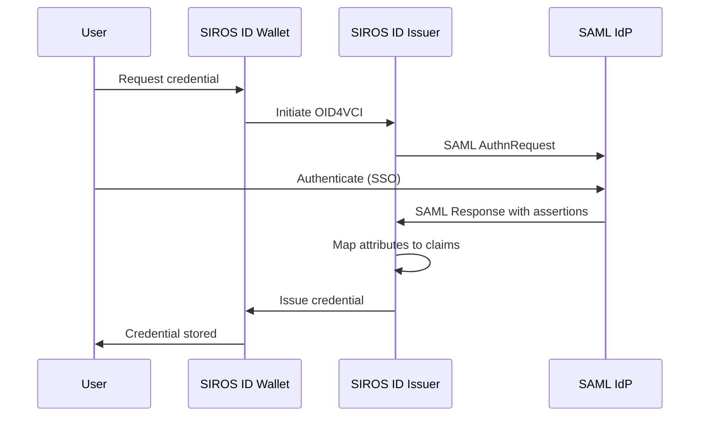

# SAML Identity Provider Integration

This guide explains how to connect a SAML 2.0 identity provider to the SIROS ID issuer for credential issuance. After reading this guide, you will understand how to:

- Configure SAML authentication for the issuer
- Map SAML attributes to credential claims
- Set up metadata exchange (manual or MDQ)
- Handle federation scenarios

## Overview

SAML integration allows organizations with existing SAML identity federations to issue digital credentials to their users. Users authenticate through their familiar SAML login, then receive credentials based on the attributes released by the IdP.



:::tip When to Use SAML
Use SAML integration when:
- Your organization is part of a SAML federation (e.g., eduGAIN, InCommon)
- Users already have accounts in a SAML IdP
- You need to leverage existing attribute release policies
:::

## Prerequisites

- A SAML 2.0 compliant identity provider
- IdP metadata (URL or file)
- A SIROS ID issuer (hosted or self-hosted)

## Metadata Exchange

SAML requires metadata exchange between the Service Provider (issuer) and Identity Provider. SIROS ID supports three methods:

### Option 1: Manual Metadata Configuration

For simple setups or testing, configure metadata statically.

#### Get Issuer SP Metadata

The issuer publishes its SP metadata at:

```
https://issuer.example.com/saml/metadata
```

Provide this URL to your IdP administrator, or download and import manually.

#### Configure IdP Metadata

Add the IdP metadata to your issuer configuration:

```yaml
issuer:
  authentication:
    type: saml
    
    # Service Provider configuration
    sp:
      entity_id: "https://issuer.example.com/sp"
      acs_url: "https://issuer.example.com/saml/acs"
      certificate_path: "/pki/sp-cert.pem"
      private_key_path: "/pki/sp-key.pem"
    
    # Identity Provider - manual metadata
    idp:
      metadata_file: "/metadata/idp-metadata.xml"
      # Or inline metadata URL (fetched once at startup)
      # metadata_url: "https://idp.example.com/metadata"
```

#### IdP Metadata File

Download your IdP's metadata and save it:

```xml
<!-- /metadata/idp-metadata.xml -->
<?xml version="1.0"?>
<EntityDescriptor xmlns="urn:oasis:names:tc:SAML:2.0:metadata"
                  entityID="https://idp.example.com">
  <IDPSSODescriptor protocolSupportEnumeration="urn:oasis:names:tc:SAML:2.0:protocol">
    <KeyDescriptor use="signing">
      <KeyInfo xmlns="http://www.w3.org/2000/09/xmldsig#">
        <X509Data>
          <X509Certificate>MIIC...</X509Certificate>
        </X509Data>
      </KeyInfo>
    </KeyDescriptor>
    <SingleSignOnService 
        Binding="urn:oasis:names:tc:SAML:2.0:bindings:HTTP-Redirect"
        Location="https://idp.example.com/sso"/>
  </IDPSSODescriptor>
</EntityDescriptor>
```

### Option 2: MDQ (Metadata Query Protocol)

For federation environments with many IdPs, use [MDQ](https://datatracker.ietf.org/doc/draft-young-md-query/) to fetch metadata on-demand.

```yaml
issuer:
  authentication:
    type: saml
    
    sp:
      entity_id: "https://issuer.example.com/sp"
      acs_url: "https://issuer.example.com/saml/acs"
      certificate_path: "/pki/sp-cert.pem"
      private_key_path: "/pki/sp-key.pem"
    
    # MDQ configuration
    mdq:
      enabled: true
      base_url: "https://mdq.example.org/entities/"
      # Optional: verify MDQ responses
      verification:
        enabled: true
        certificate_path: "/pki/mdq-signing-cert.pem"
      # Cache settings
      cache:
        enabled: true
        duration: 3600  # seconds
        max_entries: 1000
```

#### How MDQ Works

1. User initiates login and selects their IdP (or IdP is determined by email domain)
2. Issuer queries MDQ: `GET https://mdq.example.org/entities/{sha1-of-entityID}`
3. MDQ returns the IdP metadata
4. Issuer caches the metadata and proceeds with SAML flow

#### MDQ URL Formats

Different MDQ services use different URL patterns:

```yaml
mdq:
  # Standard MDQ (RFC 8484)
  base_url: "https://mdq.example.org/entities/"
  
  # Some services use URL-encoded entityID
  # base_url: "https://mdq.example.org/entity/"
  # url_encoding: true
  
  # Transform for SHA-1 hash format
  # base_url: "https://mdq.example.org/entities/{sha1}"
```

#### Federation MDQ Endpoints

| Federation | MDQ Endpoint | Documentation |
|------------|--------------|---------------|
| **InCommon** | `https://mdq.incommon.org/entities/` | [InCommon MDQ Service](https://spaces.at.internet2.edu/display/mdq) |
| **SWAMID** | `https://mds.swamid.se/entities/` | [SWAMID Technical](https://wiki.sunet.se/display/SWAMID) |

:::note eduGAIN Metadata
eduGAIN provides an aggregate metadata feed at `https://mds.edugain.org/edugain-v2.xml` intended for consumption by national federations, not individual service providers. For individual entity queries, use your national federation's MDQ service. See [eduGAIN Technical](https://technical.edugain.org/metadata) for details.
:::

### Option 3: Federation Aggregate

For federations that publish aggregate metadata:

```yaml
issuer:
  authentication:
    type: saml
    
    sp:
      entity_id: "https://issuer.example.com/sp"
    
    # Federation aggregate
    federation:
      metadata_url: "https://federation.example.org/metadata/federation-metadata.xml"
      # Refresh interval
      refresh_interval: 3600
      # Verify aggregate signature
      verification:
        enabled: true
        certificate_path: "/pki/federation-signing-cert.pem"
      # Filter to specific IdPs (optional)
      entity_filter:
        - "https://idp1.example.com"
        - "https://idp2.example.org"
```

## Attribute Mapping

Map SAML attributes to credential claims.

### Standard Attribute Names

SAML uses OID-based attribute names. Common mappings:

| Credential Claim | SAML Attribute (OID) | SAML Attribute (Friendly) |
|------------------|---------------------|---------------------------|
| `given_name` | `urn:oid:2.5.4.42` | `givenName` |
| `family_name` | `urn:oid:2.5.4.4` | `sn` |
| `email` | `urn:oid:0.9.2342.19200300.100.1.3` | `mail` |
| `birthdate` | `urn:oid:1.3.6.1.5.5.7.9.1` | `dateOfBirth` |
| `personal_id` | `urn:oid:1.3.6.1.4.1.5923.1.1.1.6` | `eduPersonPrincipalName` |

### Configuration

```yaml
issuer:
  authentication:
    type: saml
    # ... sp and idp config ...
    
    # Attribute mapping
    attribute_mapping:
      # Map by OID
      given_name: "urn:oid:2.5.4.42"
      family_name: "urn:oid:2.5.4.4"
      email: "urn:oid:0.9.2342.19200300.100.1.3"
      
      # Or by friendly name
      birthdate: "dateOfBirth"
      nationality: "country"
      
      # Complex mapping with transformation
      personal_id:
        attribute: "urn:oid:1.3.6.1.4.1.5923.1.1.1.6"
        # Extract local part before @
        transform: "regex:^([^@]+)@.*$:$1"

  # Map to credentials
  credential_constructor:
    pid:
      vct: "urn:eudi:pid:arf-1.8:1"
      claim_mapping:
        given_name: "$.saml.given_name"
        family_name: "$.saml.family_name"
        birth_date: "$.saml.birthdate"
```

### Multi-Valued Attributes

Handle attributes with multiple values:

```yaml
attribute_mapping:
  # Take first value
  affiliation:
    attribute: "eduPersonAffiliation"
    multi_value: "first"
  
  # Take all values as array
  roles:
    attribute: "eduPersonEntitlement"
    multi_value: "all"
  
  # Filter and take first matching
  primary_affiliation:
    attribute: "eduPersonAffiliation"
    multi_value: "filter"
    filter_pattern: "^(employee|faculty|staff)$"
```

## IdP Discovery

When supporting multiple IdPs, configure discovery.

### Email Domain Discovery

```yaml
issuer:
  authentication:
    type: saml
    
    discovery:
      type: email_domain
      # Map email domains to IdP entityIDs
      domain_mapping:
        "example.com": "https://idp.example.com"
        "university.edu": "https://idp.university.edu"
      # Fallback for unknown domains
      default_idp: "https://default-idp.example.org"
```

### Discovery Service (WAYF)

Use an external discovery service:

```yaml
issuer:
  authentication:
    type: saml
    
    discovery:
      type: wayf
      discovery_url: "https://wayf.example.org/DS"
      # Return URL after discovery
      return_url: "https://issuer.example.com/saml/discovery-response"
```

### Embedded Discovery

Host discovery UI within the issuer:

```yaml
issuer:
  authentication:
    type: saml
    
    discovery:
      type: embedded
      # Load IdP list from metadata
      idp_list_source: "mdq"  # or "federation" or "static"
      # UI customization
      ui:
        title: "Select your organization"
        search_enabled: true
        remember_choice: true
```

## Security Configuration

### Signature and Encryption

```yaml
issuer:
  authentication:
    type: saml
    
    sp:
      entity_id: "https://issuer.example.com/sp"
      
      # Signing configuration
      signing:
        certificate_path: "/pki/sp-signing-cert.pem"
        private_key_path: "/pki/sp-signing-key.pem"
        algorithm: "http://www.w3.org/2001/04/xmldsig-more#rsa-sha256"
        # Sign requests
        sign_authn_requests: true
        sign_logout_requests: true
      
      # Encryption configuration (for encrypted assertions)
      encryption:
        certificate_path: "/pki/sp-encryption-cert.pem"
        private_key_path: "/pki/sp-encryption-key.pem"
        # Accept encrypted assertions
        want_encrypted_assertions: true
    
    # Require signed responses from IdP
    idp:
      require_signed_response: true
      require_signed_assertions: true
```

### Authentication Context

Request specific authentication methods:

```yaml
issuer:
  authentication:
    type: saml
    
    authn_context:
      # Request MFA
      comparison: "minimum"
      class_refs:
        - "urn:oasis:names:tc:SAML:2.0:ac:classes:PasswordProtectedTransport"
        - "urn:oasis:names:tc:SAML:2.0:ac:classes:MobileTwoFactorContract"
```

## Docker Deployment

:::important Full Image Required
SAML IdP integration requires the full image with SAML support: `vc-issuer-full`
:::

### Docker Compose

```yaml
services:
  issuer:
    image: ghcr.io/sirosfoundation/vc-issuer-full:latest  # Full image required for SAML
    restart: always
    ports:
      - "8080:8080"
    environment:
      - VC_CONFIG_YAML=config.yaml
    volumes:
      - ./config.yaml:/config.yaml:ro
      - ./pki:/pki:ro
      - ./metadata:/metadata:ro
    depends_on:
      - mongo

  mongo:
    image: mongo:7
    restart: always
    volumes:
      - mongo-data:/data/db

volumes:
  mongo-data:
```

### Generate SP Certificates

```bash
# Generate signing key pair
openssl req -x509 -newkey rsa:2048 \
  -keyout pki/sp-signing-key.pem \
  -out pki/sp-signing-cert.pem \
  -days 3650 -nodes \
  -subj "/CN=issuer.example.com/O=Example Org"

# Generate encryption key pair (optional)
openssl req -x509 -newkey rsa:2048 \
  -keyout pki/sp-encryption-key.pem \
  -out pki/sp-encryption-cert.pem \
  -days 3650 -nodes \
  -subj "/CN=issuer.example.com/O=Example Org"
```

## Troubleshooting

### SAML Response Validation Failed

**Error**: `invalid_signature` or `signature_verification_failed`

**Solutions**:
1. Verify IdP signing certificate in metadata is current
2. Check clock synchronization (SAML has strict time windows)
3. Ensure metadata was fetched/configured correctly
4. Verify `require_signed_response` matches IdP behavior

### Attributes Not Received

**Symptoms**: User authenticates but credential is missing claims

**Solutions**:
1. Check IdP attribute release policy allows attributes to your SP
2. Verify attribute names match your mapping configuration
3. Enable SAML debug logging to see raw assertions
4. Contact IdP administrator to verify attribute configuration

### MDQ Lookup Failed

**Error**: `entity_not_found` or `mdq_timeout`

**Solutions**:
1. Verify MDQ base URL is correct
2. Check entityID encoding (URL-encoded vs SHA-1 hash)
3. Confirm the IdP is registered in the federation
4. Check network connectivity to MDQ service

### Clock Skew Errors

**Error**: `assertion_not_yet_valid` or `assertion_expired`

**Solutions**:
1. Synchronize server time with NTP
2. Increase allowed clock skew:

```yaml
issuer:
  authentication:
    type: saml
    validation:
      max_clock_skew: 300  # seconds
```

## Complete Configuration Example

```yaml
issuer:
  api_server:
    addr: :8080
  external_url: "https://issuer.example.com"
  
  authentication:
    type: saml
    
    sp:
      entity_id: "https://issuer.example.com/sp"
      acs_url: "https://issuer.example.com/saml/acs"
      signing:
        certificate_path: "/pki/sp-signing-cert.pem"
        private_key_path: "/pki/sp-signing-key.pem"
        sign_authn_requests: true
    
    # MDQ for federation
    mdq:
      enabled: true
      base_url: "https://mds.swamid.se/entities/"
      cache:
        enabled: true
        duration: 3600
    
    # Discovery via email domain
    discovery:
      type: email_domain
      domain_mapping:
        "su.se": "https://idp.su.se/idp"
        "kth.se": "https://saml.sys.kth.se/idp"
        "uu.se": "https://idp.uu.se/idp"
    
    # Attribute mapping
    attribute_mapping:
      given_name: "urn:oid:2.5.4.42"
      family_name: "urn:oid:2.5.4.4"
      email: "urn:oid:0.9.2342.19200300.100.1.3"
      personal_id: "urn:oid:1.3.6.1.4.1.25178.1.2.3"
    
    validation:
      max_clock_skew: 180
  
  credential_constructor:
    pid:
      vct: "urn:eudi:pid:arf-1.8:1"
      format: "vc+sd-jwt"
      validity_days: 365
      claim_mapping:
        given_name: "$.saml.given_name"
        family_name: "$.saml.family_name"
        personal_id: "$.saml.personal_id"

common:
  mongo:
    uri: mongodb://mongo:27017
```

## Next Steps

- [Issuer Configuration](./issuer.md) – Full issuer documentation
- [Trust Services](../trust/) – Configure trust framework integration
- [OpenID Connect OP Integration](./oidc-op.md) – Use OIDC instead of SAML
