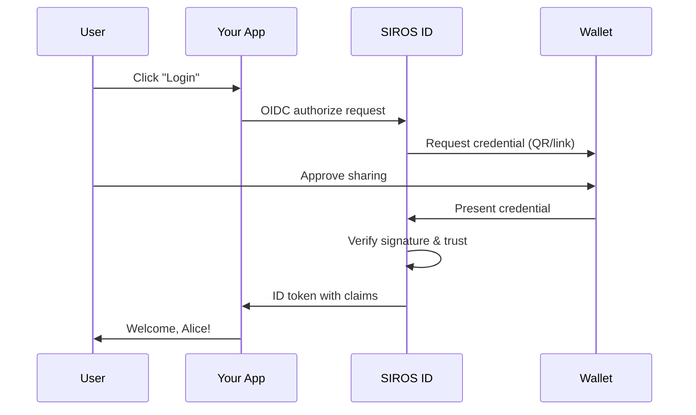

# Quick Start Guide

Get started with SIROS ID in minutes. This guide walks you through connecting your first application to verify digital credentials.

## What You'll Build

By the end of this guide, you'll have:

1. ✅ A working credential verification flow
2. ✅ Users logging in with their digital credentials
3. ✅ Verified identity claims in your application

## Prerequisites

- An application with OIDC/OAuth2 login support
- Access to your IAM configuration (e.g., Keycloak, Auth0)
- A test wallet (we'll set this up)

## Step 1: Get a Test Wallet (2 minutes)

1. Open [id.siros.org](https://id.siros.org) in your browser
2. Create a new wallet using a passkey
3. Navigate to **Add Credential** → **Demo PID**
4. Accept the test Person Identification credential

You now have a wallet with a test credential.

## Step 2: Register Your Application (5 minutes)

Register your application with a SIROS ID verifier:

```bash
# For self-hosted verifier:
curl -X POST https://verifier.example.org/register \
  -H "Content-Type: application/json" \
  -d '{
    "client_name": "My Test App",
    "redirect_uris": ["https://localhost:8080/callback"],
    "token_endpoint_auth_method": "client_secret_post",
    "grant_types": ["authorization_code"],
    "response_types": ["code"],
    "scope": "openid profile"
  }'
```

Save the returned `client_id` and `client_secret`.

:::info SIROS Hosted Service
When using the **SIROS ID hosted service**, services use subdomain-based multi-tenancy:

- **Wallet**: `https://id.siros.org/<tenant>`
- **Verifiers**: `https://<instance>.<tenant>.verifier.id.siros.org`
- **Issuers**: `https://<instance>.<tenant>.issuer.id.siros.org`

For example, with tenant `demo` and verifier instance `main`:
```bash
curl -X POST https://main.demo.verifier.id.siros.org/register \
  -H "Content-Type: application/json" \
  -d '{ ... }'
```
:::

## Step 3: Configure Your IAM (5 minutes)

Add SIROS ID verifier as an identity provider:

### Keycloak

1. Go to **Identity Providers** → **Add provider** → **OpenID Connect v1.0**
2. Configure:
   - **Alias**: `sirosid`
   - **Display Name**: `SIROS ID`
   - **Discovery URL**: `https://verifier.example.org/.well-known/openid-configuration`
   - **Client ID**: *(from step 2)*
   - **Client Secret**: *(from step 2)*
   - **Client Authentication**: `Client secret sent as post`
3. Save

### Auth0

1. Go to **Authentication** → **Enterprise** → **OpenID Connect**
2. Create a new connection with:
   - **Issuer URL**: `https://verifier.example.org`
   - **Client ID**: *(from step 2)*
   - **Client Secret**: *(from step 2)*

### Direct Integration

If not using an IAM, redirect users directly:

```javascript
// Replace with your verifier URL
const authUrl = 'https://verifier.example.org/authorize?' + 
  new URLSearchParams({
    response_type: 'code',
    client_id: 'your-client-id',
    redirect_uri: 'https://localhost:8080/callback',
    scope: 'openid profile',
    state: crypto.randomUUID()
  });

window.location = authUrl;
```

## Step 4: Test the Flow (2 minutes)

1. **Start login**: Click "Login with SIROS ID" in your app
2. **Scan QR code**: Use your test wallet to scan the QR code
3. **Approve sharing**: Review and approve the credential request
4. **Complete**: You're logged in with verified claims!

## What Just Happened?



Your application received verified identity claims directly from the user's credential:

```json
{
  "sub": "unique-user-id",
  "given_name": "Alice",
  "family_name": "Smith",
  "birthdate": "1990-01-15"
}
```

## Requesting Specific Claims

Use scopes to request different credentials:

| Scope | What You Get |
|-------|--------------|
| `openid` | Basic authentication |
| `profile` | Name, birthdate from PID |
| `pid` | Full Person ID claims |
| `ehic` | Health insurance card |
| `diploma` | Educational credentials |

Example:

```
scope=openid profile ehic
```

## Going to Production

1. **Register for production**: Contact SIROS ID to get production credentials or deploy your own infrastructure
2. **Configure trust**: Set up your trust framework registration
3. **Update URLs**: Point to your production verifier endpoint

## Next Steps

- 📖 [Full Verifier Guide](verifiers/verifier) – Complete verification documentation
- 🎫 [Issuing Credentials](issuers/issuer) – Issue your own credentials
- 🔐 [Trust Services](./trust/) – Configure trust framework
- 🔧 [Keycloak Integration](./verifiers/keycloak_verifier) – Detailed Keycloak setup

## Common Issues

### QR Code Not Scanning

- Ensure the wallet has camera permissions
- Try the deep link option for mobile browsers

### Claims Not Appearing

- Check that requested scopes match available credentials
- Verify the credential type in your wallet matches the request

### Token Validation Fails

- Ensure your clock is synchronized (NTP)
- Check the JWKS endpoint is accessible

## Get Help

- 📧 Email: support@siros.org
-  GitHub: [sirosfoundation](https://github.com/sirosfoundation)
