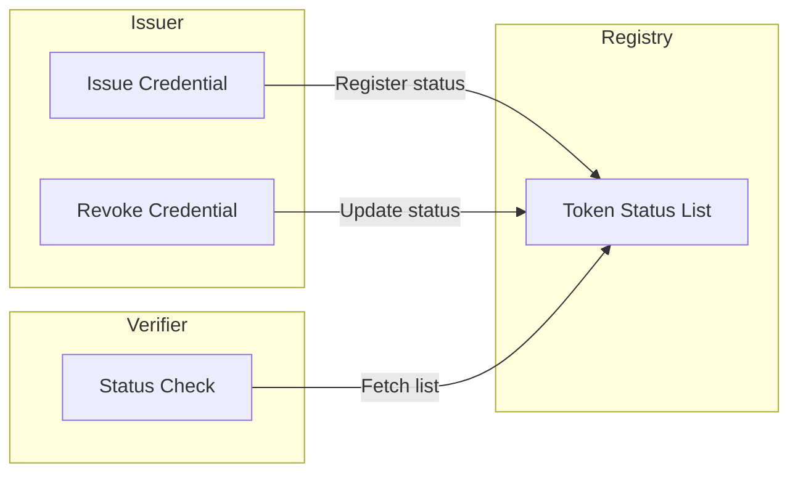
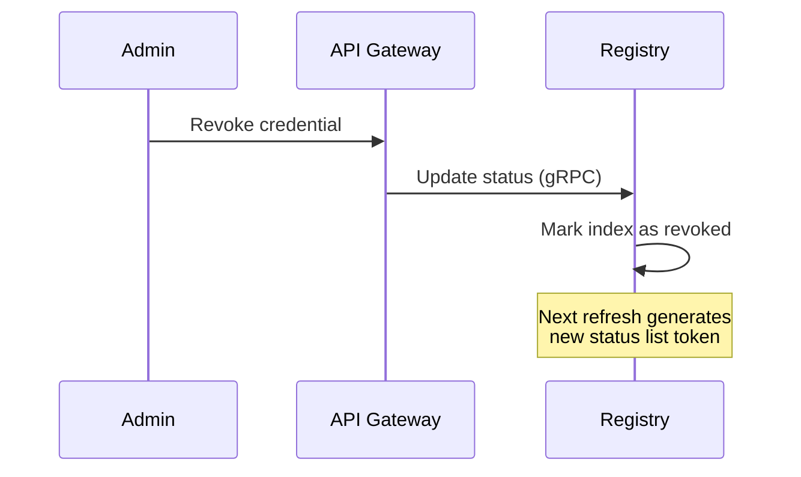
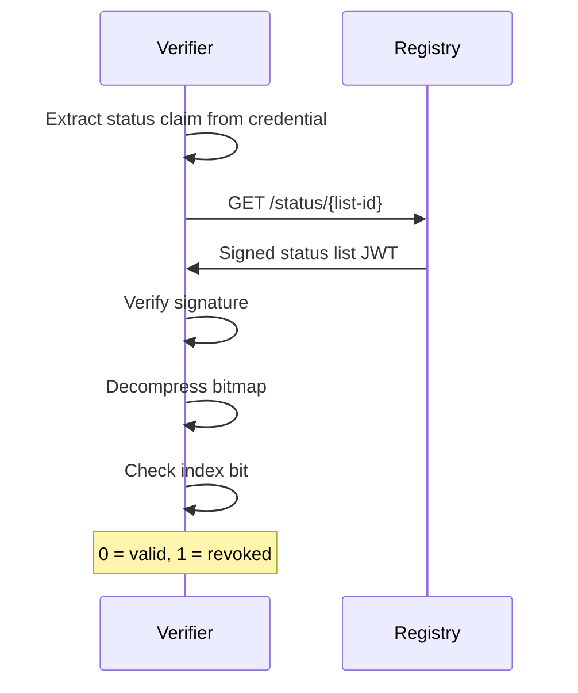

# Token Status Lists

The SIROS ID platform uses [Token Status Lists](https://datatracker.ietf.org/doc/draft-ietf-oauth-status-list/) for credential revocation. This page explains how to configure and use credential status checking.

## Overview

Token Status Lists provide an efficient, privacy-preserving mechanism for tracking credential revocation status. Instead of querying a revocation database for each credential, verifiers fetch a compact status list that contains the revocation status of many credentials.



## How It Works

1. **At Issuance**: Each credential includes a `status` claim with a reference to a status list
2. **Status List**: The registry publishes signed JWT status lists at known URLs
3. **At Verification**: Verifiers fetch the status list and check the credential's index

### Credential Status Claim

Credentials include a status reference:

```json
{
  "status": {
    "status_list": {
      "idx": 12345,
      "uri": "https://registry.example.org/status/list-001"
    }
  }
}
```

### Status List Format

Status lists are signed JWTs containing a compressed bitmap:

```json
{
  "iss": "https://registry.example.org",
  "sub": "https://registry.example.org/status/list-001",
  "iat": 1708963200,
  "exp": 1708966800,
  "status_list": {
    "bits": 1,
    "lst": "H4sIAAAAAAAAA..."
  }
}
```

## Configuration

Token Status Lists are configured in the `registry.token_status_lists` section.

### Registry Configuration

```yaml
registry:
  api_server:
    addr: :8080
  external_server_url: "https://registry.example.org"
  grpc_server:
    addr: :8090
  
  token_status_lists:
    # Signing key for status list tokens
    key_config:
      private_key_path: "/pki/tsl_signing_key.pem"
      chain_path: "/pki/tsl_signing_chain.pem"
    
    # How often new status list tokens are generated (seconds)
    # Default: 43200 (12 hours)
    token_refresh_interval: 43200
    
    # Number of entries per status list section
    # Default: 1000000 (1 million)
    section_size: 1000000
    
    # Rate limiting for status list endpoints
    # Default: 60 requests per minute per IP
    rate_limit_requests_per_minute: 60
```

### Configuration Options

| Option | Type | Default | Description |
|--------|------|---------|-------------|
| `key_config` | object | required | Signing key configuration |
| `token_refresh_interval` | int | 43200 | Token regeneration interval (seconds) |
| `section_size` | int | 1000000 | Entries per status list section |
| `rate_limit_requests_per_minute` | int | 60 | Rate limit per IP |

### HSM Support

For production deployments, use HSM-backed keys:

```yaml
registry:
  token_status_lists:
    key_config:
      pkcs11:
        module_path: /usr/lib/softhsm/libsofthsm2.so
        slot_id: 0
        pin: "${HSM_PIN}"
        key_label: "registry-tsl-key"
```

## Status List Endpoints

| Endpoint | Description |
|----------|-------------|
| `GET /status/{list-id}` | Fetch a specific status list |
| `GET /.well-known/jwt-vc-issuer` | Status list issuer metadata |

## Revocation Flow



## Verification Flow



## Privacy Considerations

Token Status Lists are designed with privacy in mind:

- **No correlation**: Verifiers only see the status at an index, not credential details
- **Batch fetching**: Multiple credentials can be checked with one request
- **Caching**: Status lists can be cached to reduce registry load
- **Decoys**: Section size includes unallocated indices for privacy

## Caching

Verifiers should cache status lists based on the `exp` claim:

```
Cache-Control: max-age=43200
```

## Next Steps

- [Registry Configuration](./registry) – Full registry setup
- [Trust Services](./trust/) – Configure trust for status list issuers
