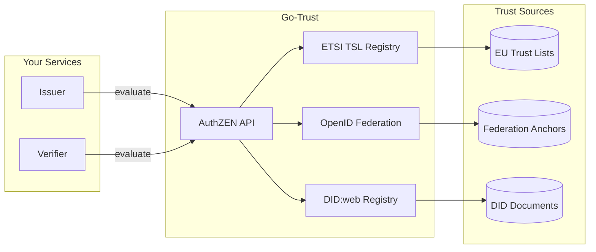

# Go-Trust AuthZEN Service

Go-Trust is a local trust engine that provides trust decisions via an [AuthZEN](https://openid.github.io/authzen/) policy decision point (PDP). It abstracts trust evaluation across multiple trust frameworks, allowing your issuer and verifier services to make consistent trust decisions without implementing complex trust logic.

## Why Use Go-Trust?

Trust evaluation in digital credential ecosystems is complex:

- **ETSI TSL 119 612** requires parsing XML trust status lists, validating certificates, and tracking service status
- **OpenID Federation** involves trust chain resolution, signature verification, and trust mark validation
- **DID:web** needs proper HTTP resolution and JWK matching

Go-Trust handles all of this behind a simple AuthZEN API, so your services can focus on credentials.



## Quick Start

### Docker Deployment

```bash
# Pull the image
docker pull ghcr.io/sirosfoundation/go-trust:latest

# Run with default configuration
docker run -p 8081:8081 ghcr.io/sirosfoundation/go-trust:latest serve
```

### Docker Compose

Add to your `docker-compose.yaml`:

```yaml
services:
  go-trust:
    image: ghcr.io/sirosfoundation/go-trust:latest
    restart: always
    ports:
      - "8081:8081"
    volumes:
      - ./trust-config.yaml:/config.yaml:ro
      - ./trust-data:/data:ro  # For local TSL files
    command: ["serve", "--config", "/config.yaml"]
    healthcheck:
      test: ["CMD", "curl", "-f", "http://localhost:8081/health"]
      interval: 30s
      timeout: 10s
      retries: 3
```

## Configuration

### Basic Configuration

Create `trust-config.yaml`:

```yaml
server:
  addr: ":8081"
  metrics_addr: ":9090"

# ETSI Trust Status List support
etsi:
  enabled: true
  trust_list_url: "https://ec.europa.eu/tools/lotl/eu-lotl.xml"
  cache_duration: 3600
  follow_refs: true
  max_ref_depth: 3

# OpenID Federation support
openid_federation:
  enabled: true
  trust_anchors:
    - entity_id: "https://federation.example.com"
  cache_duration: 1800

# DID:web support
did_web:
  enabled: true
  allowed_domains:
    - "*.example.com"
    - "issuer.trusted.org"

# Resolution strategy for multiple registries
resolution:
  strategy: "first_match"  # first_match, all_registries, best_match, sequential
```

### Multi-Registry Configuration

Go-Trust can query multiple trust frameworks simultaneously:

```yaml
registries:
  - name: "eu-tsl"
    type: "etsi_tsl"
    priority: 1
    config:
      trust_list_url: "https://ec.europa.eu/tools/lotl/eu-lotl.xml"
      
  - name: "edu-federation"
    type: "openid_federation"
    priority: 2
    config:
      trust_anchors:
        - entity_id: "https://edugateway.org"
      required_trust_marks:
        - "https://edugateway.org/tm/accredited"
        
  - name: "company-did"
    type: "did_web"
    priority: 3
    config:
      allowed_domains:
        - "*.company.internal"

resolution:
  strategy: "first_match"
  policy: "any_match"  # any_match, all_must_match
```

### Policy-Based Trust Decisions

Define policies that map action names to trust requirements:

```yaml
policies:
  # Credential issuers must be in EU TSL
  credential-issuer:
    registries: ["eu-tsl"]
    etsi:
      service_types:
        - "http://uri.etsi.org/TrstSvc/Svctype/EDS/Q"
    
  # Wallet providers need federation trust mark
  wallet-provider:
    registries: ["edu-federation"]
    oidfed:
      required_trust_marks:
        - "https://example.eu/tm/wallet-provider"
      allowed_entity_types:
        - "wallet_provider"
        
  # Internal services use DID:web
  internal-service:
    registries: ["company-did"]
    did_web:
      allowed_domains:
        - "*.company.internal"
```

## AuthZEN API

Go-Trust implements the AuthZEN protocol for trust evaluation.

### Evaluation Request

```bash
curl -X POST http://localhost:8081/access/v1/evaluation \
  -H "Content-Type: application/json" \
  -d '{
    "subject": {
      "type": "key",
      "id": "https://issuer.example.com"
    },
    "resource": {
      "type": "x5c",
      "id": "https://issuer.example.com",
      "key": ["MIIC...base64-cert..."]
    },
    "action": {
      "name": "credential-issuer"
    }
  }'
```

### Response

```json
{
  "decision": true,
  "context": {
    "reason": {
      "registry": "eu-tsl",
      "trust_service": "Qualified Electronic Signature",
      "service_status": "granted",
      "country": "SE"
    }
  }
}
```

### Resolution-Only Requests

To resolve trust metadata without key validation:

```bash
curl -X POST http://localhost:8081/access/v1/evaluation \
  -H "Content-Type: application/json" \
  -d '{
    "subject": {
      "type": "key",
      "id": "did:web:issuer.example.com"
    },
    "resource": {
      "id": "did:web:issuer.example.com"
    }
  }'
```

Response includes the resolved DID document or entity configuration:

```json
{
  "decision": true,
  "context": {
    "trust_metadata": {
      "@context": ["https://www.w3.org/ns/did/v1"],
      "id": "did:web:issuer.example.com",
      "verificationMethod": [...]
    }
  }
}
```

## Integration with Issuer/Verifier

### Verifier Configuration

Configure the verifier to use go-trust for credential validation:

```yaml
verifier_proxy:
  trust:
    authzen_endpoint: "http://go-trust:8081"
    enabled: true
    
    # Policy to use when verifying issuer trust
    issuer_policy: "credential-issuer"
    
    # Cache trust decisions
    cache_duration: 300
```

### Issuer Configuration

Configure the issuer to validate wallet attestations:

```yaml
issuer:
  trust:
    authzen_endpoint: "http://go-trust:8081"
    enabled: true
    
    # Policy for wallet provider validation
    wallet_policy: "wallet-provider"
```

## Supported Trust Frameworks

### ETSI TSL 119 612

Validates X.509 certificates against EU Trust Status Lists:

```yaml
etsi:
  enabled: true
  trust_list_url: "https://ec.europa.eu/tools/lotl/eu-lotl.xml"
  accepted_schemes:
    - "http://uri.etsi.org/TrstSvc/TrustedList/schemerules/EUcommon"
  accepted_service_types:
    - "http://uri.etsi.org/TrstSvc/Svctype/EDS/Q"  # Qualified e-signatures
    - "http://uri.etsi.org/TrstSvc/Svctype/QESIG"  # Qualified e-sig creation
```

### OpenID Federation

Validates entities via federation trust chains:

```yaml
openid_federation:
  enabled: true
  trust_anchors:
    - entity_id: "https://federation.example.com"
      # Optional: pin to specific JWKS
      jwks_uri: "https://federation.example.com/.well-known/jwks.json"
  
  # Require specific trust marks
  required_trust_marks:
    - "https://example.eu/tm/wallet-provider"
    
  # Limit to specific entity types
  allowed_entity_types:
    - "openid_provider"
    - "openid_credential_issuer"
```

### DID:web

Resolves DIDs from web infrastructure:

```yaml
did_web:
  enabled: true
  allowed_domains:
    - "*.example.com"
    - "issuer.trusted.org"
  
  # TLS requirements
  require_tls: true
  min_tls_version: "1.2"
```

## Observability

### Prometheus Metrics

Go-Trust exposes metrics at `/metrics`:

```
# Trust evaluation latency
go_trust_evaluation_duration_seconds{registry="eu-tsl",decision="allow"}

# Cache statistics
go_trust_cache_hits_total{registry="eu-tsl"}
go_trust_cache_misses_total{registry="eu-tsl"}

# Registry health
go_trust_registry_healthy{registry="eu-tsl"} 1
```

### Health Endpoints

```bash
# Liveness
curl http://localhost:8081/health

# Readiness (checks all registries)
curl http://localhost:8081/ready
```

## Kubernetes Deployment

```yaml
apiVersion: apps/v1
kind: Deployment
metadata:
  name: go-trust
spec:
  replicas: 2
  selector:
    matchLabels:
      app: go-trust
  template:
    metadata:
      labels:
        app: go-trust
    spec:
      containers:
        - name: go-trust
          image: ghcr.io/sirosfoundation/go-trust:latest
          args: ["serve", "--config", "/config/config.yaml"]
          ports:
            - containerPort: 8081
              name: http
            - containerPort: 9090
              name: metrics
          volumeMounts:
            - name: config
              mountPath: /config
          livenessProbe:
            httpGet:
              path: /health
              port: 8081
            initialDelaySeconds: 10
          readinessProbe:
            httpGet:
              path: /ready
              port: 8081
          resources:
            requests:
              memory: "128Mi"
              cpu: "100m"
            limits:
              memory: "512Mi"
              cpu: "500m"
      volumes:
        - name: config
          configMap:
            name: go-trust-config
---
apiVersion: v1
kind: Service
metadata:
  name: go-trust
spec:
  selector:
    app: go-trust
  ports:
    - name: http
      port: 8081
    - name: metrics
      port: 9090
```

## Next Steps

- [Trust Services Overview](./)
- [Issuer Configuration](../issuers/issuer)
- [Verifier Configuration](../verifiers/verifier)
- [Go-Trust GitHub Repository](https://github.com/sirosfoundation/go-trust)
