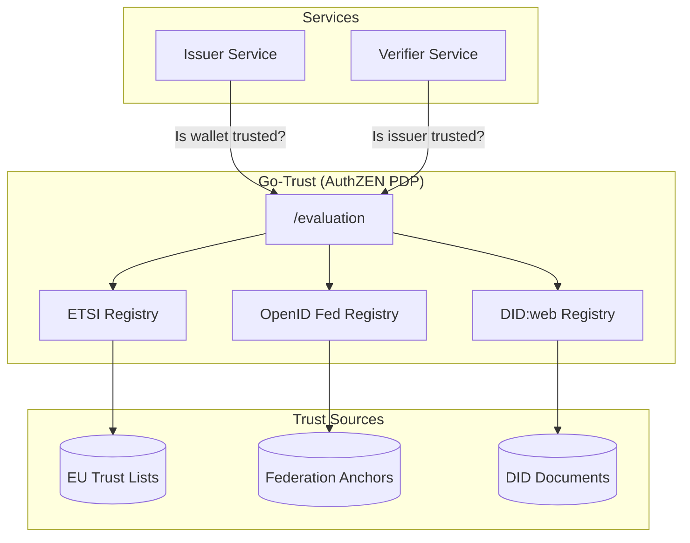
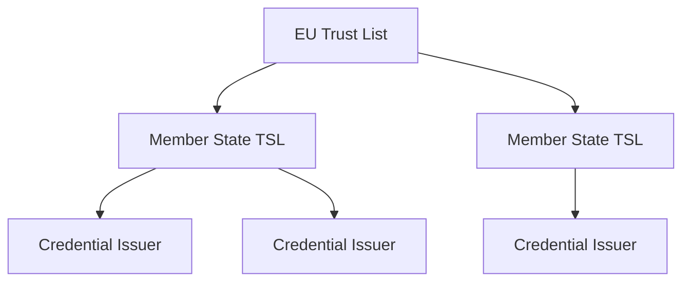
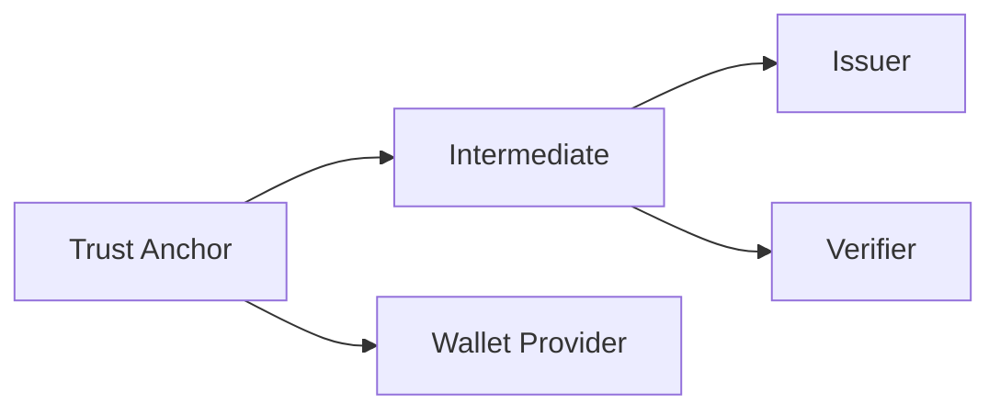
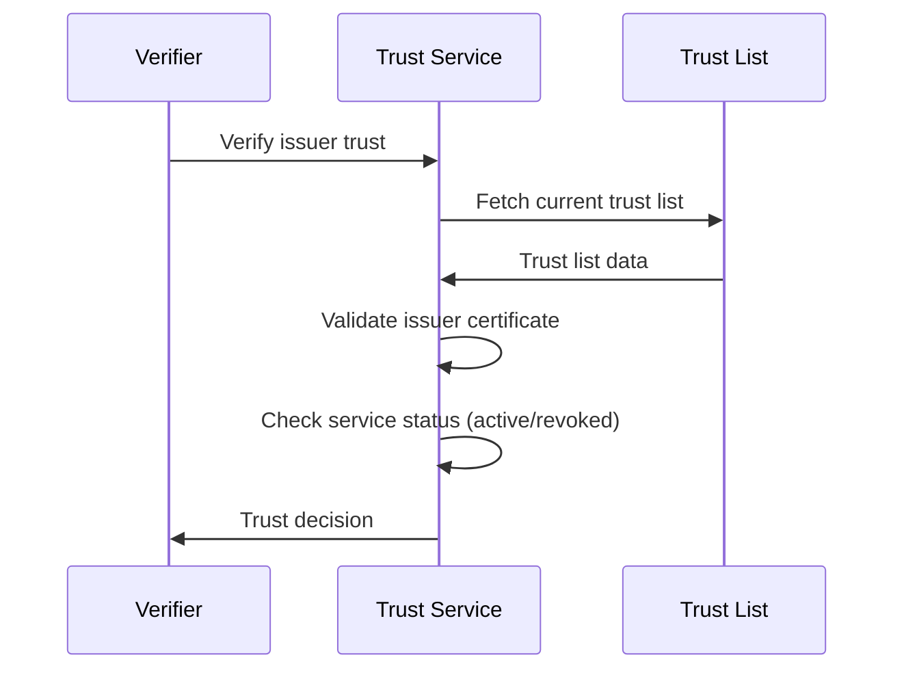

# Trust Services

A digital credential ecosystem requires mechanisms for issuers, wallets, and verifiers to recognize and trust each other. This is called **technical trust management**. SIROS ID supports multiple trust frameworks to meet different regulatory and deployment requirements.

:::tip Go-Trust Abstraction Layer
For production deployments, we recommend using **[Go-Trust](./go-trust)** as a trust abstraction layer. Go-Trust provides a unified AuthZEN API that handles the complexity of ETSI TSL, OpenID Federation, and DID resolution, so your services don't need to implement trust logic directly.
:::

## Why Trust Matters

When a verifier receives a credential, it needs to answer:

1. **Is the issuer legitimate?** – Was this credential issued by an authorized entity?
2. **Is the credential valid?** – Has it been revoked or expired?
3. **Is the wallet trusted?** – Is the presenting wallet a recognized credential manager?

Trust services provide the infrastructure to answer these questions automatically.

## Trust Architecture



## Supported Trust Frameworks

### ETSI Trust Status Lists (TSL 119 612)

The EU standard for trust services. Used by eIDAS and the EU Digital Identity framework.



**Use when:**
- Deploying in EU/EEA regulated contexts
- Interoperating with government issuers
- Requiring legal recognition under eIDAS

**Configuration:**
```yaml
trust:
  etsi_tsl:
    enabled: true
    trust_list_url: "https://ec.europa.eu/tools/lotl/eu-lotl.xml"
    cache_duration: 3600
    accepted_schemes:
      - "http://uri.etsi.org/TrstSvc/TrustedList/schemerules/EUcommon"
```

### OpenID Federation

Dynamic trust management using OAuth 2.0 / OpenID Connect federation.



**Use when:**
- Building multi-organizational ecosystems
- Needing dynamic trust updates
- Integrating with OpenID-based infrastructure

**Configuration:**
```yaml
trust:
  openid_federation:
    enabled: true
    trust_anchors:
      - "https://federation.example.com"
    entity_configuration_path: "/.well-known/openid-federation"
```

### DID:web

Decentralized identifiers resolved via web infrastructure.

**Use when:**
- Simpler trust requirements
- Self-sovereign identity scenarios
- Rapid prototyping

**Configuration:**
```yaml
trust:
  did_web:
    enabled: true
    allowed_domains:
      - "*.example.com"
      - "issuer.trusted.org"
```

### X.509 Certificate Chains

Traditional PKI-based trust using certificate chains.

**Use when:**
- Integrating with existing PKI infrastructure
- Requiring offline verification
- Connecting to legacy systems

**Configuration:**
```yaml
trust:
  x509:
    enabled: true
    root_certificates:
      - "/certs/root-ca.pem"
    allow_self_signed: false
```

## Trust Configuration

### For Issuers

Configure trust anchors that recognize your issuer:

1. **Obtain credentials** from a trust list operator
2. **Configure your signing certificate** chain
3. **Publish discovery metadata** at well-known endpoints

```yaml
issuer:
  trust:
    # Certificate chain for credential signing
    signing_chain_path: "/pki/issuer-chain.pem"
    
    # Your trust list registrations
    trust_list_entries:
      - scheme: "etsi"
        status_list_url: "https://tsl.example.eu/tsl.xml"
```

### For Verifiers

Configure which issuers to trust:

```yaml
verifier:
  trust:
    # Trust framework to use
    framework: "etsi_tsl"  # or "openid_federation", "did_web", "x509"
    
    # For ETSI TSL
    etsi_tsl:
      trust_list_url: "https://ec.europa.eu/tools/lotl/eu-lotl.xml"
      accepted_service_types:
        - "http://uri.etsi.org/TrstSvc/Svctype/EDS/Q"  # Qualified
      
    # Cache settings
    cache_duration: 3600
    
    # Fallback behavior
    allow_untrusted: false  # Reject credentials from unknown issuers
```

### For Wallet Providers

Register your wallet with trust frameworks:

1. **Generate attestation key pair**
2. **Obtain wallet attestation** from an approved body
3. **Configure attestation in wallet backend**

```yaml
wallet:
  attestation:
    enabled: true
    key_path: "/keys/wallet-attestation.pem"
    attestation_endpoint: "https://attestation.siros.org"
```

## Trust Evaluation Flow

When verifying a credential:



## Multi-Framework Support

SIROS ID can use multiple trust frameworks simultaneously with priority ordering:

```yaml
trust:
  frameworks:
    - type: "etsi_tsl"
      priority: 1
      # ... config
    - type: "openid_federation"
      priority: 2
      # ... config
    - type: "x509"
      priority: 3
      # ... config
  
  # How to handle multiple matches
  policy: "first_match"  # or "all_must_match", "any_match"
```

## Testing Trust

### Development Mode

For development, you can temporarily disable strict trust:

```yaml
trust:
  development_mode: true  # ⚠️ Never use in production
  allow_self_signed: true
```

### Test Trust List

SIROS ID provides a test trust list for development:

```yaml
trust:
  etsi_tsl:
    trust_list_url: "https://test-tsl.siros.org/tsl.xml"
```

## Troubleshooting

### "Issuer not trusted"

1. Check issuer certificate chain is complete
2. Verify trust list URL is accessible
3. Confirm issuer is active in trust list (not revoked)
4. Check certificate validity dates

### "Trust list fetch failed"

1. Verify network connectivity to trust list
2. Check for certificate errors (CA trust)
3. Increase timeout settings
4. Enable trust list caching

### "Certificate chain invalid"

1. Ensure intermediate certificates are included
2. Verify certificate order (leaf → root)
3. Check for expired certificates
4. Validate against trust anchor

## Best Practices

1. **Enable caching**: Trust lists don't change frequently
2. **Monitor expiry**: Set alerts for certificate expiration
3. **Use multiple frameworks**: Provide redundancy
4. **Audit trust decisions**: Log all trust evaluations
5. **Regular updates**: Keep trust list URLs current
6. **Use Go-Trust**: Abstract trust complexity behind AuthZEN API

## Next Steps

- [Go-Trust AuthZEN Service](./go-trust.md) – Deploy trust abstraction layer
- [Quick Start Guide](../quickstart)
- [Issuer Configuration](../issuers/issuer)
- [Verifier Configuration](../verifiers/verifier)
