# Verifier Concepts & Architecture

This document provides a conceptual introduction to the SIROS ID Verifier, explaining key concepts, components, and deployment models. For hands-on configuration, see [Verifying Credentials](./verifier).

## What is a Credential Verifier?

A **credential verifier** is a service that validates digital credentials presented by users and extracts verified claims for your applications. The verifier acts as a bridge between user wallets and your existing identity infrastructure, enabling privacy-preserving authentication based on verifiable credentials.

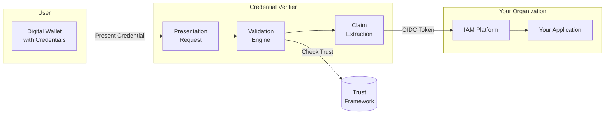

The verifier:
- **Requests** specific credentials and claims from user wallets
- **Validates** cryptographic signatures and issuer trust
- **Checks** revocation status and credential expiration
- **Extracts** claims and maps them to standard OIDC tokens
- **Integrates** with existing IAM systems (Keycloak, Okta, etc.)

## Core Concepts

### Credential Presentation

A **credential presentation** is the process where a user shares verified claims from their wallet with a relying party. Unlike traditional authentication where users prove who they are, credential presentation proves specific attributes about the user.

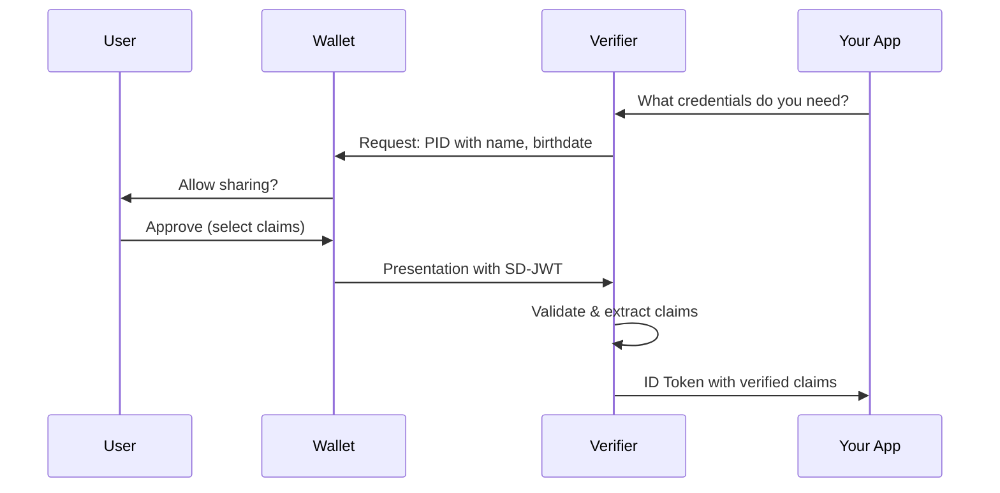

### Selective Disclosure

**Selective disclosure** allows users to share only the specific claims needed for a transaction, not the entire credential. This is a fundamental privacy feature of modern credential systems.

| Scenario | Traditional Auth | Selective Disclosure |
|----------|------------------|---------------------|
| Age verification | Show full ID | Share only "over_18: true" |
| Name verification | Share full profile | Share only "given_name" |
| Nationality check | Share passport | Share only "nationality" |

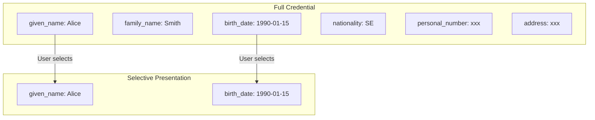

### Presentation Requests

A **presentation request** specifies what credentials and claims the verifier needs. It can be defined using:

1. **OIDC Scopes** – Simple mapping (`openid profile pid`)
2. **DCQL Queries** – Fine-grained control over credential types and claims

```yaml
# DCQL Query Example
credentials:
  - id: identity_credential
    format: vc+sd-jwt
    meta:
      vct_values:
        - urn:eudi:pid:arf-1.8:1
    claims:
      - path: ["given_name"]
      - path: ["family_name"]
      - path: ["birth_date"]
```

### Trust Verification

The verifier doesn't blindly accept credentials—it validates them against a **trust framework** to ensure they come from authorized issuers.

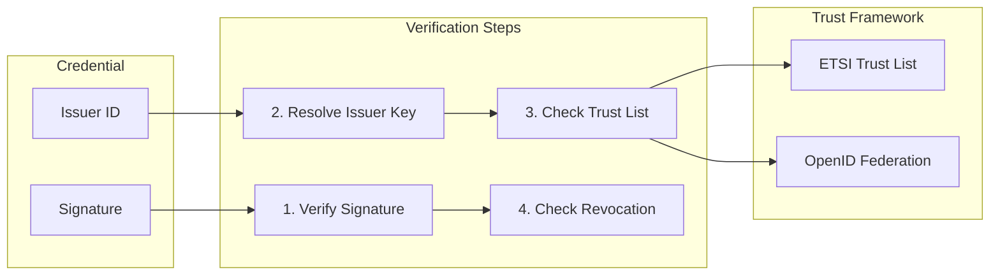

| Trust Source | Standard | Use Case |
|--------------|----------|----------|
| **ETSI TSL** | ETSI TS 119 612 | EU trust services |
| **OpenID Federation** | OpenID Federation 1.0 | OIDC ecosystems |
| **X.509 Chains** | RFC 5280 | Enterprise PKI |
| **DID Resolution** | W3C DID | Decentralized identity |

## Verifier Components

The SIROS ID Verifier is built as a modular system:

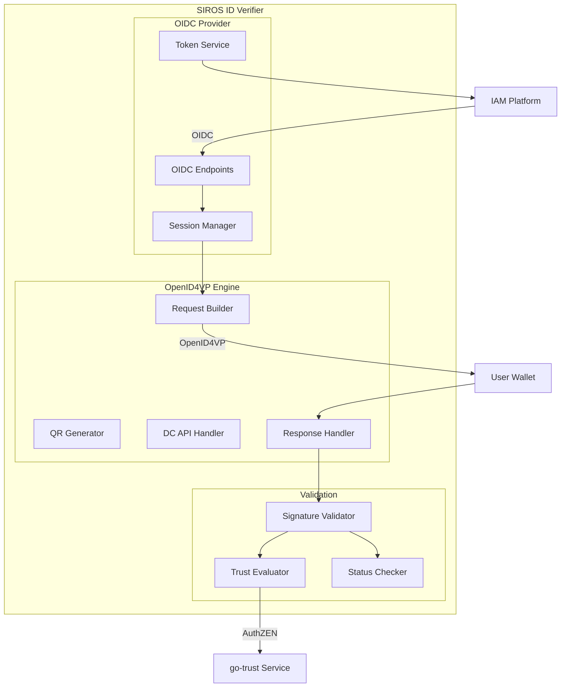

### Component Descriptions

| Component | Purpose | Protocol/Standard |
|-----------|---------|-------------------|
| **OIDC Endpoints** | Standard OIDC provider interface | OpenID Connect 1.0 |
| **Session Manager** | OAuth2 session and state management | OAuth 2.0 |
| **Token Service** | Issue ID tokens with verified claims | JWT, JWS |
| **Request Builder** | Create OpenID4VP presentation requests | OpenID4VP |
| **QR Generator** | Generate QR codes for cross-device flow | - |
| **DC API Handler** | W3C Digital Credentials API support | DC API |
| **Response Handler** | Process wallet responses | OpenID4VP |
| **Signature Validator** | Verify credential signatures | SD-JWT, mDL |
| **Trust Evaluator** | Check issuer authorization | AuthZEN |
| **Status Checker** | Verify revocation status | Token Status List |

## Protocol Interfaces

The verifier exposes two primary interfaces:

### 1. OpenID Connect Provider

Standard OIDC interface that integrates with any IAM system:

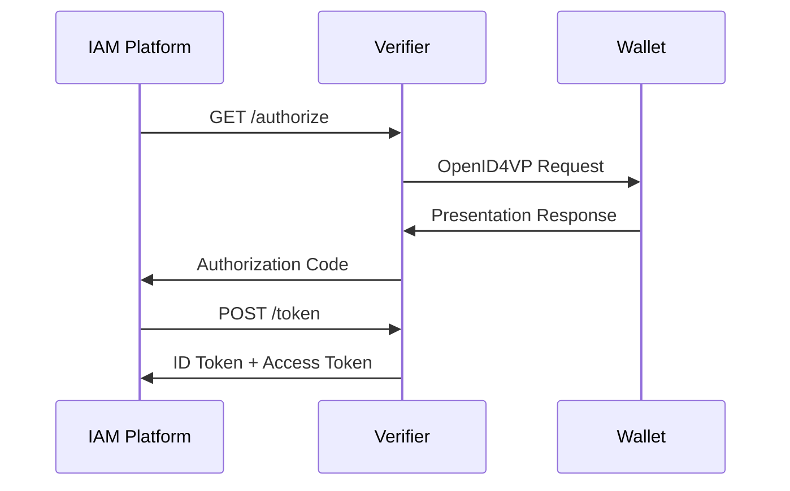

**Benefits:**
- Drop-in replacement for traditional IdPs
- No code changes to existing applications
- Works with any OIDC-compliant IAM

### 2. OpenID4VP Direct

For applications that need direct control over the verification flow:

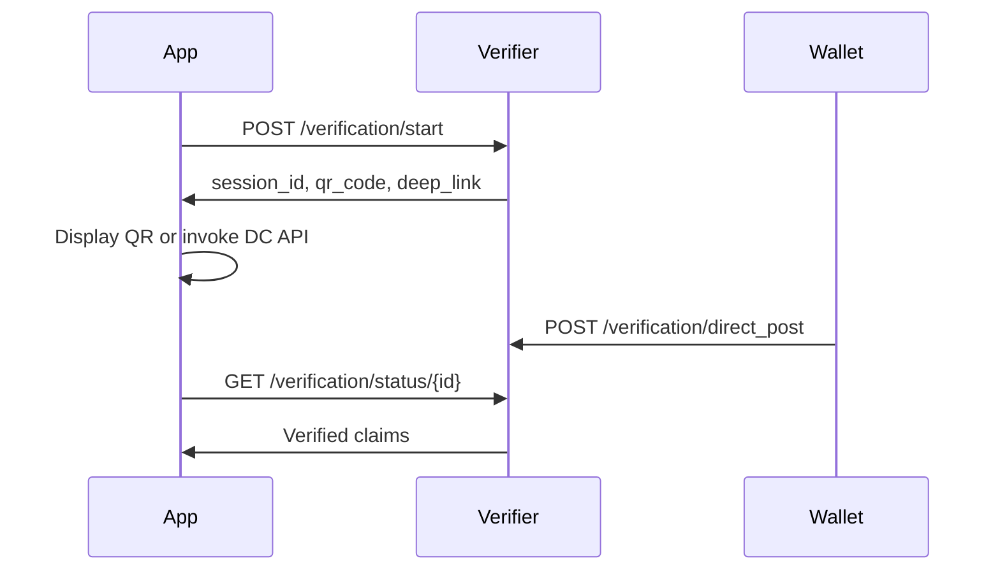

**Benefits:**
- Full control over UX
- Custom presentation logic
- Real-time status updates

## Cross-Device vs Same-Device Flow

<div className="row">
<div className="col col--6">

### Cross-Device Flow

User authenticates on a desktop browser using their mobile wallet:

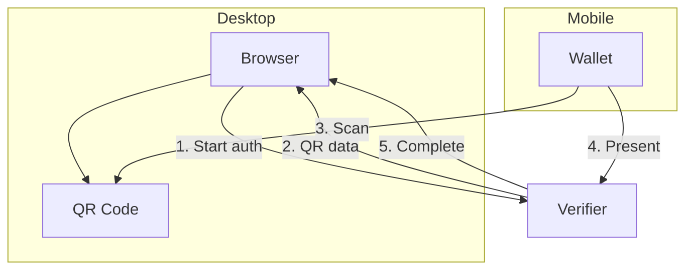

</div>
<div className="col col--6">

### Same-Device Flow

User authenticates on mobile using a wallet on the same device:

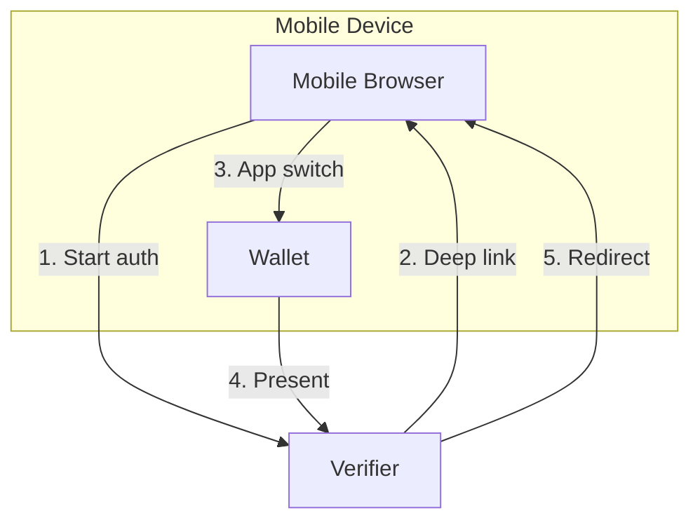

</div>
</div>

### W3C Digital Credentials API

Native browser integration (Chrome 116+):

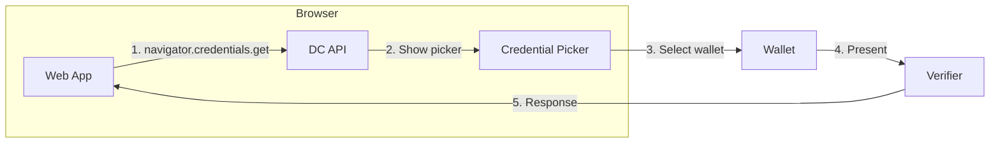

## Deployment Models

Choose a deployment model based on your requirements:

### Model 1: SIROS ID Hosted (SaaS)

Use the SIROS ID cloud platform with minimal configuration.

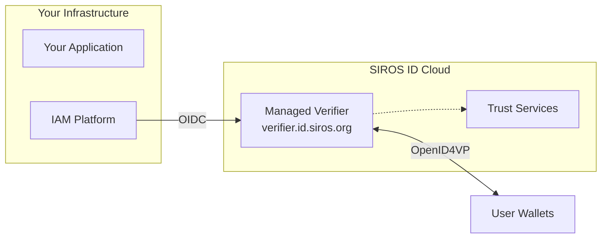

| Aspect | Details |
|--------|---------|
| **Setup** | Minutes – register via SIROS ID portal |
| **Maintenance** | Fully managed by SIROS |
| **Data location** | SIROS ID cloud infrastructure |
| **Customization** | Presentation requests, claim mapping |
| **Best for** | Quick integration, SaaS model |

### Model 2: Self-Hosted (On-Premise)

Deploy the full verifier stack in your own infrastructure.

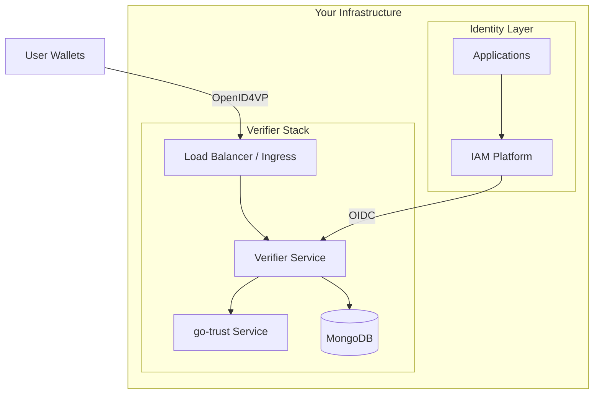

| Aspect | Details |
|--------|---------|
| **Setup** | Hours – deploy containers/VMs |
| **Maintenance** | Your operations team |
| **Data location** | Your infrastructure |
| **Customization** | Full control over all components |
| **Best for** | Data sovereignty, compliance, custom trust |

### Model 3: Hybrid

Combine self-hosted verifier with hosted trust services.

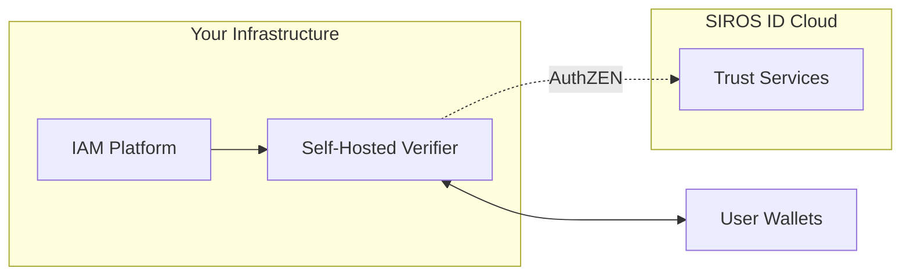

| Aspect | Details |
|--------|---------|
| **Setup** | Variable |
| **Maintenance** | Shared responsibility |
| **Data location** | Presentations on-premise, trust in cloud |
| **Customization** | Selective control |
| **Best for** | Regulated environments needing external trust |

## Deployment Decision Matrix

| Requirement | Hosted | Self-Hosted | Hybrid |
|-------------|:------:|:-----------:|:------:|
| Quick setup | ✅ | ❌ | ⚠️ |
| Data sovereignty | ✅ | ✅ | ✅ |
| Custom trust policies | ✅ | ✅ | ✅ |
| High availability | ✅ | ⚠️ | ⚠️ |
| Zero maintenance | ✅ | ❌ | ⚠️ |
| GDPR compliance | ✅ | ✅ | ✅ |

:::info EU/EES Hosting
All SIROS ID hosted services are operated from EU/EES infrastructure, ensuring data sovereignty and GDPR compliance for European customers.
:::

Legend: ✅ Excellent | ⚠️ Possible with effort | ❌ Not recommended

## Security Considerations

### Privacy by Design

The verifier implements privacy-preserving practices:

| Feature | Description |
|---------|-------------|
| **Pairwise Identifiers** | Users get different `sub` per relying party |
| **Selective Disclosure** | Only requested claims are revealed |
| **No Credential Storage** | Presentations are validated and discarded |
| **Minimal Data** | Request only what you need |

### Trust Evaluation

Every credential is validated against configured trust frameworks:

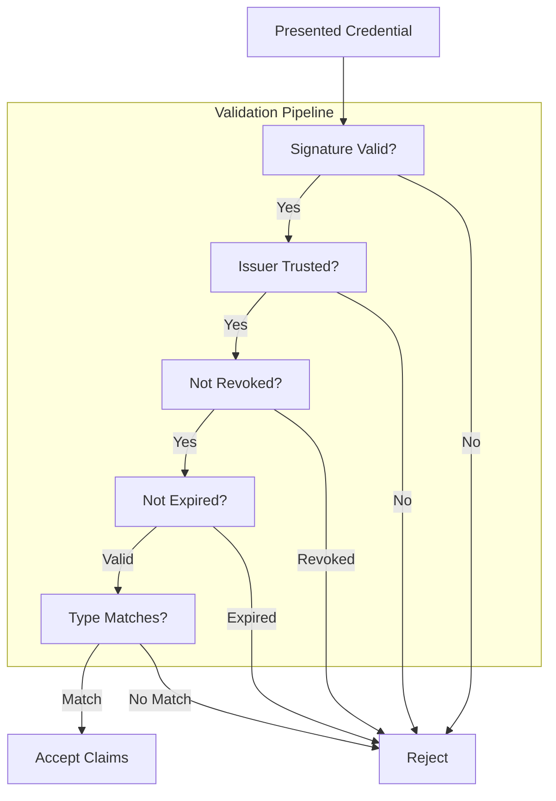

### Session Security

| Protection | Implementation |
|------------|----------------|
| **PKCE** | Required for public clients |
| **State** | Prevents CSRF attacks |
| **Nonce** | Prevents replay attacks |
| **Short-lived codes** | 5-minute authorization codes |
| **Token binding** | Tokens bound to client |

## Next Steps

Now that you understand the concepts:

1. **[Verifying Credentials](./verifier)** – Configure and deploy your verifier
2. **[Keycloak Integration](./keycloak_verifier)** – Add to Keycloak as an IdP
3. **[Direct OIDC Integration](./oidc-rp)** – Integrate as an OIDC RP
4. **[Trust Services](../trust/)** – Configure trust frameworks
