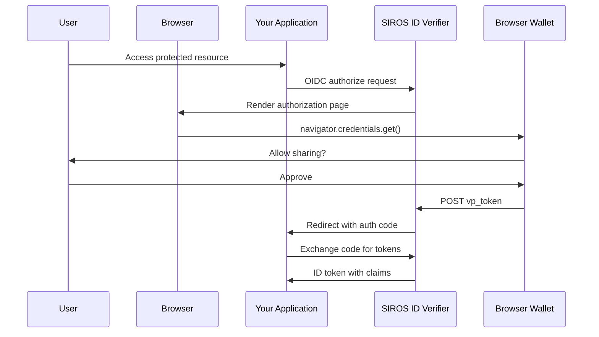
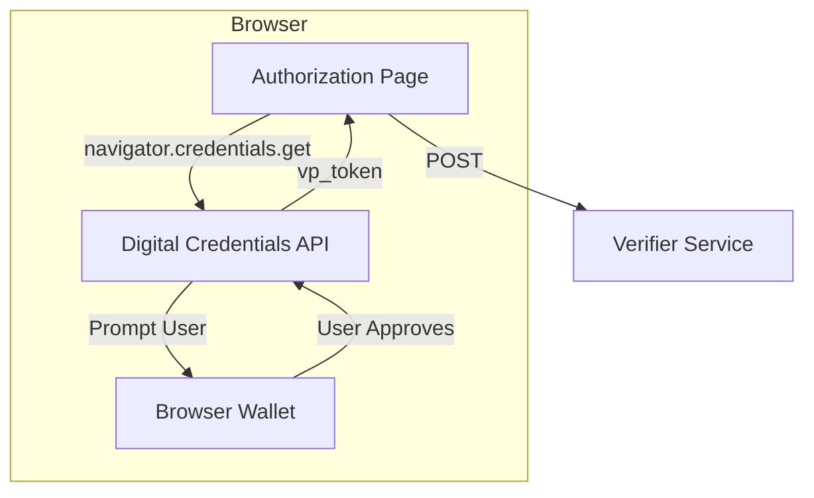

# W3C Digital Credentials API

The SIROS ID verifier supports the **W3C Digital Credentials API** for browser-based credential presentation. This modern approach allows users to present digital credentials directly from their browser's built-in wallet, providing a seamless user experience without requiring QR code scanning.

## Overview

The [W3C Digital Credentials API](https://wicg.github.io/digital-credentials/) is a browser API that enables web applications to request verifiable credentials from digital wallets. It provides:

- **Native browser integration** – No separate wallet app required for some flows
- **Improved UX** – Present credentials with a single click
- **Strong security** – Browser-mediated credential exchange
- **Format flexibility** – Supports SD-JWT and mdoc formats



## Configuration

Enable the Digital Credentials API in your verifier configuration:

```yaml
verifier:
  digital_credentials:
    # Enable W3C Digital Credentials API
    enabled: true
    
    # Use JWT Authorization Request (JAR) for enhanced security
    use_jar: true
    
    # Credential format preference order
    preferred_formats:
      - "vc+sd-jwt"
      - "dc+sd-jwt"
      - "mso_mdoc"
    
    # Response mode for credential presentation
    response_mode: "dc_api.jwt"
    
    # Fallback to QR code if DC API unavailable
    allow_qr_fallback: true
    
    # Deep link scheme for mobile wallets
    deep_link_scheme: "openid4vp://"
```

### Configuration Options

| Option | Type | Default | Description |
|--------|------|---------|-------------|
| `enabled` | boolean | `false` | Enable W3C Digital Credentials API support |
| `use_jar` | boolean | `false` | Use JWT Authorization Request (JAR) |
| `preferred_formats` | array | `["vc+sd-jwt"]` | Credential formats in preference order |
| `response_mode` | string | `"direct_post"` | Response mode: `dc_api.jwt`, `direct_post.jwt`, `direct_post` |
| `allow_qr_fallback` | boolean | `true` | Auto-fallback to QR if DC API unavailable |
| `deep_link_scheme` | string | `"openid4vp://"` | Deep link scheme for mobile wallets |

### Response Modes

| Mode | Description |
|------|-------------|
| `dc_api.jwt` | Encrypted response via DC API (most secure) |
| `direct_post.jwt` | Signed JWT via HTTP POST |
| `direct_post` | Plain JSON via HTTP POST |

### Supported Credential Formats

| Format | Description |
|--------|-------------|
| `vc+sd-jwt` | SD-JWT Verifiable Credentials (W3C standard) |
| `dc+sd-jwt` | Digital Credentials SD-JWT variant |
| `mso_mdoc` | ISO/IEC 18013-5 mobile document format |

## Browser Support

The W3C Digital Credentials API is currently supported in:

| Browser | Version | Notes |
|---------|---------|-------|
| Chrome | 128+ | Full support |
| Edge | 128+ | Chromium-based |
| Safari | Preview | Behind flag |
| Firefox | - | Not yet supported |

When a browser doesn't support the Digital Credentials API and `allow_qr_fallback` is enabled, the verifier automatically falls back to the QR code flow.

## How It Works

### For Relying Parties

**No changes required** – RPs use the standard OIDC authorization code flow. The verifier handles all wallet interactions:

```javascript
// Standard OIDC request - no special handling needed
const authUrl = new URL('https://verifier.example.org/authorize');
authUrl.searchParams.set('response_type', 'code');
authUrl.searchParams.set('client_id', 'your-client-id');
authUrl.searchParams.set('redirect_uri', 'https://your-app.com/callback');
authUrl.searchParams.set('scope', 'openid profile pid');
authUrl.searchParams.set('state', generateState());

window.location = authUrl.toString();
```

### Browser Flow

When a user visits the authorization page in a supported browser:

1. The verifier renders an authorization page with embedded JavaScript
2. The JavaScript calls `navigator.credentials.get()` with the presentation request
3. The browser's credential UI prompts the user to select and share credentials
4. The wallet returns the credential presentation to the verifier
5. The verifier verifies the presentation and issues tokens to the RP



## UI Customization

Customize the authorization page appearance:

```yaml
verifier:
  authorization_page_css:
    # Predefined theme: light, dark, blue, purple
    theme: "light"
    
    # Custom brand colors
    primary_color: "#667eea"
    secondary_color: "#764ba2"
    
    # Custom logo
    logo_url: "https://your-app.com/logo.png"
    
    # Page text
    title: "Wallet Authorization"
    subtitle: "Share your credentials securely"
    
    # Custom CSS (inline)
    custom_css: |
      .auth-container { border-radius: 12px; }
    
    # Or external CSS file
    css_file: "/static/custom-auth.css"
```

## Credential Display

Optionally show users the credentials being shared before completing authorization:

```yaml
verifier:
  credential_display:
    # Enable credential preview
    enabled: true
    
    # Require user to review credentials
    require_confirmation: false
    
    # Show raw credential data (for debugging)
    show_raw_credential: false
    
    # Show parsed claims being sent to RP
    show_claims: true
```

## Complete Example

```yaml
verifier:
  api_server:
    addr: :8080
  external_server_url: "https://verifier.example.org"
  
  key_config:
    private_key_path: "/pki/signing_key.pem"
    chain_path: "/pki/signing_chain.pem"
  
  oidc:
    issuer: "https://verifier.example.org"
    session_duration: 900
    code_duration: 600
    access_token_duration: 3600
    id_token_duration: 3600
    refresh_token_duration: 86400
    subject_type: "pairwise"
    subject_salt: "change-in-production"
  
  openid4vp:
    presentation_timeout: 300
    supported_credentials:
      - vct: "urn:eudi:pid:arf-1.8:1"
        scopes:
          - "profile"
          - "pid"
  
  digital_credentials:
    enabled: true
    use_jar: true
    preferred_formats:
      - "vc+sd-jwt"
      - "dc+sd-jwt"
    response_mode: "dc_api.jwt"
    allow_qr_fallback: true
  
  authorization_page_css:
    theme: "light"
    logo_url: "https://your-org.com/logo.png"
    title: "Sign in with Your Credential"

common:
  mongo:
    uri: mongodb://mongo:27017
```

## Security Considerations

1. **Use JAR**: Enable `use_jar: true` for signed request objects
2. **Use encrypted response**: Set `response_mode: "dc_api.jwt"` for encrypted responses
3. **Verify origins**: The browser verifies the requesting origin automatically
4. **Trust framework**: Configure [Go-Trust](../trust/go-trust) for issuer verification

## Troubleshooting

### DC API Not Detected

**Symptoms:** Falls back to QR code on supported browsers

**Solutions:**
1. Ensure HTTPS is used (required for Credential API)
2. Check browser version meets minimum requirements
3. Verify no browser extensions are blocking the API

### Credential Not Accepted

**Solutions:**
1. Verify credential format is in `preferred_formats`
2. Check credential VCT matches `supported_credentials`
3. Ensure issuer is trusted via trust configuration

## Next Steps

- [Verifier Configuration](./verifier) – Full verifier options
- [Trust Services](../trust/) – Configure issuer trust
- [OIDC RP Integration](./oidc-rp) – Standard OIDC integration
