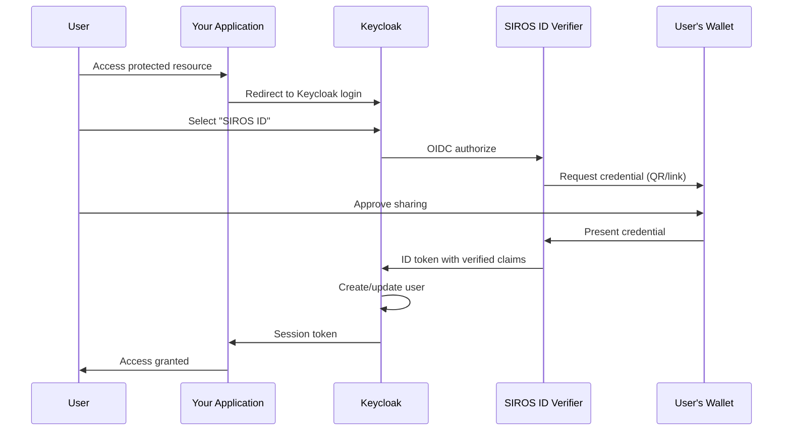

# Keycloak Integration

This guide explains how to integrate SIROS ID credential verification with [Keycloak](https://www.keycloak.org/), allowing users to authenticate to your applications using their digital credentials. After reading this guide, you will understand how to:

- Add SIROS ID as an identity provider in Keycloak
- Configure claim mappings for user attributes
- Request specific credential types
- Handle first-time logins and account linking

## Overview

Keycloak can use the SIROS ID verifier as an external [OpenID Connect identity provider](https://www.keycloak.org/docs/latest/server_admin/index.html#_identity_broker_oidc). When users select "Login with SIROS ID", they present credentials from their wallet instead of entering a username and password.



:::tip Hosted or Self-Hosted
This guide works with both the **SIROS ID hosted verifier** (`app.siros.org/<tenant>/<verifier>`) and **self-hosted deployments**. Simply replace the verifier URL as needed. See [Verifier Deployment Options](./verifier.md#deployment-options) for more information.
:::

## Prerequisites

- Keycloak 22+ installed and running
- Admin access to your Keycloak realm
- A SIROS ID verifier (hosted or self-hosted)

## Step 1: Register Your Keycloak Instance

Register Keycloak as an OIDC client with the SIROS ID verifier. Replace `your-tenant` and `your-verifier` with your assigned values.

### Using the Hosted Verifier

```bash
# Replace 'your-tenant' and 'your-verifier' with your values
curl -X POST https://app.siros.org/your-tenant/your-verifier/register \
  -H "Content-Type: application/json" \
  -d '{
    "client_name": "My Keycloak",
    "redirect_uris": ["https://keycloak.example.com/realms/myrealm/broker/sirosid/endpoint"],
    "token_endpoint_auth_method": "client_secret_post",
    "grant_types": ["authorization_code"],
    "response_types": ["code"],
    "scope": "openid profile"
  }'
```

### Using a Self-Hosted Verifier

```bash
curl -X POST https://your-verifier.example.com/register \
  -H "Content-Type: application/json" \
  -d '{
    "client_name": "My Keycloak",
    "redirect_uris": ["https://keycloak.example.com/realms/myrealm/broker/sirosid/endpoint"],
    "token_endpoint_auth_method": "client_secret_post",
    "grant_types": ["authorization_code"],
    "response_types": ["code"],
    "scope": "openid profile"
  }'
```

Save the returned `client_id` and `client_secret` for the next step.

:::warning Redirect URI Format
The redirect URI must exactly match Keycloak's broker endpoint format:
```
https://<keycloak-host>/realms/<realm-name>/broker/<alias>/endpoint
```
:::

## Step 2: Add the Identity Provider

1. Open **Keycloak Admin Console**
2. Select your realm
3. Navigate to **Identity Providers** → **Add provider** → **OpenID Connect v1.0**

Configure the following settings:

### General Settings

| Setting | Value | Description |
|---------|-------|-------------|
| **Alias** | `sirosid` | Internal identifier (used in redirect URI) |
| **Display Name** | `Login with Credential` | Shown on login page |
| **Enabled** | ON | Enable the provider |
| **Store Tokens** | ON | Required for debugging; optional in production |
| **Trust Email** | ON | Trust email from verified credentials |

### OpenID Connect Settings

| Setting | Value |
|---------|-------|
| **Discovery Endpoint** | `https://app.siros.org/your-tenant/your-verifier/.well-known/openid-configuration` |
| **Client ID** | *(from Step 1)* |
| **Client Secret** | *(from Step 1)* |
| **Client Authentication** | `Client secret sent as post` |

### Security Settings

| Setting | Value | Description |
|---------|-------|-------------|
| **Validate Signatures** | ON | Verify ID token signatures |
| **Use PKCE** | ON | Proof Key for Code Exchange |
| **PKCE Method** | `S256` | SHA-256 challenge method |

### Scopes

| Setting | Value |
|---------|-------|
| **Default Scopes** | `openid profile` |

To request additional credentials, add scopes:

| Scope | Credential Type |
|-------|-----------------|
| `profile` | Basic PID (name, birthdate) |
| `pid` | Full Person Identification Data |
| `ehic` | European Health Insurance Card |
| `diploma` | Educational credentials |

Example for health services: `openid profile ehic`

## Step 3: Configure Claim Mappers

Map verified credential claims to Keycloak user attributes.

Navigate to **Identity Providers** → **sirosid** → **Mappers** → **Add mapper**

### Essential Mappers

#### Username

| Setting | Value |
|---------|-------|
| **Name** | `username` |
| **Mapper Type** | `Username Template Importer` |
| **Template** | `${CLAIM.sub}` |
| **Sync Mode** | `inherit` |

#### First Name

| Setting | Value |
|---------|-------|
| **Name** | `firstName` |
| **Mapper Type** | `Attribute Importer` |
| **Claim** | `given_name` |
| **User Attribute Name** | `firstName` |
| **Sync Mode** | `inherit` |

#### Last Name

| Setting | Value |
|---------|-------|
| **Name** | `lastName` |
| **Mapper Type** | `Attribute Importer` |
| **Claim** | `family_name` |
| **User Attribute Name** | `lastName` |
| **Sync Mode** | `inherit` |

#### Email

| Setting | Value |
|---------|-------|
| **Name** | `email` |
| **Mapper Type** | `Attribute Importer` |
| **Claim** | `email` |
| **User Attribute Name** | `email` |
| **Sync Mode** | `inherit` |

### Optional Mappers

#### Birth Date

| Setting | Value |
|---------|-------|
| **Name** | `birthdate` |
| **Mapper Type** | `Attribute Importer` |
| **Claim** | `birthdate` |
| **User Attribute Name** | `birthdate` |
| **Sync Mode** | `inherit` |

#### Nationality

| Setting | Value |
|---------|-------|
| **Name** | `nationality` |
| **Mapper Type** | `Attribute Importer` |
| **Claim** | `nationality` |
| **User Attribute Name** | `nationality` |
| **Sync Mode** | `inherit` |

## Step 4: Configure First Login Behavior

Control what happens when a user logs in with credentials for the first time.

Navigate to **Authentication** → **Flows** and configure the **first broker login** flow:

| Option | Recommended Setting | Description |
|--------|---------------------|-------------|
| **Create User If Unique** | ON | Auto-create accounts for new users |
| **Confirm Link Existing Account** | ON | Prompt before linking to existing accounts |
| **Verify Existing Account By Email** | OFF | Skip if Trust Email is enabled |

### Auto-Linking by Email

To automatically link credential logins to existing accounts with matching email:

1. Create a new authentication flow
2. Add **Automatically Link Brokered Account** execution
3. Set the IdP's **First Login Flow** to your new flow

:::caution
Only use auto-linking if you trust the credential issuer to verify email addresses.
:::

## Step 5: Test the Integration

1. Open your application's login page
2. Click **Login with Credential** (or your configured display name)
3. Scan the QR code with your SIROS ID wallet
4. Approve the credential sharing request in your wallet
5. Verify you're logged in with the correct user attributes

### Test with the Demo Wallet

If you don't have credentials yet:

1. Go to [app.siros.org](https://app.siros.org)
2. Create a wallet with a passkey
3. Add a **Demo PID** credential
4. Use this wallet to test your Keycloak integration

## Advanced Configuration

### Step-Up Authentication

Require credential verification for sensitive operations:

```java
// In your application, request step-up authentication
KeycloakSecurityContext context = getSecurityContext();
context.getToken().getOtherClaims().get("acr"); // Check authentication level

// Force re-authentication with SIROS ID
redirectToKeycloak("?kc_idp_hint=sirosid&prompt=login");
```

### Conditional Authentication

Create authentication flows that conditionally require credential verification:

1. **Authentication** → **Flows** → **Create flow**
2. Add a **Conditional** subflow
3. Add **Condition - User Role** to check if user needs verification
4. Add **Identity Provider Redirector** pointing to `sirosid`

### Custom Theme

Customize the login button appearance:

```ftl
<!-- In your Keycloak theme: login.ftl -->
<#list social.providers as p>
    <#if p.alias == "sirosid">
        <a href="${p.loginUrl}" class="siros-login-btn">
            
            <span>Login with Digital Credential</span>
        </a>
    </#if>
</#list>
```

## Troubleshooting

### Invalid Redirect URI

**Error**: `invalid_redirect_uri`

**Solution**: Verify the redirect URI exactly matches:
```
https://keycloak.example.com/realms/{realm}/broker/sirosid/endpoint
```

Check for:
- Trailing slashes
- HTTP vs HTTPS
- Correct realm name
- Correct alias (`sirosid`)

### Token Signature Validation Failed

**Error**: `token_signature_validation_failed`

**Solutions**:
1. Ensure **Validate Signatures** is ON
2. Verify Keycloak can reach the verifier's JWKS endpoint
3. Clear the key cache:
   - **Realm Settings** → **Keys** → **Providers**
   - Toggle the provider off and on

### Claims Not Appearing in User Profile

**Symptoms**: User created but attributes are empty

**Solutions**:
1. Verify mapper **Sync Mode** is `inherit` or `force`
2. Check the claim name matches exactly (case-sensitive)
3. Enable **Store Tokens** and inspect the raw ID token in user sessions
4. Verify the requested scopes include the needed claims

### User Already Exists

**Error**: `User already exists` or duplicate user created

**Solutions**:
1. Configure the first login flow to link existing accounts
2. Use email as the linking attribute
3. Ensure **Trust Email** is enabled if using email linking

## Configuration Reference

### Complete Identity Provider JSON

Export this configuration to replicate the setup:

```json
{
  "alias": "sirosid",
  "displayName": "Login with Credential",
  "providerId": "oidc",
  "enabled": true,
  "trustEmail": true,
  "storeToken": false,
  "linkOnly": false,
  "firstBrokerLoginFlowAlias": "first broker login",
  "config": {
    "clientId": "${CLIENT_ID}",
    "clientSecret": "${CLIENT_SECRET}",
    "tokenUrl": "https://app.siros.org/${TENANT}/${VERIFIER}/token",
    "authorizationUrl": "https://app.siros.org/${TENANT}/${VERIFIER}/authorize",
    "jwksUrl": "https://app.siros.org/${TENANT}/${VERIFIER}/jwks",
    "userInfoUrl": "https://app.siros.org/${TENANT}/${VERIFIER}/userinfo",
    "issuer": "https://app.siros.org/${TENANT}/${VERIFIER}",
    "clientAuthMethod": "client_secret_post",
    "syncMode": "INHERIT",
    "validateSignature": "true",
    "pkceEnabled": "true",
    "pkceMethod": "S256",
    "defaultScope": "openid profile"
  }
}
```

### Environment Variables

For production deployments, use environment variables:

```bash
# Keycloak environment
KC_SPI_IDENTITY_PROVIDER_OIDC_SIROSID_CLIENT_ID=your-client-id
KC_SPI_IDENTITY_PROVIDER_OIDC_SIROSID_CLIENT_SECRET=your-client-secret
```

## Next Steps

- [Verifier Configuration](./verifier.md) – Full verifier documentation
- [Trust Services](../trust/) – Configure trust framework integration
- [Quick Start Guide](../quickstart) – Get started in 15 minutes
