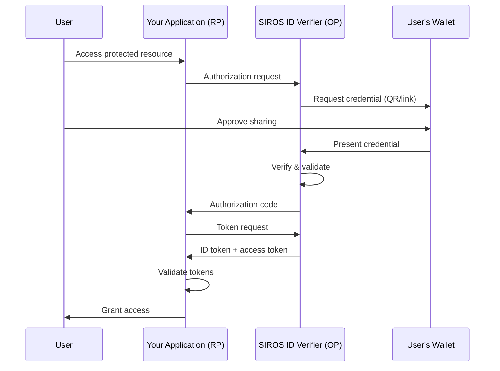

# OpenID Connect Relying Party Integration

This guide explains how to integrate the SIROS ID verifier with any application using standard [OpenID Connect](https://openid.net/specs/openid-connect-core-1_0.html). After reading this guide, you will understand how to:

- Add SIROS ID as an OpenID Connect identity provider
- Configure authentication requests
- Handle ID tokens and claims
- Implement the [authorization code flow with PKCE](https://datatracker.ietf.org/doc/html/rfc7636)

## Overview

The SIROS ID verifier acts as an OpenID Connect Provider (OP). Your application connects as a Relying Party (RP), receiving verified credential claims through standard OIDC tokens.



:::tip When to Use Direct OIDC
Use direct OIDC integration when:
- You're not using an IAM platform (Keycloak, Auth0, etc.)
- You want full control over the authentication flow
- You're building a single-page application (SPA) or mobile app
:::

## Prerequisites

- An application that supports OIDC authentication
- A SIROS ID verifier (hosted or self-hosted)
- Basic understanding of OAuth 2.0 / OIDC flows

## Step 1: Register Your Application

Register your application with the SIROS ID verifier. Replace `your-tenant` and `your-verifier` with your assigned values.

### Dynamic Registration

```bash
# Replace 'your-tenant' and 'your-verifier' with your values
curl -X POST "https://app.siros.org/your-tenant/your-verifier/register" \
  -H "Content-Type: application/json" \
  -d '{
    "client_name": "My Application",
    "redirect_uris": [
      "https://my-app.example.com/callback",
      "https://my-app.example.com/silent-callback"
    ],
    "post_logout_redirect_uris": [
      "https://my-app.example.com"
    ],
    "grant_types": ["authorization_code", "refresh_token"],
    "response_types": ["code"],
    "token_endpoint_auth_method": "client_secret_post",
    "scope": "openid profile"
  }'
```

Response:

```json
{
  "client_id": "abc123xyz",
  "client_secret": "secret456",
  "client_id_issued_at": 1704067200,
  "client_secret_expires_at": 0,
  "redirect_uris": ["https://my-app.example.com/callback"],
  "grant_types": ["authorization_code", "refresh_token"],
  "response_types": ["code"],
  "token_endpoint_auth_method": "client_secret_post"
}
```

### Public Clients (SPAs, Mobile Apps)

For applications that cannot keep secrets:

```bash
# Replace 'your-tenant' and 'your-verifier' with your values
curl -X POST "https://app.siros.org/your-tenant/your-verifier/register" \
  -H "Content-Type: application/json" \
  -d '{
    "client_name": "My SPA",
    "redirect_uris": ["https://my-spa.example.com/callback"],
    "grant_types": ["authorization_code"],
    "response_types": ["code"],
    "token_endpoint_auth_method": "none",
    "application_type": "web"
  }'
```

Public clients **must** use PKCE.

## Step 2: Discover Endpoints

Fetch the OpenID Connect discovery document for your tenant and verifier:

```bash
# Replace 'your-tenant' and 'your-verifier' with your values
curl "https://app.siros.org/your-tenant/your-verifier/.well-known/openid-configuration"
```

Response:

```json
{
  "issuer": "https://app.siros.org/your-tenant/your-verifier",
  "authorization_endpoint": "https://app.siros.org/your-tenant/your-verifier/authorize",
  "token_endpoint": "https://app.siros.org/your-tenant/your-verifier/token",
  "userinfo_endpoint": "https://app.siros.org/your-tenant/your-verifier/userinfo",
  "jwks_uri": "https://app.siros.org/your-tenant/your-verifier/jwks",
  "scopes_supported": ["openid", "profile", "pid", "ehic", "diploma"],
  "response_types_supported": ["code"],
  "grant_types_supported": ["authorization_code", "refresh_token"],
  "subject_types_supported": ["pairwise"],
  "id_token_signing_alg_values_supported": ["RS256", "ES256"],
  "code_challenge_methods_supported": ["S256"]
}
```

## Step 3: Implement Authorization Code Flow

### Generate PKCE Parameters

```javascript
// Generate code verifier (43-128 characters)
function generateCodeVerifier() {
  const array = new Uint8Array(32);
  crypto.getRandomValues(array);
  return base64UrlEncode(array);
}

// Generate code challenge
async function generateCodeChallenge(verifier) {
  const encoder = new TextEncoder();
  const data = encoder.encode(verifier);
  const hash = await crypto.subtle.digest('SHA-256', data);
  return base64UrlEncode(new Uint8Array(hash));
}

function base64UrlEncode(buffer) {
  return btoa(String.fromCharCode(...buffer))
    .replace(/\+/g, '-')
    .replace(/\//g, '_')
    .replace(/=+$/, '');
}
```

### Build Authorization URL

```javascript
async function startAuthentication() {
  // Generate PKCE
  const codeVerifier = generateCodeVerifier();
  const codeChallenge = await generateCodeChallenge(codeVerifier);
  
  // Store verifier for token exchange
  sessionStorage.setItem('code_verifier', codeVerifier);
  
  // Generate state for CSRF protection
  const state = generateCodeVerifier();
  sessionStorage.setItem('oauth_state', state);
  
  // Build authorization URL
  const params = new URLSearchParams({
    response_type: 'code',
    client_id: 'your-client-id',
    redirect_uri: 'https://my-app.example.com/callback',
    scope: 'openid profile',
    state: state,
    code_challenge: codeChallenge,
    code_challenge_method: 'S256'
  });
  
  // Redirect to verifier (replace your-tenant/your-verifier with your values)
  window.location.href = `https://app.siros.org/your-tenant/your-verifier/authorize?${params}`;
}
```

### Handle Callback

```javascript
async function handleCallback() {
  const params = new URLSearchParams(window.location.search);
  
  // Verify state
  const state = params.get('state');
  const savedState = sessionStorage.getItem('oauth_state');
  if (state !== savedState) {
    throw new Error('State mismatch - possible CSRF attack');
  }
  
  // Check for errors
  const error = params.get('error');
  if (error) {
    throw new Error(`Authentication failed: ${error}`);
  }
  
  // Exchange code for tokens
  const code = params.get('code');
  const codeVerifier = sessionStorage.getItem('code_verifier');
  
  const tokenResponse = await fetch('https://app.siros.org/your-tenant/your-verifier/token', {
    method: 'POST',
    headers: {
      'Content-Type': 'application/x-www-form-urlencoded'
    },
    body: new URLSearchParams({
      grant_type: 'authorization_code',
      code: code,
      redirect_uri: 'https://my-app.example.com/callback',
      client_id: 'your-client-id',
      code_verifier: codeVerifier
    })
  });
  
  const tokens = await tokenResponse.json();
  
  // Clean up
  sessionStorage.removeItem('code_verifier');
  sessionStorage.removeItem('oauth_state');
  
  return tokens;
}
```

### Validate ID Token

```javascript
async function validateIdToken(idToken) {
  // Fetch JWKS (replace your-tenant/your-verifier with your values)
  const jwksResponse = await fetch('https://app.siros.org/your-tenant/your-verifier/jwks');
  const jwks = await jwksResponse.json();
  
  // Parse token header to find key
  const [headerB64] = idToken.split('.');
  const header = JSON.parse(atob(headerB64));
  const key = jwks.keys.find(k => k.kid === header.kid);
  
  // Import key and verify signature
  const publicKey = await crypto.subtle.importKey(
    'jwk',
    key,
    { name: 'RSASSA-PKCS1-v1_5', hash: 'SHA-256' },
    false,
    ['verify']
  );
  
  // ... signature verification ...
  
  // Parse and validate claims
  const [, payloadB64] = idToken.split('.');
  const claims = JSON.parse(atob(payloadB64));
  
  // Validate issuer (replace with your actual tenant/verifier)
  if (claims.iss !== 'https://app.siros.org/your-tenant/your-verifier') {
    throw new Error('Invalid issuer');
  }
  
  // Validate audience
  if (claims.aud !== 'your-client-id') {
    throw new Error('Invalid audience');
  }
  
  // Validate expiration
  if (claims.exp < Date.now() / 1000) {
    throw new Error('Token expired');
  }
  
  return claims;
}
```

## Step 4: Request Credentials via Scopes

Control which credentials are requested:

| Scope | Credential Requested |
|-------|----------------------|
| `openid` | Required base scope |
| `profile` | Basic PID (name, birthdate) |
| `pid` | Full Person ID |
| `ehic` | European Health Insurance Card |
| `diploma` | Educational credentials |

### Example: Request PID and EHIC

```javascript
const params = new URLSearchParams({
  response_type: 'code',
  client_id: 'your-client-id',
  redirect_uri: 'https://my-app.example.com/callback',
  scope: 'openid profile ehic',  // Request PID profile + EHIC
  state: state,
  code_challenge: codeChallenge,
  code_challenge_method: 'S256'
});
```

## Language-Specific Examples

### Node.js (Express)

```javascript
const express = require('express');
const { Issuer, generators } = require('openid-client');

const app = express();

let client;

async function initializeClient() {
  // Replace your-tenant/your-verifier with your values
  const issuer = await Issuer.discover('https://app.siros.org/your-tenant/your-verifier');
  client = new issuer.Client({
    client_id: 'your-client-id',
    client_secret: 'your-client-secret',
    redirect_uris: ['http://localhost:3000/callback'],
    response_types: ['code']
  });
}

app.get('/login', (req, res) => {
  const codeVerifier = generators.codeVerifier();
  const codeChallenge = generators.codeChallenge(codeVerifier);
  const state = generators.state();
  
  req.session.codeVerifier = codeVerifier;
  req.session.state = state;
  
  const authUrl = client.authorizationUrl({
    scope: 'openid profile',
    state: state,
    code_challenge: codeChallenge,
    code_challenge_method: 'S256'
  });
  
  res.redirect(authUrl);
});

app.get('/callback', async (req, res) => {
  const params = client.callbackParams(req);
  const tokenSet = await client.callback(
    'http://localhost:3000/callback',
    params,
    {
      code_verifier: req.session.codeVerifier,
      state: req.session.state
    }
  );
  
  const claims = tokenSet.claims();
  req.session.user = claims;
  res.redirect('/');
});
```

### Python (Flask)

```python
from flask import Flask, redirect, session, url_for
from authlib.integrations.flask_client import OAuth

app = Flask(__name__)
app.secret_key = 'your-secret-key'

oauth = OAuth(app)
oauth.register(
    name='sirosid',
    client_id='your-client-id',
    client_secret='your-client-secret',
    # Replace your-tenant/your-verifier with your values
    server_metadata_url='https://app.siros.org/your-tenant/your-verifier/.well-known/openid-configuration',
    client_kwargs={'scope': 'openid profile'}
)

@app.route('/login')
def login():
    redirect_uri = url_for('callback', _external=True)
    return oauth.sirosid.authorize_redirect(redirect_uri)

@app.route('/callback')
def callback():
    token = oauth.sirosid.authorize_access_token()
    user = token.get('userinfo')
    session['user'] = user
    return redirect('/')
```

### Go

```go
package main

import (
    "context"
    "github.com/coreos/go-oidc/v3/oidc"
    "golang.org/x/oauth2"
)

func main() {
    ctx := context.Background()
    
    // Replace your-tenant/your-verifier with your values
    provider, _ := oidc.NewProvider(ctx, "https://app.siros.org/your-tenant/your-verifier")
    
    oauth2Config := oauth2.Config{
        ClientID:     "your-client-id",
        ClientSecret: "your-client-secret",
        RedirectURL:  "http://localhost:8080/callback",
        Endpoint:     provider.Endpoint(),
        Scopes:       []string{oidc.ScopeOpenID, "profile"},
    }
    
    verifier := provider.Verifier(&oidc.Config{ClientID: "your-client-id"})
    
    // Login handler
    http.HandleFunc("/login", func(w http.ResponseWriter, r *http.Request) {
        state := generateState()
        // Store state in session
        http.Redirect(w, r, oauth2Config.AuthCodeURL(state), http.StatusFound)
    })
    
    // Callback handler
    http.HandleFunc("/callback", func(w http.ResponseWriter, r *http.Request) {
        // Verify state
        code := r.URL.Query().Get("code")
        
        token, _ := oauth2Config.Exchange(ctx, code)
        rawIDToken, _ := token.Extra("id_token").(string)
        idToken, _ := verifier.Verify(ctx, rawIDToken)
        
        var claims map[string]interface{}
        idToken.Claims(&claims)
        
        // Use claims...
    })
}
```

### Java (Spring Security)

```java
// application.yml
spring:
  security:
    oauth2:
      client:
        registration:
          sirosid:
            client-id: your-client-id
            client-secret: your-client-secret
            scope: openid,profile
            authorization-grant-type: authorization_code
            redirect-uri: "{baseUrl}/login/oauth2/code/{registrationId}"
        provider:
          sirosid:
            # Replace your-tenant/your-verifier with your values
            issuer-uri: https://app.siros.org/your-tenant/your-verifier
```

```java
// SecurityConfig.java
@Configuration
@EnableWebSecurity
public class SecurityConfig {
    
    @Bean
    public SecurityFilterChain filterChain(HttpSecurity http) throws Exception {
        http
            .authorizeHttpRequests(auth -> auth
                .requestMatchers("/", "/public/**").permitAll()
                .anyRequest().authenticated()
            )
            .oauth2Login(oauth2 -> oauth2
                .defaultSuccessUrl("/dashboard")
            );
        return http.build();
    }
}
```

## Advanced Topics

### Requesting Specific Claims

Use the `claims` parameter for fine-grained control:

```javascript
const claims = {
  id_token: {
    given_name: { essential: true },
    family_name: { essential: true },
    birthdate: null,  // Request but not essential
    nationality: null
  }
};

const params = new URLSearchParams({
  response_type: 'code',
  client_id: 'your-client-id',
  redirect_uri: 'https://my-app.example.com/callback',
  scope: 'openid',
  claims: JSON.stringify(claims),
  // ... other params
});
```

### Silent Authentication

For session refresh without user interaction:

```javascript
async function silentRefresh() {
  const iframe = document.createElement('iframe');
  iframe.style.display = 'none';
  
  const params = new URLSearchParams({
    response_type: 'code',
    client_id: 'your-client-id',
    redirect_uri: 'https://my-app.example.com/silent-callback',
    scope: 'openid profile',
    prompt: 'none',  // Silent - no UI
    // ... PKCE params
  });
  
  iframe.src = `https://app.siros.org/your-tenant/your-verifier/authorize?${params}`;
  document.body.appendChild(iframe);
  
  // Handle response in iframe
}
```

### Logout

```javascript
function logout() {
  const params = new URLSearchParams({
    id_token_hint: sessionStorage.getItem('id_token'),
    post_logout_redirect_uri: 'https://my-app.example.com',
    state: generateState()
  });
  
  window.location.href = `https://app.siros.org/your-tenant/your-verifier/logout?${params}`;
}
```

## Troubleshooting

### Invalid Client

**Error**: `invalid_client`

**Solutions**:
1. Verify client_id is correct
2. For confidential clients, check client_secret
3. Ensure token_endpoint_auth_method matches registration

### Invalid Grant

**Error**: `invalid_grant`

**Solutions**:
1. Authorization code may have expired (typically 60 seconds)
2. Code verifier doesn't match code challenge
3. Code was already used (single-use)

### PKCE Required

**Error**: `invalid_request` with message about PKCE

**Solution**: Public clients must use PKCE. Add `code_challenge` and `code_challenge_method` parameters.

### Claims Missing

**Symptoms**: ID token doesn't contain expected claims

**Solutions**:
1. Verify scopes include the claims you need
2. User may not have presented the requested credential
3. Check if claims are in userinfo instead of ID token

## Security Best Practices

1. **Always use PKCE** - Even for confidential clients
2. **Validate state** - Prevents CSRF attacks
3. **Use nonce** - Prevents token replay
4. **Validate all claims** - iss, aud, exp, iat
5. **Store tokens securely** - HttpOnly cookies or secure storage
6. **Use short token lifetimes** - Implement refresh token rotation
7. **Implement logout** - Clear tokens on logout

## Next Steps

- [Verifier Configuration](./verifier.md) – Full verifier documentation
- [Keycloak Integration](./keycloak_verifier) – IAM-based integration
- [Trust Services](../trust/) – Understand trust validation
