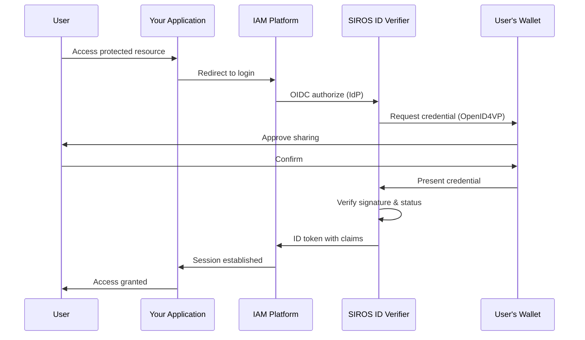

# Verifying Credentials

This guide explains how to verify digital credentials presented by users with SIROS ID wallets. You can use the **SIROS ID hosted verifier service** or **deploy your own verifier** in your infrastructure. After reading this guide, you will understand how to:

- Connect your application to verify credentials
- Configure presentation requests
- Map verified claims to user sessions
- Deploy your own verifier (optional)

## Multi-Tenancy

SIROS ID uses path-based multi-tenancy. All services are hosted under `app.siros.org`:

```
https://app.siros.org/<tenant>/<verifier_instance>/...
```

Each tenant can have multiple verifier instances. For example, tenant `acme-corp` with verifier instance `main`:

| Endpoint | URL |
|----------|-----|
| Discovery | `https://app.siros.org/acme-corp/main/.well-known/openid-configuration` |
| Authorization | `https://app.siros.org/acme-corp/main/authorize` |
| Token | `https://app.siros.org/acme-corp/main/token` |
| JWKS | `https://app.siros.org/acme-corp/main/jwks` |
| Registration | `https://app.siros.org/acme-corp/main/register` |

:::info Tenant and Instance Isolation
Each tenant has isolated configuration, and each verifier instance within a tenant has its own client registrations and presentation policies. The tenant and instance are included in the `iss` claim of issued tokens.
:::

## Deployment Options

| Option | Best For | Requirements |
|--------|----------|-------------|
| **SIROS ID Hosted** | Quick integration, SaaS model | API credentials only |
| **Self-Hosted (Docker)** | On-premise, data sovereignty | Docker, MongoDB |
| **Self-Hosted (Binary)** | Custom infrastructure | Go 1.25+, MongoDB |

:::tip Recommendation
Start with the hosted service for development and testing. Move to self-hosted when you need data sovereignty or to integrate with internal trust frameworks.
:::

## Overview

The SIROS ID verifier implements two protocol interfaces:

1. **[OpenID Connect](https://openid.net/specs/openid-connect-core-1_0.html) Provider** – Standard OIDC interface for existing IAM systems
2. **[OpenID4VP](https://openid.net/specs/openid-4-verifiable-presentations-1_0.html)** – Direct verification for custom applications

This means you can add credential verification to your application without changing your existing authentication flow.



## Integration Options

### Option 1: OIDC Identity Provider (Recommended)

Add the SIROS ID verifier as an identity provider in your IAM system. This works with:

- **Keycloak** – See [Keycloak Integration](./keycloak_verifier)
- **Auth0** – Configure as Generic OIDC connection
- **Okta** – Add as Identity Provider
- **Microsoft Entra ID** – Add as External Identity Provider
- **Google Workspace** – Configure SAML app
- **Any OIDC-compatible IAM**

**Benefits:**
- No code changes to your application
- Leverage existing session management
- Works with federation and SSO

### Option 2: Direct OIDC Integration

Integrate directly as an OIDC Relying Party:

```javascript
// Example: Standard OIDC authorization request
// Replace 'your-tenant' and 'your-verifier' with your tenant and verifier instance IDs
const authUrl = new URL('https://app.siros.org/your-tenant/your-verifier/authorize');
authUrl.searchParams.set('response_type', 'code');
authUrl.searchParams.set('client_id', 'your-client-id');
authUrl.searchParams.set('redirect_uri', 'https://your-app.com/callback');
authUrl.searchParams.set('scope', 'openid profile pid');
authUrl.searchParams.set('state', generateState());
authUrl.searchParams.set('code_challenge', generatePKCE());
authUrl.searchParams.set('code_challenge_method', 'S256');

window.location = authUrl.toString();
```

### Option 3: Direct OpenID4VP

For maximum control, use the OpenID4VP API directly:

```javascript
// Start a presentation request
// Replace 'your-tenant' and 'your-verifier' with your tenant and verifier instance IDs
const response = await fetch('https://app.siros.org/your-tenant/your-verifier/verification/start', {
  method: 'POST',
  headers: { 'Content-Type': 'application/json' },
  body: JSON.stringify({
    credential_types: ['urn:eudi:pid:1'],
    claims: ['given_name', 'family_name', 'birth_date']
  })
});

const { session_id, qr_code, deep_link } = await response.json();
```

## Client Registration

### Dynamic Registration (Recommended)

Use [RFC 7591](https://datatracker.ietf.org/doc/html/rfc7591) dynamic client registration:

```bash
# Replace 'your-tenant' and 'your-verifier' with your tenant and verifier instance IDs
curl -X POST https://app.siros.org/your-tenant/your-verifier/register \
  -H "Content-Type: application/json" \
  -d '{
    "client_name": "My Application",
    "redirect_uris": ["https://my-app.com/callback"],
    "token_endpoint_auth_method": "client_secret_post",
    "grant_types": ["authorization_code", "refresh_token"],
    "response_types": ["code"],
    "scope": "openid profile pid ehic"
  }'
```

Response:
```json
{
  "client_id": "abc123",
  "client_secret": "secret456",
  "client_id_issued_at": 1704067200,
  "client_secret_expires_at": 0
}
```

### Static Registration

Contact SIROS ID to register your client for production use.

## Configuring Presentation Requests

### Scope-Based Requests

Map OIDC scopes to credential types:

| Scope | Credential | Claims |
|-------|------------|--------|
| `profile` | PID | `given_name`, `family_name`, `birth_date` |
| `pid` | PID | All PID claims |
| `ehic` | EHIC | Health insurance claims |
| `diploma` | Diploma | Educational credentials |

### DCQL Queries (Advanced)

For fine-grained control, use [Digital Credentials Query Language (DCQL)](https://openid.net/specs/openid-4-verifiable-presentations-1_0.html#name-digital-credentials-query-l):

```yaml
# presentation_request.yaml
credentials:
  - id: pid_credential
    format: vc+sd-jwt
    meta:
      vct_values:
        - urn:eudi:pid:1
    claims:
      - path: ["given_name"]
      - path: ["family_name"]
      - path: ["birth_date"]
        
  - id: ehic_credential
    format: vc+sd-jwt
    meta:
      vct_values:
        - urn:eudi:ehic:1
    claims:
      - path: ["card_number"]
      - path: ["institution"]
```

## Claim Mapping

Verified credentials are mapped to standard OIDC claims in the ID token:

```json
{
  "iss": "https://app.siros.org/your-tenant/your-verifier",
  "sub": "pairwise-user-id",
  "aud": "your-client-id",
  "exp": 1704153600,
  "iat": 1704067200,
  "given_name": "Alice",
  "family_name": "Smith",
  "birthdate": "1990-01-15",
  "nationality": "SE"
}
```

### Custom Claim Mapping

Configure how credential claims map to OIDC claims:

```yaml
verifier:
  claim_mapping:
    # Standard mappings
    given_name: "$.vc.credentialSubject.given_name"
    family_name: "$.vc.credentialSubject.family_name"
    birthdate: "$.vc.credentialSubject.birth_date"
    # Custom mappings
    employee_id: "$.vc.credentialSubject.employee_number"
```

## W3C Digital Credentials API

For browser-based verification, the SIROS ID verifier supports the [W3C Digital Credentials API](https://wicg.github.io/digital-credentials/):

```javascript
// Browser-native credential request
const credential = await navigator.credentials.get({
  digital: {
    providers: [{
      protocol: "openid4vp",
      request: requestObject
    }]
  }
});
```

When enabled, users can present credentials with a single click—no QR code scanning needed.

### Browser Support

| Browser | Status |
|---------|--------|
| Chrome 116+ | ✅ Supported (with flag) |
| Edge 116+ | ✅ Supported (with flag) |
| Safari 17+ | ⚠️ Partial support |
| Firefox | 🔜 Planned |

The verifier automatically falls back to QR code when the DC API is unavailable.

## Security Features

### PKCE Enforcement

Public clients must use [PKCE (RFC 7636)](https://datatracker.ietf.org/doc/html/rfc7636):

```javascript
// Generate code verifier and challenge
const verifier = generateRandomString(64);
const challenge = base64url(sha256(verifier));
```

### Pairwise Subject Identifiers

By default, users receive different `sub` claims for each relying party, preventing cross-site tracking:

```yaml
verifier:
  oidc:
    subject_type: "pairwise"  # or "public"
    subject_salt: "random-secret-value"
```

### Credential Verification

The verifier automatically:

1. ✅ Validates credential signature
2. ✅ Checks issuer trust (via trust framework)
3. ✅ Verifies credential status (revocation)
4. ✅ Validates credential expiration
5. ✅ Confirms credential type matches request

## API Endpoints

### OIDC Provider Endpoints

| Endpoint | Method | Description |
|----------|--------|-------------|
| `/.well-known/openid-configuration` | GET | OIDC discovery metadata |
| `/jwks` | GET | JSON Web Key Set |
| `/authorize` | GET | Start authorization |
| `/token` | POST | Exchange code for tokens |
| `/userinfo` | GET | Get user claims |
| `/register` | POST | Dynamic client registration |

### OpenID4VP Endpoints

| Endpoint | Method | Description |
|----------|--------|-------------|
| `/verification/start` | POST | Create presentation request |
| `/verification/request-object/{id}` | GET | Get signed request object |
| `/verification/direct_post` | POST | Receive wallet response |
| `/verification/status/{id}` | GET | Check verification status |

## Testing

### Development Environment

Use the SIROS ID test environment at `app.siros.org`. Your test tenant will have pre-configured verifier instances.

### Test Credentials

Obtain test credentials from the SIROS ID demo issuer:

1. Open [app.siros.org](https://app.siros.org) on your phone
2. Navigate to "Add Credential"
3. Scan the demo issuer QR code
4. Accept the test credential

### Integration Testing

```bash
# Test OIDC discovery (replace with your tenant/verifier)
curl https://app.siros.org/your-tenant/your-verifier/.well-known/openid-configuration

# Verify JWKS
curl https://app.siros.org/your-tenant/your-verifier/jwks
```

## Self-Hosted Deployment

If you need to run the verifier in your own infrastructure, you can deploy it using Docker or as a standalone binary.

### Docker Deployment (Recommended)

The verifier is available as a Docker image:

```bash
# Pull the standard verifier image
docker pull ghcr.io/sirosfoundation/vc-verifier:latest

# Or pull the full image with SAML and VC 2.0 support
docker pull ghcr.io/sirosfoundation/vc-verifier-full:latest
```

:::info Image Variants
Use `vc-verifier-full` if you need SAML authentication or W3C VC 2.0 format support. See [Docker Images](../../docker-images) for details.
:::

#### Docker Compose

Create a `docker-compose.yaml`:

```yaml
services:
  verifier:
    image: ghcr.io/sirosfoundation/vc-verifier:latest  # or vc-verifier-full for SAML support
    restart: always
    ports:
      - "8080:8080"
    volumes:
      - ./config.yaml:/config.yaml:ro
      - ./pki:/pki:ro
      - ./presentation_requests:/presentation_requests:ro
    environment:
      - VC_CONFIG_YAML=config.yaml
    depends_on:
      - mongo

  mongo:
    image: mongo:7
    restart: always
    volumes:
      - mongo-data:/data/db
    ports:
      - "27017:27017"

  # Optional: go-trust for trust evaluation
  go-trust:
    image: ghcr.io/sirosfoundation/go-trust:latest
    restart: always
    ports:
      - "8081:8081"
    volumes:
      - ./trust-config.yaml:/config.yaml:ro
    command: ["serve", "--config", "/config.yaml"]

volumes:
  mongo-data:
```

#### Verifier Configuration

Create `config.yaml`:

```yaml
verifier:
  api_server:
    addr: :8080
    tls:
      enabled: false  # Use reverse proxy for TLS in production
  external_url: "https://verifier.example.com"

verifier_proxy:
  api_server:
    addr: :8080
  external_url: "https://verifier.example.com"
  
  oidc:
    issuer: "https://verifier.example.com"
    signing_key_path: "/pki/oidc_signing_key.pem"
    signing_alg: "RS256"
    session_duration: 900
    code_duration: 300
    access_token_duration: 3600
    id_token_duration: 3600
    subject_type: "pairwise"
    subject_salt: "${SUBJECT_SALT}"
  
  openid4vp:
    presentation_timeout: 300
    supported_credentials:
      - vct: "urn:eudi:pid:1"
        scopes: ["openid", "profile"]
      - vct: "urn:eudi:ehic:1"
        scopes: ["ehic"]

  # Trust evaluation via go-trust (AuthZEN)
  trust:
    authzen_endpoint: "http://go-trust:8081"
    enabled: true

  digital_credentials:
    enabled: true
    use_jar: true
    allow_qr_fallback: true

common:
  mongo:
    uri: mongodb://mongo:27017
  production: true
```

#### Start the Services

```bash
# Generate signing keys
openssl genrsa -out pki/oidc_signing_key.pem 2048

# Start all services
docker compose up -d

# Check logs
docker compose logs -f verifier

# Verify health
curl http://localhost:8080/health
```

### Binary Deployment

For non-Docker environments:

```bash
# Clone the repository
git clone https://github.com/dc4eu/vc.git
cd vc

# Build the verifier
make build-verifier

# Run
export VC_CONFIG_YAML=config.yaml
./bin/vc_verifier
```

### Kubernetes Deployment

For production Kubernetes deployments:

```yaml
apiVersion: apps/v1
kind: Deployment
metadata:
  name: verifier
spec:
  replicas: 2
  selector:
    matchLabels:
      app: verifier
  template:
    metadata:
      labels:
        app: verifier
    spec:
      containers:
        - name: verifier
          image: ghcr.io/sirosfoundation/vc-verifier:latest  # or vc-verifier-full
          ports:
            - containerPort: 8080
          env:
            - name: VC_CONFIG_YAML
              value: /config/config.yaml
            - name: SUBJECT_SALT
              valueFrom:
                secretKeyRef:
                  name: verifier-secrets
                  key: subject-salt
          volumeMounts:
            - name: config
              mountPath: /config
            - name: pki
              mountPath: /pki
          livenessProbe:
            httpGet:
              path: /health
              port: 8080
            initialDelaySeconds: 10
          readinessProbe:
            httpGet:
              path: /health
              port: 8080
      volumes:
        - name: config
          configMap:
            name: verifier-config
        - name: pki
          secret:
            secretName: verifier-pki
```

## Next Steps

- [Keycloak Integration Guide](./keycloak_verifier)
- [Trust Services Configuration](../trust/)
- [Go-Trust AuthZEN Service](../trust/go-trust)
- [Issuing Credentials](../issuers/issuer)
