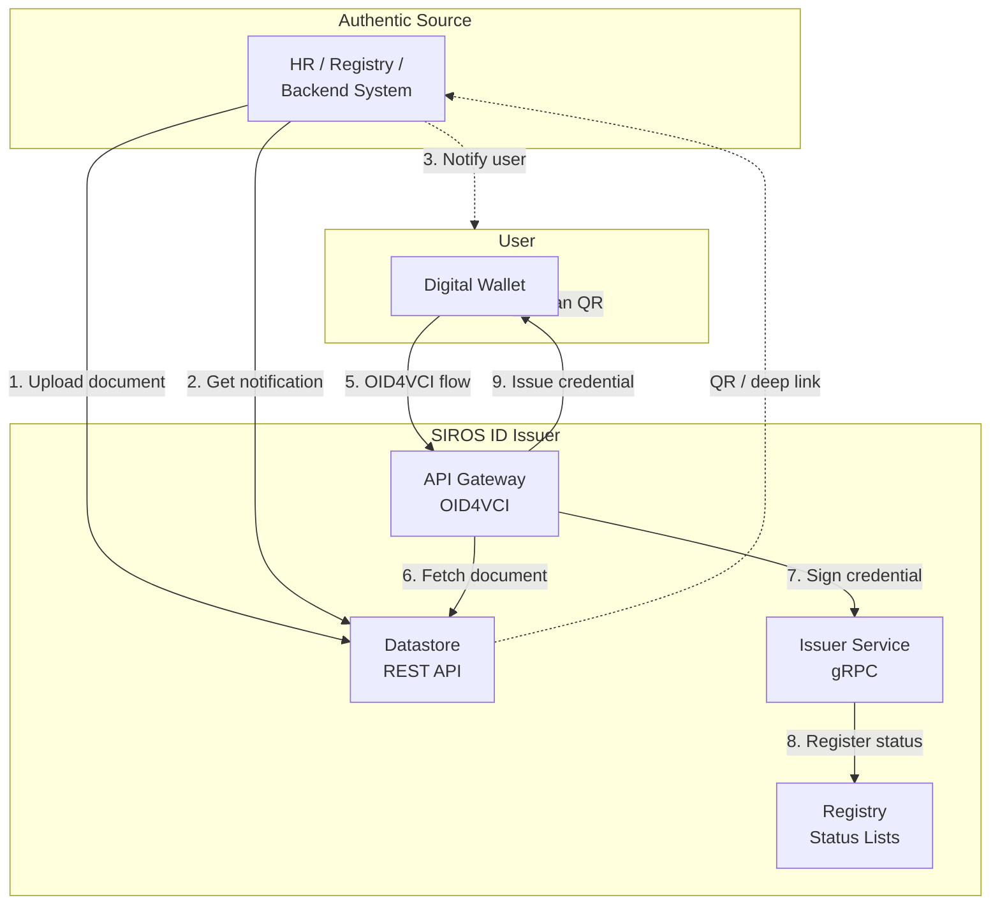
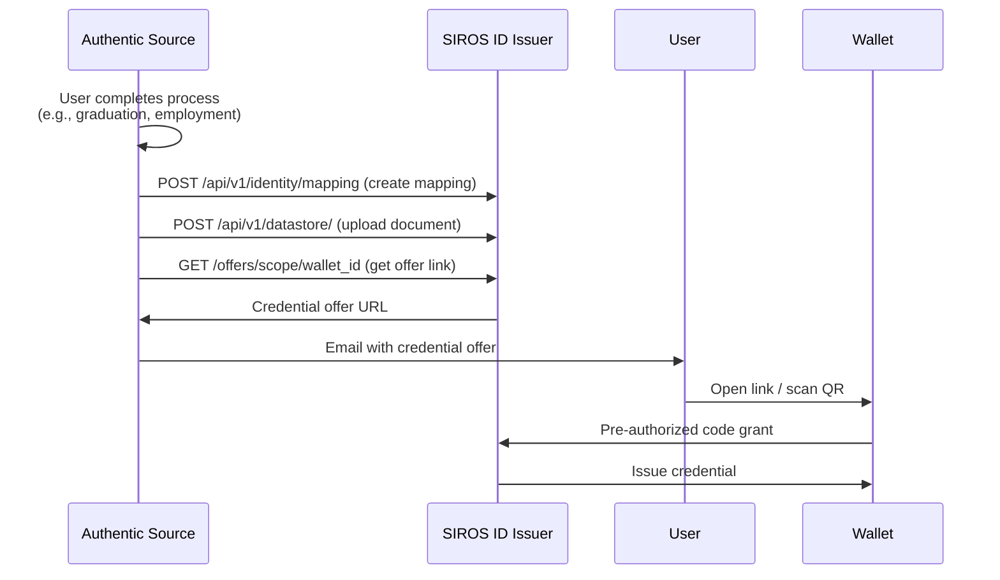

# API Integration for Authentic Sources

This guide covers integrating with the SIROS ID Issuer using REST and gRPC APIs—ideal for organizations where credential data comes from authoritative systems rather than identity providers.

## When to Use API Integration

Choose API integration when:

- **Authentic source systems** (HR databases, student information systems, government registries) need to push data directly
- **Batch issuance** is required for large-scale credential provisioning
- **Pre-authorized flows** enable users to collect credentials without additional authentication
- **Custom identity matching** logic is needed beyond standard IAM attributes
- **Non-IAM workflows** where the user doesn't authenticate via SAML/OIDC

:::tip Comparison
| Integration Type | Best For | User Auth |
|-----------------|----------|-----------|
| [SAML IdP](./saml-idp) | Federation, existing SSO | SAML assertion |
| [OIDC Provider](./oidc-op) | Modern IdP, claims-based | ID token |
| **API Integration** | Backend systems, batch, automation | Pre-authorized or PID-based |
:::

## Architecture Overview

API integration uses the **Datastore API** for document management and the **Issuer gRPC API** for credential signing:



## Datastore REST API

The Datastore API allows authentic sources to upload documents, manage identities, and trigger credential issuance flows.

### Base URL

```
https://issuer.example.org/api/v1
```

### Authentication

The `/api/v1` endpoints support two authentication methods (exactly one must be enabled):

- **JWT Bearer Token** (recommended for production): Requests include an `Authorization: Bearer <JWT>` header. Tokens are validated against a JWKS endpoint. Optional [SPOCP](https://github.com/sirosfoundation/go-spocp) rules enable fine-grained per-endpoint authorization.
- **HTTP Basic Auth** (development / simple deployments): Standard username/password via `Authorization: Basic <base64>` header.

:::tip Production recommendation
Use JWT Bearer with SPOCP rules for production. This allows you to define per-endpoint access policies (e.g., only certain subjects can call `/upload` or `/revoke`). See [Configuration](#configuration) below for examples.
:::

### Endpoint Summary

The API is organized into two resource groups under `/api/v1`:

#### Datastore Endpoints (`/api/v1/datastore`)

| Method | Endpoint | Description |
|--------|----------|-------------|
| POST | `/datastore/` | Upload a document |
| POST | `/datastore/bulk` | Bulk upload multiple documents |
| GET | `/datastore/` | Get document by key (query params) |
| POST | `/datastore` | Get document (body) |
| PUT | `/datastore/` | Replace an existing document |
| DELETE | `/datastore` | Delete a document (body) |
| POST | `/datastore/list` | List documents for an identity |
| POST | `/datastore/resolve` | Resolve identity attributes to documents |
| GET | `/datastore/search` | Search documents |
| PUT | `/datastore/identity` | Add identity mapping IDs to a document |
| DELETE | `/datastore/identity` | Remove identity mapping from a document |

#### Identity Mapping Endpoints (`/api/v1/identity/mapping`)

| Method | Endpoint | Description |
|--------|----------|-------------|
| POST | `/identity/mapping` | Create an identity mapping |
| POST | `/identity/mapping/bulk` | Bulk create identity mappings |
| POST | `/identity/mapping/resolve` | Resolve attributes → person ID |
| PUT | `/identity/mapping` | Update an identity mapping |
| DELETE | `/identity/mapping` | Delete an identity mapping |
| GET | `/identity/mapping/search` | Search identity mappings |

---

## Identity Mapping

Identity mappings link external identity attributes (name, birth date, etc.) to an internal `authentic_source_person_id`. Documents reference these IDs to establish who can collect a credential.

### Create an Identity Mapping

```bash
POST /api/v1/identity/mapping
Content-Type: application/json
Authorization: Bearer <your-jwt-token>

{
  "authentic_source": "hr.example.org",
  "authentic_source_person_id": "EMP-12345",
  "attributes": {
    "family_name": "Smith",
    "given_name": "Alice",
    "birth_date": "1990-05-15"
  }
}
```

**Response:**

```json
{
  "authentic_source_person_id": "EMP-12345"
}
```

If `authentic_source_person_id` is omitted, a UUIDv7 is generated automatically.

### Resolve Attributes to a Person ID

When a user presents their PID credential, resolve their identity to an internal person ID:

```bash
POST /api/v1/identity/mapping/resolve
Content-Type: application/json

{
  "authentic_source": "hr.example.org",
  "attributes": {
    "family_name": "Smith",
    "given_name": "Alice",
    "birth_date": "1990-05-15"
  }
}
```

**Response:**

```json
{
  "authentic_source_person_id": "EMP-12345"
}
```

### Bulk Create Mappings

```bash
POST /api/v1/identity/mapping/bulk
Content-Type: application/json

{
  "mappings": {
    "emp1": {
      "authentic_source": "hr.example.org",
      "authentic_source_person_id": "EMP-001",
      "attributes": { "family_name": "Smith", "given_name": "Alice", "birth_date": "1990-05-15" }
    },
    "emp2": {
      "authentic_source": "hr.example.org",
      "authentic_source_person_id": "EMP-002",
      "attributes": { "family_name": "Jones", "given_name": "Bob", "birth_date": "1985-03-22" }
    }
  }
}
```

**Response:** `{ "count": 2 }`

### Update / Delete / Search

```bash
# Update attributes
PUT /api/v1/identity/mapping
{ "authentic_source": "hr.example.org", "authentic_source_person_id": "EMP-12345", "attributes": { "family_name": "Smith-Jones" } }

# Delete
DELETE /api/v1/identity/mapping
{ "authentic_source": "hr.example.org", "authentic_source_person_id": "EMP-12345" }

# Search (query params)
GET /api/v1/identity/mapping/search?authentic_source=hr.example.org&search=Smith&limit=50
```

---

## Document Upload Flow

### Step 1: Upload Document Data

Upload the credential data before the user requests it. Documents reference identity mappings by their `authentic_source_person_id`:

```bash
POST /api/v1/datastore/
Content-Type: application/json
Authorization: Bearer <your-jwt-token>

{
  "meta": {
    "authentic_source": "hr.example.org",
    "scope": "diploma",
    "document_id": "diploma-2025-001234"
  },
  "identity_mapping_ids": ["EMP-12345"],
  "document_data": {
    "degree_type": "Bachelor of Science",
    "field_of_study": "Computer Science",
    "issuing_institution": "Example University",
    "graduation_date": "2025-05-15",
    "gpa": "3.8",
    "credits_earned": 120
  }
}
```

**Response:**

```json
{
  "document_id": "diploma-2025-001234"
}
```

If `document_id` is omitted from `meta`, a UUIDv7 is generated automatically.

### Step 2: Generate Credential Offer

Navigate to the credential offer UI or use the API to create an offer for the user:

```
GET /offers/<scope>/<wallet_id>
```

The user scans the QR code or clicks the deep link to initiate credential collection in their wallet.

### Step 3: Notify the User

Send the credential offer link to the user via:
- Email notification
- Portal display
- SMS with deep link
- In-app notification

---

## Document Management

### Get a Document by Key

```bash
GET /api/v1/datastore/?authentic_source=hr.example.org&scope=diploma&document_id=diploma-2025-001234
Authorization: Bearer <your-jwt-token>
```

### List Documents for an Identity

```bash
POST /api/v1/datastore/list
Content-Type: application/json

{
  "authentic_source": "hr.example.org",
  "identity_mapping_id": "EMP-12345",
  "scope": "diploma"
}
```

### Resolve Identity Attributes to Documents

```bash
POST /api/v1/datastore/resolve
Content-Type: application/json

{
  "authentic_source": "hr.example.org",
  "attributes": {
    "family_name": "Smith",
    "given_name": "Alice",
    "birth_date": "1990-05-15"
  },
  "scope": "diploma"
}
```

### Replace a Document

```bash
PUT /api/v1/datastore/
Content-Type: application/json

{
  "meta": {
    "authentic_source": "hr.example.org",
    "scope": "diploma",
    "document_id": "diploma-2025-001234"
  },
  "identity_mapping_ids": ["EMP-12345"],
  "document_data": {
    "degree_type": "Bachelor of Science",
    "field_of_study": "Computer Science",
    "gpa": "3.9"
  }
}
```

### Delete a Document

```bash
DELETE /api/v1/datastore
Content-Type: application/json

{
  "authentic_source": "hr.example.org",
  "scope": "diploma",
  "document_id": "diploma-2025-001234"
}
```

### Add/Remove Identity Mappings on a Document

```bash
# Add identities to an existing document
PUT /api/v1/datastore/identity
Content-Type: application/json

{
  "authentic_source": "hr.example.org",
  "scope": "diploma",
  "document_id": "diploma-2025-001234",
  "identity_mapping_ids": ["EMP-67890"]
}

# Remove an identity from a document
DELETE /api/v1/datastore/identity
Content-Type: application/json

{
  "authentic_source": "hr.example.org",
  "scope": "diploma",
  "document_id": "diploma-2025-001234",
  "identity_mapping_ids": ["EMP-67890"]
}
```

### Search Documents

```bash
GET /api/v1/datastore/search?authentic_source=hr.example.org&scope=diploma&search=Smith&limit=50
```

---

## Pre-Authorized Code Flow

For server-to-server issuance where the user has already been authenticated by your system:



### Configuration

Enable pre-authorized code flow in the issuer configuration:

```yaml
issuer:
  pre_authorized_code:
    enabled: true
    # Optional: require user to enter a PIN
    pin_required: false
    # Code expiration (default: 5 minutes)
    code_ttl: 300
```

### Credential Offer Format

The deep link contains a credential offer with pre-authorized code grant:

```json
{
  "credential_issuer": "https://issuer.example.org",
  "credential_configuration_ids": ["urn:eudi:diploma:1"],
  "grants": {
    "urn:ietf:params:oauth:grant-type:pre-authorized_code": {
      "pre-authorized_code": "oaKazRN8I0IbtZ...",
      "tx_code": {
        "input_mode": "numeric",
        "length": 6,
        "description": "Enter the PIN sent to your email"
      }
    }
  }
}
```

---

## Revocation

Credential revocation is managed via [Token Status Lists](/sirosid/reference/token-status-lists). When a credential needs to be revoked, delete the underlying document and the issuer updates the status list entry:

```bash
DELETE /api/v1/datastore
Content-Type: application/json
Authorization: Bearer <your-jwt-token>

{
  "authentic_source": "hr.example.org",
  "scope": "diploma",
  "document_id": "diploma-2025-001234"
}
```

Verifiers checking the Token Status List will see the credential as revoked.
```

---

## gRPC Integration

For advanced integrations, the Issuer Service exposes a gRPC API for direct credential signing.

### Service Definition

```protobuf
service IssuerService {
    rpc MakeSDJWT (MakeSDJWTRequest) returns (MakeSDJWTReply) {}
    rpc MakeMDoc (MakeMDocRequest) returns (MakeMDocReply) {}
    rpc MakeVC20 (MakeVC20Request) returns (MakeVC20Reply) {}
    rpc JWKS (Empty) returns (JwksReply) {}
}
```

### SD-JWT Credential

```protobuf
message MakeSDJWTRequest {
    string scope = 1;           // Credential scope (e.g., "diploma")
    bytes documentData = 2;     // JSON document data
    jwk jwk = 3;                // Holder's public key for binding
    string integrity = 5;       // Integrity token
    bytes vctm = 6;             // VCTM JSON bytes
}
```

### mDL/mDoc Credential

```protobuf
message MakeMDocRequest {
    string scope = 1;            // Credential scope
    string doc_type = 2;         // e.g., "org.iso.18013.5.1.mDL"
    bytes document_data = 3;     // JSON encoded mDL data
    bytes device_public_key = 4; // CBOR encoded COSE_Key
    string device_key_format = 5; // "cose", "jwk", or "x509"
}
```

### Connection

```go
import (
    "google.golang.org/grpc"
    pb "vc/internal/gen/issuer/apiv1_issuer"
)

conn, err := grpc.Dial("issuer.example.org:9090", grpc.WithTransportCredentials(creds))
client := pb.NewIssuerServiceClient(conn)

reply, err := client.MakeSDJWT(ctx, &pb.MakeSDJWTRequest{
    Scope:        "diploma",
    DocumentData: documentJSON,
    Jwk:          holderKey,
    Vctm:         vctmBytes,
})
```

---

## Batch Issuance

For large-scale credential provisioning, use the bulk upload and bulk identity mapping endpoints:

### 1. Bulk Create Identity Mappings

```bash
curl -X POST https://issuer.example.org/api/v1/identity/mapping/bulk \
  -H "Authorization: Bearer $JWT_TOKEN" \
  -H "Content-Type: application/json" \
  -d '{
    "mappings": {
      "emp1": { "authentic_source": "hr.example.org", "authentic_source_person_id": "EMP-001", "attributes": { "family_name": "Smith", "given_name": "Alice", "birth_date": "1990-05-15" } },
      "emp2": { "authentic_source": "hr.example.org", "authentic_source_person_id": "EMP-002", "attributes": { "family_name": "Jones", "given_name": "Bob", "birth_date": "1985-03-22" } }
    }
  }'
```

### 2. Bulk Upload Documents

```bash
curl -X POST https://issuer.example.org/api/v1/datastore/bulk \
  -H "Authorization: Bearer $JWT_TOKEN" \
  -H "Content-Type: application/json" \
  -d '{
    "documents": {
      "doc1": { "meta": { "authentic_source": "hr.example.org", "scope": "diploma", "document_id": "diploma-001" }, "identity_mapping_ids": ["EMP-001"], "document_data": { "degree": "BSc" } },
      "doc2": { "meta": { "authentic_source": "hr.example.org", "scope": "diploma", "document_id": "diploma-002" }, "identity_mapping_ids": ["EMP-002"], "document_data": { "degree": "MSc" } }
    }
  }'
```

### 3. Generate Offers

Navigate users to the credential offer UI:

```
https://issuer.example.org/offers/diploma/<wallet_id>
```

---

## Configuration

### API Authentication

Configure authentication for the `/api/v1` route group. Use `jwks` or `oidc` for token-based auth:

#### JWT Bearer Token via Static JWKS (Recommended)

```yaml
apigw:
  api_server:
    api_auth:
      jwks:
        enable: true
        jwks_url: "https://auth.example.com/.well-known/jwks.json"
        issuer: "https://auth.example.com"
        audience: "vc-issuer"
      # Optional: SPOCP rules for per-endpoint authorization
      rules:
        - "(vc (service apigw)(method POST)(path /api/v1/datastore/)(subject hr-system)(authentic_source SUNET)(scope diploma))"
        - "(vc (service apigw)(method DELETE)(path /api/v1/datastore)(subject hr-admin)(authentic_source *)(scope *))"
      # Or load rules from a file:
      # rules_file: "/etc/vc/spocp-rules.txt"
```

#### JWT Bearer via OIDC Discovery

```yaml
apigw:
  api_server:
    api_auth:
      oidc:
        enable: true
        issuer_url: "https://auth.example.com"
        audience: "vc-issuer"
```

When SPOCP rules are configured, each request is evaluated as a **six-part s-expression** (all six parts are mandatory and must appear in this exact order):

```
(vc (service apigw)(method <HTTP_METHOD>)(path <REQUEST_PATH>)(subject <JWT_SUBJECT>)(authentic_source <AS>)(scope <SCOPE>))
```

If no rules are configured, any valid JWT grants full access. The `subject` is resolved from the `eppn` or `email` claim in the JWT (not the standard `sub` claim).

:::caution Strict Enforcement
Since v0.6.2, the issuer strictly validates that all six s-expression parts are present and in the correct order. Rules with missing or reordered parts will be rejected at startup.
:::

### Credential Metadata

Map credential scopes to VCTM files:

```yaml
common:
  credential_metadata:
    diploma:
      vctm_file_path: "/metadata/vctm_diploma.json"
      format: "dc+sd-jwt"
    employee_badge:
      vctm_file_path: "/metadata/vctm_employee.json"
      format: "dc+sd-jwt"
```

### Identity Matching

Identity matching uses the `attributes` map stored in identity mappings. When resolving, all provided attributes must match exactly. Common attributes:

- `family_name`
- `given_name`
- `birth_date`

The authentic source defines which attributes to store when creating identity mappings.

---

## Error Handling

### Error Response Format

```json
{
  "error": {
    "code": "DOCUMENT_NOT_FOUND",
    "message": "No document found with the specified ID",
    "details": {
      "authentic_source": "hr.example.org",
      "document_id": "invalid-id"
    }
  }
}
```

### Common Error Codes

| Code | HTTP Status | Description |
|------|-------------|-------------|
| `DOCUMENT_NOT_FOUND` | 404 | Document does not exist |
| `IDENTITY_MISMATCH` | 403 | Identity attributes do not match |
| `ALREADY_REVOKED` | 409 | Credential already revoked |
| `INVALID_FORMAT` | 400 | Request body is malformed |
| `UNAUTHORIZED` | 401 | Invalid or missing credentials |
| `RATE_LIMITED` | 429 | Too many requests |

---

## Security Considerations

1. **JWT Token Security**: Use short-lived tokens, validate issuer/audience claims, and rotate signing keys regularly
2. **SPOCP Authorization**: Define fine-grained rules to restrict which subjects can access which endpoints
3. **mTLS for gRPC**: Use mutual TLS for the internal Issuer gRPC service (configurable via `grpc_server.tls`)
4. **Input Validation**: The issuer validates all document data against VCTM schemas
5. **Audit Logging**: All API operations are logged for compliance (configurable webhook destinations)
6. **Rate Limiting**: Implement rate limiting at the reverse proxy level to prevent abuse

---

## Next Steps

- [Deployment](./deployment) – Deploy your own issuer
- [Trust Services](/sirosid/trust/) – Configure trust frameworks
- [Token Status Lists](/sirosid/reference/token-status-lists) – Credential revocation
