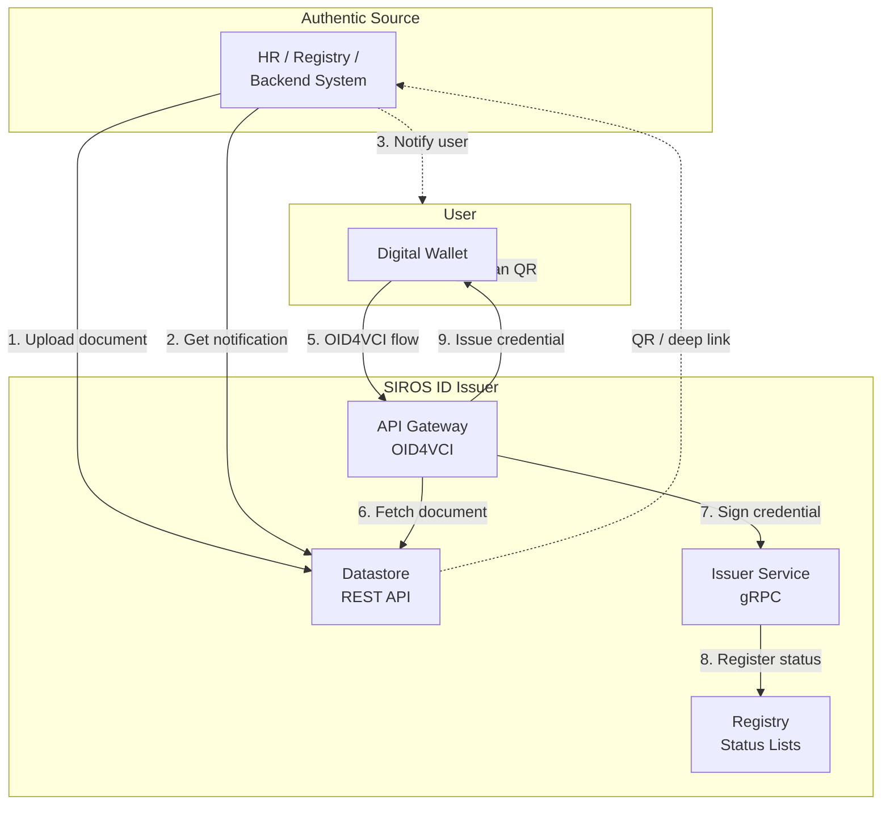
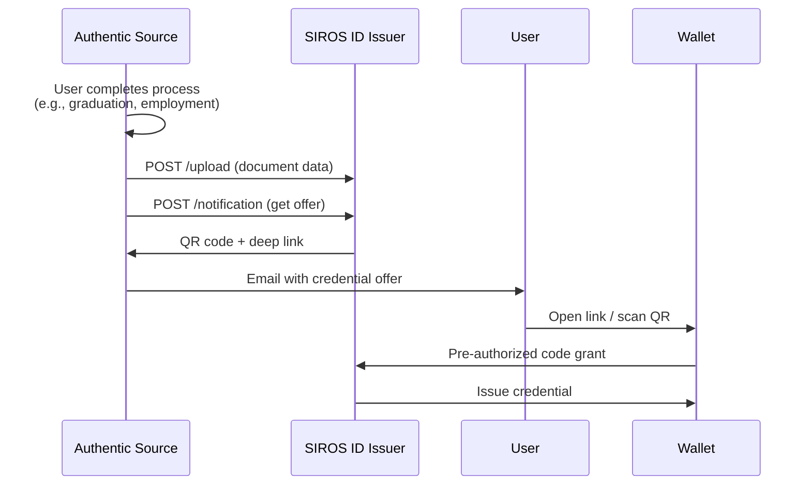

# API Integration for Authentic Sources

This guide covers integrating with the SIROS ID Issuer using REST and gRPC APIs—ideal for organizations where credential data comes from authoritative systems rather than identity providers.

## When to Use API Integration

Choose API integration when:

- **Authentic source systems** (HR databases, student information systems, government registries) need to push data directly
- **Batch issuance** is required for large-scale credential provisioning
- **Pre-authorized flows** enable users to collect credentials without additional authentication
- **Custom identity matching** logic is needed beyond standard IAM attributes
- **Non-IAM workflows** where the user doesn't authenticate via SAML/OIDC

:::tip Comparison
| Integration Type | Best For | User Auth |
|-----------------|----------|-----------|
| [SAML IdP](./saml-idp) | Federation, existing SSO | SAML assertion |
| [OIDC Provider](./oidc-op) | Modern IdP, claims-based | ID token |
| **API Integration** | Backend systems, batch, automation | Pre-authorized or PID-based |
:::

## Architecture Overview

API integration uses the **Datastore API** for document management and the **Issuer gRPC API** for credential signing:



## Datastore REST API

The Datastore API allows authentic sources to upload documents, manage identities, and trigger credential issuance flows.

### Base URL

```
https://issuer.example.org/api/v1
```

### Authentication

API requests require authentication via:
- **API Key**: `X-API-Key: <your-api-key>` header
- **mTLS**: Client certificate authentication (recommended for production)

### Endpoint Summary

| Method | Endpoint | Description |
|--------|----------|-------------|
| POST | `/upload` | Upload document data for future credential issuance |
| POST | `/notification` | Get QR code and deep link for credential pickup |
| PUT | `/document/identity` | Add identity mapping to a document |
| DELETE | `/document/identity` | Remove identity mapping from a document |
| DELETE | `/document` | Delete a document |
| POST | `/document/collect_id` | Retrieve document with identity matching |
| POST | `/identity/mapping` | Map identity attributes to internal person ID |
| POST | `/document/list` | List available documents for a person |
| POST | `/document` | Retrieve a specific document by ID |
| POST | `/document/revoke` | Revoke a credential |

---

## Document Upload Flow

### Step 1: Upload Document Data

Upload the credential data before the user requests it:

```bash
POST /api/v1/upload
Content-Type: application/json
X-API-Key: your-api-key

{
  "meta": {
    "authentic_source": "hr.example.org",
    "vct": "urn:eudi:diploma:1",
    "document_id": "diploma-2025-001234",
    "real_data": true,
    "credential_valid_from": 1735689600,
    "credential_valid_to": 1767225600
  },
  "identities": [
    {
      "authentic_source_person_id": "EMP-12345",
      "family_name": "Smith",
      "given_name": "Alice",
      "birth_date": "1990-05-15"
    }
  ],
  "document_display": {
    "description_short": "Bachelor of Science in Computer Science",
    "description_long": "Awarded by Example University, May 2025",
    "valid_from": 1735689600,
    "valid_to": 1767225600
  },
  "document_data": {
    "degree_type": "Bachelor of Science",
    "field_of_study": "Computer Science",
    "issuing_institution": "Example University",
    "graduation_date": "2025-05-15",
    "gpa": "3.8",
    "credits_earned": 120
  },
  "document_data_version": "1.0.0"
}
```

**Response:** `200 OK` on success

### Step 2: Generate Credential Offer

Get a QR code and deep link to send to the user:

```bash
POST /api/v1/notification
Content-Type: application/json
X-API-Key: your-api-key

{
  "authentic_source": "hr.example.org",
  "vct": "urn:eudi:diploma:1",
  "document_id": "diploma-2025-001234"
}
```

**Response:**

```json
{
  "qr": {
    "base64_image": "data:image/png;base64,iVBORw0KGgo...",
    "deep_link": "openid-credential-offer://?credential_offer_uri=https://issuer.example.org/offers/abc123"
  }
}
```

### Step 3: Notify the User

Send the QR code or deep link to the user via:
- Email notification
- Portal display
- SMS with deep link
- In-app notification

The user scans the QR or clicks the link to initiate credential collection in their wallet.

---

## Identity Management

### Adding Identity to a Document

If multiple people can collect a credential (e.g., legal representatives), add identities:

```bash
PUT /api/v1/document/identity
Content-Type: application/json

{
  "authentic_source": "hr.example.org",
  "vct": "urn:eudi:diploma:1",
  "document_id": "diploma-2025-001234",
  "identity": {
    "authentic_source_person_id": "REP-67890",
    "family_name": "Jones",
    "given_name": "Bob",
    "birth_date": "1985-03-22"
  }
}
```

### Identity Matching

When a user presents their PID (Person Identification Data) credential to collect a document, the issuer performs identity matching:

```bash
POST /api/v1/identity/mapping
Content-Type: application/json

{
  "authentic_source": "hr.example.org",
  "identity": {
    "schema": {
      "name": "SE",
      "version": "1.0.0"
    },
    "family_name": "Smith",
    "given_name": "Alice",
    "birth_date": "1990-05-15"
  }
}
```

**Response:**

```json
{
  "data": {
    "authentic_source_person_id": "EMP-12345"
  }
}
```

The `schema` field identifies the identity schema used (e.g. `"SE"` for Sweden). The `version` must match the version used when the document was uploaded.

The matching algorithm compares:
- `schema` (required)
- `family_name` (required)
- `given_name` (required)
- `birth_date` (required)

---

## Pre-Authorized Code Flow

For server-to-server issuance where the user has already been authenticated by your system:



### Configuration

Enable pre-authorized code flow in the issuer configuration:

```yaml
issuer:
  pre_authorized_code:
    enabled: true
    # Optional: require user to enter a PIN
    pin_required: false
    # Code expiration (default: 5 minutes)
    code_ttl: 300
```

### Credential Offer Format

The deep link contains a credential offer with pre-authorized code grant:

```json
{
  "credential_issuer": "https://issuer.example.org",
  "credential_configuration_ids": ["urn:eudi:diploma:1"],
  "grants": {
    "urn:ietf:params:oauth:grant-type:pre-authorized_code": {
      "pre-authorized_code": "oaKazRN8I0IbtZ...",
      "tx_code": {
        "input_mode": "numeric",
        "length": 6,
        "description": "Enter the PIN sent to your email"
      }
    }
  }
}
```

---

## Revocation

### Revoking a Credential

When a credential needs to be revoked (e.g., employee termination, certificate withdrawal):

```bash
POST /api/v1/document/revoke
Content-Type: application/json

{
  "authentic_source": "hr.example.org",
  "vct": "urn:eudi:diploma:1",
  "revocation": {
    "id": "diploma-2025-001234",
    "reason": "Certificate withdrawn due to academic misconduct",
    "revoke_at": 1735689600
  }
}
```

The issuer updates the Token Status List, and verifiers will see the credential as revoked.

### Revocation with Replacement

If issuing a replacement credential:

```json
{
  "revocation": {
    "id": "diploma-2025-001234",
    "reference": {
      "authentic_source": "hr.example.org",
      "vct": "urn:eudi:diploma:1",
      "document_id": "diploma-2025-001234-v2"
    }
  }
}
```

---

## gRPC Integration

For advanced integrations, the Issuer Service exposes a gRPC API for direct credential signing.

### Service Definition

```protobuf
service IssuerService {
    rpc MakeSDJWT (MakeSDJWTRequest) returns (MakeSDJWTReply) {}
    rpc MakeMDoc (MakeMDocRequest) returns (MakeMDocReply) {}
    rpc MakeVC20 (MakeVC20Request) returns (MakeVC20Reply) {}
    rpc JWKS (Empty) returns (JwksReply) {}
}
```

### SD-JWT Credential

```protobuf
message MakeSDJWTRequest {
    string scope = 1;           // Credential scope (e.g., "diploma")
    bytes documentData = 2;     // JSON document data
    jwk jwk = 3;                // Holder's public key for binding
    string integrity = 5;       // Integrity token
    bytes vctm = 6;             // VCTM JSON bytes
}
```

### mDL/mDoc Credential

```protobuf
message MakeMDocRequest {
    string scope = 1;            // Credential scope
    string doc_type = 2;         // e.g., "org.iso.18013.5.1.mDL"
    bytes document_data = 3;     // JSON encoded mDL data
    bytes device_public_key = 4; // CBOR encoded COSE_Key
    string device_key_format = 5; // "cose", "jwk", or "x509"
}
```

### Connection

```go
import (
    "google.golang.org/grpc"
    pb "vc/internal/gen/issuer/apiv1_issuer"
)

conn, err := grpc.Dial("issuer.example.org:9090", grpc.WithTransportCredentials(creds))
client := pb.NewIssuerServiceClient(conn)

reply, err := client.MakeSDJWT(ctx, &pb.MakeSDJWTRequest{
    Scope:        "diploma",
    DocumentData: documentJSON,
    Jwk:          holderKey,
    Vctm:         vctmBytes,
})
```

---

## Batch Issuance

For large-scale credential provisioning:

### 1. Bulk Upload

```bash
# Upload multiple documents
for doc in documents/*.json; do
  curl -X POST https://issuer.example.org/api/v1/upload \
    -H "X-API-Key: $API_KEY" \
    -H "Content-Type: application/json" \
    -d @"$doc"
done
```

### 2. Generate Offers in Batch

```bash
POST /api/v1/notification/batch
Content-Type: application/json

{
  "authentic_source": "hr.example.org",
  "vct": "urn:eudi:diploma:1",
  "document_ids": [
    "diploma-2025-001234",
    "diploma-2025-001235",
    "diploma-2025-001236"
  ]
}
```

### 3. Bulk Notification

Integrate with your notification system to send credential offers to all recipients.

---

## Configuration

### Authentic Source Configuration

Register your authentic source in the issuer configuration:

```yaml
authentic_sources:
  hr.example.org:
    identifier: "hr.example.org"
    country_code: "SE"
    
    # API key for authentication
    api_key_hash: "$2a$12$..."
    
    # Supported credential types
    credential_types:
      diploma:
        vct: "urn:eudi:diploma:1"
        vctm_path: "/metadata/vctm_diploma.json"
        format: "dc+sd-jwt"
      
      employee_badge:
        vct: "urn:example:employee:1"
        vctm_path: "/metadata/vctm_employee.json"
        format: "dc+sd-jwt"
    
    # Optional: webhook for status updates
    notification_endpoint:
      url: "https://hr.example.org/webhooks/credential-status"
      auth_header: "X-Webhook-Secret"
```

### Identity Matching Rules

Configure how identity attributes are matched:

```yaml
identity_matching:
  # Required attributes for matching
  required_attributes:
    - family_name
    - given_name
    - birth_date
  
  # Fuzzy matching tolerance
  fuzzy_matching:
    enabled: true
    threshold: 0.85
  
  # Date format normalization
  date_formats:
    - "2006-01-02"      # ISO 8601
    - "02/01/2006"      # European
    - "01/02/2006"      # US
```

---

## Error Handling

### Error Response Format

```json
{
  "error": {
    "code": "DOCUMENT_NOT_FOUND",
    "message": "No document found with the specified ID",
    "details": {
      "authentic_source": "hr.example.org",
      "document_id": "invalid-id"
    }
  }
}
```

### Common Error Codes

| Code | HTTP Status | Description |
|------|-------------|-------------|
| `DOCUMENT_NOT_FOUND` | 404 | Document does not exist |
| `IDENTITY_MISMATCH` | 403 | Identity attributes do not match |
| `ALREADY_REVOKED` | 409 | Credential already revoked |
| `INVALID_FORMAT` | 400 | Request body is malformed |
| `UNAUTHORIZED` | 401 | Invalid or missing API key |
| `RATE_LIMITED` | 429 | Too many requests |

---

## Security Considerations

1. **API Key Rotation**: Rotate API keys regularly and use environment variables
2. **mTLS**: Use mutual TLS for production deployments
3. **Input Validation**: The issuer validates all document data against VCTM schemas
4. **Audit Logging**: All API operations are logged for compliance
5. **Rate Limiting**: Implement rate limiting to prevent abuse

---

## Next Steps

- [Deployment](./deployment) – Deploy your own issuer
- [Trust Services](/sirosid/trust/) – Configure trust frameworks
- [Token Status Lists](/sirosid/reference/token-status-lists) – Credential revocation
