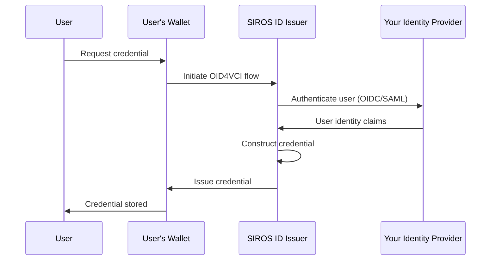

# Issuer Configuration

This guide provides detailed configuration options for the SIROS ID credential issuer. For conceptual background, see [Concepts & Architecture](./concepts). For deployment setup, see [Deployment](./deployment).

After reading this guide, you will understand how to:

- Connect your identity provider to the issuer
- Configure credential types
- Issue credentials to wallets
- Deploy your own issuer (optional)

## Endpoints

The SIROS ID issuer exposes standard OID4VCI endpoints. For a self-hosted or on-premise deployment at `issuer.example.org`:

| Endpoint | URL |
|----------|-----|
| Credential Offer | `https://issuer.example.org/credential-offer` |
| Token | `https://issuer.example.org/token` |
| Credential | `https://issuer.example.org/credential` |
| Metadata | `https://issuer.example.org/.well-known/openid-credential-issuer` |

:::info SIROS Hosted Service
When using the **SIROS ID hosted service**, issuers use subdomain-based multi-tenancy:

```
https://<tenant>.issuer.id.siros.org
```

For example, tenant `acme-corp`:
- `https://acme-corp.issuer.id.siros.org/credential-offer`
- `https://acme-corp.issuer.id.siros.org/.well-known/openid-credential-issuer`

Each tenant has isolated configuration and its own credential types and signing keys.
:::

## Deployment Options

| Option | Best For | Requirements |
|--------|----------|-------------|
| **SIROS ID Hosted** | Quick start, SaaS model | API credentials only |
| **Self-Hosted (Docker)** | On-premise, data sovereignty | Docker, MongoDB |
| **Self-Hosted (Binary)** | Custom infrastructure | Go 1.25+, MongoDB |

:::tip Recommendation
Start with the hosted service for development and testing. Move to self-hosted when you need data sovereignty or custom integrations.
:::

## Overview

The SIROS ID issuer implements the [OpenID for Verifiable Credential Issuance (OID4VCI)](https://openid.net/specs/openid-4-verifiable-credential-issuance-1_0.html) specification. This allows **any OID4VCI-compatible wallet** to receive credentials from your issuer—not just the SIROS ID Credential Manager.

:::info Wallet Compatibility
The SIROS ID Issuer works with any wallet that implements the OID4VCI specification, including:
- **SIROS ID Credential Manager** (based on wwWallet) – used in examples throughout this documentation
- **EUDI Reference Wallet** – the EU Digital Identity reference implementation
- **Third-party wallets** – any wallet implementing OID4VCI with supported credential formats

The diagrams below show the SIROS ID Wallet as an example, but the flows apply to any compatible wallet.
:::



## Authentication Methods

The SIROS ID issuer supports multiple ways to authenticate users before issuing credentials:

### 1. OpenID Connect (OIDC)

Connect any OIDC-compliant identity provider to issue credentials. See [OIDC Provider Integration](./oidc-op) for detailed configuration:

```yaml
# OIDC is configured under apigw.auth_providers.oidc
apigw:
  auth_providers:
    oidc:
      enable: true
      issuer_url: "https://your-idp.example.com"
      redirect_uri: "https://issuer.example.org/oidcrp/callback"
      registration:
        preconfigured:
          enable: true
          client_id: "your-client-id"
          client_secret: "your-client-secret"
      scopes:
        - openid
        - profile
        - email
```

### 2. SAML 2.0

Use existing [SAML 2.0](http://docs.oasis-open.org/security/saml/v2.0/) identity federations. See [SAML IdP Integration](./saml-idp) for detailed configuration:

```yaml
# SAML is configured under apigw.auth_providers.saml
apigw:
  auth_providers:
    saml:
      enable: true
      entity_id: "https://issuer.example.org/sp"
      acs_endpoint: "https://issuer.example.org/saml/acs"
      certificate_path: "/pki/sp-cert.pem"
      private_key_path: "/pki/sp-key.pem"
      # Use MDQ for federation metadata lookup
      mdq_server: "https://mds.swamid.se/md"
      attribute_mapping:
        "urn:oid:2.5.4.42":
          claim: "given_name"
        "urn:oid:2.5.4.4":
          claim: "family_name"
```

### 3. Pre-Authorized Code (API Integration)

For server-to-server issuance where authentic sources push data directly, use the pre-authorized code flow. This enables credential issuance without requiring user authentication via IdP.

See [API Integration](./api-integration) for complete documentation on:
- REST API for document upload and management
- gRPC API for direct credential signing
- Batch issuance workflows
- Pre-authorized code configuration

```yaml
issuer:
  pre_authorized_code:
    enabled: true
    pin_required: false  # Optional: require PIN confirmation
    code_ttl: 300        # Code expiration in seconds
```

Pre-authorized codes are generated via the API and can be used once to retrieve a credential without additional authentication.

## Supported Credential Types

SIROS ID supports issuing credentials in multiple formats:

| Format | Description | Specification | Use Case |
|--------|-------------|---------------|----------|
| **SD-JWT VC** | SD-JWT Verifiable Credential | [draft-ietf-oauth-sd-jwt-vc](https://datatracker.ietf.org/doc/draft-ietf-oauth-sd-jwt-vc/) | EU Digital Identity, general VCs |
| **mDL/mDoc** | ISO 18013-5 mobile document | [ISO/IEC 18013-5:2021](https://www.iso.org/standard/69084.html) | Mobile driving licenses |
| **JWT VC** | JWT-encoded credential | [W3C VC Data Model](https://www.w3.org/TR/vc-data-model/) | Legacy systems |

### Built-in Credential Types

The SIROS ID platform includes preconfigured schemas for common EU credential types based on the [EUDI Wallet Architecture Reference Framework](https://github.com/eu-digital-identity-wallet/eudi-doc-architecture-and-reference-framework):

| Credential | VCT | Description |
|------------|-----|-------------|
| **PID (ARF 1.5)** | `urn:eudi:pid:arf-1.5:1` | Person Identification Data (ARF 1.5) |
| **PID (ARF 1.8)** | `urn:eudi:pid:arf-1.8:1` | Person Identification Data (ARF 1.8+) |
| **EHIC** | `urn:eudi:ehic:1` | European Health Insurance Card |
| **PDA1** | `urn:eudi:pda1:1` | Portable Document A1 |
| **Diploma** | `urn:eudi:diploma:1` | Educational credentials |
| **ELM** | `urn:eudi:elm:1` | [European Learning Model](https://europa.eu/europass/elm-browser/index.html) |
| **Microcredential** | `urn:eudi:micro_credential:1` | Short learning achievements |
| **OpenBadge** | `urn:eudi:openbadge_complete:1` | Open Badges 3.0 (complete) |

:::note Credential Type Aliases
For backwards compatibility with some systems, the generic VCT `urn:eudi:pid:1` may be accepted and mapped to the appropriate ARF version based on configuration.
:::

## Integration Steps

### Step 1: Configure Your Identity Provider

Configure your IdP to allow the issuer as a client:

**For OIDC IdPs:**
1. Register a new OIDC client
2. Set redirect URI to: `https://issuer.example.org/callback`
3. Enable required scopes (openid, profile, email, etc.)

**For SAML IdPs:**
1. Import issuer SP metadata
2. Configure attribute release (name, email, etc.)

### Step 2: Configure Credential Types and Data Sources

The SIROS ID issuer uses two configuration sections to define credentials:

1. **`common.credential_metadata`** — Defines credential types (VCTM path and format)
2. **`apigw.data_sources`** — Binds credential scopes to authentication providers and data source categories

#### Data Source Categories

| Category | Description | Integration Guide |
|----------|-------------|-------------------|
| `datastore` | Document data pre-loaded in MongoDB by an authentic source | [API Integration](./api-integration) |
| `assertion` | Claims come directly from the auth provider (SAML assertion or OIDC token) | [SAML IdP](./saml-idp), [OIDC Provider](./oidc-op) |
| `external_api` | Data fetched from a remote API at issuance time | [API Integration](./api-integration) |

#### Auth Providers

The `auth_provider` field in each data source scope determines how the user is authenticated:

| `auth_provider` | Description | Integration Guide |
|-----------------|-------------|-------------------|
| `oidc`          | User redirected to OIDC Provider; claims from ID token | [OIDC Provider](./oidc-op) |
| `saml`          | User redirected to SAML IdP; claims from assertion | [SAML IdP](./saml-idp) |
| `openid4vp`     | User presents a Verifiable Credential via OpenID4VP | [API Integration](./api-integration) |

#### Choosing the Right Data Source

**`datastore`** – Use when your backend system already has verified user data and controls the issuance flow:
- Diplomas issued by a university after graduation processing
- Employee badges issued via HR system integration
- Government documents issued after in-person verification
- Any scenario where the issuer pushes pre-authorized credential offers via API

**`assertion`** – Use when the credential data comes directly from an IdP:
- PIDs issued via national identity schemes (e.g., Swedish BankID via SAML proxy)
- Credentials where the OIDC token or SAML assertion contains all needed claims
- Social login providers (Google, Microsoft, etc.) for simple identity credentials

**`external_api`** – Use when credential data is fetched from a remote API:
- Educational credentials fetched from Ladok or similar registries
- Credentials requiring data from multiple external systems

**`openid4vp` auth** – Use when the user must prove their identity by presenting an existing credential:
- Issuing derived credentials (e.g., EHIC based on PID)
- Cross-border credential issuance requiring identity verification
- Self-service credential requests where users prove eligibility via existing credentials
- Scenarios requiring multiple credential types for identity matching (configurable via `auth_scopes`)

When using `openid4vp` auth_provider, you must also configure:
- **`auth_scopes`**: List of acceptable credential types that can be presented for authentication (e.g., `["pid_1_5", "pid_1_8"]`)
- **`auth_claims`**: List of claims required from the presented credential (e.g., `["given_name", "birth_date", "family_name"]`)

```yaml
common:
  credential_metadata:
    # Credential type definitions (VCTM path + format)
    pid:
      vctm_file_path: "/metadata/vctm_pid_arf_1_8.json"
      format: "dc+sd-jwt"
    ehic:
      vctm_file_path: "/metadata/vctm_ehic.json"
      format: "dc+sd-jwt"
    diploma:
      vctm_file_path: "/metadata/vctm_diploma.json"
      format: "dc+sd-jwt"

apigw:
  data_sources:
    # Assertion: claims from auth provider ARE the credential data
    assertion:
      scopes:
        pid:
          auth_provider: saml

    # Datastore: pre-loaded document data, auth used for identity lookup
    datastore:
      scopes:
        ehic:
          auth_provider: openid4vp
          auth_scopes: ["pid"]
          auth_claims: ["given_name", "family_name", "birth_date"]

    # External API: data fetched from a remote API
    external_api:
      scopes:
        diploma:
          auth_provider: oidc
          remote: ladok
```

:::tip VCTM Files
The VCTM file defines the credential schema, including claim definitions, display names, and localization. Example files are available in the [vc repository metadata directory](https://github.com/sirosfoundation/vc/tree/main/metadata).
:::

### Step 3: Configure Trust

Establish trust with the SIROS ID ecosystem. See [Trust Services](../trust/) for details on:

- ETSI TSL registration
- OpenID Federation
- X.509 certificate chains

### Step 4: Test the Integration

1. **Obtain a test wallet**: Use the SIROS ID web app at [id.siros.org](https://id.siros.org)
2. **Trigger issuance**: Navigate to your issuer's credential offer page
3. **Scan QR code**: Use the wallet to scan and accept the credential
4. **Verify**: Check that the credential appears in the wallet

## Credential Offer Methods

### QR Code

Generate a QR code containing a credential offer:

```
openid-credential-offer://?credential_offer_uri=https://issuer.example.org/offers/abc123
```

### Deep Link

For mobile apps, use a deep link:

```
openid-credential-offer://issuer.example.org/offers/abc123
```

### Pre-authorized Flow

For server-initiated issuance (e.g., when user completes registration):

```yaml
credential_offer:
  type: pre_authorized
  pin_required: true  # Optional: require PIN confirmation
```

## API Reference

The issuer exposes OpenID4VCI-compliant endpoints:

| Endpoint | Description |
|----------|-------------|
| `/.well-known/openid-credential-issuer` | Credential issuer metadata |
| `/.well-known/oauth-authorization-server` | OAuth2 metadata |
| `/authorize` | Authorization endpoint |
| `/token` | Token endpoint |
| `/credential` | Credential endpoint |
| `/deferred_credential` | Deferred credential endpoint |
| `/nonce` | Nonce endpoint for proof binding |
| `/notification` | Credential notification endpoint |

### Swagger Documentation

Full API documentation is available at:
```
https://issuer.example.org/swagger/index.html
```

## Security Considerations

1. **Key Management**: The issuer signs credentials with keys managed in secure HSMs
2. **Revocation**: Configure status lists for credential revocation
3. **Audit Logging**: All issuance events are logged for compliance

## Self-Hosted Deployment

If you need to run the issuer in your own infrastructure, you can deploy it using Docker or as a standalone binary.

### Docker Deployment (Recommended)

The issuer is available as a Docker image:

```bash
# Pull the issuer image (includes SAML, OIDC, and all credential formats)
docker pull ghcr.io/sirosfoundation/vc/issuer:latest
```

#### Docker Compose

Create a `docker-compose.yaml`:

```yaml
services:
  issuer:
    image: ghcr.io/sirosfoundation/vc/issuer:latest
    restart: always
    ports:
      - "8080:8080"
    volumes:
      - ./config.yaml:/config.yaml:ro
      - ./pki:/pki:ro
      - ./metadata:/metadata:ro
    environment:
      - VC_CONFIG_YAML=config.yaml
    depends_on:
      - mongo

  mongo:
    image: mongo:7
    restart: always
    volumes:
      - mongo-data:/data/db
    ports:
      - "27017:27017"

volumes:
  mongo-data:
```

#### Issuer Configuration

Create `config.yaml`:

```yaml
common:
  mongo:
    uri: mongodb://mongo:27017
  production: true

  credential_metadata:
    pid:
      vctm_file_path: "/metadata/vctm_pid_arf_1_8.json"
      format: "dc+sd-jwt"

issuer:
  issuer_url: "https://issuer.example.com"
  api_server:
    addr: :8080
  grpc_server:
    addr: :8090
  key_config:
    private_key_path: "/pki/signing_ec_private.pem"
    chain_path: "/pki/signing_ec_chain.pem"

apigw:
  api_server:
    addr: :8080
  public_url: "https://issuer.example.com"
  key_config:
    private_key_path: "/pki/signing_ec_private.pem"
    chain_path: "/pki/signing_ec_chain.pem"
  issuer_client:
    addr: issuer:8090
  registry_client:
    addr: registry:8090
  auth_providers:
    oidc:
      enable: true
      issuer_url: "https://your-idp.example.com"
      redirect_uri: "https://issuer.example.com/oidcrp/callback"
      registration:
        preconfigured:
          enable: true
          client_id: "issuer-client"
          client_secret: "${OIDC_CLIENT_SECRET}"
      scopes:
        - openid
        - profile
  data_sources:
    assertion:
      scopes:
        pid:
          auth_provider: oidc
  delivery:
    openid4vci:
      token_endpoint: "https://issuer.example.com/token"
      clients:
        "1003":
          type: "public"
          redirect_uri: "https://wallet.example.com"
          scopes:
            - "pid"
```

#### Start the Service

```bash
# Start all services
docker compose up -d

# Check logs
docker compose logs -f issuer

# Verify health
curl http://localhost:8080/health
```

### Binary Deployment

For non-Docker environments:

```bash
# Clone the repository
git clone https://github.com/SUNET/vc.git
cd vc

# Build the issuer
make build-issuer

# Run
export VC_CONFIG_YAML=config.yaml
./bin/vc_issuer
```

### Kubernetes Deployment

For production Kubernetes deployments:

```yaml
apiVersion: apps/v1
kind: Deployment
metadata:
  name: issuer
spec:
  replicas: 2
  selector:
    matchLabels:
      app: issuer
  template:
    metadata:
      labels:
        app: issuer
    spec:
      containers:
        - name: issuer
          image: ghcr.io/sirosfoundation/vc/issuer:latest
          ports:
            - containerPort: 8080
          env:
            - name: VC_CONFIG_YAML
              value: /config/config.yaml
          volumeMounts:
            - name: config
              mountPath: /config
            - name: pki
              mountPath: /pki
          livenessProbe:
            httpGet:
              path: /health
              port: 8080
            initialDelaySeconds: 10
          readinessProbe:
            httpGet:
              path: /health
              port: 8080
      volumes:
        - name: config
          configMap:
            name: issuer-config
        - name: pki
          secret:
            secretName: issuer-pki
```

## Next Steps

- [Configure Trust Services](../trust/)
- [Set up Credential Verification](../verifiers/verifier)
- [Keycloak Verifier Integration](../verifiers/keycloak_verifier)
