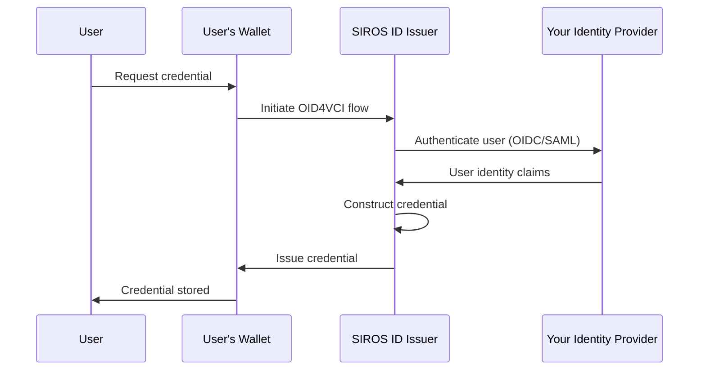

# Issuer Configuration

This guide provides detailed configuration options for the SIROS ID credential issuer. For conceptual background, see [Concepts & Architecture](./concepts). For deployment setup, see [Deployment](./deployment).

After reading this guide, you will understand how to:

- Connect your identity provider to the issuer
- Configure credential types
- Issue credentials to wallets
- Deploy your own issuer (optional)

## Endpoints

The OID4VCI and OAuth endpoints are served by the **apigw** service (the `vc/apigw` image), which fronts the issuer. The `issuer` service itself only speaks gRPC to apigw and exposes `GET /health` and `/swagger/*` over HTTP. For a self-hosted or on-premise deployment where apigw is published at `issuer.example.org`:

| Endpoint | URL |
|----------|-----|
| Credential Offer (by UUID) | `https://issuer.example.org/credential-offer/{credential_offer_uuid}` |
| Offer page (per scope) | `https://issuer.example.org/offers/{scope}` |
| Token | `https://issuer.example.org/token` |
| Credential | `https://issuer.example.org/credential` |
| Metadata | `https://issuer.example.org/.well-known/openid-credential-issuer` |

:::info SIROS Hosted Service
When using the **SIROS ID hosted service**, issuers use subdomain-based multi-tenancy:

```
https://<tenant>.issuer.id.siros.org
```

For example, tenant `acme-corp`:
- `https://acme-corp.issuer.id.siros.org/credential-offer/{credential_offer_uuid}`
- `https://acme-corp.issuer.id.siros.org/.well-known/openid-credential-issuer`

Each tenant has isolated configuration and its own credential types and signing keys.
:::

## Deployment Options

| Option | Best For | Requirements |
|--------|----------|-------------|
| **SIROS ID Hosted** | Quick start, SaaS model | API credentials only |
| **Self-Hosted (Docker)** | On-premise, data sovereignty | Docker, MongoDB (services: apigw, issuer, registry) |
| **Self-Hosted (Binary)** | Custom infrastructure | Go 1.27+, MongoDB |

:::tip Recommendation
Start with the hosted service for development and testing. Move to self-hosted when you need data sovereignty or custom integrations.
:::

## Overview

The SIROS ID issuer implements the [OpenID for Verifiable Credential Issuance (OID4VCI)](https://openid.net/specs/openid-4-verifiable-credential-issuance-1_0.html) specification. This allows **any OID4VCI-compatible wallet** to receive credentials from your issuer—not just the SIROS ID Credential Manager.

:::info Wallet Compatibility
The SIROS ID Issuer works with any wallet that implements the OID4VCI specification, including:
- **SIROS ID Credential Manager** (based on wwWallet) – used in examples throughout this documentation
- **EUDI Reference Wallet** – the EU Digital Identity reference implementation
- **Third-party wallets** – any wallet implementing OID4VCI with supported credential formats

The diagrams below show the SIROS ID Wallet as an example, but the flows apply to any compatible wallet.
:::


```mermaid
sequenceDiagram
    participant User
    participant Wallet as User's Wallet
    participant Issuer as SIROS ID Issuer
    participant IdP as Your Identity Provider

    User->>Wallet: Request credential
    Wallet->>Issuer: Initiate OID4VCI flow
    Issuer->>IdP: Authenticate user (OIDC/SAML)
    IdP->>Issuer: User identity claims
    Issuer->>Issuer: Construct credential
    Issuer->>Wallet: Issue credential
    Wallet->>User: Credential stored
```

## Authentication Methods

The SIROS ID issuer supports multiple ways to authenticate users before issuing credentials:

### 1. OpenID Connect (OIDC)

Connect any OIDC-compliant identity provider to issue credentials. See [OIDC Provider Integration](./oidc-op) for detailed configuration:

```yaml
# OIDC is configured under apigw.auth_providers.oidc
apigw:
  auth_providers:
    oidc:
      enable: true
      issuer_url: "https://your-idp.example.com"
      redirect_uri: "https://issuer.example.org/oidcrp/callback"
      registration:
        preconfigured:
          enable: true
          client_id: "your-client-id"
          client_secret: "your-client-secret"
      scopes:
        - openid
        - profile
        - email
```

### 2. SAML 2.0

Use existing [SAML 2.0](http://docs.oasis-open.org/security/saml/v2.0/) identity federations. See [SAML IdP Integration](./saml-idp) for detailed configuration:

```yaml
# SAML is configured under apigw.auth_providers.saml
apigw:
  auth_providers:
    saml:
      enable: true
      entity_id: "https://issuer.example.org/sp"
      acs_endpoint: "https://issuer.example.org/samlsp/acs"
      certificate_path: "/pki/sp-cert.pem"
      private_key_path: "/pki/sp-key.pem"
      # Use MDQ for federation metadata lookup. MDQ metadata must be
      # signature-verified, so metadata_signing_cert_path is required
      # (or allow_unsigned_metadata: true for testing only).
      mdq_server: "https://mds.swamid.se/entities/"
      metadata_signing_cert_path: "/pki/mdq-signing-cert.pem"
      attribute_mapping:
        "urn:oid:2.5.4.42":
          claim: "given_name"
        "urn:oid:2.5.4.4":
          claim: "family_name"
```

### 3. Pre-Authorized Code (API Integration)

For server-to-server issuance where authentic sources push data directly, use the pre-authorized code flow. This enables credential issuance without requiring user authentication via IdP.

See [API Integration](./api-integration) for complete documentation on:
- REST API for document upload and management
- gRPC API for direct credential signing
- Batch issuance workflows
- Pre-authorized code configuration

```yaml
apigw:
  auth_providers:
    preauth:
      # Generate a numeric transaction code (PIN) for each pre-authorized
      # offer; the wallet must include it in the token request.
      enable_pin: false
```

Pre-authorized offers are created by `POST /api/v1/datastore/preauth_offer` and
can be used once to retrieve a credential without additional authentication.

## Supported Credential Types

SIROS ID supports issuing credentials in multiple formats:

| Format | Description | Specification | Use Case |
|--------|-------------|---------------|----------|
| **SD-JWT VC** | SD-JWT Verifiable Credential | [draft-ietf-oauth-sd-jwt-vc](https://datatracker.ietf.org/doc/draft-ietf-oauth-sd-jwt-vc/) | EU Digital Identity, general VCs |
| **mDL/mDoc** | ISO 18013-5 mobile document | [ISO/IEC 18013-5:2021](https://www.iso.org/standard/69084.html) | Mobile driving licenses |
| **W3C VC 2.0 (Data Integrity)** | `ldp_vc` / `vc+ld+json` credential with a Data Integrity proof | [W3C VC Data Model 2.0](https://www.w3.org/TR/vc-data-model-2.0/) | Linked-data ecosystems |
| **JWP (blind BBS)** | `jwp` credential, enabled by `issuer.bbs` (see [Blind BBS Issuance](#blind-bbs-issuance)) | [draft-ietf-jose-json-web-proof](https://datatracker.ietf.org/doc/draft-ietf-jose-json-web-proof/) | Unlinkable presentations |

JWT-encoded W3C credentials (`jwt_vc_json`) are not issued.

### Credential Type Metadata Shipped with vc

The [vc repository `metadata/` directory](https://github.com/SUNET/vc/tree/main/metadata) ships type metadata files for common credential types, several based on the [EUDI Wallet Architecture Reference Framework](https://github.com/eu-digital-identity-wallet/eudi-doc-architecture-and-reference-framework). Point a `common.credential_metadata` entry at one of them (or at your own file):

| File | VCT / doctype | Description |
|------|---------------|-------------|
| `vctm_pid.json` | `urn:eudi:pid:1` | Person Identification Data (SD-JWT VC) |
| `vctm_pid_urn.json` | `urn:eudi:pid:1` | PID variant |
| `vctm_ehic.json` | `urn:eudi:ehic:1` | European Health Insurance Card |
| `vctm_pda1.json` | `urn:eudi:pda1:1` | Portable Document A1 |
| `vctm_diploma.json` | `urn:eudi:diploma:1` | Educational credentials |
| `vctm_elm.json` | `urn:eudi:elm:1` | [European Learning Model](https://europa.eu/europass/elm-browser/index.html) |
| `vctm_microcredential.json` | `urn:eudi:micro_credential:1` | Short learning achievements |
| `vctm_eduid.json` | `urn:credential:eduid:1` | eduID |
| `vctm_eduid_age_verification.json` | `urn:credential:eduid_age_verification:1` | eduID age verification |
| `pid_mdoc.mdoc.json` | `eu.europa.ec.eudi.pid.1` | PID as mdoc |
| `mdl.mdoc.json` | `org.iso.18013.5.1.mDL` | Mobile driving licence (mdoc) |

## Integration Steps

### Step 1: Configure Your Identity Provider

Configure your IdP to allow the issuer as a client:

**For OIDC IdPs:**
1. Register a new OIDC client
2. Set redirect URI to: `https://issuer.example.org/oidcrp/callback`
3. Enable required scopes (openid, profile, email, etc.)

**For SAML IdPs:**
1. Import issuer SP metadata
2. Configure attribute release (name, email, etc.)

### Step 2: Configure Credential Types and Data Sources

The SIROS ID issuer uses two configuration sections to define credentials:

1. **`common.credential_metadata`** — Defines credential types (VCTM path and format)
2. **`apigw.data_sources`** — Binds credential scopes to authentication providers and data source categories

#### Data Source Categories

| Category | Description | Integration Guide |
|----------|-------------|-------------------|
| `datastore` | Document data pre-loaded in MongoDB by an authentic source | [API Integration](./api-integration) |
| `assertion` | Claims come directly from the auth provider (SAML assertion or OIDC token) | [SAML IdP](./saml-idp), [OIDC Provider](./oidc-op) |
| `external_api` | Data fetched from a remote API at issuance time | [API Integration](./api-integration) |

#### Auth Providers

The `auth_provider` field in each data source scope determines how the user is authenticated:

| `auth_provider` | Description | Integration Guide |
|-----------------|-------------|-------------------|
| `oidc`          | User redirected to OIDC Provider; claims from ID token | [OIDC Provider](./oidc-op) |
| `saml`          | User redirected to SAML IdP; claims from assertion | [SAML IdP](./saml-idp) |
| `openid4vp`     | User presents a Verifiable Credential via OpenID4VP | [API Integration](./api-integration) |
| `preauth`       | No user authentication; the offer itself carries a pre-authorized code. Only valid under `datastore`, and required by `/api/v1/datastore/preauth_offer` | [API Integration](./api-integration) |

#### Choosing the Right Data Source

**`datastore`** – Use when your backend system already has verified user data and controls the issuance flow:
- Diplomas issued by a university after graduation processing
- Employee badges issued via HR system integration
- Government documents issued after in-person verification
- Any scenario where the issuer pushes pre-authorized credential offers via API

**`assertion`** – Use when the credential data comes directly from an IdP:
- PIDs issued via national identity schemes (e.g., Swedish BankID via SAML proxy)
- Credentials where the OIDC token or SAML assertion contains all needed claims
- Social login providers (Google, Microsoft, etc.) for simple identity credentials

**`external_api`** – Use when credential data is fetched from a remote API:
- Educational credentials fetched from Ladok or similar registries
- Credentials requiring data from multiple external systems

**`openid4vp` auth** – Use when the user must prove their identity by presenting an existing credential:
- Issuing derived credentials (e.g., EHIC based on PID)
- Cross-border credential issuance requiring identity verification
- Self-service credential requests where users prove eligibility via existing credentials
- Scenarios requiring multiple credential types for identity matching (configurable via `auth_scopes`)

When using `openid4vp` auth_provider, you must also configure:
- **`auth_scopes`**: A map of acceptable credential types that can be presented for authentication, keyed by `credential_metadata` scope name (e.g. `pid`). Each key must name a configured `common.credential_metadata` scope or startup fails.
- **`auth_claims`** (inside each `auth_scopes` entry): List of claims required from the presented credential (e.g., `["given_name", "birth_date", "family_name"]`). The top-level `auth_claims` is not used with `openid4vp`.

```yaml
common:
  credential_metadata:
    # Credential type definitions (VCTM path + format)
    pid:
      vctm_file_path: "/metadata/vctm_pid.json"
      format: "dc+sd-jwt"
    ehic:
      vctm_file_path: "/metadata/vctm_ehic.json"
      format: "dc+sd-jwt"
    diploma:
      vctm_file_path: "/metadata/vctm_diploma.json"
      format: "dc+sd-jwt"

apigw:
  data_sources:
    # Assertion: claims from auth provider ARE the credential data
    assertion:
      scopes:
        pid:
          auth_provider: saml

    # Datastore: pre-loaded document data, auth used for identity lookup
    datastore:
      scopes:
        ehic:
          auth_provider: openid4vp
          auth_scopes:
            pid:
              auth_claims: ["given_name", "family_name", "birth_date"]

    # External API: data fetched from a remote API
    external_api:
      scopes:
        diploma:
          auth_provider: oidc
          remote: ladok
```

:::tip VCTM Files
The VCTM file defines the credential schema, including claim definitions, display names, and localization. Example files are available in the [vc repository metadata directory](https://github.com/SUNET/vc/tree/main/metadata).
:::

### Step 3: Configure Trust

`apigw.trust` configures trust evaluation for credentials and keys that are
presented *to* apigw, for example when a scope uses the `openid4vp`
auth provider or wallet attestation. It does not register the issuer in any
trust framework. Point it at a Go-Trust PDP; the trust frameworks themselves are
configured in Go-Trust, not in the issuer:

```yaml
apigw:
  trust:
    pdp_url: "http://go-trust:6001"
```

:::warning A PDP is required for production
A PDP (AuthZEN, such as [Go-Trust](../trust/)) configured through `trust.pdp_url` is required for production use. Running without one is not supported (development and testing only). Some things may still work: the resolver handles `did:key` and `did:jwk` locally and trust evaluation runs in "allow all" mode, treating every resolved key as trusted, but other `did:` methods cannot be resolved, and there are no guarantees and no support for such a setup.
:::

See [Trust Services](../trust/) for details on:

- ETSI TSL registration
- OpenID Federation
- X.509 certificate chains

:::tip Accepting wallets without pre-registering each one
You can let the issuer accept **any wallet whose provider is trusted** — instead of maintaining a static client map — via [Wallet Attestation](../trust/wallet-attestation.md). See the [Attestation-Based Authentication how-to](../../howto/attestation-based-authentication.md) for a full worked setup.
:::

### Step 4: Test the Integration

1. **Obtain a test wallet**: Use the SIROS ID web app at [id.siros.org](https://id.siros.org)
2. **Trigger issuance**: Navigate to your issuer's credential offer page
3. **Scan QR code**: Use the wallet to scan and accept the credential
4. **Verify**: Check that the credential appears in the wallet

## Resolving Credential Types from a Registry

Instead of shipping a VCTM file with every deployment, a scope can name a `vct`
(or, for mdoc, a `doctype`) and have it resolved at runtime from a TS11
credential-type registry such as [registry.siros.org](https://registry.siros.org):

```yaml
common:
  credential_registry:
    enable: true
    # Ordered list of independent registries. A later entry overrides an
    # earlier one for the same vct/doctype.
    registries:
      - mirrors:
          # Endpoints serving the same logical registry's content
          - base_url: "https://registry.siros.org"
            timeout: "10s"
    # How long a registry's discovery index is trusted before re-fetching.
    # Zero fetches once and caches for the process lifetime.
    refresh_interval: "1h"

  credential_metadata:
    diploma:
      vct: "https://registry.siros.org/credentials/diploma"
      format: "dc+sd-jwt"
```

`enable: true` is required — naming a `vct` in a scope does not itself turn
registry lookups on. Scopes configured with `vctm_file_path`, `vctm_url`,
`mddl_file_path` or `mddl_url` are unaffected either way.

:::caution
Switching a deployment to registry-backed resolution affects **all** SD-JWT
issuance. Make sure every scope either resolves in the registry or still points
at a local file before enabling it.
:::

## Embedded Disclosure Policies

Per CIR 2024/2979 Annex III and ETSI TS 119 472-3 §4.2.5, a QEAA or PuB-EAA can
carry a policy limiting which relying parties may receive it. It is optional and
off by default; when omitted, no `disclosure_policy` field appears in the issuer
metadata. It does not apply to PIDs.

```yaml
common:
  credential_metadata:
    diploma:
      vctm_file_path: "/metadata/vctm_diploma.json"
      format: "dc+sd-jwt"
      disclosure_policy:
        # none | authorized_relying_parties | specific_root_of_trust
        policy_type: "authorized_relying_parties"
        # Required for authorized_relying_parties: EU-wide unique RP
        # identifiers, as found in the RP's registration certificate
        authorized_relying_parties:
          - "urn:eudi:rp:se:1234567890"
```

With `policy_type: "specific_root_of_trust"`, supply `trusted_roots` instead —
hex-encoded SHA-256 fingerprints (64 characters) of the roots an RP's access
certificate must chain to.

## Credential Offer Methods

### QR Code / Deep Link

Wallet-initiated and UI-initiated offers are served by reference. Encode the
following URI as a QR code, or use it as a deep link on mobile:

```
openid-credential-offer://?credential_offer_uri=https%3A%2F%2Fissuer.example.org%2Fcredential-offer%2F<uuid>
```

:::caution
The scheme keeps its empty authority (`openid-credential-offer://?...`). Do not
round-trip this URI through a URI parser that normalises `scheme://?query` to
`scheme:?query` — several wallets reject the normalised form.
:::

### Pre-authorized Flow

For server-initiated issuance (e.g., when the user completes registration),
create the offer through the datastore API:

```bash
curl -X POST https://issuer.example.org/api/v1/datastore/preauth_offer \
  -H "Authorization: Bearer <token>" \
  -H "Content-Type: application/json" \
  -d '{ "authentic_source": "hr.example.org", "scope": "diploma", "document_id": "..." }'
```

The reply carries the offer inline (`openid-credential-offer://?credential_offer=<json>`) rather than by reference. Turn the transaction-code (PIN) requirement on with
`apigw.auth_providers.preauth.enable_pin`.

## API Reference

apigw exposes the following OpenID4VCI and OAuth endpoints (see also `/op/par`, `/jwks`, `/.well-known/jwt-vc-issuer` and `/type-metadata/{scope}`):

| Endpoint | Description |
|----------|-------------|
| `/.well-known/openid-credential-issuer` | Credential issuer metadata |
| `/.well-known/oauth-authorization-server` | OAuth2 metadata |
| `/authorize` | Authorization endpoint |
| `/token` | Token endpoint |
| `/credential` | Credential endpoint |
| `/deferred_credential` | Deferred credential endpoint |
| `/nonce` | Nonce endpoint for proof binding |
| `/notification` | Credential notification endpoint |

### Swagger Documentation

The issuer service serves its (currently empty) Swagger UI at `/swagger/index.html` on its own HTTP port; the REST surface that matters is apigw's, see [API Integration](./api-integration).

## Audit Logging

Issuance events can be written to any combination of console, file and webhook:

```yaml
issuer:
  audit_log:
    enable: true
    destinations:
      - "stdout"
      - "/var/log/audit.log"
      - "https://audit.example.org/webhook"
    # 0 fsyncs after every write (strict durability, lower throughput);
    # >0 batches fsyncs at this interval (better throughput, bounded
    # data-loss window). No effect on console or webhook destinations.
    file_sync_interval: "5s"
```

## Rate Limiting

APIGW rate-limits its wallet-facing endpoints per client IP:

```yaml
apigw:
  rate_limit:
    token_requests_per_minute: 20
    credential_requests_per_minute: 30
    credential_offer_requests_per_minute: 20
    datastore_requests_per_minute: 60
```

Those four values are the defaults.

The issuer's `SignMetadata` gRPC endpoint has its own limiter. In an HA
deployment every APIGW node refreshes two documents (VCI + OAuth2), so raise it
to suit the cluster size:

```yaml
issuer:
  sign_metadata_rate_limit:
    requests_per_second: 2
    burst: 20
```

## Blind BBS Issuance

The `jwp` credential format is enabled by the presence of `issuer.bbs`; absent,
it is disabled entirely.

```yaml
issuer:
  bbs:
    # Raw BLS12-381 secret scalar, base64url-encoded.
    # Exactly one of secret_key_path / secret_key must be set, and
    # independently exactly one of public_key_path / public_key.
    secret_key_path: "/pki/bbs_secret.b64"
    public_key_path: "/pki/bbs_public.b64"
    default_validity: "8760h"
```

:::caution The BBS key is necessarily a software key
Every other key this issuer signs with is an ECDSA key over a digest, which is
what PKCS#11 is built around. A BBS secret key is a BLS12-381 scalar consumed
inside the signing algebra itself, so it cannot be handed to an HSM that only
offers "sign these bytes" — and mainstream HSMs do not implement the curve at
all. This is a known and accepted property of the format, not an oversight.
Prefer the `_path` variants so the key stays out of the rendered config.
:::

## Pseudonymous mdoc Issuance

```yaml
issuer:
  pseudonym_seed: true
```

When set, the issuer attaches a fresh random `pseudonym_seed` claim to each
issued mdoc — but only where the MDDL schema declares `pseudonym_seed` as a
claim in some namespace, and only when the caller did not already supply one.
The toggle is deliberately decoupled from any particular namespace or doctype:
the schema opting in is what drives it.

## Security Considerations

1. **Key Management**: The issuer signs credentials with keys managed in secure HSMs, configured via `issuer.key_config.pkcs11` (the BBS key excepted, above)
2. **Revocation**: Credential status is published as Token Status Lists by the registry service; see [Token Status Lists](../reference/token-status-lists)
3. **Audit Logging**: See [Audit Logging](#audit-logging) above

## Self-Hosted Deployment

If you need to run the issuer in your own infrastructure, you can deploy it using Docker or as a standalone binary.

### Docker Deployment (Recommended)

A working issuer deployment consists of three vc services plus MongoDB:

| Service | Image | Role |
|---------|-------|------|
| apigw | `ghcr.io/sirosfoundation/vc/apigw` | Public OpenID4VCI/OAuth endpoints, user authentication (OIDC, SAML), datastore API |
| issuer | `ghcr.io/sirosfoundation/vc/issuer` | Credential signing (gRPC) |
| registry | `ghcr.io/sirosfoundation/vc/registry` | Token Status Lists (revocation) |

```bash
docker pull ghcr.io/sirosfoundation/vc/apigw:latest
docker pull ghcr.io/sirosfoundation/vc/issuer:latest
docker pull ghcr.io/sirosfoundation/vc/registry:latest
```

#### Docker Compose

Create a `docker-compose.yaml`:

```yaml
services:
  apigw:
    image: ghcr.io/sirosfoundation/vc/apigw:latest
    restart: always
    ports:
      - "8080:8080"   # public OpenID4VCI / OAuth endpoints
    volumes:
      - ./config.yaml:/config.yaml:ro
      - ./pki:/pki:ro
      - ./metadata:/metadata:ro
    environment:
      - VC_CONFIG_YAML=config.yaml
    depends_on:
      - issuer
      - registry
      - mongo

  issuer:
    image: ghcr.io/sirosfoundation/vc/issuer:latest
    restart: always
    volumes:
      - ./config.yaml:/config.yaml:ro
      - ./pki:/pki:ro
      - ./metadata:/metadata:ro
    environment:
      - VC_CONFIG_YAML=config.yaml
    depends_on:
      - registry
      - mongo

  registry:
    image: ghcr.io/sirosfoundation/vc/registry:latest
    restart: always
    ports:
      - "8081:8080"   # Token Status List HTTP endpoint
    volumes:
      - ./config.yaml:/config.yaml:ro
      - ./pki:/pki:ro
    environment:
      - VC_CONFIG_YAML=config.yaml
    depends_on:
      - mongo

  go-trust:
    image: ghcr.io/sirosfoundation/go-trust:latest
    restart: always
    volumes:
      - ./trust-config.yaml:/config.yaml:ro
    # go-trust binds 127.0.0.1 by default; listen on all interfaces so
    # apigw can reach it on the compose network.
    command: ["--host", "0.0.0.0", "--config", "/config.yaml"]

  mongo:
    image: mongo:7
    restart: always
    volumes:
      - mongo-data:/data/db

volumes:
  mongo-data:
```

The same `config.yaml` is mounted into all three vc services; each reads only its own section (`apigw`, `issuer`, `registry`) plus `common`. The apigw is the only service that needs to be reachable by wallets; the issuer and registry gRPC ports (`8090`) only need to be reachable from the other vc services. See [Go-Trust configuration](/sirosid/trust/go-trust-configuration) for `trust-config.yaml`.

#### Configuration

Create `config.yaml`:

```yaml
common:
  production: true
  mongo:
    uri: mongodb://mongo:27017
  credential_metadata:
    pid:
      vctm_file_path: "/metadata/vctm_pid.json"
      format: "dc+sd-jwt"

issuer:
  issuer_url: "https://issuer.example.org"
  api_server:
    addr: :8080
  grpc_server:
    addr: :8090
  registry_client:
    addr: registry:8090
  key_config:
    private_key_path: "/pki/signing_ec_private.pem"
    chain_path: "/pki/signing_ec_chain.pem"
  jwt_attribute:
    issuer: "https://issuer.example.org"
    verifiable_credential_type: "urn:eudi:pid:1"

apigw:
  api_server:
    addr: :8080
  public_url: "https://issuer.example.org"
  key_config:
    private_key_path: "/pki/signing_ec_private.pem"
    chain_path: "/pki/signing_ec_chain.pem"
  issuer_client:
    addr: issuer:8090
  registry_client:
    addr: registry:8090
  auth_providers:
    oidc:
      enable: true
      issuer_url: "https://your-idp.example.com"
      redirect_uri: "https://issuer.example.org/oidcrp/callback"
      registration:
        preconfigured:
          enable: true
          client_id: "issuer-client"
          client_secret: "the-client-secret"
      scopes:
        - openid
        - profile
  data_sources:
    assertion:
      scopes:
        pid:
          auth_provider: oidc
  delivery:
    openid4vci:
      token_endpoint: "https://issuer.example.org/token"
      clients:
        "1003":
          type: "public"
          redirect_uri: "https://wallet.example.com"
          scopes:
            - "pid"
    credential_offers:
      issuer_url: "https://issuer.example.org"
      wallets:
        my_wallet:
          label: "My Wallet"
          redirect_uri: "https://wallet.example.com/credential-offer"
  trust:
    pdp_url: "http://go-trust:6001"

registry:
  api_server:
    addr: :8080
  public_url: "https://registry.example.org"
  grpc_server:
    addr: :8090
  token_status_lists:
    key_config:
      private_key_path: "/pki/signing_ec_private.pem"
      chain_path: "/pki/signing_ec_chain.pem"
```

The `jwt_attribute` block is required by the issuer service, and `apigw.delivery.credential_offers.issuer_url` must be byte-identical to `apigw.public_url`. Configure the OIDC secret inline (or via the file named by `common.secret_file_path`); the config file is not environment-interpolated.

#### Start the Service

```bash
# Start all services
docker compose up -d

# Check logs
docker compose logs -f apigw issuer registry

# Verify the public endpoint serves issuer metadata
curl https://issuer.example.org/.well-known/openid-credential-issuer
```

### Binary Deployment

For non-Docker environments, build and run each service:

```bash
# Clone the repository
git clone https://github.com/SUNET/vc.git
cd vc

# Build the services
make build-apigw build-issuer build-registry

# Run each service (in separate processes) against the same config
export VC_CONFIG_YAML=config.yaml
./bin/vc_registry &
./bin/vc_issuer &
./bin/vc_apigw
```

### Kubernetes Deployment

Deploy apigw, issuer and registry as three Deployments sharing one config
ConfigMap, with a Service for each gRPC port (`issuer:8090`, `registry:8090`).
Only apigw needs an Ingress. The example below shows the apigw Deployment; the
issuer and registry follow the same pattern with their own image:

```yaml
apiVersion: apps/v1
kind: Deployment
metadata:
  name: apigw
spec:
  replicas: 2
  selector:
    matchLabels:
      app: apigw
  template:
    metadata:
      labels:
        app: apigw
    spec:
      containers:
        - name: apigw
          image: ghcr.io/sirosfoundation/vc/apigw:latest
          ports:
            - containerPort: 8080
          env:
            - name: VC_CONFIG_YAML
              value: /config/config.yaml
          volumeMounts:
            - name: config
              mountPath: /config
            - name: pki
              mountPath: /pki
          livenessProbe:
            httpGet:
              path: /health
              port: 8080
            initialDelaySeconds: 10
          readinessProbe:
            httpGet:
              path: /health
              port: 8080
      volumes:
        - name: config
          configMap:
            name: vc-config
        - name: pki
          secret:
            secretName: vc-pki
```

## Next Steps

- [Configure Trust Services](../trust/)
- [Set up Credential Verification](../verifiers/verifier)
- [Keycloak Verifier Integration](../verifiers/keycloak_verifier)
