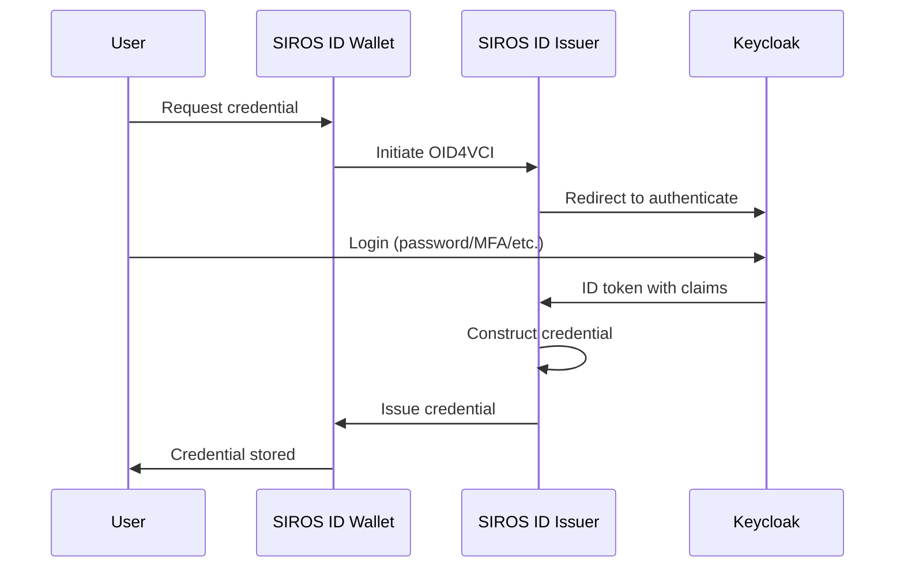

# Keycloak Issuer Integration

This guide explains how to use Keycloak as the identity provider for credential issuance, allowing authenticated Keycloak users to receive digital credentials in their SIROS ID wallet. After reading this guide, you will understand how to:

- Configure Keycloak as the authentication backend for credential issuance
- Map Keycloak user attributes to credential claims
- Set up OIDC or SAML integration
- Trigger credential issuance from Keycloak workflows

## Overview

When using Keycloak as the identity provider for credential issuance, users authenticate through Keycloak first, then receive credentials based on their verified identity attributes. This is ideal for organizations that already manage user identities in Keycloak.



:::tip Hosted or Self-Hosted
This guide works with both the **SIROS ID hosted issuer** and **self-hosted deployments**. The examples use `issuer.example.org` as a placeholder—replace with your actual issuer URL. See [Issuer Deployment Options](./issuer.md#deployment-options) for more information.
:::

:::info SIROS Hosted Service
If using the SIROS-hosted issuer service, your URL will follow the pattern:
```
https://<tenant>.issuer.id.siros.org
```
For example: `https://main.demo.issuer.id.siros.org`
:::

## Prerequisites

- Keycloak 22+ installed and running
- Admin access to your Keycloak realm
- A SIROS ID issuer (hosted or self-hosted)
- Users with attributes you want to include in credentials

## Step 1: Register the Issuer as a Keycloak Client

Create an OIDC client in Keycloak for the SIROS ID issuer.

1. Open **Keycloak Admin Console**
2. Select your realm
3. Navigate to **Clients** → **Create client**

### Client Configuration

| Setting | Value | Description |
|---------|-------|-------------|
| **Client type** | `OpenID Connect` | Protocol type |
| **Client ID** | `siros-issuer` | Identifier for the issuer |
| **Name** | `SIROS ID Credential Issuer` | Display name |
| **Always display in UI** | OFF | Hide from account console |

### Capability Config

| Setting | Value |
|---------|-------|
| **Client authentication** | ON |
| **Authorization** | OFF |
| **Authentication flow** | ✅ Standard flow |

### Access Settings

Configure the redirect URLs for your issuer:

| Setting | Value |
|---------|-------|
| **Root URL** | `https://issuer.example.org` |
| **Valid redirect URIs** | `https://issuer.example.org/callback` |
| **Valid post logout redirect URIs** | `https://issuer.example.org` |
| **Web origins** | `https://issuer.example.org` |

For self-hosted issuers, replace with your issuer URL.

### Credentials

After creating the client, go to the **Credentials** tab and copy the **Client secret**.

## Step 2: Configure User Attributes

Ensure Keycloak users have the attributes needed for credential claims.

### Built-in Attributes

These attributes are available by default:

| Keycloak Attribute | OIDC Claim | Description |
|--------------------|------------|-------------|
| `username` | `preferred_username` | User's username |
| `email` | `email` | Email address |
| `firstName` | `given_name` | First name |
| `lastName` | `family_name` | Last name |

### Custom User Attributes

For credential-specific claims (birthdate, nationality, etc.):

1. Navigate to **Users** → Select a user → **Attributes**
2. Add custom attributes:

| Key | Example Value |
|-----|---------------|
| `birthdate` | `1990-01-15` |
| `nationality` | `SE` |
| `personal_id` | `199001150123` |

### Bulk Import Attributes

For existing users, use the Admin REST API:

```bash
curl -X PUT "https://keycloak.example.com/admin/realms/myrealm/users/{user-id}" \
  -H "Authorization: Bearer ${ADMIN_TOKEN}" \
  -H "Content-Type: application/json" \
  -d '{
    "attributes": {
      "birthdate": ["1990-01-15"],
      "nationality": ["SE"],
      "personal_id": ["199001150123"]
    }
  }'
```

## Step 3: Configure Client Scopes

Create scopes to expose user attributes as OIDC claims.

### Create a Credential Scope

1. Navigate to **Client scopes** → **Create client scope**
2. Configure:

| Setting | Value |
|---------|-------|
| **Name** | `credential-claims` |
| **Type** | `Default` |
| **Display on consent screen** | ON |
| **Consent screen text** | `Share identity attributes for credential issuance` |

### Add Attribute Mappers

In the new scope, go to **Mappers** → **Configure a new mapper** → **User Attribute**

#### Birthdate Mapper

| Setting | Value |
|---------|-------|
| **Name** | `birthdate` |
| **User Attribute** | `birthdate` |
| **Token Claim Name** | `birthdate` |
| **Claim JSON Type** | `String` |
| **Add to ID token** | ON |
| **Add to access token** | OFF |
| **Add to userinfo** | ON |

#### Nationality Mapper

| Setting | Value |
|---------|-------|
| **Name** | `nationality` |
| **User Attribute** | `nationality` |
| **Token Claim Name** | `nationality` |
| **Claim JSON Type** | `String` |
| **Add to ID token** | ON |
| **Add to access token** | OFF |
| **Add to userinfo** | ON |

#### Personal ID Mapper

| Setting | Value |
|---------|-------|
| **Name** | `personal_id` |
| **User Attribute** | `personal_id` |
| **Token Claim Name** | `personal_id` |
| **Claim JSON Type** | `String` |
| **Add to ID token** | ON |
| **Add to access token** | OFF |
| **Add to userinfo** | ON |

### Assign Scope to Client

1. Go to **Clients** → **siros-issuer** → **Client scopes**
2. Click **Add client scope**
3. Select `credential-claims` → **Add** → **Default**

## Step 4: Configure the SIROS ID Issuer

Configure the issuer to use Keycloak as its authentication backend.

### For Hosted Issuer

Contact SIROS ID support to configure your Keycloak as an IdP, providing:

- Keycloak realm URL: `https://keycloak.example.com/realms/myrealm`
- Client ID: `siros-issuer`
- Client Secret: *(from Step 1)*
- Required scopes

### For Self-Hosted Issuer

Create or update `config.yaml`:

```yaml
common:
  mongo:
    uri: mongodb://mongo:27017
  credential_metadata:
    pid:
      vctm_file_path: "/metadata/vctm_pid_arf_1_8.json"
      format: "dc+sd-jwt"

apigw:
  api_server:
    addr: :8080
  public_url: "https://issuer.example.com"

  auth_providers:
    # Keycloak as the OIDC Provider
    oidc:
      enable: true
      issuer_url: "https://keycloak.example.com/realms/myrealm"
      redirect_uri: "https://issuer.example.com/oidcrp/callback"
      registration:
        preconfigured:
          enable: true
          client_id: "siros-issuer"
          client_secret: "keycloak-client-secret"
      scopes:
        - openid
        - profile
        - email
        - credential-claims
      # Normalise Keycloak's claim names where they differ from the VCTM's
      attribute_mapping:
        birthdate:
          claim: "birth_date"

  # The OIDC claims ARE the credential data for this scope
  data_sources:
    assertion:
      scopes:
        pid:
          auth_provider: oidc
```

PKCE is always used by the OIDC RP; there is no `use_pkce` switch. APIGW serves
the callback at `/oidcrp/callback`, so `redirect_uri` must be that path on your
`public_url`, and the same value must be registered in Keycloak.

### Docker Compose with Keycloak

```yaml
services:
  issuer:
    image: ghcr.io/sirosfoundation/vc/issuer:latest
    restart: always
    ports:
      - "8080:8080"
    environment:
      - VC_CONFIG_YAML=config.yaml
    volumes:
      - ./config.yaml:/config.yaml:ro
      - ./pki:/pki:ro
    depends_on:
      - mongo

  mongo:
    image: mongo:7
    restart: always
    volumes:
      - mongo-data:/data/db

volumes:
  mongo-data:
```

## Step 5: Configure Credential Types

Map Keycloak claims to specific credential types.

### Person Identification Data (PID)

```yaml
common:
  credential_metadata:
    pid:
      vctm_file_path: "/metadata/vctm_pid_arf_1_8.json"
      format: "dc+sd-jwt"

apigw:
  data_sources:
    assertion:
      scopes:
        pid:
          auth_provider: oidc
  auth_providers:
    oidc:
      attribute_mapping:
        # Required PID claims — only entries that need renaming or a
        # transform; standard OIDC claim names pass through unchanged.
        birthdate:
          claim: "birth_date"

        # Optional PID claims released by Keycloak under a different name
        country:
          claim: "resident_country"
          transform: "country_alpha2"

        # A claim every credential should carry, even if the IdP omits it
        issuing_country:
          claim: "issuing_country"
          default: "SE"
```

Claims the IdP does not release at all (`issuance_date`, `issuing_authority`)
are filled in by the issuer at signing time, not by configuration here.

### European Health Insurance Card (EHIC)

EHIC data does not come from the IdP — the health insurance institution is the
authentic source. Declare the type, then bind the scope to the `datastore`
data source, using OIDC only to identify the person:

```yaml
common:
  credential_metadata:
    ehic:
      vctm_file_path: "/metadata/vctm_ehic.json"
      format: "dc+sd-jwt"

apigw:
  data_sources:
    datastore:
      scopes:
        ehic:
          auth_provider: oidc
          # Claims used to look the person up in the datastore
          auth_claims: ["given_name", "family_name", "birthdate"]
```

The institution then pushes each person's EHIC document through the
[Datastore API](./api-integration).

## Step 6: Test the Integration

### Using the Demo Wallet

1. Go to [id.siros.org](https://id.siros.org) and create a wallet
2. Navigate to **Add Credential**
3. Enter your issuer URL or scan the QR code
4. Authenticate with your Keycloak credentials
5. Approve the credential issuance
6. Verify the credential contains correct claims

### Direct Testing

Test the OIDC flow manually:

```bash
# 1. Start authorization (opens browser)
open "https://issuer.example.org/authorize?client_id=wallet&redirect_uri=https://id.siros.org/callback&scope=openid%20pid&response_type=code"

# 2. After authentication, check the issued credential
```

### Verify Claim Mapping

Check that Keycloak claims appear correctly:

```bash
# Get a token from Keycloak directly
TOKEN=$(curl -s -X POST \
  "https://keycloak.example.com/realms/myrealm/protocol/openid-connect/token" \
  -d "client_id=siros-issuer" \
  -d "client_secret=${CLIENT_SECRET}" \
  -d "grant_type=password" \
  -d "username=testuser" \
  -d "password=testpassword" \
  -d "scope=openid profile credential-claims" | jq -r '.id_token')

# Decode and inspect claims
echo $TOKEN | cut -d'.' -f2 | base64 -d | jq
```

## Advanced Configuration

### SAML Integration

If your organization uses SAML instead of OIDC, configure it under
`apigw.auth_providers.saml` (not `issuer.authentication`, which no longer
exists). Like the OIDC provider, `attribute_mapping` is keyed by the SAML
attribute identifier, with the target claim name as the value:

```yaml
apigw:
  auth_providers:
    saml:
      enable: true
      entity_id: "https://issuer.example.com/sp"
      acs_endpoint: "https://issuer.example.com/saml/acs"
      certificate_path: "/pki/sp-cert.pem"
      private_key_path: "/pki/sp-key.pem"
      attribute_mapping:
        "urn:oid:2.5.4.42":
          claim: "given_name"
        "urn:oid:2.5.4.4":
          claim: "family_name"
        "urn:oid:0.9.2342.19200300.100.1.3":
          claim: "email"
        "urn:oid:1.3.6.1.5.5.7.9.1":
          claim: "birth_date"

  data_sources:
    assertion:
      scopes:
        pid:
          auth_provider: saml
```

Keycloak's SAML descriptor is discovered via `mdq_server` or a single
`static_idp_metadata` entry, not `metadata_url` — see
[Using SAML Authentication](../../howto/custom-sd-jwt-credential#using-saml-authentication)
for the full SAML provider field reference.

### Conditional Credential Issuance

There is no config-level "issue credential X only to role/group Y" gate —
`issuer.credential_policies` (and `required_roles`/`required_groups`) do not
exist in vc. What Keycloak roles and groups control is which OIDC scopes and
attributes end up in the ID token in the first place (via client scope and
mapper assignment, Step 3 above); apigw then only ever sees the claims
Keycloak chose to release. Two ways to get role/group-gated behavior in
practice:

- Give each population its own `credential-claims`-style client scope in
  Keycloak, and map each scope to a different `common.credential_metadata`
  entry — a user without the scope simply cannot obtain that credential
  type, because APIGW never sees the OIDC scope requested.
- For issuance triggered from your own backend rather than by the wallet,
  use the [pre-authorized flow](#pre-authorized-code-flow) below and decide
  eligibility in your own code before calling the API.

### Multi-Realm Support

`apigw.auth_providers.oidc` configures exactly one OIDC provider — there is
no `providers:` list, and `issuer.authentication` does not exist. A
deployment cannot register two Keycloak realms as two separate OIDC
providers in the same apigw instance today.

To serve users from more than one Keycloak realm, use Keycloak's own
**Identity Brokering**: configure one realm (e.g. `myrealm`) as the OIDC
provider apigw talks to, and add the other realms to it as brokered identity
providers. Keycloak handles the realm selection and federates the login;
apigw still only ever sees one `issuer_url`.

### Automated Credential Provisioning

Automatically issue credentials when users are created or updated:

```java
// Keycloak Event Listener SPI
public class CredentialProvisioningListener implements EventListenerProvider {
    
    @Override
    public void onEvent(AdminEvent event, boolean includeRepresentation) {
        if (event.getResourceType() == ResourceType.USER && 
            event.getOperationType() == OperationType.CREATE) {
            
            // Call POST /api/v1/datastore/preauth_offer (see
            // "Pre-Authorized Code Flow" below) with this user's identity
            // and the scope to issue. issuerClient is your own HTTP client,
            // not part of vc.
            issuerClient.createCredentialOffer(
                event.getResourcePath(),
                "pid"
            );
        }
    }
}
```

### Pre-Authorized Code Flow

For server-initiated issuance (e.g., batch provisioning), skip OIDC entirely
and create the offer through the datastore API — the scope's `datastore`
entry must declare `auth_provider: preauth` (see
[API Integration](./api-integration#pre-authorized-code-flow)):

```bash
curl -X POST "https://issuer.example.com/api/v1/datastore/preauth_offer" \
  -H "Authorization: Bearer ${SERVICE_TOKEN}" \
  -H "Content-Type: application/json" \
  -d '{
    "authentic_source": "hr.example.org",
    "scope": "pid",
    "document_id": "keycloak-user-uuid"
  }'
```

The response contains a credential offer that can be sent to users via email
or displayed as a QR code, plus a `tx_code` when
`apigw.auth_providers.preauth.enable_pin` is set.

## Troubleshooting

### Authentication Fails

**Error**: `invalid_client` or `unauthorized_client`

**Solutions**:
1. Verify client ID matches exactly
2. Check client secret is correct
3. Ensure **Client authentication** is ON in Keycloak
4. Verify redirect URI matches configured values

### Claims Missing from Token

**Symptoms**: Credential issued but missing attributes

**Solutions**:
1. Verify user has the attributes set in Keycloak
2. Check mapper configuration in client scope
3. Ensure scope is assigned to client as **Default**
4. Verify **Add to ID token** is ON for each mapper
5. Test with userinfo endpoint:

```bash
curl -H "Authorization: Bearer ${ACCESS_TOKEN}" \
  "https://keycloak.example.com/realms/myrealm/protocol/openid-connect/userinfo"
```

### Credential Has Wrong Values

**Symptoms**: Credential contains incorrect or default values

**Solutions**:
1. Check claim mapping JSONPath expressions
2. Verify Keycloak attribute names match mapper configuration
3. Enable issuer debug logging to see raw claims
4. Test token claims directly from Keycloak

### CORS Errors

**Error**: Browser blocks cross-origin requests

**Solutions**:
1. Add issuer URL to Keycloak client **Web origins**
2. Configure CORS headers on issuer reverse proxy
3. Verify both HTTP and HTTPS origins if needed

## Configuration Reference

### Complete Keycloak Client JSON

Import this client configuration:

```json
{
  "clientId": "siros-issuer",
  "name": "SIROS ID Credential Issuer",
  "enabled": true,
  "clientAuthenticatorType": "client-secret",
  "redirectUris": [
    "https://issuer.example.com/callback"
  ],
  "webOrigins": [
    "https://issuer.example.com"
  ],
  "standardFlowEnabled": true,
  "directAccessGrantsEnabled": false,
  "serviceAccountsEnabled": false,
  "publicClient": false,
  "protocol": "openid-connect",
  "defaultClientScopes": [
    "openid",
    "profile",
    "email",
    "credential-claims"
  ],
  "optionalClientScopes": []
}
```

### Complete Issuer Configuration

```yaml
common:
  mongo:
    uri: mongodb://mongo:27017
  production: true
  credential_metadata:
    pid:
      vctm_file_path: "/metadata/vctm_pid_arf_1_8.json"
      format: "dc+sd-jwt"

# Signing service
issuer:
  issuer_url: "https://issuer.example.com"
  api_server:
    addr: :8080
  grpc_server:
    addr: :8090
  key_config:
    private_key_path: "/pki/issuer_key.pem"
    chain_path: "/pki/issuer_chain.pem"

# OpenID4VCI front end
apigw:
  api_server:
    addr: :8080
    tls:
      enable: false

  public_url: "https://issuer.example.com"

  issuer_client:
    addr: issuer:8090

  # Keycloak authentication
  auth_providers:
    oidc:
      enable: true
      issuer_url: "https://keycloak.example.com/realms/myrealm"
      redirect_uri: "https://issuer.example.com/oidcrp/callback"
      registration:
        preconfigured:
          enable: true
          client_id: "siros-issuer"
          client_secret: "keycloak-client-secret"
      scopes:
        - openid
        - profile
        - email
        - credential-claims

  data_sources:
    assertion:
      scopes:
        pid:
          auth_provider: oidc

  # Trust configuration (optional)
  trust:
    pdp_url: "http://go-trust:6001"
```

Credential validity is taken from the VCTM / issuance logic, not from a
`validity_days` config key.

## Next Steps

- [Issuer Configuration](./issuer.md) – Full issuer documentation
- [Trust Services](../trust/) – Configure trust framework integration
- [Keycloak Verifier Integration](../verifiers/keycloak_verifier) – Use credentials for Keycloak login
- [Quick Start Guide](../quickstart) – Get started in 15 minutes
