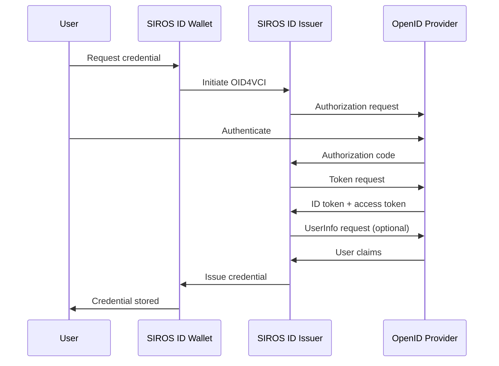

# OpenID Connect Provider Integration

This guide explains how to connect any [OpenID Connect](https://openid.net/specs/openid-connect-core-1_0.html) provider (OP) to the SIROS ID issuer for credential issuance. After reading this guide, you will understand how to:

- Configure OIDC authentication for the issuer
- Register the issuer as an OIDC client
- Map OIDC claims to credential claims
- Use dynamic client registration

## Overview

OpenID Connect is the recommended integration method for most identity providers. Users authenticate through their existing OIDC provider, and the issuer uses the identity claims to construct digital credentials via [OID4VCI](https://openid.net/specs/openid-4-verifiable-credential-issuance-1_0.html).



:::tip When to Use OIDC
Use OIDC integration when:
- Your identity provider supports OpenID Connect
- You want the simplest integration path
- You need modern features like PKCE and dynamic registration
:::

## Prerequisites

- An OpenID Connect compliant identity provider
- Admin access to register OIDC clients (or OP supports dynamic registration)
- A SIROS ID issuer (hosted or self-hosted)

:::note OIDC RP Build Tag
OIDC RP support may require building with the \`oidcrp\` build tag depending on your deployment.
:::

## Configuration

OIDC Relying Party authentication is configured in the \`apigw.oidcrp\` section.

### Basic Configuration

```yaml
apigw:
  oidcrp:
    # Enable OIDC RP support
    enabled: true
    
    # OAuth2 client credentials
    client_id: "your-client-id"
    client_secret: "your-client-secret"
    
    # Callback URL for authorization responses
    redirect_uri: "https://issuer.example.org/oidcrp/callback"
    
    # OIDC Provider issuer URL (for discovery)
    issuer_url: "https://accounts.google.com"
    
    # Scopes to request
    scopes:
      - openid
      - profile
      - email
    
    # Session duration in seconds (default: 3600)
    session_duration: 3600
    
    # Credential mappings
    credential_mappings:
      pid:
        credential_config_id: "urn:eudi:pid:arf-1.8:1"
        attributes:
          given_name:
            claim: "given_name"
            required: true
          family_name:
            claim: "family_name"
            required: true
```

### Dynamic Client Registration

For OIDC Providers supporting [RFC 7591](https://datatracker.ietf.org/doc/html/rfc7591):

```yaml
apigw:
  oidcrp:
    enabled: true
    redirect_uri: "https://issuer.example.org/oidcrp/callback"
    issuer_url: "https://op.example.org"
    
    # Dynamic registration (instead of static client_id/client_secret)
    dynamic_registration:
      enabled: true
      # Optional: initial access token if required by OP
      initial_access_token: "your-registration-token"
      # Optional: persist registered credentials
      storage_path: "/var/lib/vc/oidcrp-registration.json"
    
    scopes:
      - openid
      - profile
      - email
    
    # Optional client metadata for registration
    client_name: "SIROS ID Credential Issuer"
    client_uri: "https://issuer.example.org"
    logo_uri: "https://issuer.example.org/logo.png"
    contacts:
      - "admin@example.org"
    
    credential_mappings:
      # ...
```

## Claim Mapping

### Standard OIDC Claims

OpenID Connect defines standard claims:

| OIDC Claim | Description |
|------------|-------------|
| \`sub\` | Subject identifier |
| \`given_name\` | First name |
| \`family_name\` | Last name |
| \`email\` | Email address |
| \`email_verified\` | Email verification status |
| \`birthdate\` | Birth date (YYYY-MM-DD) |
| \`address\` | Address object |
| \`phone_number\` | Phone number |

### Credential Mappings Configuration

```yaml
apigw:
  oidcrp:
    enabled: true
    issuer_url: "https://accounts.google.com"
    client_id: "${OIDC_CLIENT_ID}"
    client_secret: "${OIDC_CLIENT_SECRET}"
    redirect_uri: "https://issuer.example.org/oidcrp/callback"
    
    scopes:
      - openid
      - profile
      - email
    
    credential_mappings:
      # Key matches credential_constructor scope
      pid:
        # OpenID4VCI credential configuration ID
        credential_config_id: "urn:eudi:pid:arf-1.8:1"
        
        # Attribute mappings: OIDC claim -> credential claim
        attributes:
          # Direct claim mapping
          given_name:
            claim: "given_name"
            required: true
          family_name:
            claim: "family_name"
            required: true
          email:
            claim: "email"
            required: false
          # Subject identifier with transformation
          sub:
            claim: "personal_id"
            required: true
            transform: "lowercase"
          # Claim with default value
          locale:
            claim: "locale"
            required: false
            default: "en-US"
      
      # Example: diploma credential
      diploma:
        credential_config_id: "urn:eudi:diploma:1"
        attributes:
          given_name:
            claim: "student_first_name"
            required: true
          # ...
```

### Attribute Configuration Options

| Option | Type | Description |
|--------|------|-------------|
| \`claim\` | string | Target credential claim name (supports dot-notation) |
| \`required\` | boolean | Whether the OIDC claim must be present |
| \`transform\` | string | Optional: \`lowercase\`, \`uppercase\`, \`trim\` |
| \`default\` | string | Default value if claim is missing |

## Provider-Specific Examples

### Google

```yaml
apigw:
  oidcrp:
    enabled: true
    issuer_url: "https://accounts.google.com"
    client_id: "${GOOGLE_CLIENT_ID}"
    client_secret: "${GOOGLE_CLIENT_SECRET}"
    redirect_uri: "https://issuer.example.org/oidcrp/callback"
    scopes:
      - openid
      - profile
      - email
    credential_mappings:
      pid:
        credential_config_id: "urn:eudi:pid:arf-1.8:1"
        attributes:
          given_name:
            claim: "given_name"
            required: true
          family_name:
            claim: "family_name"
            required: true
          email:
            claim: "email"
            required: true
```

### Azure AD / Microsoft Entra ID

```yaml
apigw:
  oidcrp:
    enabled: true
    issuer_url: "https://login.microsoftonline.com/{tenant-id}/v2.0"
    client_id: "${AZURE_CLIENT_ID}"
    client_secret: "${AZURE_CLIENT_SECRET}"
    redirect_uri: "https://issuer.example.org/oidcrp/callback"
    scopes:
      - openid
      - profile
      - email
      - User.Read
    credential_mappings:
      # ...
```

### Keycloak

```yaml
apigw:
  oidcrp:
    enabled: true
    issuer_url: "https://keycloak.example.org/realms/myrealm"
    client_id: "${KEYCLOAK_CLIENT_ID}"
    client_secret: "${KEYCLOAK_CLIENT_SECRET}"
    redirect_uri: "https://issuer.example.org/oidcrp/callback"
    scopes:
      - openid
      - profile
      - email
    credential_mappings:
      # ...
```

### Auth0

```yaml
apigw:
  oidcrp:
    enabled: true
    issuer_url: "https://{your-domain}.auth0.com/"
    client_id: "${AUTH0_CLIENT_ID}"
    client_secret: "${AUTH0_CLIENT_SECRET}"
    redirect_uri: "https://issuer.example.org/oidcrp/callback"
    scopes:
      - openid
      - profile
      - email
    credential_mappings:
      # ...
```

## Docker Deployment

```yaml
services:
  apigw:
    image: ghcr.io/sirosfoundation/vc-apigw:latest
    restart: always
    ports:
      - "8080:8080"
    environment:
      - OIDC_CLIENT_ID=${OIDC_CLIENT_ID}
      - OIDC_CLIENT_SECRET=${OIDC_CLIENT_SECRET}
    volumes:
      - ./config.yaml:/config.yaml:ro
      - ./pki:/pki:ro
    depends_on:
      - mongo
      - issuer

  issuer:
    image: ghcr.io/sirosfoundation/vc-issuer:latest
    # ...

  mongo:
    image: mongo:7
    volumes:
      - mongo-data:/data/db

volumes:
  mongo-data:
```

## Complete Configuration Example

```yaml
apigw:
  external_server_url: "https://issuer.example.org"
  
  oidcrp:
    enabled: true
    client_id: "${OIDC_CLIENT_ID}"
    client_secret: "${OIDC_CLIENT_SECRET}"
    redirect_uri: "https://issuer.example.org/oidcrp/callback"
    issuer_url: "https://accounts.google.com"
    
    scopes:
      - openid
      - profile
      - email
    
    session_duration: 3600
    
    credential_mappings:
      pid:
        credential_config_id: "urn:eudi:pid:arf-1.8:1"
        attributes:
          given_name:
            claim: "given_name"
            required: true
          family_name:
            claim: "family_name"
            required: true
          email:
            claim: "email"
            required: true
          sub:
            claim: "subject_id"
            required: true

# Credential constructor must match credential_mappings keys
credential_constructor:
  pid:
    vct: "urn:eudi:pid:arf-1.8:1"
    vctm_file_path: "/metadata/vctm_pid_arf_1_8.json"
    auth_method: basic
    format: "dc+sd-jwt"

common:
  mongo:
    uri: mongodb://mongo:27017
```

## Troubleshooting

### Invalid Client

**Solutions:**
1. Verify \`client_id\` and \`client_secret\` are correct
2. Ensure the client is not expired or disabled at the OP
3. Check redirect URI exactly matches what's registered

### Claims Missing

**Solutions:**
1. Verify scopes include the claims you need
2. Some claims require explicit consent or additional scopes
3. Check OP documentation for claim availability

### Token Signature Verification Failed

**Solutions:**
1. Verify \`issuer_url\` matches the token's \`iss\` claim
2. Check JWKS endpoint is accessible from your issuer
3. Ensure server time is synchronized

## Next Steps

- [Issuer Configuration](./issuer) – Full issuer documentation
- [SAML IdP Integration](./saml-idp) – Use SAML instead of OIDC
- [Trust Services](../trust/) – Configure trust framework integration
