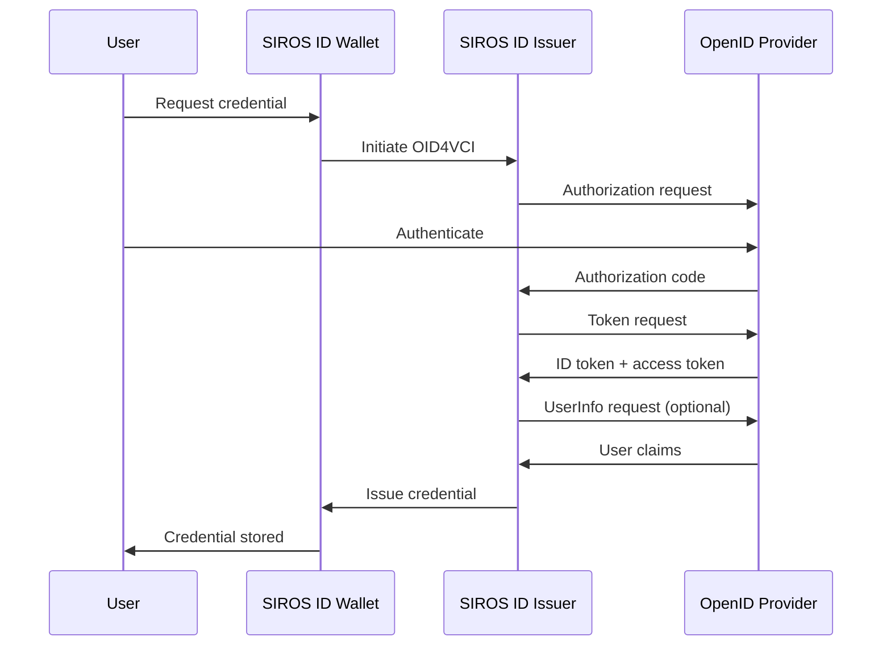

# OpenID Connect Provider Integration

This guide explains how to connect any [OpenID Connect](https://openid.net/specs/openid-connect-core-1_0.html) provider (OP) to the SIROS ID issuer for credential issuance. After reading this guide, you will understand how to:

- Configure OIDC authentication for the issuer
- Register the issuer as an OIDC client
- Map OIDC claims to credential claims
- Use dynamic client registration

## Overview

OpenID Connect is the recommended integration method for most identity providers. Users authenticate through their existing OIDC provider, and the issuer uses the identity claims to construct digital credentials via [OID4VCI](https://openid.net/specs/openid-4-verifiable-credential-issuance-1_0.html).


```mermaid
sequenceDiagram
    participant User
    participant Wallet as SIROS ID Wallet
    participant Issuer as SIROS ID Issuer
    participant OP as OpenID Provider

    User->>Wallet: Request credential
    Wallet->>Issuer: Initiate OID4VCI
    Issuer->>OP: Authorization request
    User->>OP: Authenticate
    OP->>Issuer: Authorization code
    Issuer->>OP: Token request
    OP->>Issuer: ID token + access token
    Issuer->>OP: UserInfo request (optional)
    OP->>Issuer: User claims
    Issuer->>Wallet: Issue credential
    Wallet->>User: Credential stored
```

:::tip When to Use OIDC
Use OIDC integration when:
- Your identity provider supports OpenID Connect
- You want the simplest integration path
- You need modern features like PKCE and dynamic registration
:::

## Prerequisites

- An OpenID Connect compliant identity provider
- Admin access to register OIDC clients (or OP supports dynamic registration)
- A SIROS ID issuer (hosted or self-hosted) with OIDC configured (`apigw.auth_providers.oidc` section)

## Integration Mode

OIDC authentication is integrated into the standard **OpenID4VCI** credential issuance pipeline. When a data source scope has `auth_provider: oidc`, the OID4VCI consent step redirects the user to the OIDC Provider. After successful authentication, the ID token claims are used to construct the credential (for `assertion` data sources) or to perform an identity lookup (for `datastore` data sources), and the standard OID4VCI token/credential flow continues.

This means OIDC-authenticated credentials benefit from the same DPoP binding, token lifecycle, and wallet protocol support as every other auth method.

:::tip Data Source Scope Key
The scope key under `apigw.data_sources` must match the key in `common.credential_metadata`. For example, if credential metadata defines `pid`, the data source scope must also be `pid`.
:::

## Configuration

OIDC Relying Party authentication is configured in the `apigw.auth_providers.oidc` section. Credential types are defined separately in `common.credential_metadata`, and authentication bindings are configured in `apigw.data_sources`.

### Basic Configuration

```yaml
common:
  credential_metadata:
    pid:
      vctm_file_path: "/metadata/vctm_pid_arf_1_8.json"
      format: "dc+sd-jwt"

apigw:
  auth_providers:
    oidc:
      # Enable OIDC RP support
      enable: true

      # OIDC Provider issuer URL (for discovery)
      issuer_url: "https://accounts.google.com"

      # Callback URL for authorization responses
      redirect_uri: "https://issuer.example.org/oidcrp/callback"

      # Client credentials (preconfigured or dynamic registration)
      registration:
        preconfigured:
          enable: true
          client_id: "your-client-id"
          client_secret: "your-client-secret"

      # Scopes to request
      scopes:
        - openid
        - profile
        - email

      # Session duration in seconds (default: 300)
      session_duration: 300

  # Data sources bind credential scopes to auth providers
  data_sources:
    # Assertion: claims from OIDC token ARE the credential data
    assertion:
      scopes:
        pid:
          auth_provider: oidc

    # Datastore: OIDC identifies the user; document data is in MongoDB
    datastore:
      scopes:
        ehic:
          auth_provider: oidc
          auth_claims: ["given_name", "family_name", "birthdate"]
```

### Dynamic Client Registration

For OIDC Providers supporting [RFC 7591](https://datatracker.ietf.org/doc/html/rfc7591):

```yaml
apigw:
  auth_providers:
    oidc:
      enable: true
      redirect_uri: "https://issuer.example.org/oidcrp/callback"
      issuer_url: "https://op.example.org"

      # Dynamic registration (instead of preconfigured client_id/client_secret)
      registration:
        dynamic:
          enable: true
          # Optional: initial access token if required by OP
          initial_access_token: "your-registration-token"

      scopes:
        - openid
        - profile
        - email

      # Optional client metadata for registration
      client_name: "SIROS ID Credential Issuer"
      client_uri: "https://issuer.example.org"
      logo_uri: "https://issuer.example.org/logo.png"
      contacts:
        - "admin@example.org"
```

## Claim Mapping

### Standard OIDC Claims

OpenID Connect defines standard claims:

| OIDC Claim | Description |
|------------|-------------|
| \`sub\` | Subject identifier |
| \`given_name\` | First name |
| \`family_name\` | Last name |
| \`email\` | Email address |
| \`email_verified\` | Email verification status |
| \`birthdate\` | Birth date (YYYY-MM-DD) |
| \`address\` | Address object |
| \`phone_number\` | Phone number |

### Attribute Mapping (Optional)

Attribute mapping normalizes OIDC claim names to canonical claim names. It is **optional** for OIDC — when omitted, OIDC claims pass through as-is since standard claim names already match canonical names. Only specify `attribute_mapping` when OIDC claim names differ from the canonical names expected by VCTM.

```yaml
apigw:
  auth_providers:
    oidc:
      enable: true
      issuer_url: "https://accounts.google.com"
      redirect_uri: "https://issuer.example.org/oidcrp/callback"
      registration:
        preconfigured:
          enable: true
          client_id: "${OIDC_CLIENT_ID}"
          client_secret: "${OIDC_CLIENT_SECRET}"

      scopes:
        - openid
        - profile
        - email

      # attribute_mapping is optional for OIDC. When omitted, OIDC claims
      # pass through as-is (standard claim names already match canonical names).
      # Only needed when OIDC claim names differ from canonical claim names:
      #
      # attribute_mapping:
      #   sub:
      #     claim: "subject_id"
      #     required: true
      #     transform: "lowercase"
```

### Attribute Configuration Options

| Option | Type | Description |
|--------|------|-------------|
| `claim` | string | Canonical claim name to map to |
| `required` | boolean | Whether the OIDC claim must be present |
| `transform` | string | Optional: `lowercase`, `uppercase`, `trim` |

## Provider-Specific Examples

### Google

```yaml
apigw:
  auth_providers:
    oidc:
      enable: true
      issuer_url: "https://accounts.google.com"
      registration:
        preconfigured:
          enable: true
          client_id: "${GOOGLE_CLIENT_ID}"
          client_secret: "${GOOGLE_CLIENT_SECRET}"
      redirect_uri: "https://issuer.example.org/oidcrp/callback"
      scopes:
        - openid
        - profile
        - email
```

### Azure AD / Microsoft Entra ID

```yaml
apigw:
  auth_providers:
    oidc:
      enable: true
      issuer_url: "https://login.microsoftonline.com/{tenant-id}/v2.0"
      registration:
        preconfigured:
          enable: true
          client_id: "${AZURE_CLIENT_ID}"
          client_secret: "${AZURE_CLIENT_SECRET}"
      redirect_uri: "https://issuer.example.org/oidcrp/callback"
      scopes:
        - openid
        - profile
        - email
        - User.Read
```

### Keycloak

```yaml
apigw:
  auth_providers:
    oidc:
      enable: true
      issuer_url: "https://keycloak.example.org/realms/myrealm"
      registration:
        preconfigured:
          enable: true
          client_id: "${KEYCLOAK_CLIENT_ID}"
          client_secret: "${KEYCLOAK_CLIENT_SECRET}"
      redirect_uri: "https://issuer.example.org/oidcrp/callback"
      scopes:
        - openid
        - profile
        - email
```

### Auth0

```yaml
apigw:
  auth_providers:
    oidc:
      enable: true
      issuer_url: "https://{your-domain}.auth0.com/"
      registration:
        preconfigured:
          enable: true
          client_id: "${AUTH0_CLIENT_ID}"
          client_secret: "${AUTH0_CLIENT_SECRET}"
      redirect_uri: "https://issuer.example.org/oidcrp/callback"
      scopes:
      - openid
      - profile
      - email
```

## Docker Deployment

```yaml
services:
  apigw:
    image: ghcr.io/sirosfoundation/vc/apigw:latest
    restart: always
    ports:
      - "8080:8080"
    environment:
      - OIDC_CLIENT_ID=${OIDC_CLIENT_ID}
      - OIDC_CLIENT_SECRET=${OIDC_CLIENT_SECRET}
    volumes:
      - ./config.yaml:/config.yaml:ro
      - ./pki:/pki:ro
    depends_on:
      - mongo
      - issuer

  issuer:
    image: ghcr.io/sirosfoundation/vc/issuer:latest
    # ...

  mongo:
    image: mongo:7
    volumes:
      - mongo-data:/data/db

volumes:
  mongo-data:
```

## Complete Configuration Example

```yaml
common:
  mongo:
    uri: mongodb://mongo:27017

  credential_metadata:
    pid:
      vctm_file_path: "/metadata/vctm_pid_arf_1_8.json"
      format: "dc+sd-jwt"

apigw:
  public_url: "https://issuer.example.org"
  key_config:
    private_key_path: "/pki/signing_ec_private.pem"
    chain_path: "/pki/signing_ec_chain.pem"

  auth_providers:
    oidc:
      enable: true
      issuer_url: "https://accounts.google.com"
      redirect_uri: "https://issuer.example.org/oidcrp/callback"
      registration:
        preconfigured:
          enable: true
          client_id: "${OIDC_CLIENT_ID}"
          client_secret: "${OIDC_CLIENT_SECRET}"
      scopes:
        - openid
        - profile
        - email
      session_duration: 300

  data_sources:
    assertion:
      scopes:
        pid:
          auth_provider: oidc

  delivery:
    openid4vci:
      token_endpoint: "https://issuer.example.org/token"
      clients:
        "1003":
          type: "public"
          redirect_uri: "https://dev.wallet.sunet.se"
          scopes:
            - "pid"
```

## Troubleshooting

### Invalid Client

**Solutions:**
1. Verify \`client_id\` and \`client_secret\` are correct
2. Ensure the client is not expired or disabled at the OP
3. Check redirect URI exactly matches what's registered

### Claims Missing

**Solutions:**
1. Verify scopes include the claims you need
2. Some claims require explicit consent or additional scopes
3. Check OP documentation for claim availability

### Token Signature Verification Failed

**Solutions:**
1. Verify \`issuer_url\` matches the token's \`iss\` claim
2. Check JWKS endpoint is accessible from your issuer
3. Ensure server time is synchronized

## Next Steps

- [Issuer Configuration](./issuer) – Full issuer documentation
- [SAML IdP Integration](./saml-idp) – Use SAML instead of OIDC
- [Trust Services](../trust/) – Configure trust framework integration
