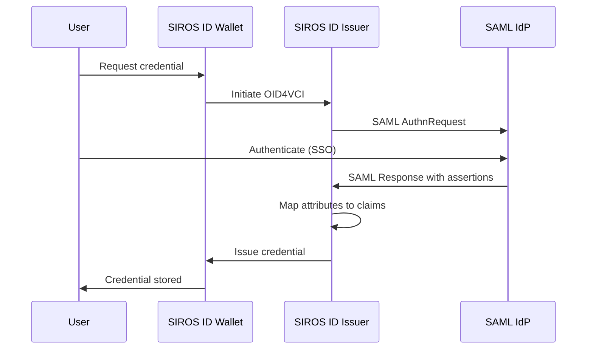

# SAML Identity Provider Integration

This guide explains how to connect a SAML 2.0 identity provider to the SIROS ID issuer for credential issuance. After reading this guide, you will understand how to:

- Configure SAML authentication for the issuer
- Map SAML attributes to credential claims
- Set up metadata exchange (manual or MDQ)
- Handle federation scenarios

## Overview

SAML integration allows organizations with existing SAML identity federations to issue digital credentials to their users. Users authenticate through their familiar SAML login, then receive credentials based on the attributes released by the IdP.



:::tip When to Use SAML
Use SAML integration when:
- Your organization is part of a SAML federation (e.g., eduGAIN, InCommon, SWAMID)
- Users already have accounts in a SAML IdP
- You need to leverage existing attribute release policies
:::

## Prerequisites

- A SAML 2.0 compliant identity provider
- IdP metadata (URL or file)
- A SIROS ID issuer with SAML configured (`apigw.auth_providers.saml` section)

## Integration Mode

SAML authentication is integrated into the standard **OpenID4VCI** credential issuance pipeline. When a data source scope has `auth_provider: saml`, the OID4VCI consent step redirects the user to the SAML IdP. After successful authentication, the SAML assertion attributes are normalized via `attribute_mapping` and then used to construct the credential (for `assertion` data sources) or to perform an identity lookup (for `datastore` data sources), and the standard OID4VCI token/credential flow continues.

This means SAML-authenticated credentials benefit from the same DPoP binding, token lifecycle, and wallet protocol support as every other auth method.

:::tip Data Source Scope Key
The scope key under `apigw.data_sources` must match the key in `common.credential_metadata`. For example, if credential metadata defines `pid`, the data source scope must also be `pid`.
:::

## Configuration

SAML authentication is configured in the `apigw.auth_providers.saml` section. Credential types are defined separately in `common.credential_metadata`, and authentication bindings are configured in `apigw.data_sources`.

### Basic Configuration

```yaml
common:
  credential_metadata:
    pid:
      vctm_file_path: "/metadata/vctm_pid.json"
      format: "dc+sd-jwt"
    diploma:
      vctm_file_path: "/metadata/vctm_diploma.json"
      format: "dc+sd-jwt"

apigw:
  auth_providers:
    saml:
      # Enable SAML support
      enable: true

      # Service Provider entity ID (your issuer's identifier)
      entity_id: "https://issuer.example.org/sp"

      # Assertion Consumer Service endpoint (where IdP sends responses)
      acs_endpoint: "https://issuer.example.org/samlsp/acs"

      # SP signing/encryption certificates
      certificate_path: "/pki/sp-cert.pem"
      private_key_path: "/pki/sp-key.pem"

      # Session duration in seconds (default: 300)
      session_duration: 300

      # Attribute mapping normalizes SAML attribute OIDs to canonical claim names
      attribute_mapping:
        "urn:oid:2.5.4.42":
          claim: "given_name"
        "urn:oid:2.5.4.4":
          claim: "family_name"
        "urn:oid:1.3.6.1.5.5.7.9.1":
          claim: "birth_date"
        "urn:oid:0.9.2342.19200300.100.1.3":
          claim: "email_address"

  # Data sources bind credential scopes to auth providers
  data_sources:
    assertion:
      scopes:
        pid:
          auth_provider: saml
        diploma:
          auth_provider: saml
    datastore:
      scopes:
        ehic:
          auth_provider: saml
          auth_claims: ["given_name", "family_name", "birth_date"]
```

### IdP Metadata Configuration

You must configure either MDQ or static IdP metadata (but not both).

#### Option 1: MDQ (Metadata Query Protocol)

For federation environments with many IdPs, use [MDQ](https://datatracker.ietf.org/doc/draft-young-md-query/) to fetch metadata on-demand:

```yaml
apigw:
  auth_providers:
    saml:
      enable: true
      entity_id: "https://issuer.example.org/sp"
      acs_endpoint: "https://issuer.example.org/samlsp/acs"
      certificate_path: "/pki/sp-cert.pem"
      private_key_path: "/pki/sp-key.pem"
    
      # MDQ configuration
      mdq_server: "https://mds.swamid.se/entities/"
    
      # Cache TTL in seconds (default: 3600)
      metadata_cache_ttl: 3600
    
      # Verify metadata XML signatures (required for MDQ and URL metadata)
      metadata_signing_cert_path: "/pki/federation-signing.pem"
```

**Federation MDQ Endpoints:**

| Federation | MDQ Endpoint |
|------------|--------------|
| **SWAMID** | `https://mds.swamid.se/entities/` |
| **InCommon** | `https://mdq.incommon.org/entities/` |

:::note eduGAIN Metadata
eduGAIN provides aggregate metadata intended for national federations. For individual entity queries, use your national federation's MDQ service.
:::

#### Metadata Signature Validation

When fetching IdP metadata from an MDQ service or a remote URL, the issuer verifies that the metadata is signed by the federation operator. This prevents tampering with metadata in transit and ensures you only trust IdPs that are registered in the federation.

Configure the `metadata_signing_cert_path` option to point to the federation's metadata signing certificate (PEM format):

```yaml
apigw:
  auth_providers:
    saml:
      # ... other SAML config ...
    
      # Federation metadata signing certificate
      # When set, ALL fetched metadata (MDQ and static URL) must carry
      # a valid XML signature from this certificate.
      metadata_signing_cert_path: "/pki/federation-signing.pem"
```

**Behavior:**
- When `metadata_signing_cert_path` is set, the issuer validates the enveloped XML signature on every metadata document before parsing it.
- Metadata without a valid signature from the configured certificate is **rejected**.
- MDQ and URL-based metadata **require** `metadata_signing_cert_path`: with neither it nor `allow_unsigned_metadata: true` set, apigw refuses to start. Only static metadata loaded from a local file (`metadata_path`) may be unsigned (a warning is logged).
- `allow_unsigned_metadata: true` lifts the requirement for MDQ/URL sources. It is insecure and meant for development only.

:::tip Federation Signing Certificates
Federation operators publish their metadata signing certificates. Common sources:
- **SWAMID**: Available at [swamid.se](https://wiki.sunet.se/display/SWAMID/SWAMID+Metadata)
- **InCommon**: Available at [incommon.org](https://spaces.at.internet2.edu/x/jokYAQ)

Download the certificate in PEM format and mount it into your container.
:::

:::caution Never run unsigned in production
`allow_unsigned_metadata: true` exposes the issuer to a compromised network path injecting malicious IdP metadata, redirecting authentication to an attacker-controlled IdP. Use it for development only.
:::

#### Option 2: Static IdP Metadata

For single IdP setups or testing:

```yaml
apigw:
  auth_providers:
    saml:
      enable: true
      entity_id: "https://issuer.example.org/sp"
      acs_endpoint: "https://issuer.example.org/samlsp/acs"
      certificate_path: "/pki/sp-cert.pem"
      private_key_path: "/pki/sp-key.pem"
    
      # Static IdP configuration (mutually exclusive with mdq_server)
      static_idp_metadata:
        entity_id: "https://idp.example.org"
        # Use file path OR URL (not both)
        metadata_path: "/metadata/idp-metadata.xml"
        # metadata_url: "https://idp.example.org/metadata"
```

## Attribute Mapping

Attribute mapping is configured in `apigw.auth_providers.saml.attribute_mapping` and normalizes SAML attribute OIDs to canonical claim names. The mapping is applied globally to ALL attributes in the SAML assertion. Which normalized attributes are used depends on the data source:
- **assertion**: VCTM determines which claims go into the credential
- **datastore**: `auth_claims` determines which are used for DB identity lookup
- **external_api**: `auth_claims` determine identity, remote API provides data

### Standard Attribute Names

SAML uses OID-based attribute names. Common mappings:

| Credential Claim | SAML Attribute (OID) | Friendly Name |
|------------------|---------------------|---------------|
| `given_name` | `urn:oid:2.5.4.42` | `givenName` |
| `family_name` | `urn:oid:2.5.4.4` | `sn` |
| `email_address` | `urn:oid:0.9.2342.19200300.100.1.3` | `mail` |
| `personal_administrative_number` | `urn:oid:1.2.752.29.4.13` | Swedish personnummer |
| `birth_date` | `urn:oid:1.3.6.1.5.5.7.9.1` | `dateOfBirth` |
| `affiliation` | `urn:oid:1.3.6.1.4.1.5923.1.1.1.1` | `eduPersonAffiliation` |
| `principal_name` | `urn:oid:1.3.6.1.4.1.5923.1.1.1.6` | `eduPersonPrincipalName` |
| `institution` | `urn:oid:2.5.4.10` | `organizationName` |

### Attribute Mapping Configuration

The `attribute_mapping` section normalizes provider-specific attribute names to canonical claim names:

```yaml
apigw:
  auth_providers:
    saml:
      attribute_mapping:
        "urn:oid:2.5.4.42":
          claim: "given_name"
        "urn:oid:2.5.4.4":
          claim: "family_name"
        "urn:oid:0.9.2342.19200300.100.1.3":
          claim: "email_address"
        "urn:oid:1.2.752.29.4.13":
          claim: "personal_administrative_number"
        "urn:oid:2.5.4.6":
          claim: "nationality"
        "urn:oid:1.3.6.1.5.5.7.9.1":
          claim: "birth_date"
        "urn:oid:1.3.6.1.4.1.5923.1.1.1.1":
          claim: "affiliation"
        "urn:oid:1.3.6.1.4.1.5923.1.1.1.6":
          claim: "principal_name"
        "urn:oid:2.5.4.10":
          claim: "institution"
```

### Attribute Configuration Options

Each attribute mapping supports:

| Option | Type | Description |
|--------|------|-------------|
| `claim` | string | Canonical claim name to map to |
| `required` | boolean | Whether the attribute must be present |
| `default` | string | Value used when the attribute is absent |
| `as_array` | boolean | Wrap a scalar value in a single-element array |

Mapping only renames attributes and checks presence. Value transformations (lowercase, trim, country codes, ...) are `derivations` on the data source scope, for example:

```yaml
apigw:
  data_sources:
    assertion:
      scopes:
        pid:
          auth_provider: saml
          derivations:
            - lowercase:
                input: email_address
```

See [Concepts](./concepts#building-the-claim-set) for the available primitives.

## Docker Deployment

The SAML SP runs inside the **apigw** service, which also needs the issuer and registry services and MongoDB. See [Deployment](./deployment#docker-composeyaml) for the full Compose file, and mount the SP certificate, key and any static IdP metadata into apigw (`./pki:/pki:ro`, `./metadata:/metadata:ro`).

### SP metadata and publication

apigw serves its SAML SP metadata at `https://issuer.example.org/samlsp/metadata`. For federation acceptance (for example SWAMID) add a `metadata` block describing the organization, contacts and UI information; it is published in the SP metadata:

```yaml
apigw:
  auth_providers:
    saml:
      metadata:
        organization:
          name: "Example Org"
          display_name: "Example Org"
          url: "https://example.org"
          lang: "en"
        contact_persons:
          - type: technical
            given_name: "Ops"
            email: "ops@example.org"
          - type: administrative
            email: "admin@example.org"
        ui_info:
          display_name: "Example Org Credential Issuer"
          description: "Issues digital credentials to Example Org members"
          information_url: "https://example.org/credentials"
          privacy_statement_url: "https://example.org/privacy"
          logo:
            url: "https://example.org/logo.png"
            height: 80
            width: 200
```

### Generate SP Certificates

```bash
# Generate signing/encryption key pair
openssl req -x509 -newkey rsa:2048 \
  -keyout pki/sp-key.pem \
  -out pki/sp-cert.pem \
  -days 3650 -nodes \
  -subj "/CN=issuer.example.org/O=Example Org"
```

## Complete Configuration Example

A complete `config.yaml` for the apigw, issuer and registry services using SAML (as in [Deployment](./deployment)):

```yaml
common:
  production: true
  mongo:
    uri: mongodb://mongo:27017
  credential_metadata:
    pid:
      vctm_file_path: "/metadata/vctm_pid.json"
      format: "dc+sd-jwt"

issuer:
  issuer_url: "https://issuer.example.org"
  api_server:
    addr: :8080
  grpc_server:
    addr: :8090
  registry_client:
    addr: registry:8090
  key_config:
    private_key_path: "/pki/signing_ec_private.pem"
    chain_path: "/pki/signing_ec_chain.pem"
  jwt_attribute:
    issuer: "https://issuer.example.org"
    verifiable_credential_type: "urn:eudi:pid:1"

apigw:
  api_server:
    addr: :8080
  public_url: "https://issuer.example.org"
  key_config:
    private_key_path: "/pki/signing_ec_private.pem"
    chain_path: "/pki/signing_ec_chain.pem"
  issuer_client:
    addr: issuer:8090
  registry_client:
    addr: registry:8090
  auth_providers:
    saml:
      enable: true
      entity_id: "https://issuer.example.org/sp"
      acs_endpoint: "https://issuer.example.org/samlsp/acs"
      certificate_path: "/pki/sp-cert.pem"
      private_key_path: "/pki/sp-key.pem"

      # MDQ for SWAMID federation
      mdq_server: "https://mds.swamid.se/entities/"
      metadata_cache_ttl: 3600
      metadata_signing_cert_path: "/pki/swamid-signing.pem"

      session_duration: 300

      attribute_mapping:
        "urn:oid:2.5.4.42":
          claim: "given_name"
        "urn:oid:2.5.4.4":
          claim: "family_name"
        "urn:oid:1.3.6.1.5.5.7.9.1":
          claim: "birth_date"
        "urn:oid:1.2.752.29.4.13":
          claim: "personal_administrative_number"
        "urn:oid:0.9.2342.19200300.100.1.3":
          claim: "email_address"
  data_sources:
    assertion:
      scopes:
        pid:
          auth_provider: saml
          derivations:
            - lowercase:
                input: email_address
  delivery:
    openid4vci:
      token_endpoint: "https://issuer.example.org/token"
      clients:
        "1003":
          type: "public"
          redirect_uri: "https://wallet.example.com"
          scopes:
            - "pid"
    credential_offers:
      issuer_url: "https://issuer.example.org"
      wallets:
        my_wallet:
          label: "My Wallet"
          redirect_uri: "https://wallet.example.com/credential-offer"
  trust:
    pdp_url: "http://go-trust:6001"

registry:
  api_server:
    addr: :8080
  public_url: "https://registry.example.org"
  grpc_server:
    addr: :8090
  token_status_lists:
    key_config:
      private_key_path: "/pki/signing_ec_private.pem"
      chain_path: "/pki/signing_ec_chain.pem"
```

## Troubleshooting

### SAML Response Validation Failed

**Solutions:**
1. Verify IdP signing certificate in metadata is current
2. Check clock synchronization (SAML has strict time windows)
3. Ensure SP certificates are valid and not expired

### Attributes Not Received

**Solutions:**
1. Check IdP attribute release policy allows attributes to your SP
2. Verify attribute OIDs match your mapping configuration
3. Enable debug logging to inspect raw SAML assertions
4. Contact IdP administrator to verify attribute configuration

### MDQ Lookup Failed

**Solutions:**
1. Verify the MDQ server URL (for example `https://mds.swamid.se/entities/`); a trailing `/` is added automatically if missing
2. Check the IdP is registered in the federation
3. Verify network connectivity to MDQ service

### Metadata Signature Verification Failed

**Solutions:**
1. Confirm the federation signing certificate is current (not expired or rotated)
2. Verify you are using the correct certificate for your MDQ service (e.g., SWAMID cert for SWAMID MDQ)
3. Check that the metadata is actually signed (some MDQ services may return unsigned metadata for non-federated entities)
4. If testing, temporarily remove `metadata_signing_cert_path` to confirm the metadata itself is valid

## Next Steps

- [Issuer Configuration](./issuer) – Full issuer documentation
- [OpenID Connect Provider Integration](./oidc-op) – Use OIDC instead of SAML
- [Trust Services](../trust/) – Configure trust framework integration
