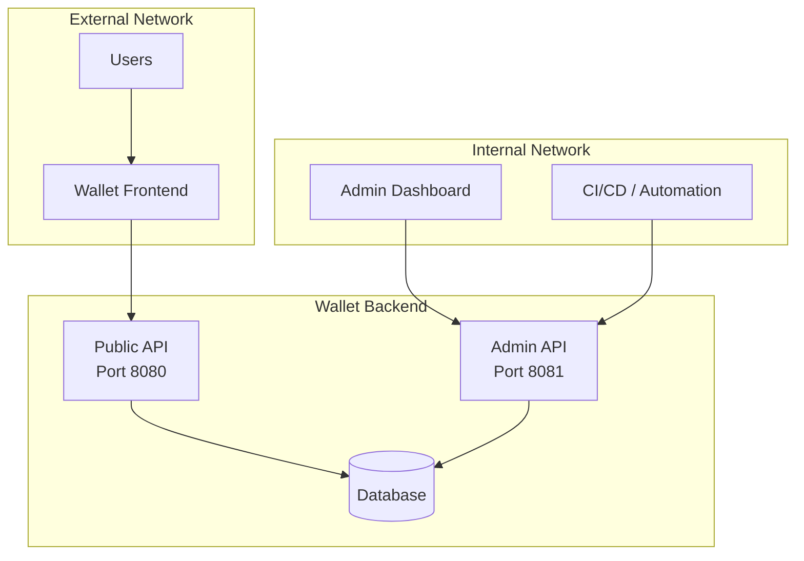

# Admin API

The Wallet Backend Admin API provides internal management capabilities for multi-tenant wallet infrastructure. This API allows you to:

- Manage tenants (create, update, delete)
- Manage user memberships within tenants
- Configure credential issuers per tenant
- Configure verifiers per tenant

## Overview

The admin API runs on a separate port (default: `8081`) from the main wallet API to ensure it's not accidentally exposed to the public internet.



## Base URL

```
http://localhost:8081/admin
```

In production, this should only be accessible from your internal network.

### Authentication

Every `/admin/*` endpoint except `GET /admin/status` requires a bearer token:

```
Authorization: Bearer <admin token>
```

Requests without it get `401` (`{"error": "Authorization header required"}`). Set the token with `server.admin_token` (`WALLET_SERVER_ADMIN_TOKEN`) or read it from a file with `server.admin_token_path` (`WALLET_SERVER_ADMIN_TOKEN_PATH`). In development an unset token is auto-generated at startup; in production the server refuses to start without one. The examples below omit the header for brevity, except the `curl` workflow at the end.

## Multi-Tenancy Model

The wallet backend supports multiple tenants, each with complete isolation of:

| Resource | Description |
|----------|-------------|
| **Users** | Each user belongs to one or more tenants with specific roles |
| **Credentials** | Stored credentials are scoped to tenants |
| **Issuers** | Credential issuers available to users in the tenant |
| **Verifiers** | Verifiers where users can present credentials |

### Tenant IDs

Tenant IDs must:
- Match `^[a-z0-9][a-z0-9_-]*$` (lowercase letters, digits, hyphens and underscores; start with a letter or digit)
- Be 1-63 characters long

Examples: `acme-corp`, `university-demo`, `test-tenant`

## API Reference

### OpenAPI Specification

The complete OpenAPI specification (version 1.1.0) is available at:
- [openapi-admin.yaml](https://github.com/sirosfoundation/go-wallet-backend/blob/main/docs/openapi-admin.yaml)

You can import this into tools like Swagger UI, Postman, or Insomnia for interactive exploration.

---

## Tenant Management

### List All Tenants

```bash
GET /admin/tenants
```

**Response:**
```json
{
  "tenants": [
    {
      "id": "default",
      "name": "Default Tenant",
      "display_name": "Default Wallet",
      "enabled": true,
      "created_at": "2025-01-15T10:00:00Z",
      "updated_at": "2025-01-15T10:00:00Z"
    }
  ]
}
```

### Create a Tenant

```bash
POST /admin/tenants
Content-Type: application/json

{
  "id": "acme-corp",
  "name": "ACME Corporation",
  "display_name": "ACME Digital Wallet",
  "enabled": true
}
```

### Get a Tenant

```bash
GET /admin/tenants/{tenantId}
```

### Update a Tenant

```bash
PUT /admin/tenants/{tenantId}
Content-Type: application/json

{
  "id": "acme-corp",
  "name": "ACME Corporation Updated",
  "display_name": "ACME Wallet",
  "enabled": true
}
```

### Delete a Tenant

```bash
DELETE /admin/tenants/{tenantId}
```

:::warning
Deleting a tenant removes all associated users, credentials, issuers, and verifiers. The default tenant cannot be deleted.
:::

---

## User Management

Users are associated with tenants through memberships. A user can belong to multiple tenants with different roles.

### List Tenant Users

```bash
GET /admin/tenants/{tenantId}/users
```

**Response:**
```json
{
  "users": [
    "550e8400-e29b-41d4-a716-446655440000",
    "6ba7b810-9dad-11d1-80b4-00c04fd430c8"
  ]
}
```

### Add User to Tenant

```bash
POST /admin/tenants/{tenantId}/users
Content-Type: application/json

{
  "user_id": "550e8400-e29b-41d4-a716-446655440000",
  "role": "user"
}
```

**Roles:**
- `user` - Standard user access (default)
- `admin` - Administrative access within the tenant

### Remove User from Tenant

```bash
DELETE /admin/tenants/{tenantId}/users/{userId}
```

---

## Issuer Management

Issuers define where users can request credentials from. The wallet frontend fetches issuer metadata to display available credentials to users.

### How Issuers Work

1. You register an issuer's URL in the admin API
2. The wallet frontend fetches metadata from `{issuer_url}/.well-known/openid-credential-issuer`
3. Users see available credentials from the issuer in their wallet
4. Users can initiate credential issuance flows

### List Issuers

```bash
GET /admin/tenants/{tenantId}/issuers
```

**Response:**
```json
{
  "issuers": [
    {
      "id": 1,
      "tenant_id": "acme-corp",
      "credential_issuer_identifier": "https://issuer.example.com",
      "client_id": "wallet-client",
      "visible": true
    }
  ]
}
```

### Create an Issuer

```bash
POST /admin/tenants/{tenantId}/issuers
Content-Type: application/json

{
  "credential_issuer_identifier": "https://issuer.example.com",
  "client_id": "wallet-client",
  "visible": true
}
```

| Field | Required | Description |
|-------|----------|-------------|
| `credential_issuer_identifier` | Yes | OpenID4VCI issuer URL |
| `client_id` | No | OAuth2 client ID for authentication |
| `visible` | No | Whether to show in wallet UI (default: true) |

### Update an Issuer

```bash
PUT /admin/tenants/{tenantId}/issuers/{issuerId}
Content-Type: application/json

{
  "credential_issuer_identifier": "https://issuer.example.com",
  "client_id": "new-client-id",
  "visible": true
}
```

### Delete an Issuer

```bash
DELETE /admin/tenants/{tenantId}/issuers/{issuerId}
```

---

## Verifier Management

Verifiers define where users can present their credentials. These are displayed in the wallet UI as presentation destinations.

### List Verifiers

```bash
GET /admin/tenants/{tenantId}/verifiers
```

**Response:**
```json
{
  "verifiers": [
    {
      "id": 1,
      "tenant_id": "acme-corp",
      "name": "University Portal",
      "url": "https://verifier.university.edu"
    }
  ]
}
```

### Create a Verifier

```bash
POST /admin/tenants/{tenantId}/verifiers
Content-Type: application/json

{
  "name": "University Portal",
  "url": "https://verifier.university.edu"
}
```

| Field | Required | Description |
|-------|----------|-------------|
| `name` | Yes | Human-readable verifier name |
| `url` | Yes | URL of the verifier service |

### Update a Verifier

```bash
PUT /admin/tenants/{tenantId}/verifiers/{verifierId}
Content-Type: application/json

{
  "name": "Updated Portal Name",
  "url": "https://new-verifier.example.com"
}
```

### Delete a Verifier

```bash
DELETE /admin/tenants/{tenantId}/verifiers/{verifierId}
```

---

## Example: Setting Up a New Tenant

Here's a complete example of setting up a new tenant with issuers and verifiers:

```bash
# 1. Create the tenant
curl -X POST -H "Authorization: Bearer $WALLET_SERVER_ADMIN_TOKEN" http://localhost:8081/admin/tenants \
  -H "Content-Type: application/json" \
  -d '{
    "id": "university-demo",
    "name": "University Demo",
    "display_name": "University Digital Wallet",
    "enabled": true
  }'

# 2. Add a credential issuer
curl -X POST -H "Authorization: Bearer $WALLET_SERVER_ADMIN_TOKEN" http://localhost:8081/admin/tenants/university-demo/issuers \
  -H "Content-Type: application/json" \
  -d '{
    "credential_issuer_identifier": "https://issuer.university.edu",
    "client_id": "wallet-client",
    "visible": true
  }'

# 3. Add a verifier
curl -X POST -H "Authorization: Bearer $WALLET_SERVER_ADMIN_TOKEN" http://localhost:8081/admin/tenants/university-demo/verifiers \
  -H "Content-Type: application/json" \
  -d '{
    "name": "Student Portal",
    "url": "https://portal.university.edu"
  }'

# 4. List the configuration
curl -H "Authorization: Bearer $WALLET_SERVER_ADMIN_TOKEN" http://localhost:8081/admin/tenants/university-demo/issuers
curl -H "Authorization: Bearer $WALLET_SERVER_ADMIN_TOKEN" http://localhost:8081/admin/tenants/university-demo/verifiers
```

---

## Security Considerations

:::danger Important
The admin API is protected by a single shared bearer token, not per-user credentials. It should **never** be exposed to the public internet. `GET /metrics` is served on the admin port without authentication, so keep that port network-isolated.
:::

**Recommended security measures:**

1. **Strong token**: Use a long random `admin_token` (or `admin_token_path`) and rotate it periodically
2. **Network isolation**: Run the admin API on an internal-only network
3. **Firewall rules**: Block external access to port 8081
4. **VPN/Bastion**: Access admin API through VPN or bastion hosts

### Configuration

| Setting / variable | Default | Description |
|--------------------|---------|-------------|
| `server.admin_port` / `WALLET_SERVER_ADMIN_PORT` | `8081` | Port for the admin API; `0` disables the admin server |
| `server.admin_token` / `WALLET_SERVER_ADMIN_TOKEN` | auto-generated (dev only) | Bearer token required by `/admin/*` |
| `server.admin_token_path` / `WALLET_SERVER_ADMIN_TOKEN_PATH` | – | File containing the bearer token |

:::caution Admin bind address
The admin server currently binds to `server.host` (default `0.0.0.0`) on the admin port. `server.admin_host` / `WALLET_SERVER_ADMIN_HOST` is parsed but has no effect, so it cannot be used to restrict the admin API to `127.0.0.1` (known issue: [go-wallet-backend#444](https://github.com/sirosfoundation/go-wallet-backend/issues/444)). Restrict access with a firewall or network policy instead (setting `server.host` would also move the public API).
:::

---

## Additional Endpoints

The router also serves, under `/admin/tenants/{tenantId}`: `GET issuers/{issuerId}` and `GET verifiers/{verifierId}`; invites (`/invites`, `/invites/{inviteId}`: list, create, get, update, delete); wallet instances (`/instances`, `/instances/{instanceId}`, `PUT /instances/{instanceId}/status`, `DELETE /instances/{instanceId}`, and `/users/{userId}/instances`); plus `GET /admin/status` (unauthenticated health). See the OpenAPI specification for request and response schemas. The `wallet-admin` command-line tool in the same repository wraps these endpoints.

---

## Error Responses

All endpoints return consistent error responses:

```json
{
  "error": "Error message describing what went wrong"
}
```

**Common HTTP Status Codes:**

| Code | Description |
|------|-------------|
| `200` | Success |
| `201` | Resource created |
| `400` | Bad request (invalid input) |
| `401` | Missing or invalid admin bearer token |
| `403` | Forbidden (e.g., cannot delete default tenant) |
| `404` | Resource not found |
| `409` | Conflict (e.g., duplicate tenant ID) |
| `500` | Internal server error |
