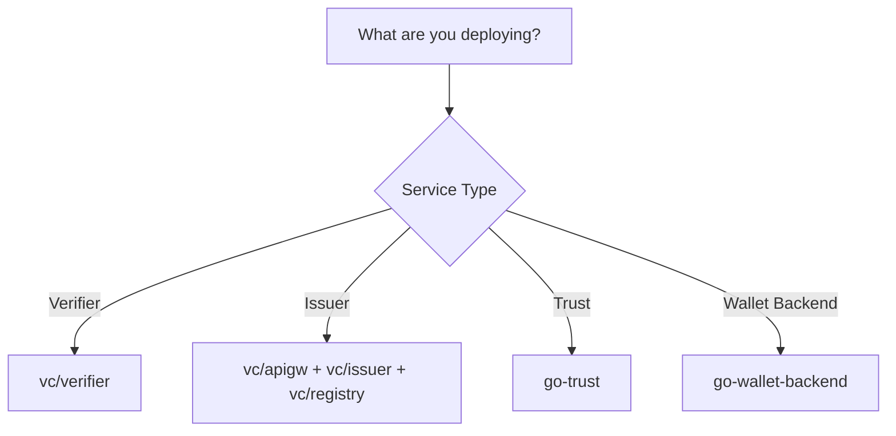

# Docker Images

This page documents all Docker container images provided by the SIROS Foundation for the SIROS ID platform.

## Container Registry

All images are published to the GitHub Container Registry (GHCR):

```
ghcr.io/sirosfoundation/<image-name>
```

## VC Platform Images

The Verifiable Credentials (VC) platform provides multiple services.

### Available Services

| Service | Image |
|---------|-------|
| **Verifier** | `ghcr.io/sirosfoundation/vc/verifier` |
| **Issuer** (credential signing, gRPC) | `ghcr.io/sirosfoundation/vc/issuer` |
| **API Gateway** (public OpenID4VCI/OAuth endpoints, user authentication) | `ghcr.io/sirosfoundation/vc/apigw` |
| **Registry** (Token Status Lists) | `ghcr.io/sirosfoundation/vc/registry` |

All images include SAML 2.0 SP, OIDC RP, and all credential format support.

A credential issuer deployment needs the `issuer`, `apigw` and `registry` images together (plus MongoDB); the issuer image alone does not serve the wallet-facing endpoints. See [Issuer Deployment](/sirosid/issuers/deployment).

### Version Tags

Images are tagged with multiple version identifiers:

| Tag Pattern | Description | Example |
|-------------|-------------|---------|
| `{major}.{minor}.{patch}` | Semantic version release | `vc/verifier:0.7.0` |
| `{major}.{minor}`, `{major}` | Moving tags for the latest patch release | `vc/verifier:0.7` |
| `latest` | Latest tagged release (not the head of `main`) | `vc/verifier:latest` |
| `<git-sha>` | A specific commit | `vc/verifier:3f2c1a9...` |

SIROS-built images are additionally published with a `-sirosid.N` suffix (for example `0.7.20-sirosid.4`) and `dev-<sha>` tags; some per-architecture builds carry an `-amd64` or `-arm64` suffix. The [Container Image Catalog](/opensource/container-images) lists the tags currently published. Not every release is published as an image: as last checked on GHCR, `vc/verifier` has `0.7.0`, `0.7.5-sirosid.0` and `0.7.20-sirosid.0` to `.4` (`-amd64` only), and `latest` points at `0.7.5-sirosid.0`.

**Recommended for production:** Pin an exact version tag (e.g., `0.7.5-sirosid.0`, or `0.7.20-sirosid.4-amd64` for amd64 hosts) for reproducible deployments; do not track `latest`.

## Trust Service Images

### go-trust

AuthZEN-compliant trust evaluation service.

| Image | Description |
|-------|-------------|
| `ghcr.io/sirosfoundation/go-trust` | Trust evaluation service |

**Tags:** Same tagging scheme as VC images (`latest`, `{major}.{minor}.{patch}`)

```bash
docker pull ghcr.io/sirosfoundation/go-trust:latest
```

## Wallet Backend Images

### go-wallet-backend

Backend service for the SIROS ID wallet application.

| Image | Description |
|-------|-------------|
| `ghcr.io/sirosfoundation/go-wallet-backend` | Wallet backend service |
| `ghcr.io/sirosfoundation/go-wallet-registry` | Credential type registry role of the wallet backend binary |
| `ghcr.io/sirosfoundation/go-wallet-admin` | `wallet-admin` administration tool for the wallet backend |
| `ghcr.io/sirosfoundation/wallet-frontend` | SIROS ID wallet web frontend |

**Tags:** Same tagging scheme as VC images (`latest`, `{major}.{minor}.{patch}`)

```bash
docker pull ghcr.io/sirosfoundation/go-wallet-backend:latest
```

## Registry Tooling Images

| Image | Description |
|-------|-------------|
| `ghcr.io/sirosfoundation/registry-cli` | [registry-cli](/sirosid/registry/registry-cli): builds and serves a credential type registry |

## Other Images

Further images (for example `go-spocp`, `goff`, `go-invite-op`, `go-grc`, `go-r2ps-service`, `facetec-api`) are listed in the [Container Image Catalog](/opensource/container-images).

## Testing & Development Images

### mini-oidc

Minimal OIDC Provider (OP) and Relying Party (RP) for testing OpenID Connect
flows. Used by `sirosid-dev` and other e2e test suites to exercise OIDC
integrations without standing up a full identity provider.

| Image | Description |
|-------|-------------|
| `ghcr.io/sirosfoundation/mini-oidc` | Bundles the `op` and `rp` binaries; select which to run via the container `command` |

**Tags:** Same tagging scheme as VC images (`latest`, `{major}.{minor}.{patch}`)

```bash
docker pull ghcr.io/sirosfoundation/mini-oidc:latest
```

```yaml
services:
  mini-oidc-op:
    image: ghcr.io/sirosfoundation/mini-oidc:latest
    command: ["/usr/local/bin/op"]
    ports:
      - "9005:9005"

  mini-oidc-rp:
    image: ghcr.io/sirosfoundation/mini-oidc:latest
    command: ["/usr/local/bin/rp"]
    ports:
      - "9006:9006"
```

:::info Not a production identity provider
mini-oidc exists for local development and automated testing only. It is not
intended for production credential issuance or verification.
:::

## Pulling Images

### Authentication

Public read access is available for all images. For pulling rate-limited scenarios, authenticate with a GitHub token:

```bash
# Login to GHCR
echo $GITHUB_TOKEN | docker login ghcr.io -u USERNAME --password-stdin
```

### Pull Examples

```bash
# Standard verifier (latest)
docker pull ghcr.io/sirosfoundation/vc/verifier:latest

# Issuer stack
docker pull ghcr.io/sirosfoundation/vc/issuer:latest
docker pull ghcr.io/sirosfoundation/vc/apigw:latest
docker pull ghcr.io/sirosfoundation/vc/registry:latest

# Trust service
docker pull ghcr.io/sirosfoundation/go-trust:latest

# Wallet backend
docker pull ghcr.io/sirosfoundation/go-wallet-backend:latest

# mini-oidc test OP/RP
docker pull ghcr.io/sirosfoundation/mini-oidc:latest
```

## Platforms

All images are built for multiple architectures:

| Architecture | Platform |
|--------------|----------|
| `linux/amd64` | x86_64 (Intel/AMD) |
| `linux/arm64` | ARM64 (Apple Silicon, AWS Graviton, etc.) |

Docker automatically selects the correct platform for your system.

## Choosing the Right Image

### Decision Tree



### Common Deployment Scenarios

All features (SAML, OIDC, SD-JWT VC, VC 2.0) are included in every image.

| Scenario | Verifier Image | Issuer Images |
|----------|---------------|--------------|
| Basic OID4VC deployment | `vc/verifier` | `vc/apigw`, `vc/issuer`, `vc/registry` |
| Academic federation (eduGAIN/SAML) | `vc/verifier` | `vc/apigw`, `vc/issuer`, `vc/registry` |
| Government identity (SAML) | `vc/verifier` | `vc/apigw`, `vc/issuer`, `vc/registry` |
| Enterprise OIDC | `vc/verifier` | `vc/apigw`, `vc/issuer`, `vc/registry` |

## Example Docker Compose

### Issuer Stack

A complete issuer deployment (apigw, issuer, registry, go-trust and MongoDB) with its `config.yaml` is described in [Issuer Deployment](/sirosid/issuers/deployment#docker-composeyaml). For SAML, mount the SP key material and IdP metadata into the `apigw` service.

### Verifier

```yaml
services:
  verifier:
    image: ghcr.io/sirosfoundation/vc/verifier:latest
    restart: always
    ports:
      - "8080:8080"
    volumes:
      - ./config.yaml:/config.yaml:ro
    environment:
      - VC_CONFIG_YAML=config.yaml
    depends_on:
      - trust
      - mongo

  trust:
    image: ghcr.io/sirosfoundation/go-trust:latest
    restart: always
    ports:
      - "8082:6001"
    volumes:
      - ./trust-config.yaml:/config.yaml:ro
    # go-trust binds 127.0.0.1 by default; listen on all interfaces so the
    # verifier can reach it on the compose network.
    command: ["--host", "0.0.0.0", "--config", "/config.yaml"]

  mongo:
    image: mongo:7
    restart: always
    volumes:
      - mongo-data:/data/db

volumes:
  mongo-data:
```

:::warning A PDP is required for production
The trust service is a PDP (AuthZEN). A PDP referenced through `trust.pdp_url` is required for production use of the vc services. Running without one is not supported (development and testing only): local `did:key`/`did:jwk` resolution and "allow all" trust may work, with no guarantees and no support.
:::

## Source Code & CI/CD

| Component | Repository | Workflow |
|-----------|------------|----------|
| VC Services | [sirosfoundation/vc](https://github.com/sirosfoundation/vc) | `docker-build-push.yml` |
| go-trust | [sirosfoundation/go-trust](https://github.com/sirosfoundation/go-trust) | `docker-publish.yml` |
| go-wallet-backend | [sirosfoundation/go-wallet-backend](https://github.com/sirosfoundation/go-wallet-backend) | `docker-publish.yml` |
| mini-oidc | [sirosfoundation/mini-oidc](https://github.com/sirosfoundation/mini-oidc) | `docker-publish.yml` |

## Next Steps

- [Verifier Configuration](/sirosid/verifiers/verifier)
- [Issuer Configuration](/sirosid/issuers/issuer)
- [Trust Services](/sirosid/trust/)
