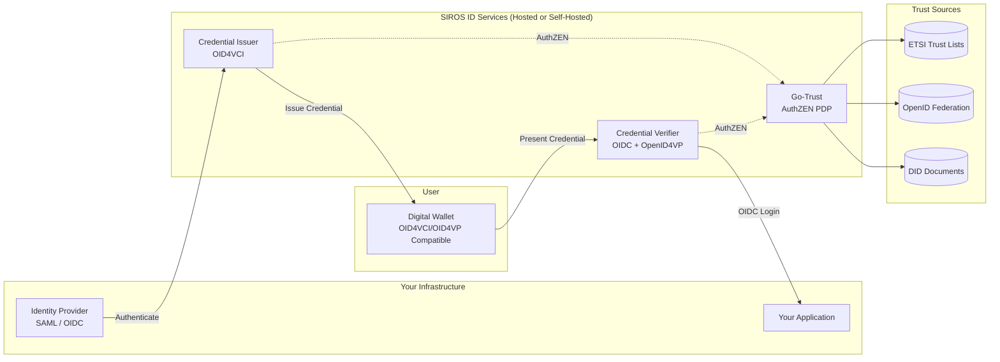

# Overview

The SIROS ID platform is an open-source, multi-tenant digital credentials platform built around the [OpenID4VC](https://openid.net/specs/openid-4-verifiable-credential-issuance-1_0.html) ecosystem. It enables organizations to issue, manage, and verify digital credentials following EU Digital Identity Wallet (EUDIW) standards.

## Wallet Interoperability

The SIROS ID Issuer and Verifier are designed to work with **any standards-compliant digital wallet**, not just the SIROS ID Credential Manager. As long as a wallet implements the required OpenID4VC protocols (OID4VCI for issuance, OID4VP for verification), it can interact with SIROS ID services.

This includes:
- **SIROS ID Credential Manager** (based on [wwWallet](/opensource#wwwallet-project)) – the reference wallet used throughout this documentation
- **EUDI Reference Wallet** – the EU Digital Identity reference implementation
- **Third-party wallets** – any wallet implementing OID4VCI/OID4VP and supported credential formats
- **Native mobile wallets** – iOS and Android applications with protocol support

:::tip Interoperability
When integrating with SIROS ID, you can support multiple wallets simultaneously. Users choose their preferred wallet, and the protocols ensure consistent behavior across implementations.
:::

## Architecture

**How it works:**

1. **Issuance**: Your identity provider authenticates users, and the issuer creates digital credentials stored in the user's wallet of choice. Any OID4VCI-compatible wallet can receive credentials.

2. **Verification**: When users access your application, they present credentials from their wallet. The verifier validates them and returns standard OIDC tokens to your app. Any OID4VP-compatible wallet can participate.

3. **Trust**: Go-Trust provides unified trust evaluation via AuthZEN, querying ETSI Trust Lists, OpenID Federation, and DID documents.

## Core Components

| Component | Description | Learn More |
|-----------|-------------|------------|
| **Issuer** | Creates and signs digital credentials using OID4VCI protocol. Works with any compatible wallet. | [Issuer Integration](./issuers/concepts) |
| **Credential Manager** | Digital wallet based on wwWallet with significant SIROS enhancements. The SIROS ID Credential Manager is one example of a compatible wallet. | [Credential Manager](./reference/cm) |
| **Verifier** | Validates credentials and provides OIDC/OID4VP interfaces. Accepts presentations from any compatible wallet. | [Verifier Integration](./verifiers/concepts) |
| **Trust Framework** | OpenID Federation and ETSI TSL support for trust validation | [Trust Architecture](./trust/) |
| **Credential Type Registry** | Aggregated credential type metadata | [registry.siros.org](./reference/vctm-registry) |

## Supported Standards

For a comprehensive list of implemented standards and specifications, see the [Standards & Specifications](./reference/standards) page.

### Protocol Summary

| Standard | Description | Use Case |
|----------|-------------|----------|
| **OID4VCI** | OpenID for Verifiable Credential Issuance | Credential issuance flows |
| **OID4VP** | OpenID for Verifiable Presentations | Credential verification |
| **SD-JWT VC** | Selective Disclosure JWT Verifiable Credentials | EUDIW credential format |
| **ISO 18013-5** | Mobile driving license standard (mDL/mDoc) | Mobile documents |
| **Digital Credentials API** | W3C Digital Credentials API | Browser-native flows |
| **Token Status Lists** | Credential revocation mechanism | Status checking |

## Credential Formats

| Format | Selective Disclosure | Status | Primary Use |
|--------|---------------------|--------|-------------|
| **SD-JWT VC** | ✅ Yes | Recommended | EU Digital Identity |
| **mDL/mDoc** | ✅ Yes | Supported | Mobile documents |
| **JWT VC** | ❌ No | Legacy | Compatibility |

## Deployment Options

| Option | Description | Best For |
|--------|-------------|----------|
| **Hosted** | Use SIROS ID cloud services | Quick start, SaaS model |
| **Self-Hosted** | Deploy in your infrastructure | Data sovereignty, on-premise |
| **Hybrid** | Mix hosted and self-hosted | Flexible requirements |

## Getting Started

**[Quick Start Guide](./quickstart)** – Get up and running in under 15 minutes

### Integration Guides

| Area | Guide | Description |
|------|-------|-------------|
| **Issuance** | [Issuing Credentials](./issuers/issuer) | Core guide for credential issuance |
| | [SAML IdP](./issuers/saml-idp) | Connect SAML identity providers |
| | [OpenID Connect Provider](./issuers/oidc-op) | Connect OIDC providers |
| **Verification** | [Verifying Credentials](./verifiers/verifier) | Core guide for credential verification |
| | [OpenID Connect RP](./verifiers/oidc-rp) | Integrate with OIDC applications |
| **Trust** | [Trust Services](./trust/) | Configure trust frameworks |

## Demo Environment

A SIROS ID demo environment is available for testing:

| Service | URL |
|---------|-----|
| Wallet | [id.siros.org](https://id.siros.org) |
| Demo Verifier | `https://main.demo.verifier.id.siros.org` |
| Demo Issuer | `https://main.demo.issuer.id.siros.org` |

:::info Hosted Service URL Pattern
SIROS ID hosted services use subdomain-based multi-tenancy:
- **Wallet**: `https://id.siros.org/<tenant>`
- **Verifiers**: `https://<instance>.<tenant>.verifier.id.siros.org`
- **Issuers**: `https://<instance>.<tenant>.issuer.id.siros.org`
:::

## Source Code

- **Issuer/Verifier**: [github.com/SUNET/vc](https://github.com/SUNET/vc)
- **Wallet**: [github.com/wwWallet](https://github.com/wwWallet)
- **Trust Services**: [github.com/sirosfoundation/go-trust](https://github.com/sirosfoundation/go-trust)

## Support

- 📧 **Email**: support@siros.org
-  **GitHub Issues**: For technical issues and feature requests
