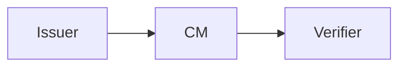

# Overview

The SIROS ID platform is a multi-tenant digital credentials platform. This is an overview of the architecture:

Issuer create an issue digital credentials to a credential manager (aka digital identity wallet) that present credentials to a verifier. The SIROS ID platform is built around the opensource wwWallet credential manager that supports most current credential formats such as mdoc/mDL and SD-JWTs.

The SIROS ID credential manager suports most modern protocols such as OpenID4VP, OpenID4VC and ISO 18013-5. SIROS ID has hosted options for issuers and verifiers that makes it easy to connect to existing business systems including most IAM platforms such as Okta, Google, Microsoft Entra and KeyCloak. Anything that can speak SAML or OpenID can be turned into a credential issuer and any IAM system that speaks OpenID can be turned into a verifier for digital identity credentials.

**SIROS ID makes it super-easy to get started building services on digital identity credentials.**
