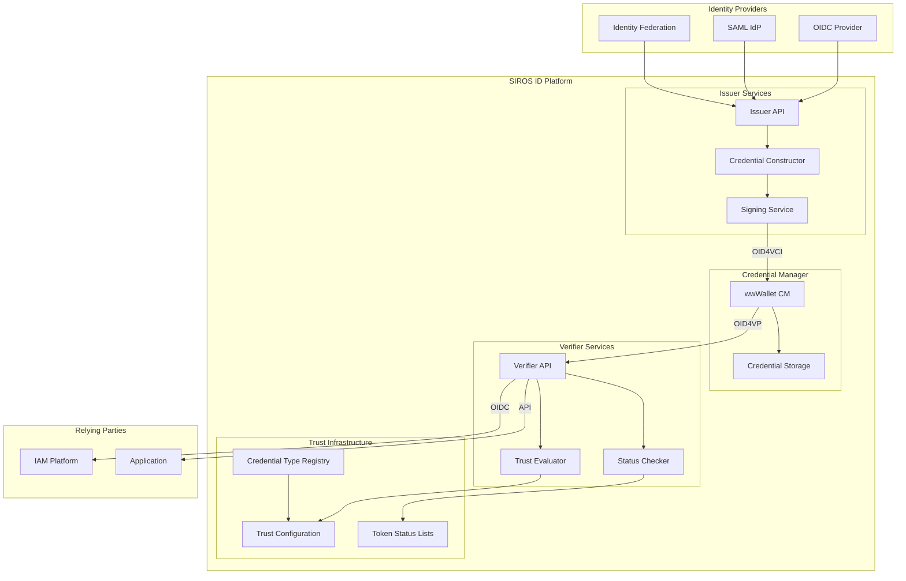

# Overview

The SIROS ID platform is an open-source, multi-tenant digital credentials platform built around the [OpenID4VC](https://openid.net/specs/openid-4-verifiable-credential-issuance-1_0.html) ecosystem. It enables organizations to issue, manage, and verify digital credentials following EU Digital Identity Wallet (EUDIW) standards.

## Architecture

## Core Components

| Component | Description | Learn More |
|-----------|-------------|------------|
| **Issuer** | Creates and signs digital credentials using OID4VCI protocol | [Issuer Integration](../integrations/issuers/concepts) |
| **Credential Manager** | wwWallet-based wallet for storing and presenting credentials | [Credential Manager](../cm) |
| **Verifier** | Validates credentials and provides OIDC/OID4VP interfaces | [Verifier Integration](../integrations/verifiers/concepts) |
| **Trust Framework** | OpenID Federation and ETSI TSL support for trust validation | [Trust Architecture](../integrations/trust/) |
| **Credential Type Registry** | Aggregated credential type metadata | [registry.siros.org](../vctm-registry) |

## Supported Standards

| Standard | Description | Use Case |
|----------|-------------|----------|
| **OID4VCI** | OpenID for Verifiable Credential Issuance | Credential issuance flows |
| **OID4VP** | OpenID for Verifiable Presentations | Credential verification |
| **SD-JWT VC** | Selective Disclosure JWT Verifiable Credentials | EUDIW credential format |
| **ISO 18013-5** | Mobile driving license standard (mDL/mDoc) | Mobile documents |
| **Digital Credentials API** | W3C Digital Credentials API | Browser-native flows |
| **Token Status Lists** | Credential revocation mechanism | Status checking |

## Credential Formats

SIROS ID supports multiple credential formats for different use cases:

| Format | Selective Disclosure | Status | Primary Use |
|--------|---------------------|--------|-------------|
| **SD-JWT VC** | ✅ Yes | Recommended | EU Digital Identity |
| **mDL/mDoc** | ✅ Yes | Supported | Mobile documents |
| **JWT VC** | ❌ No | Legacy | Compatibility |

## Integration Patterns

### Issuers

Connect your identity provider to issue credentials:

- **SAML Integration**: Use existing SAML federations ([SWAMID](https://swamid.se), eduGAIN)
- **OIDC Integration**: Connect any OpenID Connect provider
- **API Integration**: Issue credentials programmatically via REST API

### Verifiers

Add credential verification to your applications:

- **OIDC IdP Mode**: Add as identity provider in Keycloak, Okta, Entra ID
- **Direct OIDC**: Use as standard OIDC authorization server
- **OID4VP API**: Direct API integration for custom applications

## Deployment Options

| Option | Best For | Components |
|--------|----------|------------|
| **SIROS Hosted** | Quick start, SaaS model | Managed issuer, verifier, wallet |
| **Self-Hosted** | Data sovereignty, customization | Docker images or binaries |
| **Hybrid** | Mix of hosted and on-premise | Flexible deployment |

## Getting Started

1. **Try the demo**: Use the hosted service at [id.siros.org](https://id.siros.org)
2. **Issue a credential**: Connect your IdP and issue your first credential
3. **Verify a credential**: Add SIROS ID verifier to your IAM
4. **Deploy your own**: Use our [Docker images](../docker-images) for self-hosting

**SIROS ID makes it super-easy to get started building services on digital identity credentials.**
