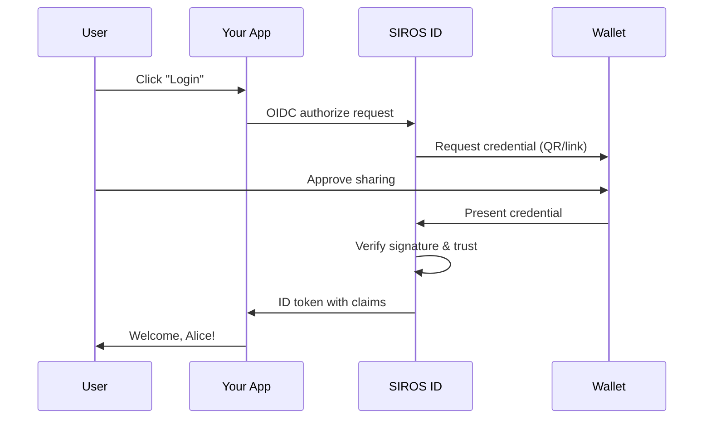

# Quick Start Guide

Get started with SIROS ID in minutes. This guide walks you through connecting your first application to verify digital credentials.

## What You'll Build

By the end of this guide, you'll have:

1. ✅ A working credential verification flow
2. ✅ Users logging in with their digital credentials
3. ✅ Verified identity claims in your application

## Prerequisites

- An application with OIDC/OAuth2 login support
- Access to your IAM configuration (e.g., Keycloak, Auth0)
- A test wallet (we'll set this up)

## Step 1: Get a Test Wallet (2 minutes)

You can use any OID4VCI/OID4VP-compatible wallet for testing. The simplest option is the SIROS ID Credential Manager:

1. Open [id.siros.org](https://id.siros.org) in your browser
2. Create a new wallet using a passkey
3. Navigate to **Add Credential** → **Demo PID**
4. Accept the test Person Identification credential

You now have a wallet with a test credential.

:::tip Alternative Wallets
The SIROS ID Verifier works with any OID4VP-compatible wallet. If you have an EUDI Reference Wallet or another compatible wallet, you can use that instead. The verification flow is identical.
:::

## Step 2: Register Your Application (5 minutes)

Register your application with a SIROS ID verifier:

```bash
# For self-hosted verifier:
curl -X POST https://verifier.example.org/register \
  -H "Content-Type: application/json" \
  -d '{
    "client_name": "My Test App",
    "redirect_uris": ["https://localhost:8080/callback"],
    "token_endpoint_auth_method": "client_secret_post",
    "grant_types": ["authorization_code"],
    "response_types": ["code"],
    "scope": "openid pid"
  }'
```

The `scope` string lists every scope this client may request later (the default
is `openid` only). The scopes must exist on the verifier; `pid` is used here as
an example, see [Requesting Specific Claims](#requesting-specific-claims).

Save the returned `client_id` and `client_secret`.

:::info SIROS Hosted Service
When using the **SIROS ID hosted service**, services use subdomain-based multi-tenancy:

- **Wallet**: `https://id.siros.org/id/<tenant>`
- **Verifiers**: `https://<tenant>.verifier.id.siros.org`
- **Issuers**: `https://<tenant>.issuer.id.siros.org`

For example, with tenant `demo` and verifier instance `main`:
```bash
curl -X POST https://main.demo.verifier.id.siros.org/register \
  -H "Content-Type: application/json" \
  -d '{ ... }'
```
:::

## Step 3: Configure Your IAM (5 minutes)

Add SIROS ID verifier as an identity provider:

### Keycloak

1. Go to **Identity Providers** → **Add provider** → **OpenID Connect v1.0**
2. Configure:
   - **Alias**: `sirosid`
   - **Display Name**: `SIROS ID`
   - **Discovery URL**: `https://verifier.example.org/.well-known/openid-configuration`
   - **Client ID**: *(from step 2)*
   - **Client Secret**: *(from step 2)*
   - **Client Authentication**: `Client secret sent as post`
   - **Use PKCE**: ON, method `S256` (required for registered clients)
   - **Default Scopes**: `openid pid`
3. Save

### Auth0

1. Go to **Authentication** → **Enterprise** → **OpenID Connect**
2. Create a new connection with:
   - **Issuer URL**: `https://verifier.example.org`
   - **Client ID**: *(from step 2)*
   - **Client Secret**: *(from step 2)*
   - Send the client credentials in the request body (not as HTTP Basic), and enable PKCE

### Direct Integration

If not using an IAM, redirect users directly:

```javascript
// codeChallenge: base64url(SHA-256(codeVerifier)); keep the verifier for the token request
// Replace with your verifier URL
const authUrl = 'https://verifier.example.org/authorize?' + 
  new URLSearchParams({
    response_type: 'code',
    client_id: 'your-client-id',
    redirect_uri: 'https://localhost:8080/callback',
    scope: 'openid pid',
    state: crypto.randomUUID(),
    // PKCE is required for clients registered through /register
    code_challenge: codeChallenge,
    code_challenge_method: 'S256'
  });

window.location = authUrl;
```

## Step 4: Test the Flow (2 minutes)

1. **Start login**: Click "Login with SIROS ID" in your app
2. **Scan QR code**: Use your test wallet to scan the QR code
3. **Approve sharing**: Review and approve the credential request
4. **Complete**: You're logged in with verified claims!

## What Just Happened?



:::caution Not enforced on the OIDC `/authorize` path
The "Verify signature & trust" step above is intended behaviour. Currently, a presentation that answers an OIDC `/authorize` session (QR code or same-device link) is posted to `/verification/oidc-direct_post`, which does not verify the SD-JWT VC or mdoc signature and does not ask the PDP about the issuer. The checks run on `/verification/direct_post`, used by the verifier's own page at `/`.

Known issue: https://github.com/SUNET/vc/issues/761
:::

Your application received verified identity claims directly from the user's credential:

```json
{
  "sub": "unique-user-id",
  "given_name": "Alice",
  "family_name": "Smith",
  "birthdate": "1990-01-15"
}
```

## Requesting Specific Claims

Use scopes to request different credentials. There is no fixed scope list:
the scopes are the credential types the verifier operator configured
(`scopes_supported` in the discovery document lists them), and each must also be
in the `scope` you registered in step 2. For example, a verifier configured with
`pid` and `ehic` supports:

```
scope=openid pid ehic
```

## Going to Production

1. **Register for production**: Contact SIROS ID to get production credentials or deploy your own infrastructure
2. **Configure trust**: Run an AuthZEN PDP such as [go-trust](/sirosid/trust/go-trust) and set `verifier.trust.pdp_url`. A PDP is required for production; a verifier without one trusts every issuer and is for development and testing only
3. **Update URLs**: Point to your production verifier endpoint

## Next Steps

- 📖 [Full Verifier Guide](/sirosid/verifiers/verifier) – Complete verification documentation
- 🤝 [Verifier Quick Start: Trust an Issuer](/howto/verifier-quickstart) – Get a verifier accepting one issuer's credentials
- 🎫 [Issuing Credentials](/sirosid/issuers/issuer) – Issue your own credentials
- 🔐 [Trust Services](/sirosid/trust/) – Configure trust framework
- 🔧 [Keycloak Integration](/sirosid/verifiers/keycloak_verifier) – Detailed Keycloak setup

## Common Issues

### QR Code Not Scanning

- Ensure the wallet has camera permissions
- Try the deep link option for mobile browsers

### Claims Not Appearing

- Check that requested scopes were registered for your client and exist on the verifier
- Verify the credential type in your wallet matches the request

### Token Validation Fails

- Ensure your clock is synchronized (NTP)
- Check the JWKS endpoint is accessible

## Get Help

- 📧 Email: support@siros.org
-  GitHub: [sirosfoundation](https://github.com/sirosfoundation)
