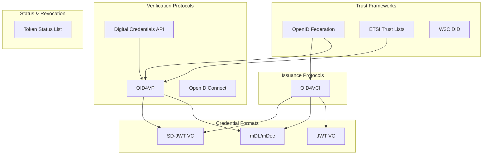

# Standards & Specifications

This page provides a comprehensive reference of the standards and specifications implemented by the SIROS ID platform. Understanding these standards helps with interoperability testing and integration planning.

## Overview

The SIROS ID platform implements a modern digital credentials stack based on OpenID and W3C standards. These standards enable interoperability between different wallet implementations, issuers, and verifiers across the ecosystem.



---

## Issuance Standards

Standards and specifications implemented by the SIROS ID **Issuer** for credential creation and delivery.

### OID4VCI (OpenID for Verifiable Credential Issuance)

| Attribute | Value |
|-----------|-------|
| **Specification** | [OpenID for Verifiable Credential Issuance 1.0](https://openid.net/specs/openid-4-verifiable-credential-issuance-1_0.html) |
| **Status** | Draft (ID1) |
| **Component** | Issuer |

The core protocol for issuing credentials to wallets. SIROS ID implements:

- **Authorization Code Flow** – User authenticates via IdP, then receives credential
- **Pre-Authorized Code Flow** – Server-to-server issuance without user redirect
- **Credential Offer** – Deep links and QR codes for initiating issuance
- **Batch Issuance** – Multiple credentials in a single flow
- **Deferred Issuance** – Credentials delivered asynchronously

**Endpoints:**
- `/.well-known/openid-credential-issuer` – Issuer metadata
- `/credential-offer` – Initiate credential offer
- `/token` – OAuth2 token endpoint
- `/credential` – Credential endpoint
- `/batch-credential` – Batch credential endpoint
- `/deferred-credential` – Deferred credential endpoint

### SD-JWT VC (Selective Disclosure JWT Verifiable Credentials)

| Attribute | Value |
|-----------|-------|
| **Specification** | [draft-ietf-oauth-sd-jwt-vc](https://datatracker.ietf.org/doc/draft-ietf-oauth-sd-jwt-vc/) |
| **Status** | IETF Draft |
| **Component** | Issuer, Verifier |

The recommended credential format for EU Digital Identity (EUDIW). Features:

- **Selective Disclosure** – Users reveal only required claims
- **Holder Binding** – Cryptographic proof of credential possession
- **Compact Format** – Efficient for mobile and QR code transmission
- **JSON-based Claims** – Standard claim structures

### ISO 18013-5 (mDL/mDoc)

| Attribute | Value |
|-----------|-------|
| **Specification** | [ISO/IEC 18013-5:2021](https://www.iso.org/standard/69084.html) |
| **Status** | Published Standard |
| **Component** | Issuer, Verifier |

Mobile driving license format, used for government-issued documents:

- **CBOR Encoding** – Binary format for efficient transmission
- **COSE Signatures** – CBOR Object Signing and Encryption
- **Selective Disclosure** – Hardware-backed claim selection
- **Proximity Presentation** – NFC and Bluetooth LE support

### VCTM (Verifiable Credential Type Metadata)

| Attribute | Value |
|-----------|-------|
| **Specification** | [draft-ietf-oauth-sd-jwt-vc](https://datatracker.ietf.org/doc/draft-ietf-oauth-sd-jwt-vc/) (Section on Credential Type Metadata) |
| **Status** | IETF Draft |
| **Component** | Issuer, Verifier, Registry |

Defines credential type schemas, display information, and claim specifications:

- **Credential Type Identifier (VCT)** – Unique type URN/URL
- **Claim Definitions** – Schema for credential content
- **Display Metadata** – Localized names, logos, templates
- **Rendering Templates** – SVG templates for visual display

---

## Verification Standards

Standards and specifications implemented by the SIROS ID **Verifier** for credential validation and presentation.

### OID4VP (OpenID for Verifiable Presentations)

| Attribute | Value |
|-----------|-------|
| **Specification** | [OpenID for Verifiable Presentations 1.0](https://openid.net/specs/openid-4-verifiable-presentations-1_0.html) |
| **Status** | Draft (ID2) |
| **Component** | Verifier |

Protocol for requesting and receiving credential presentations from wallets:

- **Same-Device Flow** – Wallet on same device as browser
- **Cross-Device Flow** – QR code scanned by mobile wallet
- **Direct Post Response** – Wallet posts directly to verifier
- **DCQL Queries** – Fine-grained credential and claim requests

**Endpoints:**
- `/authorize` – Authorization endpoint (OIDC-style)
- `/direct_post` – Direct post response endpoint
- `/request_uri` – Request object endpoint

### DCQL (Digital Credentials Query Language)

| Attribute | Value |
|-----------|-------|
| **Specification** | [OID4VP DCQL](https://openid.net/specs/openid-4-verifiable-presentations-1_0.html#name-digital-credentials-query-l) |
| **Status** | Draft |
| **Component** | Verifier |

Query language for specifying credential requirements:

```yaml
credentials:
  - id: pid_credential
    format: vc+sd-jwt
    meta:
      vct_values:
        - urn:eudi:pid:arf-1.8:1
    claims:
      - path: ["given_name"]
      - path: ["family_name"]
```

### OpenID Connect 1.0

| Attribute | Value |
|-----------|-------|
| **Specification** | [OpenID Connect Core 1.0](https://openid.net/specs/openid-connect-core-1_0.html) |
| **Status** | Final |
| **Component** | Verifier |

The verifier acts as an OpenID Connect Provider, enabling integration with existing IAM systems:

- **Authorization Code Flow** – Standard OIDC authentication
- **PKCE** – Proof Key for Code Exchange
- **Dynamic Client Registration** – RFC 7591 client registration
- **Discovery** – `.well-known/openid-configuration` endpoint

**Verified claims from credentials are mapped to standard OIDC ID tokens.**

### W3C Digital Credentials API

| Attribute | Value |
|-----------|-------|
| **Specification** | [Digital Credentials API](https://wicg.github.io/digital-credentials/) |
| **Status** | W3C Draft |
| **Component** | Verifier |

Browser-native API for credential presentation:

- **`navigator.credentials.get()`** – Request credentials from browser
- **Same-Device UX** – Native browser credential selector
- **Platform Integration** – OS-level wallet integration (Android, Chrome)

### Token Status List

| Attribute | Value |
|-----------|-------|
| **Specification** | [draft-ietf-oauth-status-list](https://datatracker.ietf.org/doc/draft-ietf-oauth-status-list/) |
| **Status** | IETF Draft |
| **Component** | Issuer, Verifier |

Efficient credential revocation mechanism:

- **Bit Array Status** – Compact revocation representation
- **JWT-Wrapped Lists** – Signed status information
- **Cacheable** – Efficient for high-volume verification

---

## Trust Framework Standards

Standards for establishing and verifying trust between parties.

### OpenID Federation 1.0

| Attribute | Value |
|-----------|-------|
| **Specification** | [OpenID Federation 1.0](https://openid.net/specs/openid-federation-1_0.html) |
| **Status** | Draft |
| **Component** | All (go-trust) |

Decentralized trust infrastructure for OpenID ecosystems:

- **Entity Statements** – Self-signed metadata about entities
- **Trust Chains** – Hierarchical trust from Trust Anchors
- **Trust Marks** – Attestations of compliance/certification
- **Automatic Trust Resolution** – Dynamic trust establishment

### ETSI TS 119 612 (Trust Service Lists)

| Attribute | Value |
|-----------|-------|
| **Specification** | [ETSI TS 119 612](https://www.etsi.org/deliver/etsi_ts/119600_119699/119612/) |
| **Status** | Published |
| **Component** | go-trust |

EU Trust Service Provider lists:

- **XML-based Trust Lists** – Standardized list format
- **Qualified Trust Services** – eIDAS qualified providers
- **Cross-border Trust** – EU member state interoperability

### LOTL (List of Trusted Lists)

| Attribute | Value |
|-----------|-------|
| **Specification** | [EU LOTL](https://ec.europa.eu/tools/lotl/eu-lotl.xml) |
| **Status** | Published |
| **Component** | go-trust |

EU aggregation point for member state trust lists:

- **Central Registry** – Single entry point for EU trust
- **Member State Lists** – Links to national TSLs

### W3C DID (Decentralized Identifiers)

| Attribute | Value |
|-----------|-------|
| **Specification** | [W3C DID Core 1.0](https://www.w3.org/TR/did-core/) |
| **Status** | W3C Recommendation |
| **Component** | go-trust |

Decentralized identity resolution:

- **DID Methods** – `did:web`, `did:key`, `did:jwk`
- **DID Documents** – Public key and service endpoint discovery
- **Key Resolution** – Cryptographic key retrieval

---

## Wallet Standards

Standards implemented by wallets (including the [SIROS ID Credential Manager](./cm)) for credential storage and presentation.

### WebAuthn / FIDO2

| Attribute | Value |
|-----------|-------|
| **Specification** | [W3C Web Authentication](https://www.w3.org/TR/webauthn-2/) |
| **Status** | W3C Recommendation |
| **Component** | Credential Manager (wwWallet) |

Passwordless authentication and wallet security:

- **Passkeys** – Cross-platform FIDO credentials
- **Wallet Secure Cryptographic Device (WSCD)** – Hardware key protection
- **Phishing Resistance** – Origin-bound credentials

### OAuth 2.0

| Attribute | Value |
|-----------|-------|
| **Specification** | [RFC 6749](https://datatracker.ietf.org/doc/html/rfc6749) |
| **Status** | Published |
| **Component** | All |

Foundation for OID4VCI and OID4VP flows:

- **Authorization Code Grant** – Primary flow for user authentication
- **PKCE** – [RFC 7636](https://datatracker.ietf.org/doc/html/rfc7636) for public clients
- **DPoP** – [RFC 9449](https://datatracker.ietf.org/doc/html/rfc9449) proof-of-possession

### JWT (JSON Web Token)

| Attribute | Value |
|-----------|-------|
| **Specification** | [RFC 7519](https://datatracker.ietf.org/doc/html/rfc7519) |
| **Status** | Published |
| **Component** | All |

Token format for credentials and protocol messages:

- **JWS** – [RFC 7515](https://datatracker.ietf.org/doc/html/rfc7515) signed tokens
- **JWK** – [RFC 7517](https://datatracker.ietf.org/doc/html/rfc7517) key representation
- **JWA** – [RFC 7518](https://datatracker.ietf.org/doc/html/rfc7518) algorithms

### COSE (CBOR Object Signing and Encryption)

| Attribute | Value |
|-----------|-------|
| **Specification** | [RFC 9052](https://datatracker.ietf.org/doc/html/rfc9052) |
| **Status** | Published |
| **Component** | Issuer, Verifier (mDL) |

Signing format for ISO 18013-5 mDL credentials:

- **COSE_Sign1** – Single-signer signatures
- **CBOR Encoding** – Binary representation

---

## EU Digital Identity Framework

SIROS ID aligns with the EU Digital Identity Wallet ecosystem.

### EUDI ARF (Architecture Reference Framework)

| Attribute | Value |
|-----------|-------|
| **Specification** | [EUDI ARF](https://github.com/eu-digital-identity-wallet/eudi-doc-architecture-and-reference-framework) |
| **Status** | Working Document |
| **Component** | All |

EU reference architecture for digital identity wallets:

- **ARF 1.5** – Initial PID schema
- **ARF 1.8+** – Updated PID schema with additional claims
- **High Assurance Requirements** – Security and privacy requirements

### PID (Person Identification Data)

| Attribute | Value |
|-----------|-------|
| **Type Identifier** | `urn:eudi:pid:arf-1.8:1`, `urn:eudi:pid:arf-1.5:1` |
| **Status** | EU Standard |
| **Component** | Issuer, Verifier |

Standard credential type for person identification:

- **Core Claims** – `given_name`, `family_name`, `birth_date`, `nationality`
- **Optional Claims** – Address, portrait, document numbers
- **Selective Disclosure** – All claims support SD

---

## Authorization Standards

### AuthZEN

| Attribute | Value |
|-----------|-------|
| **Specification** | [AuthZEN](https://openid.github.io/authzen/) |
| **Status** | OpenID Working Group Draft |
| **Component** | go-trust |

Authorization interface for trust decisions:

- **PDP (Policy Decision Point)** – Centralized trust evaluation
- **Standard API** – Interoperable authorization requests
- **Policy-based Trust** – Configurable trust rules

---

## Protocol Profiles

### Credential Format Support Matrix

| Format | Issuance | Verification | Selective Disclosure | Key Binding |
|--------|----------|--------------|---------------------|-------------|
| **SD-JWT VC** | ✅ | ✅ | ✅ | ✅ |
| **mDL/mDoc** | ✅ | ✅ | ✅ | ✅ |
| **JWT VC** | ✅ | ✅ | ❌ | Optional |

### Transport Profiles

| Profile | Issuance | Verification | Description |
|---------|----------|--------------|-------------|
| **HTTPS** | ✅ | ✅ | Standard web transport |
| **Deep Links** | ✅ | ✅ | Mobile app invocation |
| **QR Codes** | ✅ | ✅ | Cross-device flows |
| **DC API** | ❌ | ✅ | Browser-native (Chrome, Android) |

---

## Conformance

SIROS ID targets conformance with:

- **EUDIW Large Scale Pilots (LSP)** – Interoperability testing
- **OpenID Foundation Conformance** – Protocol compliance
- **ETSI TR 119 471** – Trust list processing

For interoperability testing and conformance reports, contact support@siros.org.
