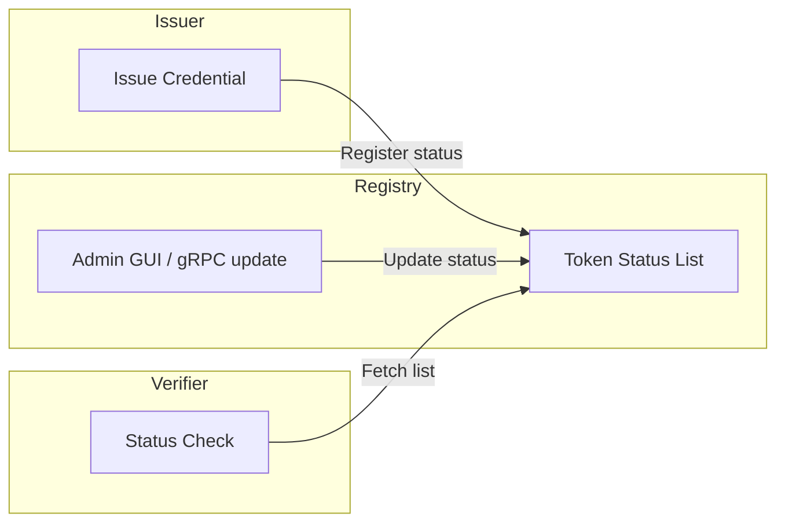
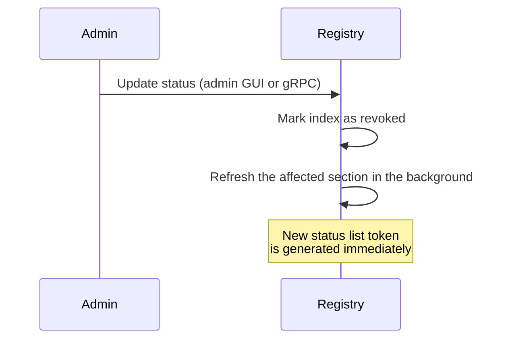
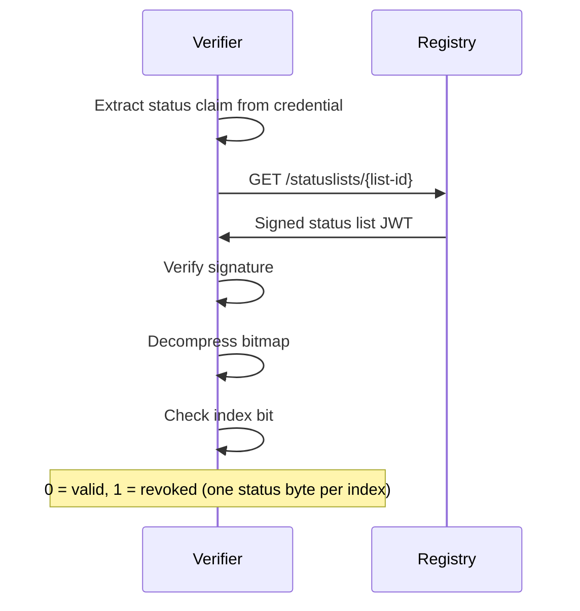

# Token Status Lists

The SIROS ID platform uses [Token Status Lists](https://datatracker.ietf.org/doc/draft-ietf-oauth-status-list/) for credential revocation. This page explains how to configure and use credential status checking.

## Overview

Token Status Lists provide an efficient, privacy-preserving mechanism for tracking credential revocation status. Instead of querying a revocation database for each credential, verifiers fetch a compact status list that contains the revocation status of many credentials.



## How It Works

1. **At Issuance**: Each credential includes a `status` claim with a reference to a status list
2. **Status List**: The registry publishes signed JWT status lists at known URLs
3. **At Verification**: Verifiers fetch the status list and check the credential's index

### Credential Status Claim

Credentials include a status reference:

```json
{
  "status": {
    "status_list": {
      "idx": 12345,
      "uri": "https://registry.example.org/statuslists/1"
    }
  }
}
```

### Status List Format

Status lists are signed Status List Tokens (`application/statuslist+jwt`, or `application/statuslist+cwt` when requested through the `Accept` header). The JWT payload carries a zlib-compressed, base64url-encoded status array with one byte (8 bits) per credential:

```json
{
  "iss": "https://registry.example.org",
  "sub": "https://registry.example.org/statuslists/1",
  "iat": 1708963200,
  "exp": 1708966800,
  "ttl": 43200,
  "status_list": {
    "bits": 8,
    "lst": "eNrt..."
  }
}
```

The JWT header carries `typ: statuslist+jwt`, the signing `kid` and the signing key. The `uri` of a credential's `status_list` reference is `{registry.public_url}/statuslists/{section}`, where `section` is the integer number of the list section.

## Configuration

Token Status Lists are configured in the `registry.token_status_lists` section.

### Registry Configuration

```yaml
registry:
  api_server:
    addr: :8080
  public_url: "https://registry.example.org"
  grpc_server:
    addr: :8090
  
  token_status_lists:
    # Signing key for status list tokens
    key_config:
      private_key_path: "/pki/tsl_signing_key.pem"
      chain_path: "/pki/tsl_signing_chain.pem"
    
    # How often new status list tokens are generated (seconds)
    # Default: 43200 (12 hours); must be between 301 and 86400
    token_refresh_interval: 43200
    
    # Number of entries per status list section
    # Default: 1000000 (1 million)
    section_size: 1000000
    
    # Rate limiting for status list endpoints
    # Default: 60 requests per minute per IP
    rate_limit_requests_per_minute: 60
```

### Configuration Options

| Option | Type | Default | Description |
|--------|------|---------|-------------|
| `key_config` | object | required | Signing key configuration |
| `token_refresh_interval` | int | 43200 | Token regeneration interval in seconds (valid range 301-86400; token validity is the interval minus 5 minutes) |
| `section_size` | int | 1000000 | Entries per status list section |
| `rate_limit_requests_per_minute` | int | 60 | Rate limit per IP |

### HSM Support

For production deployments, use HSM-backed keys:

```yaml
registry:
  token_status_lists:
    key_config:
      pkcs11:
        module_path: /usr/lib/softhsm/libsofthsm2.so
        slot_id: 0
        pin: "1234"   # plaintext in the config, or supplied through the secrets file
        key_label: "registry-tsl-key"
```

## Status List Endpoints

| Endpoint | Description |
|----------|-------------|
| `GET /statuslists/{list-id}` | Fetch a specific status list token (draft-ietf-oauth-status-list §8.1) |
| `GET /statuslists` | Status List Aggregation — the list of all Status List Token URIs this registry hosts (draft-ietf-oauth-status-list §9.3) |

The registry needs MongoDB (`common.mongo.uri`) and a `registry.public_url`. It has no `.well-known` metadata endpoint of its own; a verifier
resolves its signing key the same way it resolves any other trust decision —
via go-trust — rather than through SD-JWT VC issuer-metadata discovery. That
discovery mechanism (`/.well-known/jwt-vc-issuer`) belongs to the credential
issuer (APIGW), for resolving the credential's own signing key, and is
unrelated to status list verification.

## Revocation Flow

Credential status is changed in the registry. apigw has no revoke endpoint and does not update statuses itself (deleting a document through the datastore API does not revoke credentials already issued). Two interfaces exist:

- the **admin GUI**, enabled with `registry.admin_gui.enable` (plus `username` and `password`), which updates a status through `POST /admin/status`;
- the registry's **gRPC** `TokenStatusListUpdateStatus` method, protected by mTLS (`registry.grpc_server.tls`).



## Verification Flow



## Privacy Considerations

Token Status Lists are designed with privacy in mind:

- **No correlation**: Verifiers only see the status at an index, not credential details
- **Batch fetching**: Multiple credentials can be checked with one request
- **Caching**: Status lists can be cached to reduce registry load
- **Decoys**: Sections are padded with decoy entries, and a new section is started when few decoys remain, so list size does not reveal how many credentials were issued

## Caching

The registry does not set a `Cache-Control` header on status list responses. Verifiers should cache a status list according to the token's `ttl` claim (equal to `token_refresh_interval`) and its `exp`.

## Separate Status Service

SIROS also develops a separate, standalone status list service, [siros-status-service](https://github.com/sirosfoundation/siros-status-service) (a prototype implementing draft-ietf-oauth-status-list-21 with issuer authentication through a trust PDP, ingestion and verifier services, and sharding). The configuration above is for the registry that ships with the vc suite.

## Next Steps

- [Credential Type Registry](./vctm-registry) – Credential type metadata registry
- [Trust Services](/sirosid/trust/) – Configure trust for status list issuers
