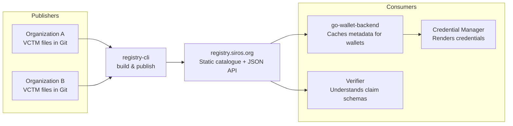

# Registry Services

The **Credential Type Registry** is the publication and discovery layer in the SIROS ID wallet ecosystem. It makes credential type metadata — such as display names, claim definitions, and rendering hints — available to wallets, issuers, and verifiers so they can present credentials consistently.

The public registry is hosted at **[registry.siros.org](https://registry.siros.org)** and is built using [registry-cli](./registry-cli).

## What the Registry Does

Organizations that issue digital credentials define **Verifiable Credential Type Metadata (VCTM)** files describing how each credential type looks and what claims it contains. The registry:

1. **Discovers** VCTM files from configured sources (GitHub repositories, local directories).
2. **Aggregates** them into a single, browsable catalogue.
3. **Publishes** the catalogue as a static HTML site with a TS11-compliant JSON API, an OpenAPI specification, and optional JWS-signed responses.

The result is a public (or private) catalogue that any compatible client can query.

## How registry.siros.org is Built

The public instance at [registry.siros.org](https://registry.siros.org) is produced by running `registry-cli build` against a set of source repositories — primarily those tagged with the `vctm` topic on GitHub. A CI pipeline rebuilds and deploys the site whenever source metadata changes. The site is hosted as a static site on GitHub Pages.

The build process is fully reproducible: anyone can point `registry-cli` at the same sources and get an equivalent catalogue. See the [registry-cli](./registry-cli) page for setup instructions.

## Role in the Wallet Ecosystem

The registry sits between credential **publishers** and credential **consumers**:

- **Issuers / credential designers** publish VCTM files in Git repositories. The registry discovers and aggregates them.
- **go-wallet-backend** fetches and caches metadata from the registry so wallets can render credentials with the correct display names, logos, and claim labels.
- **Verifiers** can look up claim schemas to understand what a presented credential contains.

:::caution Don't confuse the "registries"
The SIROS ecosystem uses the word "registry" in several places:

| Component | Role | Description |
|-----------|------|-------------|
| **registry-cli** | **Publisher** | CLI tool that builds the credential type catalogue. |
| **registry.siros.org** | **Catalogue** | The public static site produced by registry-cli. |
| **go-wallet-backend registry** | **Consumer** | Service in go-wallet-backend that fetches and caches metadata from registry.siros.org. |
| **VC registry** (`vc/cmd/registry`) | **Token Status Lists** | A completely separate service managing credential revocation. Not related to credential type metadata. |
:::

## Further Reading

- [registry-cli](./registry-cli) — CLI tool reference, Docker quick start, sources configuration, and API output
- [Credential Type Registry reference](../reference/vctm-registry) — deployer-facing documentation on registry.siros.org
