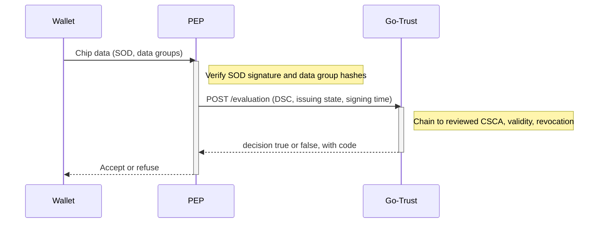

# eMRTD Document Signer Trust

The `emrtd` registry in [Go-Trust](./go-trust) answers one question for a policy enforcement point (PEP) that has already verified an electronic passport or ID card (eMRTD, ICAO Doc 9303): **does the Document Signer Certificate (DSC) of this chip chain, for the claimed issuing state, to a Country Signing CA (CSCA) in our reviewed anchor list?**

It is available from Go-Trust v0.24.0.

## What it does, and what it does not

A chip carries a signed data structure (the SOD, `EF.SOD`) that signs hashes of the data groups with a DSC. Checking those hashes against the DSC inside the same chip proves integrity only. A forger with their own DSC passes that check. What turns the check into trust is the question this registry answers: is that DSC vouched for by a CSCA that we have decided to trust for that state?

| The PEP does | The registry does |
|---|---|
| Parses the SOD and verifies its signature with the embedded DSC | Builds a certificate path from the DSC to a reviewed CSCA of the claimed state |
| Verifies every presented data group against the SOD | Checks validity, key usage, signature algorithms and revocation along that path |
| Cross-checks the data against what was scanned, and normalises the issuing state to ISO 3166-1 alpha-3 | Returns an allow or deny decision, with a machine-readable code on deny |
| Derives the signing time from the verified SOD | Never sees the SOD, the data groups, or any personal data |

:::warning Trust lives only in the reviewed anchors
The registry trusts exactly the certificates in `anchors_dir`, and nothing else. The operating system certificate pool is never used. Extra certificates sent in the request are candidate link certificates only: they are never anchors and are never consulted for trust. Whatever you put in `anchors_dir` is what your deployment trusts, so review it before it goes there.
:::

## Request flow



## Configuration

Enable the registry under `registries.emrtd` and add a policy for the `emrtd-document-signer` action:

```yaml
registries:
  emrtd:
    enabled: true
    name: emrtd-csca                          # default: emrtd-csca
    description: "eMRTD CSCA anchors"         # optional
    anchors_dir: /etc/go-trust/emrtd/anchors  # required
    crls_dir: /etc/go-trust/emrtd/crls        # optional
    watch: true                               # reload when files change

policies:
  policies:
    emrtd-document-signer:
      registries: [emrtd-csca]
      constraints:
        require_key_binding: true
        allowed_key_types: [x5c]
      emrtd:                        # optional, see "Path length"
        path_len_mode: enforce      # ignore (default) | enforce
        path_len_override: 1        # optional; implies enforce, so not valid with "ignore"
```

### Registry keys

| Key | Required | Meaning |
|-----|----------|---------|
| `registries.emrtd.enabled` | yes | Enables the registry. |
| `registries.emrtd.name` | no | Registry name, referenced from `policies.<name>.registries`. Default `emrtd-csca`. |
| `registries.emrtd.description` | no | Free text. |
| `registries.emrtd.anchors_dir` | yes | Directory holding the trust anchors (layout [below](#anchor-directory-format)). Startup fails if it is missing. |
| `registries.emrtd.crls_dir` | no | Directory holding CRLs. Without it no revocation check is made. |
| `registries.emrtd.watch` | no | Reload anchors and CRLs when files change (debounced). If `false`, changes need a restart. |

The generated [configuration reference](/sirosid/trust/go-trust-configuration) lists the `registries.emrtd` keys and the `policies.policies.<name>.emrtd` keys for each release.

### Policy keys

The registry only answers requests whose `action.name` is `emrtd-document-signer`. Any other action is denied as `malformed_request`. The policy block is what routes that action to the registry and requires an `x5c` key.

| Key | Required | Meaning |
|-----|----------|---------|
| `policies.<name>.emrtd.path_len_mode` | no | `ignore` (default) or `enforce`. See [Path length](#path-length). Any other value fails startup. |
| `policies.<name>.emrtd.path_len_override` | no | Integer `>= 0`, used instead of a certificate's own `pathLenConstraint`. Implies `enforce`. Combining it with an explicit `path_len_mode: ignore` fails startup. |

## Anchor directory format

```
<anchors_dir>/<ALPHA3>/<anything>.pem     CSCA and link certificates, one or more per file
<crls_dir>/<ALPHA3>/<anything>.crl        optional, DER or PEM
```

- `<ALPHA3>` is the ISO 3166-1 **alpha-3** code of the issuing state, for example `SWE` or `DEU`. The directory name is the country binding.
- Each anchor's subject country (`C`, alpha-2) must correspond to the directory name through an embedded ISO 3166 table (249 codes plus `XK`/`XKX`). A mismatching **certificate** is skipped and logged. Other certificates in the same PEM file that match remain eligible as anchors.
- Files may be PEM with one or more certificates. The file name is not interpreted.
- A directory under `anchors_dir` that is not an ISO 3166-1 alpha-3 code is logged and skipped.
- `anchors_dir` and `crls_dir` themselves may be symlinks, which allows atomic tree swaps. Anything **below** the root must be real. Startup fails, and on reload the previous data stays in use, if it finds any of these:
  - a country-named entry that is not a real directory (a file, FIFO or symlink, whatever it points to);
  - a symlink to a directory;
  - a symlinked or otherwise non-regular `.pem` or `.crl` file.

  The registry refuses these instead of silently dropping anchors or revocation data, or trusting a link whose target can change without the watcher seeing an event.
- Files that cannot be parsed are **skipped and logged** (`emrtd: no valid certificate in anchor file`), never treated as trusted. A DSC whose only chain goes through a skipped anchor is denied (`no_anchor`).

:::tip Check the load log after every deployment
The startup line `emrtd anchors loaded` reports the number of countries and anchors actually loaded, which can be lower than the number of files. If the registry loads no anchors at all it logs a warning and every request is denied.
:::

### Revocation lists

CRLs are read from `crls_dir/<ALPHA3>/*.crl`. A file is one raw DER CRL, or PEM with one or more CRL blocks (all of them are used). A PEM file must contain nothing but well-formed PEM blocks separated by whitespace. Junk or a malformed block anywhere fails the load.

The load fails, rather than ignoring the list, for each of these, because a silently ignored list would look like "not revoked":

- an unparsable CRL file;
- a directory under `crls_dir` that is not an upper-case alpha-3 code but contains `.crl` files (for example `crls_dir/swe`), or a `.crl` entry that is not a regular file;
- a CRL whose issuer name carries a country `C` that does not match its `crls_dir/<ALPHA3>` directory;
- an indirect CRL (`issuingDistributionPoint` with `indirectCRL` true, or an unparsable one), since delegated CRL issuers and per-entry certificate issuers are not supported;
- a delta CRL (`deltaCRLIndicator`), since a delta checked without its base would look complete. Provide complete CRLs.

### Known parsing limits

Real CSCA certificates often use encodings that Go's X.509 parser rejects. The registry registers the opt-in `ecparams` parser from `go-cryptoutil` next to `brainpool`. It handles the following, without ever trusting a self-described curve:

- ECDSA keys with explicit curve parameters, when they match NIST P-224, P-256, P-384 or P-521, or brainpoolP256r1, P384r1 or P512r1 exactly;
- negative serial numbers;
- RSA keys whose AlgorithmIdentifier lacks the NULL parameters;
- zero-padded curve constants in explicit parameters (go-cryptoutil v0.7.1);
- a non-DER `cA` BOOLEAN in `basicConstraints` (go-cryptoutil v0.7.1).

Still rejected: explicit parameters that match no known curve (other curves, twisted Brainpool, wrong generator or cofactor), an invalid `subjectKeyIdentifier`, `basicConstraints` that are invalid in any other way, and a brainpool subject key under an RSA-PSS signature. Such an anchor is skipped and logged at load time, so DSCs issued under it are denied with `no_anchor`.

## Request

```json
{
  "subject":  {"type": "key", "id": "SWE"},
  "resource": {"type": "x5c", "id": "SWE", "key": ["<DSC base64 DER>", "<extra cert from SOD>"]},
  "action":   {"name": "emrtd-document-signer"},
  "context":  {"signing_time": "2026-09-30T10:00:00Z"}
}
```

- `subject.type` is `key` and `resource.type` is `x5c`.
- `subject.id` is the alpha-3 issuing state. An invalid value is denied as `unknown_country`.
- `resource.id` is required and must equal `subject.id`. The manager enforces this and the registry enforces it too for direct callers (`malformed_request`).
- `resource.key[0]` is the DSC, as base64 DER. Further entries are candidate intermediates (link certificates) only. They are never anchors, must carry CA basic constraints and `keyCertSign`, and at most 16 certificates are accepted. A single encoded certificate may not exceed 32 KiB.
- `context.signing_time` is an optional RFC 3339 time at which validity is evaluated for every certificate in the chain. Per ICAO 9303 Part 12 a DSC is judged at signing time, so the DSC of an old passport that has long expired today can still be valid. The default is now. A malformed value is denied.

:::warning signing_time is taken on the caller's word
The registry cannot tell whether `signing_time` is honest. A signer that holds an expired or compromised DSC key can claim a convenient time inside the old validity window, which is the backdating risk. The PEP must derive the value from a **verified** SOD, and should be careful with a time the signer itself asserts. Sanity-check it, for example that it is not in the future and is plausible for the document. This bounds backdating but cannot remove it. The registry and the reviewed anchors, plus the CRLs, remain the authority.
:::

The request body is limited to 1 MiB on `/evaluation`. A larger body is refused with HTTP 413. This limit applies to every registry, not only `emrtd`.

### Example

```bash
curl -s -X POST http://localhost:6001/evaluation \
  -H 'Content-Type: application/json' \
  -d '{
    "subject":  {"type": "key", "id": "SWE"},
    "resource": {"type": "x5c", "id": "SWE", "key": ["MIIC...DSC..."]},
    "action":   {"name": "emrtd-document-signer"},
    "context":  {"signing_time": "2026-09-30T10:00:00Z"}
  }'
```

## Response

An allow decision carries the anchor that was used and the DSC fingerprint in `context.reason.admin`:

```json
{"decision": true,
 "context": {"reason": {"admin": {
   "csca_sha256": "...", "csca_subject": "...", "dsc_sha256": "...",
   "country": "SWE", "signing_time": "...", "link_sha256": ["..."]}}}}
```

`link_sha256` appears only when link certificates were used.

A deny decision looks like this when the `emrtd` registry is the only registry for the policy:

```json
{"decision": false,
 "context": {"reason": {
   "code": "expired",
   "admin": {"code": "expired", "detail": "\"C=SE,CN=...\" expired 2024-05-01T00:00:00Z (evaluated at 2026-09-30T10:00:00Z)"}}}}
```

When the registry denies, with the documented policy where it is the only registry, the machine-readable `code` is in `context.reason.code` and also in `context.reason.admin.code`, with the human-readable explanation in `context.reason.admin.detail`. Through the manager, `context.reason.error` can be the manager's generic "no registry returned positive match", and the registry's own text is then in `context.reason.admin.detail`. A request can also be rejected before the registry runs (request validation, a policy check), in which case only `context.reason.error` is present. With several denying registries the codes can remain nested in the per-registry results.

:::warning Decide from the decision, never from a code
Always decide trust from `decision`. A caller must treat anything other than `decision: true` as not trusted, including errors, timeouts and malformed bodies. Do not infer trust from the presence or absence of a code.
:::

:::info Admin details are for service callers
With the `all` and `best_match` resolution strategies the manager copies each registry's full `reason`, including the `admin` details (certificate fingerprints, subjects), into `all_results`. This is meant for service callers (a PEP talking to Go-Trust), not for passing on to end users.
:::

### Deny codes

| Code | Meaning |
|------|---------|
| `unknown_country` | `subject.id` is not a valid alpha-3 code, or no anchors are loaded for it |
| `no_anchor` | No chain to an anchor of that country could be built |
| `chain_invalid` | No acceptable certificate path: a signature in the chain does not verify (or uses a refused algorithm), a supplied link certificate is not a valid CA, the path violates an enforced `pathLenConstraint` (see [Path length](#path-length)), or the path search was canceled or hit its work limit |
| `country_mismatch` | The DSC's subject `C` disagrees with `subject.id`, or it chains only to another country's anchor |
| `expired` / `not_yet_valid` | A certificate in the chain is outside its validity at `signing_time` |
| `bad_key_usage` | The DSC has a `keyUsage` extension without `digitalSignature`, or is itself a CA |
| `revoked` | A verified CRL lists a certificate in the chain |
| `malformed_request` | Wrong action, bad certificates, bad `signing_time`, unsupported key combination |

## Validation rules

**Chain building**

- Chain building uses `go-cryptoutil` signature checking, so brainpool curves and RSA-PSS work. SHA-1 and MD5 certificate signatures are refused outright, even when the signature is correct.
- Issuer names match by bytes first, then case-insensitively, because the same name appears in different string types in the wild. The authority and subject key identifiers need not match. The signature decides.
- Chains are limited to 5 certificates (DSC, link certificates, CSCA). The search has a fixed work budget, and exhausting it is an explicit `chain_invalid` denial, never a silent truncation.
- If a DSC does not chain to the claimed state but would chain to another state's anchor, it is denied as `country_mismatch`.

**Key usage and constraints**

- A DSC without a `keyUsage` extension is accepted. If the extension is present (even with no bits set) it must include `digitalSignature`. A DSC that is itself a CA (`basicConstraints` cA=true) is refused.
- Anchors are exempt from the CA and `keyCertSign` check. Link certificates from the request must be CAs and assert `keyCertSign`.
- `pathLenConstraint` is not enforced unless the policy opts in (see [Path length](#path-length)).

**Validity**

- Validity is checked for every certificate on the path (DSC, link certificates and CSCA) at `signing_time`.

**Revocation**

- Revocation is strict. Any entry on a CRL that is authentic for the certificate's issuer denies the certificate, regardless of the revocation date and even if the CRL is past `nextUpdate`. A stale CRL still counts for positive hits, since staleness never un-revokes a certificate.
- CRLs that are not authentic are ignored. With no CRL for an issuer nothing is denied, so without `crls_dir` there is no revocation check at all.
- A CRL is **authentic for an issuer** when its issuer name equals the revoked certificate's issuer name and its signature verifies against the issuer certificate on the validated path, or against **any reviewed anchor of the claimed state whose subject name equals the CRL's issuer name** (every key of that CSCA name).
- The second rule matters after a CSCA key rollover. The state publishes one CRL, signed with its current key, that also lists DSCs issued under earlier keys, which chain to the old anchor. Never an authority: another state's anchor, an anchor with a different name, or a request-supplied certificate that is not on the validated path.

## Path length

By default the registry **ignores** the `basicConstraints` `pathLenConstraint` of anchors and link certificates. Real CSCAs often carry `pathLenConstraint=0` and still sign link certificates for their successors, so strict enforcement would reject valid passports. Chains are bounded by the 5-certificate cap instead.

A policy can opt in with the `emrtd` block:

```yaml
policies:
  policies:
    emrtd-document-signer:
      registries: [emrtd-csca]
      emrtd:
        path_len_mode: enforce   # ignore (default) | enforce
        path_len_override: 1     # optional
```

- `path_len_mode: ignore`, or no `emrtd` block, is the default behaviour.
- `path_len_mode: enforce` applies each certificate's own `pathLenConstraint` to the path DSC, link certificates, CSCA. A certificate without one is unlimited.
- `path_len_override: N` (N >= 0) is used **instead of** the certificate's own value for every CSCA and link certificate that acts as an issuer in the chain, including one that has no `pathLenConstraint`, and the anchor itself. It implies `enforce`. Combining it with an explicit `path_len_mode: ignore` is a configuration error.

Semantics follow RFC 5280 section 6.1.4. `pathLenConstraint` is the number of **non-self-issued intermediate CAs** allowed below the issuer. For the issuer at a given position of the path, the intermediates are the link certificates between it and the DSC. The DSC is the end entity and never counts. A **self-issued** certificate (issuer name equal to subject name, as for a link certificate that certifies a CSCA's new key under its unchanged name) does not count against the limit.

Examples, for DSC, one link certificate, CSCA:

| CSCA `pathLenConstraint` | Link | Mode / override | Result |
|---|---|---|---|
| 0 | different name | default | allowed |
| 0 | different name | `enforce` | `chain_invalid` |
| 0 | self-issued | `enforce` | allowed |
| 0 | different name | override 1 | allowed |
| any / none | different name | override 0 | `chain_invalid` |

A violation is denied as `chain_invalid`, with the offending certificate and the counts in `context.reason.admin.detail`. Other candidate paths are still tried, so a chain that satisfies the limit through another route is accepted.

The mode and override are server-side policy controls. The manager drops any client-supplied `emrtd_path_len_mode` or `emrtd_path_len_override` from the request context, so a caller can neither set nor weaken them.

:::caution Test with real documents before enabling enforce
A CSCA with `pathLenConstraint=0` that has already issued a non-self-issued link certificate to its successor, or a rollover spanning several link certificates, is denied under `enforce` without an override, even though the passports are genuine. Self-issued links (same name) are unaffected. Before enabling `enforce`, test with real documents from states that are mid-rollover, and prefer an override sized for the longest legitimate chain (the 5-certificate cap still applies).
:::

Enforce if your risk assessment wants the issuer's own CA constraints honoured and you have checked that the CSCAs you anchor behave. Use `path_len_override` to apply one deliberate limit across all states, for example `1` to allow a single link certificate under any CSCA regardless of what the CSCA certificate says.

## Deploying

The anchors are a directory of PEM files that **you provide and review yourself**. Go-Trust ships none. Maintain a reviewed set of CSCA certificates, and obtain the CSCA certificates for each state from that issuing state's own publication. Make sure a human approves each certificate before it enters the `anchors_dir/<ALPHA3>/` tree, and keep unreviewed candidates and withdrawn certificates outside the directory you point `anchors_dir` at.

Two deployment shapes both work:

- **A data-only container image** that holds the anchor tree (and CRLs), used as an init container or sidecar that populates a shared volume.
- **A volume mounted at the anchors path**, for example a read-only mount at `/etc/go-trust/emrtd/anchors`, with CRLs at the `crls_dir` path.

With `watch: true`, Go-Trust reloads when files change, so refreshing the volume or syncing the directory is enough, with no restart. File events are debounced. The resolved location of both roots is also re-checked every 30 seconds, so swapping a symlink in an ancestor directory (`/data/current` pointing at `v2`, with `anchors_dir: /data/current/anchors`) is noticed within that interval. If a reload fails, the previous data stays in use.

:::tip Rolling anchors and CRLs
Publish a new tree and swap a symlink to it, rather than editing files in place, so a reload never sees a half-written directory. Then check the `emrtd anchors loaded` log line for the country and anchor counts.
:::

## How facetec-api uses it

[facetec-api](https://github.com/sirosfoundation/facetec-api) (v0.15.0 and later) is the PEP for passport issuance. It parses the SOD from the chip data, verifies the signature and the data groups itself, and then asks Go-Trust. See [ADR-002](https://github.com/sirosfoundation/facetec-api/blob/main/docs/adr/002-emrtd-document-signer-trust.md) and the [README](https://github.com/sirosfoundation/facetec-api#readme) for the full contract.

- **`TRUST_PDP_URL`** (`trust.pdp_url`) is the base origin of the Go-Trust PDP. It must be `https` with no path (plain `http` is accepted only for localhost). The service calls `POST {url}/evaluation`.
- **`trust.required`** (`TRUST_REQUIRED`) defaults to `true`. The service then refuses to start without `trust.pdp_url`, and hard-rejects any passport scan with chip data that is not trusted (`chip_untrusted`), independent of the policy rules.
- **`chip-trusted`** is the policy field the outcome is reported in. Only `decision: true` with an anchor fingerprint (`csca_sha256`) counts as trusted. Transport errors, timeouts, non-200 responses, malformed bodies and denials all mean not trusted. The default passport rules require both `(nfc-verified true)` and `(chip-trusted true)`.
- **Status 4 is required.** `/process-request` requires FaceTec's NFC authentication status 4 (AUTHENTICATED, clone detection) for every document type before trust is even consulted. The two checks answer different questions: status 4 proves the chip is genuine hardware holding unaltered data, and `chip-trusted` proves the DSC chains to your reviewed CSCA list. Neither implies the other.

:::note The PDP is on the issuance path
The check fails closed. If Go-Trust is unavailable, passport issuance stops. A passport from a state with no reviewed CSCA in your anchors is refused until you add one.
:::

## See also

- [Go-Trust AuthZEN Service](./go-trust)
- [Go-Trust Configuration Reference](/sirosid/trust/go-trust-configuration)
- [Trust Services overview](/sirosid/trust)
