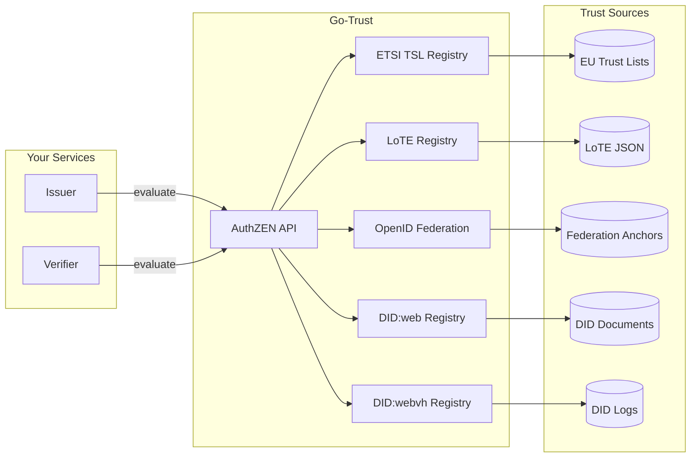
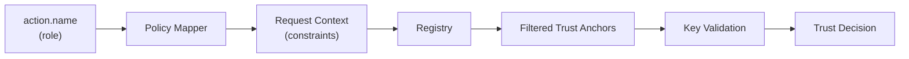
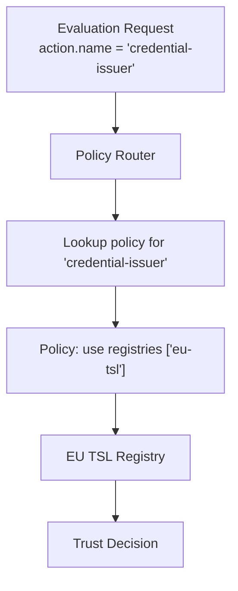
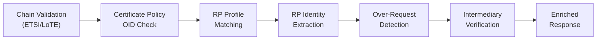
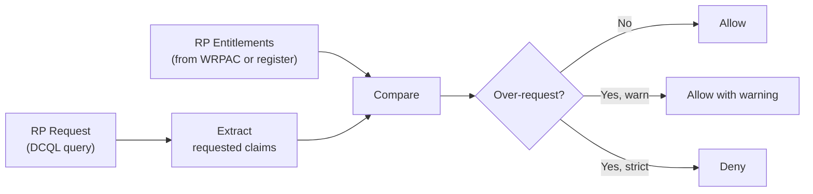

# Go-Trust AuthZEN Service

Go-Trust is a local trust engine that provides trust decisions via an [AuthZEN](https://openid.github.io/authzen/) policy decision point (PDP). It abstracts trust evaluation across multiple trust frameworks, allowing your issuer and verifier services to make consistent trust decisions without implementing complex trust logic.

## Why Use Go-Trust?

Trust evaluation in digital credential ecosystems is complex:

- **[ETSI TS 119 612](https://www.etsi.org/deliver/etsi_ts/119600_119699/119612/02.01.01_60/ts_119612v020101p.pdf)** requires parsing XML trust status lists, validating certificates, and tracking service status
- **[ETSI TS 119 602](https://www.etsi.org/deliver/etsi_ts/119600_119699/119602/)** involves parsing JSON Lists of Trusted Entities (LoTE) with JWK, X.509, or DID identities
- **[OpenID Federation](https://openid.net/specs/openid-federation-1_0.html)** involves trust chain resolution, signature verification, and trust mark validation
- **[DID:web](https://w3c-ccg.github.io/did-method-web/)** needs proper HTTP resolution and JWK matching
- **[DID:webvh](https://identity.foundation/didwebvh/v1.0/)** adds verifiable history with cryptographic integrity validation

Go-Trust handles all of this behind a simple AuthZEN API, so your services can focus on credentials.



## Quick Start

### Docker Deployment

```bash
# Pull the image
docker pull ghcr.io/sirosfoundation/go-trust:latest

# Run with default configuration
docker run -p 6001:6001 ghcr.io/sirosfoundation/go-trust:latest
```

### Docker Compose

Add to your `docker-compose.yaml`:

```yaml
services:
  go-trust:
    image: ghcr.io/sirosfoundation/go-trust:latest
    restart: always
    ports:
      - "6001:6001"
    volumes:
      - ./trust-config.yaml:/config.yaml:ro
      - ./trust-data:/data:ro  # For local TSL files
    command: ["--config", "/config.yaml"]
    healthcheck:
      test: ["CMD", "curl", "-f", "http://localhost:6001/healthz"]
      interval: 30s
      timeout: 10s
      retries: 3
```

## Configuration

### Basic Configuration

Create `trust-config.yaml`:

```yaml
server:
  addr: ":6001"
  metrics_addr: ":9090"

# ETSI Trust Status List support
etsi:
  enabled: true
  trust_list_url: "https://ec.europa.eu/tools/lotl/eu-lotl.xml"
  cache_duration: 3600
  follow_refs: true
  max_ref_depth: 3

# OpenID Federation support
openid_federation:
  enabled: true
  trust_anchors:
    - entity_id: "https://federation.example.com"
  cache_duration: 1800

# DID:web support
did_web:
  enabled: true
  allowed_domains:
    - "*.example.com"
    - "issuer.trusted.org"

# Resolution strategy for multiple registries
resolution:
  strategy: "first_match"  # first_match, all_registries, best_match, sequential
```

### ETSI TSL Multi-Source Configuration

The ETSI TSL registry supports loading trust data from **multiple sources simultaneously**. You can combine any or all of these source types in a single registry:

- **`cert_bundle`** — A PEM file containing pre-extracted trusted CA certificates (recommended for production)
- **`tsl_files`** — A list of local TSL XML files
- **`tsl_urls`** — A list of remote or local (`file://`) URLs to fetch TSL XML from

All certificates from all sources are merged into a single trust pool, and the individual TSL documents are kept for filtered evaluation via policies.

```yaml
etsi:
  enabled: true
  name: "EU-TSL"

  # PEM bundle with pre-extracted certificates (fast, no XML parsing)
  cert_bundle: "/var/lib/go-trust/eu-trusted-certs.pem"

  # Multiple local TSL XML files
  tsl_files:
    - "/var/lib/go-trust/eu-lotl.xml"
    - "/var/lib/go-trust/se-tsl.xml"
    - "/var/lib/go-trust/de-tsl.xml"

  # Multiple remote (or file://) TSL URLs
  tsl_urls:
    - "https://ec.europa.eu/tools/lotl/eu-lotl.xml"
    - "file:///var/lib/go-trust/backup-tsl.xml"

  # Follow TSL references (pointers to member state TSLs in a LOTL)
  follow_refs: true
  max_ref_depth: 3

  # Periodic re-fetch of all sources
  refresh_interval: "24h"
```

:::tip
For production, pre-process trust lists into a PEM `cert_bundle` using `tsl-tool` from [g119612](https://github.com/sirosfoundation/g119612). This avoids runtime XML parsing and reference following, giving faster startup and predictable behavior.
:::

### Multi-Registry Configuration

Go-Trust can query multiple trust frameworks simultaneously:

```yaml
registries:
  - name: "eu-tsl"
    type: "etsi_tsl"
    priority: 1
    config:
      trust_list_url: "https://ec.europa.eu/tools/lotl/eu-lotl.xml"
      
  - name: "edu-federation"
    type: "openid_federation"
    priority: 2
    config:
      trust_anchors:
        - entity_id: "https://edugateway.org"
      required_trust_marks:
        - "https://edugateway.org/tm/accredited"
        
  - name: "company-did"
    type: "did_web"
    priority: 3
    config:
      allowed_domains:
        - "*.company.internal"

resolution:
  strategy: "first_match"
  policy: "any_match"  # any_match, all_must_match
```

### LoTE Registry Configuration

Go-Trust can evaluate trust from ETSI TS 119 602 Lists of Trusted Entities (LoTE) — JSON documents that list trusted entities with their digital identities.

The LoTE registry supports **multiple sources**, which are all fetched and merged into a single entity index. This allows combining trust lists from different scheme operators, countries, or environments:

```yaml
registries:
  lote:
    enabled: true
    name: "LoTE Registry"
    description: "ETSI TS 119 602 List of Trusted Entities"
    sources:
      - "https://lote.example.org/lote-SE.json"    # Sweden
      - "https://lote.example.org/lote-DE.json"    # Germany
      - "https://lote.example.org/lote-FR.json"    # France
      - "/etc/go-trust/local-lote.json"            # Local overrides
    verify_jws: false            # Set to true for JWS-signed LoTEs
    fetch_timeout: "30s"
    refresh_interval: "1h"       # How often to re-fetch all sources
```

All entities across sources are indexed by EntityID and by key hash (SHA-256 fingerprint), enabling efficient lookup regardless of which source the entity came from. Sources are re-fetched periodically and the index is swapped atomically.

The LoTE registry evaluates trust by:
1. Looking up the entity by `subject.id` (the entity's identifier)
2. Checking the entity's status is active (granted)
3. Validating the resource key against the entity's digital identities:
   - **X.509 (`x5c`)**: PKIX path validation against entity certificates
   - **JWK (`jwk`)**: SHA-256 fingerprint matching against entity JWK keys

:::tip
To create and publish LoTE documents, use `tsl-tool` from [g119612](https://github.com/sirosfoundation/g119612). See the [LoTE Publishing Guide](./lote-publishing) for a complete walkthrough.
:::

### Static Registries

Go-Trust includes static registries for simple trust scenarios, testing, and development:

#### Whitelist Registry

The **whitelist registry** maintains a list of trusted entity URLs and validates name-to-key bindings by fetching and caching each entity's JWKS (JSON Web Key Set). For each whitelisted entity, it:

1. Discovers the entity's JWKS endpoint via standard metadata discovery
2. Fetches and caches the public keys
3. Computes SHA-256 fingerprints for each key
4. Validates that incoming request keys match a whitelisted entity's keys

```yaml
registries:
  whitelist:
    enabled: true
    config_file: "/config/approved-issuers.yaml"
    watch_file: true  # Auto-reload on changes
```

**Whitelist file format — new format** (recommended):

```yaml
# Named entity lists
lists:
  pid-issuers:
    - "https://issuer1.example.com"
    - "https://issuer2.example.org"
  verifiers:
    - "https://verifier.example.com"
    - "https://relying-party.example.org"

# Map action names to lists
actions:
  pid-provider: "pid-issuers"
  credential-issuer: "pid-issuers"
  verifier: "verifiers"
  credential-verifier: "verifiers"

# JWKS discovery configuration
jwks_endpoint_pattern: ""  # Empty: use standard metadata discovery
fetch_timeout: "30s"
refresh_interval: "5m"     # Background JWKS refresh interval
allow_http: false          # Require HTTPS for JWKS endpoints
```

**Whitelist file format — legacy format** (backward compatible):

```json
{
  "issuers": [
    "https://issuer1.example.com",
    "https://issuer2.example.org"
  ],
  "verifiers": [
    "https://verifier.example.com",
    "https://relying-party.example.org"
  ],
  "trusted_subjects": [
    "https://any-role.example.com"
  ]
}
```

The legacy format auto-maps to actions: `issuers` → `credential-issuer`/`pid-provider`, `verifiers` → `credential-verifier`/`verifier`, and `trusted_subjects` acts as a catch-all.

**JWKS Discovery Order:**

When no explicit `jwks_endpoint_pattern` is set, the registry discovers keys via:
1. **SD-JWT VC §5.3** — `{entity}/.well-known/jwt-vc-issuer` (supports inline JWKS)
2. **RFC 8414** — `{entity}/.well-known/oauth-authorization-server`
3. **OIDC Discovery** — `{entity}/.well-known/openid-configuration`
4. **OpenID4VCI** — `{entity}/.well-known/openid-credential-issuer`
5. **Fallback** — `{entity}/.well-known/jwks.json`

**Features:**
- URLs can include wildcards (`*`) for prefix matching
- Named lists with action-to-list mapping for role-based trust
- Automatic JWKS discovery and key fingerprint caching
- Background refresh loop keeps keys up to date
- Hot-reloadable configuration file
- Supports resolution-only requests (URL authorization without key validation)

**Use when:**
- You have a known set of trusted partners
- You want simple, file-based trust management with full key validation
- Standard metadata discovery works for your entities

:::tip Key Validation
The whitelist registry performs full cryptographic key validation by default. Each entity's JWKS is fetched at startup and periodically refreshed. The registry reports healthy only when keys for all configured entities have been successfully loaded.
:::

#### Always-Trusted Registry

Returns `decision: true` for any request. Useful for testing or when trust is handled by other means.

```bash
# From command line
gt --registry always-trusted
```

#### Never-Trusted Registry

Returns `decision: false` for any request. Useful for testing rejection scenarios.

```bash
# From command line  
gt --registry never-trusted
```

### Policy-Based Trust Decisions

Define policies that map action names to trust requirements. The policy system maps application-level roles (issuer, verifier) to registry-specific constraints (ETSI service types, trust marks, DID domains, etc.):

```yaml
policies:
  # Default policy used when action.name is not specified
  default_policy: credential-verifier

  policies:
    # Credential issuers must be in EU TSL
    credential-issuer:
      description: "Trust requirements for credential issuers"
      etsi:
        service_types:
          - "http://uri.etsi.org/TrstSvc/Svctype/QCert"
          - "http://uri.etsi.org/TrstSvc/Svctype/QCertForESeal"
        service_statuses:
          - "http://uri.etsi.org/TrstSvc/TrustedList/Svcstatus/granted"
      oidfed:
        entity_types:
          - "openid_credential_issuer"
        required_trust_marks:
          - "https://dc4eu.eu/tm/issuer"
      did:
        allowed_domains:
          - "*.eudiw.dev"
          - "*.example.com"
        require_verifiable_history: true
    
    # Wallet providers need federation trust mark
    wallet-provider:
      description: "Trust requirements for wallet providers"
      oidfed:
        entity_types:
          - "wallet_provider"
        required_trust_marks:
          - "https://dc4eu.eu/tm/wallet"
      # Override which registries to use
      registries:
        - "oidfed-registry"
        
    # mDL issuers use IACA validation
    mdl-issuer:
      description: "Trust requirements for mDL/mDOC issuers"
      mdociaca:
        issuer_allowlist:
          - "https://pid-issuer.eudiw.dev"
          - "https://mdl-issuer.example.com"
        require_iaca_endpoint: true
      registries:
        - "mdoc-iaca"
```

## Query Routing

Go-Trust routes evaluation requests to appropriate registries based on the **action name** in the request. This allows different trust requirements for different use cases.

### Trust Evaluation Architecture

Every trust evaluation follows a canonical pattern:



1. The **action name** (e.g., `credential-issuer`) identifies the role being evaluated
2. The **policy mapper** looks up the policy for that role and injects registry-specific constraints into the request context
3. Each **registry** reads its constraints from the context and filters its trust anchors accordingly
4. The registry evaluates the presented key material against the **filtered** trust anchors
5. The registry returns a trust decision with diagnostic information in the response context

This ensures that the same registry instance can enforce different trust requirements depending on the role, without needing separate registry configurations per role.

#### How Each Registry Uses Policy Constraints

| Registry | Constraint Fields | Enforcement |
|----------|-------------------|-------------|
| **ETSI TSL** | `service_types`, `service_statuses` | Builds a **dynamic cert pool** filtered to only include certificates from trust services matching the specified types and statuses. Falls back to the full cert pool when no constraints are present. |
| **OpenID Federation** | `entity_types`, `required_trust_marks` | Validates trust marks and entity types during chain resolution. Additionally performs **key binding verification** — the presented key must match a key in the resolved entity's JWKS. |
| **DID:web** | `allowed_domains`, `required_services` | Extracts the domain from the DID and checks it against allowed domain patterns (supports wildcards like `*.example.com`). Verifies the DID document contains required service types. |
| **DID:webvh** | `allowed_domains`, `required_services` | Same domain and service filtering as DID:web, adapted for the `did:webvh` method format. |
| **DID (generic)** | `allowed_domains`, `required_services` | Applies domain and service constraints for both `did:web` and `did:webvh` methods. DIDs without extractable domains (e.g., `did:key`) pass domain checks automatically. |
| **mDOC IACA** | `issuer_allowlist`, `require_iaca_endpoint` | Checks the issuer URL against a **policy allowlist** in addition to any static allowlist. Normalizes trailing slashes for consistent matching. |

### How Routing Works



1. The client sends an evaluation request with an `action.name` field (e.g., `"credential-issuer"`)
2. Go-Trust looks up the policy associated with that action name
3. The policy specifies which registries to query and any additional constraints
4. Go-Trust queries the specified registries using the configured resolution strategy
5. Returns the aggregated trust decision

### Resolution Strategies

When multiple registries are applicable, Go-Trust uses a **resolution strategy** to determine the outcome:

| Strategy | Description |
|----------|-------------|
| `first_match` | Return the first registry that gives a positive decision |
| `all_registries` | Query all registries, return positive if all agree |
| `best_match` | Query all registries, return the highest confidence match |
| `sequential` | Query registries in order, stop at first definitive answer |

```yaml
resolution:
  strategy: "first_match"  # Default behavior
```

### Composite Registries (Boolean Logic)

For advanced trust policies, Go-Trust supports **composite registries** that combine multiple registries using boolean logic operators. Composite registries can be nested to express complex trust requirements.

| Operator | Description |
|----------|-------------|
| `AND` | All child registries must return `decision: true` |
| `OR` | At least one child registry must return `decision: true` |
| `MAJORITY` | More than 50% of child registries must agree |
| `QUORUM` | A configurable threshold of child registries must agree |

All child registries are evaluated in parallel for optimal performance.

```yaml
# Example: require BOTH EU TSL and OpenID Federation
composite:
  name: "defense-in-depth"
  operator: "AND"
  registries:
    - name: "eu-tsl"
      type: "etsi_tsl"
      config:
        cert_bundle: "/var/lib/go-trust/eu-certs.pem"
    - name: "oidf"
      type: "openid_federation"
      config:
        trust_anchors:
          - entity_id: "https://federation.example.com"
```

**Nesting example** — trust requires `(TSL OR LoTE) AND OpenID Federation`:

```yaml
composite:
  name: "nested-policy"
  operator: "AND"
  registries:
    - name: "any-trust-list"
      operator: "OR"
      registries:
        - name: "eu-tsl"
          type: "etsi_tsl"
          config:
            cert_bundle: "/var/lib/go-trust/eu-certs.pem"
        - name: "lote"
          type: "lote"
          config:
            sources:
              - "https://lote.example.org/lote-SE.json"
    - name: "oidf"
      type: "openid_federation"
      config:
        trust_anchors:
          - entity_id: "https://federation.example.com"
```

### Example: Multi-Tenant Trust

Configure different trust sources for different credential types:

```yaml
policies:
  default_policy: credential-issuer

  policies:
    # PID credentials (national ID) - strict EU TSL only
    pid-provider:
      description: "PID provider validation"
      etsi:
        service_types:
          - "http://uri.etsi.org/TrstSvc/Svctype/QCertForESig"
        service_statuses:
          - "http://uri.etsi.org/TrstSvc/TrustedList/Svcstatus/granted"

    # mDL credentials - ISO/IEC 18013-5 compliant CAs via IACA
    mdl-issuer:
      description: "mDL issuer validation"
      mdociaca:
        issuer_allowlist:
          - "https://pid-issuer.eudiw.dev"
        require_iaca_endpoint: true
      registries:
        - "mdoc-iaca"
        
    # Educational credentials - federation trust + fallback to TSL
    credential-issuer:
      description: "Generic credential issuer"
      oidfed:
        entity_types:
          - "openid_credential_issuer"
      etsi:
        service_types:
          - "http://uri.etsi.org/TrstSvc/Svctype/QCert"
```

### Fallback Behavior

If no policy matches the action name, Go-Trust uses the `default_policy`:

```yaml
policies:
  default_policy: "credential-issuer"  # Policy to use when action.name doesn't match
```

## AuthZEN API

Go-Trust implements the AuthZEN protocol for trust evaluation.

### Evaluation Request

```bash
curl -X POST http://localhost:6001/evaluation \
  -H "Content-Type: application/json" \
  -d '{
    "subject": {
      "type": "key",
      "id": "https://issuer.example.com"
    },
    "resource": {
      "type": "x5c",
      "id": "https://issuer.example.com",
      "key": ["MIIC...base64-cert..."]
    },
    "action": {
      "name": "credential-issuer"
    }
  }'
```

### Response

```json
{
  "decision": true,
  "context": {
    "reason": {
      "registry": "eu-tsl",
      "trust_service": "Qualified Electronic Signature",
      "service_status": "granted",
      "country": "SE"
    }
  }
}
```

### Resolution-Only Requests

To resolve trust metadata without key validation:

```bash
curl -X POST http://localhost:6001/evaluation \
  -H "Content-Type: application/json" \
  -d '{
    "subject": {
      "type": "key",
      "id": "did:web:issuer.example.com"
    },
    "resource": {
      "id": "did:web:issuer.example.com"
    }
  }'
```

Response includes the resolved DID document or entity configuration:

```json
{
  "decision": true,
  "context": {
    "trust_metadata": {
      "@context": ["https://www.w3.org/ns/did/v1"],
      "id": "did:web:issuer.example.com",
      "verificationMethod": [...]
    }
  }
}
```

### Subject ID Normalization

Go-Trust automatically normalizes `subject.id` values that use
[OpenID4VP client_id_scheme](https://openid.net/specs/openid-4-verifiable-presentations-1_0.html#section-5.9)
prefixes. This normalization happens in the registry manager before any
registry receives the request, ensuring consistent matching across all
trust backends (whitelist, LoTE, ETSI TSL, OIDFed, etc.).

| Input `subject.id` | Normalized `subject.id` |
|---|---|
| `x509_san_dns:verifier.example.com` | `https://verifier.example.com` |
| `x509_san_uri:https://issuer.example.com` | `https://issuer.example.com` |
| `https://issuer.example.com` | `https://issuer.example.com` (unchanged) |
| `did:web:issuer.example.com` | `did:web:issuer.example.com` (unchanged) |

This means callers can send either the raw URL or the OpenID4VP
`client_id_scheme`-prefixed form — both will match the same registry
entries. For example, a whitelist entry of `https://verifier.example.com`
will match requests with `subject.id` set to either
`https://verifier.example.com` or `x509_san_dns:verifier.example.com`.

## Integration with Issuer/Verifier

### Verifier Configuration

Configure the verifier to use go-trust for credential validation:

```yaml
verifier_proxy:
  trust:
    # AuthZEN PDP URL — when set, operates in "default deny" mode
    pdp_url: "http://go-trust:6001"
```

When `pdp_url` is set, all trust decisions are evaluated via the PDP. When omitted, the verifier operates in "allow all" mode where resolved keys are always considered trusted.

### Issuer Configuration

Configure the issuer to validate wallet attestations:

```yaml
issuer:
  trust:
    pdp_url: "http://go-trust:6001"
```

## Supported Trust Frameworks

### ETSI TSL 119 612

Validates X.509 certificates against EU Trust Status Lists:

```yaml
etsi:
  enabled: true
  trust_list_url: "https://ec.europa.eu/tools/lotl/eu-lotl.xml"
  accepted_schemes:
    - "http://uri.etsi.org/TrstSvc/TrustedList/schemerules/EUcommon"
  accepted_service_types:
    - "http://uri.etsi.org/TrstSvc/Svctype/EDS/Q"  # Qualified e-signatures
    - "http://uri.etsi.org/TrstSvc/Svctype/QESIG"  # Qualified e-sig creation
```

### OpenID Federation

Validates entities via federation trust chains:

```yaml
openid_federation:
  enabled: true
  trust_anchors:
    - entity_id: "https://federation.example.com"
      # Optional: pin to specific JWKS
      jwks_uri: "https://federation.example.com/.well-known/jwks.json"
  
  # Require specific trust marks
  required_trust_marks:
    - "https://example.eu/tm/wallet-provider"
    
  # Limit to specific entity types
  allowed_entity_types:
    - "openid_provider"
    - "openid_credential_issuer"
```

### DID:web

Resolves DIDs from web infrastructure:

```yaml
did_web:
  enabled: true
  allowed_domains:
    - "*.example.com"
    - "issuer.trusted.org"
  
  # TLS requirements
  require_tls: true
  min_tls_version: "1.2"
```

### DID:webvh

Resolves DIDs with verifiable history – an extension of DID:web providing cryptographic integrity:

```yaml
did_webvh:
  enabled: true
  
  # HTTP timeout for DID log resolution
  timeout: "30s"
  
  # TLS verification (disable only for testing)
  insecure_skip_verify: false
  
  # Allow HTTP (only for testing - production requires HTTPS)
  allow_http: false
```

**Features:**
- **Self-certifying identifiers** – DID is derived from initial log entry
- **Verifiable history** – Validates entire chain of DID document changes
- **Pre-rotation keys** – Supports secure key rotation with hash commitments
- **Witness support** – Third-party attestation of DID state changes

**Resource types:** `did_document`, `jwk`, `verification_method`

**Resolution-only:** Yes – Can resolve DID documents without key binding validation

## Observability

### Prometheus Metrics

Go-Trust exposes metrics at `/metrics`:

```
# Trust evaluation latency
go_trust_evaluation_duration_seconds{registry="eu-tsl",decision="allow"}

# Cache statistics
go_trust_cache_hits_total{registry="eu-tsl"}
go_trust_cache_misses_total{registry="eu-tsl"}

# Registry health
go_trust_registry_healthy{registry="eu-tsl"} 1
```

### Health Endpoints

```bash
# Liveness
curl http://localhost:6001/healthz

# Readiness (checks all registries)
curl http://localhost:6001/readyz
```

## Kubernetes Deployment

```yaml
apiVersion: apps/v1
kind: Deployment
metadata:
  name: go-trust
spec:
  replicas: 2
  selector:
    matchLabels:
      app: go-trust
  template:
    metadata:
      labels:
        app: go-trust
    spec:
      containers:
        - name: go-trust
          image: ghcr.io/sirosfoundation/go-trust:latest
          args: ["--config", "/config/config.yaml"]
          ports:
            - containerPort: 6001
              name: http
            - containerPort: 9090
              name: metrics
          volumeMounts:
            - name: config
              mountPath: /config
          livenessProbe:
            httpGet:
              path: /healthz
              port: 6001
            initialDelaySeconds: 10
          readinessProbe:
            httpGet:
              path: /readyz
              port: 6001
          resources:
            requests:
              memory: "128Mi"
              cpu: "100m"
            limits:
              memory: "512Mi"
              cpu: "500m"
      volumes:
        - name: config
          configMap:
            name: go-trust-config
---
apiVersion: v1
kind: Service
metadata:
  name: go-trust
spec:
  selector:
    app: go-trust
  ports:
    - name: http
      port: 6001
    - name: metrics
      port: 9090
```

## X5C Enrichment & Certificate Policy Validation

When a trust evaluation involves X.509 certificates (resource type `x5c`), Go-Trust performs **post-chain-validation enrichment** — additional checks and metadata extraction after the basic certificate chain has been validated against a trust store.

### Enrichment Pipeline



1. **Certificate policy OID validation** — checks the leaf certificate contains required policy OIDs (configured per policy)
2. **RP profile matching** — matches the certificate against registered RP profiles (e.g., WRPAC) for structured validation
3. **RP identity extraction** — extracts structured identity from the certificate (organization, subject type, contact info)
4. **Over-request detection** — compares requested attributes against the RP's entitlements
5. **Intermediary verification** — detects and validates proxy/broker presentation requests

### Enabling Enrichment

Enrichment is controlled via policy configuration. Add these fields to your policy to enable specific enrichment features:

```yaml
policies:
  policies:
    credential-verifier:
      description: "Verifier trust with enrichment"
      etsi:
        service_types:
          - "http://uri.etsi.org/TrstSvc/Svctype/QCert"
      # Enrichment options
      require_cert_policy_oids:
        - "0.4.0.194118.1.1"   # NCP natural person
        - "0.4.0.194118.1.2"   # NCP legal person
        - "0.4.0.194118.1.3"   # QCP natural person
        - "0.4.0.194118.1.4"   # QCP legal person
      extract_rp_identity: true
      strict_entitlement_check: false  # true = reject over-requests
      allow_intermediaries: false
```

### Enriched Response

When enrichment is active, the AuthZEN response includes additional metadata:

```json
{
  "decision": true,
  "context": {
    "reason": {
      "registry": "eu-tsl",
      "matched_policy_oids": ["0.4.0.194118.1.3"],
      "matched_profile": "wrpac"
    },
    "trust_metadata": {
      "rp_identity": {
        "organization": "Example Corp",
        "country": "SE",
        "subject_type": "legal_person",
        "organization_identifier": "559000-1234",
        "policy_level": "qualified",
        "policy_id": "QCP-l-eudiwrp"
      },
      "matched_policy_oids": ["0.4.0.194118.1.3"],
      "rp_profile": "wrpac"
    }
  }
}
```

## RP Certificate Profiles

Go-Trust supports an extensible **RP profile system** for validating different types of RP certificates. Profiles define format-specific rules for identity extraction, required extensions, and validation constraints.

### WRPAC Profile

The **Wallet-Relying Party Access Certificate** (WRPAC) profile implements [ETSI TS 119 411-8](https://www.etsi.org/deliver/etsi_ts/119400_119499/11941108/) for X.509 RP access certificates in the EUDI Wallet ecosystem.

**Certificate Policy OIDs:**

| OID | Policy | Subject Type |
|-----|--------|--------------|
| `0.4.0.194118.1.1` | NCP-n-eudiwrp | Natural person |
| `0.4.0.194118.1.2` | NCP-l-eudiwrp | Legal person |
| `0.4.0.194118.1.3` | QCP-n-eudiwrp | Natural person (qualified) |
| `0.4.0.194118.1.4` | QCP-l-eudiwrp | Legal person (qualified) |

**Profile validation checks:**
- `keyUsage` must include `nonRepudiation`
- `subjectAltName` must contain at least one contact method (URI or email)
- `certificatePolicies` must contain a recognized WRPAC policy OID

**Identity extraction:** The WRPAC profile extracts structured RP identity including `organization`, `country`, `organization_identifier`, `subject_type` (natural/legal person), `policy_level` (normalised/qualified), and `contact` information from subjectAltName.

### Custom Profiles

The profile system is extensible. Custom profiles implement the `RPProfile` interface and are registered at startup. This enables support for future RP credential formats (SD-JWT, CBOR) without changes to the evaluation pipeline.

## Over-Request Detection

Over-request detection compares the attributes a Relying Party is requesting against its entitled attributes, per [ETSI TS 119 475](https://www.etsi.org/deliver/etsi_ts/119400_119499/119475/). This helps wallets protect users from RPs requesting more data than they are authorized to receive.

### How It Works



The detection pipeline:

1. **Requested attributes** are extracted from the DCQL query in `action.parameters.dcql_query` or from `action.parameters.requested_attributes`
2. **Allowed attributes** come from the RP's entitlements (extracted from the WRPAC certificate or looked up via the National Register)
3. **Comparison** identifies any attributes requested but not in the entitlement set
4. **Decision** depends on `strict_entitlement_check` — either warn (default) or deny

### DCQL Query Support

Over-request detection can parse [DCQL (Digital Credentials Query Language)](../reference/standards#dcql-digital-credentials-query-language) queries to extract the set of requested claim names. For nested claim paths like `["address", "street_address"]`, only the top-level name (`address`) is used since entitlement checks operate at the attribute level.

### Configuration

```yaml
policies:
  policies:
    credential-verifier:
      # Enable strict mode to reject over-requests
      strict_entitlement_check: true
      
      # Allow presentations when no WRPRC/entitlement data is available
      allow_without_wrprc: true
```

### Over-Request in Response

When over-request is detected, the response includes details:

```json
{
  "decision": true,
  "context": {
    "reason": {
      "over_request": {
        "allowed": ["given_name", "family_name", "birth_date"],
        "requested": ["given_name", "family_name", "birth_date", "personal_number"],
        "over_requested": ["personal_number"],
        "is_over_request": true
      }
    }
  }
}
```

With `strict_entitlement_check: true`, the decision would be `false` instead.

## Intermediary Certificate Handling

Go-Trust supports **intermediary/broker** scenarios where a presentation request is proxied through a third party. An intermediary presents its own certificate alongside the RP's certificate, indicating it is acting on behalf of another party.

When an intermediary certificate chain is present in the request context:

1. Go-Trust checks whether intermediaries are allowed by the active policy (`allow_intermediaries`)
2. If allowed, it extracts the intermediary's identity from the first certificate in the intermediary chain
3. Both the RP identity and intermediary identity are included in the response metadata

```yaml
policies:
  policies:
    credential-verifier:
      allow_intermediaries: false  # default: reject intermediary requests
```

:::caution
Intermediary certificate validation is currently informational only — the intermediary chain is **not** validated against a trust store. Full intermediary chain validation will be implemented when the intermediary certificate profile is finalized.
:::

## JWKS Fetch Resilience

Go-Trust implements retry and stale-cache fallback for JWKS (JSON Web Key Set) fetching. When a JWKS endpoint is temporarily unavailable:

1. **Retry** — failed fetches are retried with exponential backoff
2. **Stale cache** — if retries fail, the last successfully fetched JWKS is served from cache
3. **Health degradation** — the registry reports degraded health but continues operating

This prevents transient network issues from causing trust evaluation failures.

## Next Steps

- [Trust Services Overview](./)
- [Issuer Configuration](../issuers/issuer)
- [Verifier Configuration](../verifiers/verifier)
- [Go-Trust GitHub Repository](https://github.com/sirosfoundation/go-trust)
