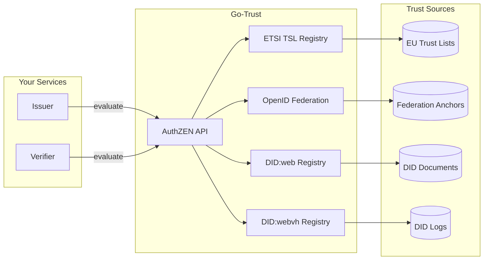
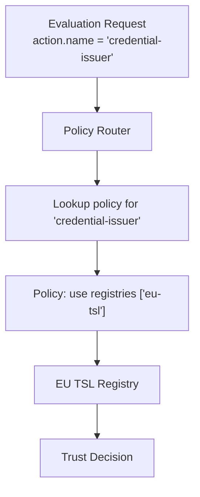

# Go-Trust AuthZEN Service

Go-Trust is a local trust engine that provides trust decisions via an [AuthZEN](https://openid.github.io/authzen/) policy decision point (PDP). It abstracts trust evaluation across multiple trust frameworks, allowing your issuer and verifier services to make consistent trust decisions without implementing complex trust logic.

## Why Use Go-Trust?

Trust evaluation in digital credential ecosystems is complex:

- **[ETSI TS 119 612](https://www.etsi.org/deliver/etsi_ts/119600_119699/119612/02.01.01_60/ts_119612v020101p.pdf)** requires parsing XML trust status lists, validating certificates, and tracking service status
- **[OpenID Federation](https://openid.net/specs/openid-federation-1_0.html)** involves trust chain resolution, signature verification, and trust mark validation
- **[DID:web](https://w3c-ccg.github.io/did-method-web/)** needs proper HTTP resolution and JWK matching
- **[DID:webvh](https://identity.foundation/didwebvh/v1.0/)** adds verifiable history with cryptographic integrity validation

Go-Trust handles all of this behind a simple AuthZEN API, so your services can focus on credentials.



## Quick Start

### Docker Deployment

```bash
# Pull the image
docker pull ghcr.io/sirosfoundation/go-trust:latest

# Run with default configuration
docker run -p 8081:8081 ghcr.io/sirosfoundation/go-trust:latest serve
```

### Docker Compose

Add to your `docker-compose.yaml`:

```yaml
services:
  go-trust:
    image: ghcr.io/sirosfoundation/go-trust:latest
    restart: always
    ports:
      - "8081:8081"
    volumes:
      - ./trust-config.yaml:/config.yaml:ro
      - ./trust-data:/data:ro  # For local TSL files
    command: ["serve", "--config", "/config.yaml"]
    healthcheck:
      test: ["CMD", "curl", "-f", "http://localhost:8081/healthz"]
      interval: 30s
      timeout: 10s
      retries: 3
```

## Configuration

### Basic Configuration

Create `trust-config.yaml`:

```yaml
server:
  addr: ":8081"
  metrics_addr: ":9090"

# ETSI Trust Status List support
etsi:
  enabled: true
  trust_list_url: "https://ec.europa.eu/tools/lotl/eu-lotl.xml"
  cache_duration: 3600
  follow_refs: true
  max_ref_depth: 3

# OpenID Federation support
openid_federation:
  enabled: true
  trust_anchors:
    - entity_id: "https://federation.example.com"
  cache_duration: 1800

# DID:web support
did_web:
  enabled: true
  allowed_domains:
    - "*.example.com"
    - "issuer.trusted.org"

# Resolution strategy for multiple registries
resolution:
  strategy: "first_match"  # first_match, all_registries, best_match, sequential
```

### Multi-Registry Configuration

Go-Trust can query multiple trust frameworks simultaneously:

```yaml
registries:
  - name: "eu-tsl"
    type: "etsi_tsl"
    priority: 1
    config:
      trust_list_url: "https://ec.europa.eu/tools/lotl/eu-lotl.xml"
      
  - name: "edu-federation"
    type: "openid_federation"
    priority: 2
    config:
      trust_anchors:
        - entity_id: "https://edugateway.org"
      required_trust_marks:
        - "https://edugateway.org/tm/accredited"
        
  - name: "company-did"
    type: "did_web"
    priority: 3
    config:
      allowed_domains:
        - "*.company.internal"

resolution:
  strategy: "first_match"
  policy: "any_match"  # any_match, all_must_match
```

### Static Registries

Go-Trust includes static registries for simple trust scenarios, testing, and development:

#### Whitelist Registry

The **whitelist registry** provides a simple URL-based trust model. Rather than validating certificates or trust chains, it simply checks if the subject identifier (URL) is in a configured list.

```yaml
registries:
  - name: "approved-issuers"
    type: "whitelist"
    config:
      # Path to whitelist file (JSON or YAML)
      file: "/config/approved-issuers.json"
      # Watch for file changes and auto-reload
      watch: true
```

**Whitelist file format** (`approved-issuers.json`):

```json
{
  "issuers": [
    "https://issuer1.example.com",
    "https://issuer2.example.org",
    "https://pilot.*.example.com"  
  ],
  "verifiers": [
    "https://verifier.example.com",
    "https://relying-party.example.org"
  ],
  "trusted_subjects": [
    "https://any-role.example.com"
  ]
}
```

**Features:**
- URLs can include wildcards (`*`) for prefix matching
- Separate lists for **issuers**, **verifiers**, and **trusted_subjects** (catch-all)
- The file can be hot-reloaded when `watch: true` is set
- No key validation—only URL authorization

**Use when:**
- You have a known set of trusted partners
- You want simple, file-based trust management
- Key validation is handled elsewhere (e.g., TLS)
- Rapid development or testing

:::caution
Whitelist registries only check if the identifier URL is allowed—they don't validate the actual cryptographic key material. Use ETSI, OpenID Federation, or X.509 registries when you need full key validation.
:::

#### Always-Trusted Registry

Returns `decision: true` for any request. Useful for testing or when trust is handled by other means.

```bash
# From command line
go-trust serve --registry always-trusted
```

#### Never-Trusted Registry

Returns `decision: false` for any request. Useful for testing rejection scenarios.

```bash
# From command line  
go-trust serve --registry never-trusted
```

### Policy-Based Trust Decisions

Define policies that map action names to trust requirements. The policy system maps application-level roles (issuer, verifier) to registry-specific constraints (ETSI service types, trust marks, DID domains, etc.):

```yaml
policies:
  # Default policy used when action.name is not specified
  default_policy: credential-verifier

  policies:
    # Credential issuers must be in EU TSL
    credential-issuer:
      description: "Trust requirements for credential issuers"
      etsi:
        service_types:
          - "http://uri.etsi.org/TrstSvc/Svctype/QCert"
          - "http://uri.etsi.org/TrstSvc/Svctype/QCertForESeal"
        service_statuses:
          - "http://uri.etsi.org/TrstSvc/TrustedList/Svcstatus/granted"
      oidfed:
        entity_types:
          - "openid_credential_issuer"
        required_trust_marks:
          - "https://dc4eu.eu/tm/issuer"
      did:
        allowed_domains:
          - "*.eudiw.dev"
          - "*.example.com"
        require_verifiable_history: true
    
    # Wallet providers need federation trust mark
    wallet-provider:
      description: "Trust requirements for wallet providers"
      oidfed:
        entity_types:
          - "wallet_provider"
        required_trust_marks:
          - "https://dc4eu.eu/tm/wallet"
      # Override which registries to use
      registries:
        - "oidfed-registry"
        
    # mDL issuers use IACA validation
    mdl-issuer:
      description: "Trust requirements for mDL/mDOC issuers"
      mdociaca:
        issuer_allowlist:
          - "https://pid-issuer.eudiw.dev"
          - "https://mdl-issuer.example.com"
        require_iaca_endpoint: true
      registries:
        - "mdoc-iaca"
```

## Query Routing

Go-Trust routes evaluation requests to appropriate registries based on the **action name** in the request. This allows different trust requirements for different use cases.

### How Routing Works



1. The client sends an evaluation request with an `action.name` field (e.g., `"credential-issuer"`)
2. Go-Trust looks up the policy associated with that action name
3. The policy specifies which registries to query and any additional constraints
4. Go-Trust queries the specified registries using the configured resolution strategy
5. Returns the aggregated trust decision

### Resolution Strategies

When multiple registries are applicable, Go-Trust uses a **resolution strategy** to determine the outcome:

| Strategy | Description |
|----------|-------------|
| `first_match` | Return the first registry that gives a positive decision |
| `all_registries` | Query all registries, return positive if all agree |
| `best_match` | Query all registries, return the highest confidence match |
| `sequential` | Query registries in order, stop at first definitive answer |

```yaml
resolution:
  strategy: "first_match"  # Default behavior
```

### Example: Multi-Tenant Trust

Configure different trust sources for different credential types:

```yaml
policies:
  default_policy: credential-issuer

  policies:
    # PID credentials (national ID) - strict EU TSL only
    pid-provider:
      description: "PID provider validation"
      etsi:
        service_types:
          - "http://uri.etsi.org/TrstSvc/Svctype/QCertForESig"
        service_statuses:
          - "http://uri.etsi.org/TrstSvc/TrustedList/Svcstatus/granted"

    # mDL credentials - ISO/IEC 18013-5 compliant CAs via IACA
    mdl-issuer:
      description: "mDL issuer validation"
      mdociaca:
        issuer_allowlist:
          - "https://pid-issuer.eudiw.dev"
        require_iaca_endpoint: true
      registries:
        - "mdoc-iaca"
        
    # Educational credentials - federation trust + fallback to TSL
    credential-issuer:
      description: "Generic credential issuer"
      oidfed:
        entity_types:
          - "openid_credential_issuer"
      etsi:
        service_types:
          - "http://uri.etsi.org/TrstSvc/Svctype/QCert"
```

### Fallback Behavior

If no policy matches the action name, Go-Trust uses the `default_policy`:

```yaml
policies:
  default_policy: "credential-issuer"  # Policy to use when action.name doesn't match
```

## AuthZEN API

Go-Trust implements the AuthZEN protocol for trust evaluation.

### Evaluation Request

```bash
curl -X POST http://localhost:8081/evaluation \
  -H "Content-Type: application/json" \
  -d '{
    "subject": {
      "type": "key",
      "id": "https://issuer.example.com"
    },
    "resource": {
      "type": "x5c",
      "id": "https://issuer.example.com",
      "key": ["MIIC...base64-cert..."]
    },
    "action": {
      "name": "credential-issuer"
    }
  }'
```

### Response

```json
{
  "decision": true,
  "context": {
    "reason": {
      "registry": "eu-tsl",
      "trust_service": "Qualified Electronic Signature",
      "service_status": "granted",
      "country": "SE"
    }
  }
}
```

### Resolution-Only Requests

To resolve trust metadata without key validation:

```bash
curl -X POST http://localhost:8081/evaluation \
  -H "Content-Type: application/json" \
  -d '{
    "subject": {
      "type": "key",
      "id": "did:web:issuer.example.com"
    },
    "resource": {
      "id": "did:web:issuer.example.com"
    }
  }'
```

Response includes the resolved DID document or entity configuration:

```json
{
  "decision": true,
  "context": {
    "trust_metadata": {
      "@context": ["https://www.w3.org/ns/did/v1"],
      "id": "did:web:issuer.example.com",
      "verificationMethod": [...]
    }
  }
}
```

## Integration with Issuer/Verifier

### Verifier Configuration

Configure the verifier to use go-trust for credential validation:

```yaml
verifier_proxy:
  trust:
    authzen_endpoint: "http://go-trust:8081"
    enabled: true
    
    # Policy to use when verifying issuer trust
    issuer_policy: "credential-issuer"
    
    # Cache trust decisions
    cache_duration: 300
```

### Issuer Configuration

Configure the issuer to validate wallet attestations:

```yaml
issuer:
  trust:
    authzen_endpoint: "http://go-trust:8081"
    enabled: true
    
    # Policy for wallet provider validation
    wallet_policy: "wallet-provider"
```

## Supported Trust Frameworks

### ETSI TSL 119 612

Validates X.509 certificates against EU Trust Status Lists:

```yaml
etsi:
  enabled: true
  trust_list_url: "https://ec.europa.eu/tools/lotl/eu-lotl.xml"
  accepted_schemes:
    - "http://uri.etsi.org/TrstSvc/TrustedList/schemerules/EUcommon"
  accepted_service_types:
    - "http://uri.etsi.org/TrstSvc/Svctype/EDS/Q"  # Qualified e-signatures
    - "http://uri.etsi.org/TrstSvc/Svctype/QESIG"  # Qualified e-sig creation
```

### OpenID Federation

Validates entities via federation trust chains:

```yaml
openid_federation:
  enabled: true
  trust_anchors:
    - entity_id: "https://federation.example.com"
      # Optional: pin to specific JWKS
      jwks_uri: "https://federation.example.com/.well-known/jwks.json"
  
  # Require specific trust marks
  required_trust_marks:
    - "https://example.eu/tm/wallet-provider"
    
  # Limit to specific entity types
  allowed_entity_types:
    - "openid_provider"
    - "openid_credential_issuer"
```

### DID:web

Resolves DIDs from web infrastructure:

```yaml
did_web:
  enabled: true
  allowed_domains:
    - "*.example.com"
    - "issuer.trusted.org"
  
  # TLS requirements
  require_tls: true
  min_tls_version: "1.2"
```

### DID:webvh

Resolves DIDs with verifiable history – an extension of DID:web providing cryptographic integrity:

```yaml
did_webvh:
  enabled: true
  
  # HTTP timeout for DID log resolution
  timeout: "30s"
  
  # TLS verification (disable only for testing)
  insecure_skip_verify: false
  
  # Allow HTTP (only for testing - production requires HTTPS)
  allow_http: false
```

**Features:**
- **Self-certifying identifiers** – DID is derived from initial log entry
- **Verifiable history** – Validates entire chain of DID document changes
- **Pre-rotation keys** – Supports secure key rotation with hash commitments
- **Witness support** – Third-party attestation of DID state changes

**Resource types:** `did_document`, `jwk`, `verification_method`

**Resolution-only:** Yes – Can resolve DID documents without key binding validation

## Observability

### Prometheus Metrics

Go-Trust exposes metrics at `/metrics`:

```
# Trust evaluation latency
go_trust_evaluation_duration_seconds{registry="eu-tsl",decision="allow"}

# Cache statistics
go_trust_cache_hits_total{registry="eu-tsl"}
go_trust_cache_misses_total{registry="eu-tsl"}

# Registry health
go_trust_registry_healthy{registry="eu-tsl"} 1
```

### Health Endpoints

```bash
# Liveness
curl http://localhost:8081/healthz

# Readiness (checks all registries)
curl http://localhost:8081/readyz
```

## Kubernetes Deployment

```yaml
apiVersion: apps/v1
kind: Deployment
metadata:
  name: go-trust
spec:
  replicas: 2
  selector:
    matchLabels:
      app: go-trust
  template:
    metadata:
      labels:
        app: go-trust
    spec:
      containers:
        - name: go-trust
          image: ghcr.io/sirosfoundation/go-trust:latest
          args: ["serve", "--config", "/config/config.yaml"]
          ports:
            - containerPort: 8081
              name: http
            - containerPort: 9090
              name: metrics
          volumeMounts:
            - name: config
              mountPath: /config
          livenessProbe:
            httpGet:
              path: /healthz
              port: 8081
            initialDelaySeconds: 10
          readinessProbe:
            httpGet:
              path: /readyz
              port: 8081
          resources:
            requests:
              memory: "128Mi"
              cpu: "100m"
            limits:
              memory: "512Mi"
              cpu: "500m"
      volumes:
        - name: config
          configMap:
            name: go-trust-config
---
apiVersion: v1
kind: Service
metadata:
  name: go-trust
spec:
  selector:
    app: go-trust
  ports:
    - name: http
      port: 8081
    - name: metrics
      port: 9090
```

## Next Steps

- [Trust Services Overview](./)
- [Issuer Configuration](../issuers/issuer)
- [Verifier Configuration](../verifiers/verifier)
- [Go-Trust GitHub Repository](https://github.com/sirosfoundation/go-trust)
