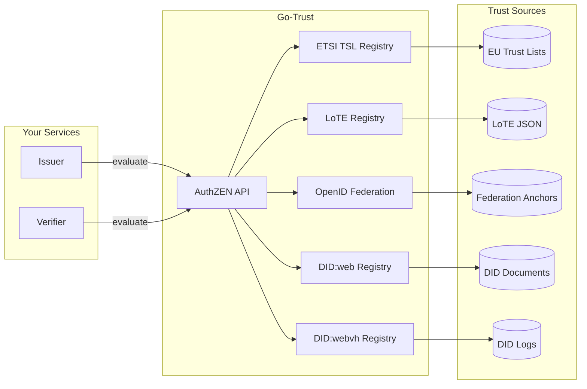
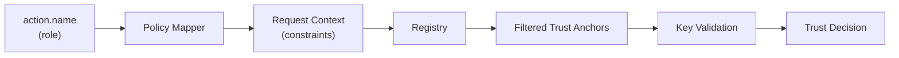
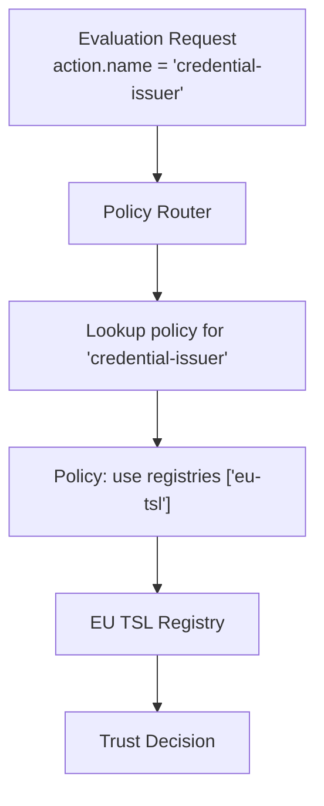
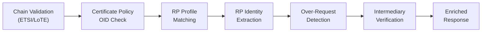
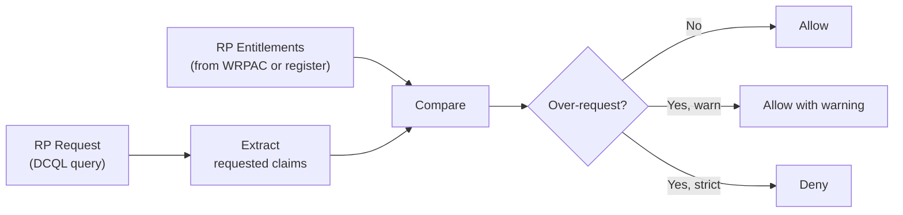

# Go-Trust AuthZEN Service

Go-Trust is a local trust engine that provides trust decisions via an [AuthZEN](https://openid.github.io/authzen/) policy decision point (PDP). It abstracts trust evaluation across multiple trust frameworks, allowing your issuer and verifier services to make consistent trust decisions without implementing complex trust logic.

## Why Use Go-Trust?

Trust evaluation in digital credential ecosystems is complex:

- **[ETSI TS 119 612](https://www.etsi.org/deliver/etsi_ts/119600_119699/119612/02.01.01_60/ts_119612v020101p.pdf)** requires parsing XML trust status lists, validating certificates, and tracking service status
- **[ETSI TS 119 602](https://www.etsi.org/deliver/etsi_ts/119600_119699/119602/)** involves parsing JSON Lists of Trusted Entities (LoTE) with JWK, X.509, or DID identities
- **[OpenID Federation](https://openid.net/specs/openid-federation-1_0.html)** involves trust chain resolution, signature verification, and trust mark validation
- **[DID:web](https://w3c-ccg.github.io/did-method-web/)** needs proper HTTP resolution and JWK matching
- **[DID:webvh](https://identity.foundation/didwebvh/v1.0/)** adds verifiable history with cryptographic integrity validation

Go-Trust handles all of this behind a simple AuthZEN API, so your services can focus on credentials.


```mermaid
flowchart LR
    subgraph Your Services
        Issuer[Issuer]
        Verifier[Verifier]
    end
    
    subgraph Go-Trust
        API[AuthZEN API]
        ETSI[ETSI TSL Registry]
        LOTE[LoTE Registry]
        OIDF[OpenID Federation]
        DIDWeb[DID:web Registry]
        DIDWebVH[DID:webvh Registry]
    end
    
    subgraph Trust Sources
        TSL[(EU Trust Lists)]
        LJSON[(LoTE JSON)]
        Fed[(Federation Anchors)]
        DID[(DID Documents)]
        DIDVH[(DID Logs)]
    end
    
    Issuer -->|evaluate| API
    Verifier -->|evaluate| API
    API --> ETSI
    API --> LOTE
    API --> OIDF
    API --> DIDWeb
    API --> DIDWebVH
    ETSI --> TSL
    LOTE --> LJSON
    OIDF --> Fed
    DIDWeb --> DID
    DIDWebVH --> DIDVH
```

## Quick Start

### Docker Deployment

```bash
# Pull the image
docker pull ghcr.io/sirosfoundation/go-trust:latest

# Run with default configuration. gt listens on 127.0.0.1 unless told
# otherwise, which inside a container is unreachable from the published port,
# so bind to all interfaces.
docker run -p 6001:6001 -e GT_HOST=0.0.0.0 ghcr.io/sirosfoundation/go-trust:latest
```

:::caution Bind address
`gt` defaults to `server.host: 127.0.0.1` and `server.port: "6001"`. In a container you must set `server.host: "0.0.0.0"` in the configuration file (or `GT_HOST=0.0.0.0`) or the published port will not reach the process. The image's built-in `HEALTHCHECK` probes port 8080 (the image `EXPOSE`s 8080), so if you keep the default port 6001 override the health check in your orchestrator, as in the Compose example below.
:::

### Docker Compose

Add to your `docker-compose.yaml`:

```yaml
services:
  go-trust:
    image: ghcr.io/sirosfoundation/go-trust:latest
    restart: always
    ports:
      - "6001:6001"
    volumes:
      - ./trust-config.yaml:/config.yaml:ro
      - ./trust-data:/data:ro  # For local TSL files
    command: ["--config", "/config.yaml"]   # config must set server.host: "0.0.0.0"
    healthcheck:
      # The image ships wget, not curl
      test: ["CMD", "wget", "--spider", "-q", "http://localhost:6001/healthz"]
      interval: 30s
      timeout: 10s
      retries: 3
```

## Configuration

:::tip Complete Configuration Reference
See the [generated configuration reference](/sirosid/trust/go-trust-configuration) for each `server`, `logging`, `security`, `registries` and `policies` key, its type, description, and (where one exists) `GT_*` environment variable override — generated directly from the Go config structs, so it can't drift from what the code actually accepts. Every tagged release also has its own pinned page in the sidebar.
:::

### Basic Configuration

Create `trust-config.yaml`:

```yaml
server:
  host: "0.0.0.0"
  port: "6001"

registries:
  # ETSI Trust Status List support
  etsi:
    enabled: true
    name: "EU-TSL"
    tsl_files:
      - "/var/lib/go-trust/eu-lotl.xml"
    follow_refs: true
    max_ref_depth: 3

  # OpenID Federation support
  oidfed:
    enabled: true
    trust_anchors:
      - entity_id: "https://federation.example.com"
    cache_ttl: "30m"

  # DID:web support
  didweb:
    enabled: true
    timeout: "30s"
```

The configuration file has exactly five top-level sections — `server`,
`logging`, `security`, `registries` and `policies`. Every registry is a named
key under `registries`; the names are fixed (see the inventory below). There is
no top-level `trust:`, `etsi:` or `resolution:` block (the resolution strategy
is `registries.strategy`, see [Resolution Strategy](#resolution-strategy)), and
`/metrics` is served on the same listener as the API — there is no separate
metrics port.

Which *domains*, service types or trust marks a registry accepts is a
**policy** concern, not a registry setting — see
[Policy-Based Trust Decisions](#policy-based-trust-decisions) below.

### Server and Security Settings

```yaml
server:
  host: "0.0.0.0"
  port: "6001"
  # Advertised in /.well-known/authzen-configuration so clients can discover
  # the evaluation endpoint behind a proxy
  external_url: "https://pdp.example.com"
  tls:
    enabled: true
    cert_file: "/pki/pdp.crt"
    key_file: "/pki/pdp.key"

logging:
  level: "info"     # debug | info | warn | error
  format: "json"    # text | json
  output: "stdout"

security:
  # Cap on the size of any HTTP response a registry will read, in bytes.
  # Default 10 MB. Guards against a hostile trust-list endpoint.
  max_response_body_bytes: 10485760

  # Per-client-IP rate limit on the API, in requests per second (burst is
  # rate_limit_rps / 10, minimum 1). 0 disables limiting. /healthz, /readyz and
  # /metrics are exempt.
  rate_limit_rps: 50

  # CORS for browser clients
  enable_cors: true
  allowed_origins:
    - "https://app.example.com"

  # CIDRs whose X-Forwarded-For / X-Real-IP headers are believed
  trusted_proxies:
    - "10.0.0.0/8"
```

`server`, `logging` and `security.max_response_body_bytes` also take `GT_*`
environment overrides (`GT_HOST`, `GT_PORT`, `GT_LOG_LEVEL`,
`GT_MAX_RESPONSE_BODY_BYTES`, …) — the
[generated reference](/sirosid/trust/go-trust-configuration) lists each one.
Registry and policy settings are YAML-only.

:::warning Set `trusted_proxies` behind a load balancer
Rate limiting keys on the client address. `security.trusted_proxies` is empty by default, which means forwarded headers are ignored and the TCP peer address is used. If go-trust runs behind a load balancer or ingress and you enable `rate_limit_rps`, list the proxy's CIDRs in `trusted_proxies`; otherwise every client shares the proxy's single bucket. Conversely, never list a range that clients can reach directly, or a client could rotate `X-Forwarded-For` to get a fresh bucket per request.
:::

### Registry Inventory

Every trust registry the `gt` server can be told to use from `config.yaml`:

| Registry | Config key | Validates | Resource types | Resolution-only |
|---|---|---|---|---|
| ETSI TSL | `etsi` | X.509 chains against ETSI TS 119 612 trust lists, or a plain PEM `cert_bundle` | `x5c`, `jwk`, `x509_san_dns`, `x509_san_uri` | No |
| LoTE | `lote` | Entities in ETSI TS 119 602 JSON Lists of Trusted Entities | `jwk`, `x5c` | Yes |
| OpenID Federation | `oidfed` | Trust chains from a leaf entity to a configured trust anchor | `entity`, `openid_provider`, `relying_party`, `oauth_client`, `oauth_server`, … | Yes |
| Whitelist | `whitelist` | A file-based entity allowlist, with JWKS fetched per entity | `jwk`, `x5c`, `x509_san_dns`, `x509_san_uri` | Yes |
| DID (self-contained) | `didlocal` | Self-contained DID methods — `did:key`, `did:jwk` — resolved with no network access. Pick methods with `methods: ["key", "jwk"]`; empty enables all | `jwk`, `kid` | Yes |
| DID:web | `didweb` | DID documents fetched over HTTPS | `jwk` | Yes |
| DID:webvh | `didwebvh` | DID documents with a verifiable history log | `jwk` | Yes |
| did:jwks | `didjwks` | Existing OAuth2/OIDC JWKS endpoints addressed as DIDs; the DID document is generated from the fetched JWKS | `jwk` | Yes |
| mDOC IACA | `mdociaca` | mdoc **issuer** chains against IACA certificates fetched from OpenID4VCI issuers | `x5c` | No |
| VICAL | `vical` | mdoc **issuer** certificates against an ISO/IEC 18013-5 Annex C Verified Issuer CA List, including its per-certificate doctype restrictions | `x5c` | No |
| RICAL | `mdocrical` | mdoc **reader** certificates against a Reader Identity CA List (ISO/IEC 18013-5 2nd ed. Annex F) | `x5c` | No |
| eMRTD document signer | `emrtd` | ePassport/ID chip Document Signer Certificates against a reviewed set of CSCA anchors, per issuing state; see [eMRTD Document Signer Trust](./emrtd-document-signer) | `x5c` | No |
| FIDO MDS3 | `fidomds3` | FIDO2/CTAP2 authenticator attestation certificates against the FIDO Alliance Metadata Service v3 blob | `x5c` | No |
| Always-trusted | `always_trusted` | Nothing — returns `decision: true` | `*` | Yes |
| Never-trusted | `never_trusted` | Nothing — returns `decision: false` | `*` | Yes |
| System cert pool | `systemcertpool` | X.509 chains against the **operating system's root CA store** | `x5c`, `jwk` | No |
| Composite | `composite` (a list) | Combines other configured registries with `AND` / `OR` / `MAJORITY` / `QUORUM` | inherited | inherited |

:::note Unknown keys are reported, not silently dropped
Since v0.23.0, `gt` logs `Unknown config key ignored` (with the key, line and section) for every key it does not recognise, so a typo or a renamed key (for example `did_local`, renamed to `didlocal` in v0.21.1) shows up in the startup log. These warnings are slated to become startup errors, so fix them now.
:::

#### Default registry names

A policy's `registries:` list (see [Policy-Based Trust Decisions](#policy-based-trust-decisions)) matches the registry's **reported name** exactly. Some registries honour the `name:` key in their block; others have a fixed name regardless of any `name:` you set:

| Config key | Registry name | `name:` honoured? |
|---|---|---|
| `etsi` | `ETSI-TSL` | Yes |
| `lote` | `LoTE` | Yes |
| `oidfed` | `oidfed-registry` | No |
| `whitelist` | `whitelist` | Yes |
| `didlocal` | `generic-did-registry` | No |
| `didweb` | `didweb-registry` | No |
| `didwebvh` | `didwebvh-registry` | No |
| `didjwks` | `didjwks-registry` | No |
| `mdociaca` | `mdoc-iaca` | Yes |
| `vical` | `mdoc-vical` | Yes |
| `mdocrical` | `mdoc-rical` | Yes |
| `emrtd` | `emrtd-csca` | Yes |
| `fidomds3` | `fido-mds3` | Yes |
| `systemcertpool` | `system-cert-pool` | Yes |

A policy that names a registry that does not exist matches nothing, so every request for that role is denied.

### ETSI TSL Multi-Source Configuration

The ETSI TSL registry supports loading trust data from **multiple sources simultaneously**. You can combine any or all of these source types in a single registry:

- **`cert_bundle`** — A PEM file containing pre-extracted trusted CA certificates (recommended for production)
- **`tsl_files`** — A list of local TSL XML files
- **`tsl_urls`** — A list of remote or local (`file://`) URLs to fetch TSL XML from

All certificates from all sources are merged into a single trust pool, and the individual TSL documents are kept for filtered evaluation via policies.

```yaml
registries:
  etsi:
    enabled: true
    name: "EU-TSL"

    # PEM bundle with pre-extracted certificates (fast, no XML parsing)
    cert_bundle: "/var/lib/go-trust/eu-trusted-certs.pem"

    # Multiple local TSL XML files
    tsl_files:
      - "/var/lib/go-trust/eu-lotl.xml"
      - "/var/lib/go-trust/se-tsl.xml"
      - "/var/lib/go-trust/de-tsl.xml"

    # Multiple remote (or file://) TSL URLs.
    # http(s) URLs are refused unless allow_network_access is true.
    allow_network_access: true
    tsl_urls:
      - "https://ec.europa.eu/tools/lotl/eu-lotl.xml"
      - "file:///var/lib/go-trust/backup-tsl.xml"

    # Follow TSL references (pointers to member state TSLs in a LOTL)
    follow_refs: true
    max_ref_depth: 3

    # HTTP client settings for remote fetches
    fetch_timeout: "30s"
    user_agent: "Go-Trust/1.0 TSL Registry"

    # Re-fetch all sources periodically (empty / 0 = load once at startup)
    refresh_interval: "6h"
```

#### Verifying the Trust List's Own Signature

By default a TSL is parsed without checking who signed it. For a LOTL fetched
over the network that is usually not good enough:

```yaml
registries:
  etsi:
    enabled: true
    allow_network_access: true
    tsl_urls:
      - "https://ec.europa.eu/tools/lotl/eu-lotl.xml"

    # PEM file of certificates permitted to sign the LOTL
    lotl_signer_bundle: "/var/lib/go-trust/lotl-signers.pem"

    # Reject a TSL whose signature is missing or does not verify,
    # instead of loading it anyway
    require_signature: true

    # Follow ETSI TS 119 615 pivot LOTLs to discover a signer that is
    # not yet in the bundle. Requires network access.
    follow_pivots: true
```

`require_signature: true` is what turns a failed verification into a refusal —
with `lotl_signer_bundle` set but `require_signature` left false, an unverifiable
list still loads. `follow_pivots` exists because the EU rotates LOTL signers
through pivot lists: when the signer is unknown to the bundle, the registry can
walk the pivot chain to establish it rather than failing outright.

:::note Refreshing trust lists
Set `refresh_interval` (a duration string such as `"6h"`) on `registries.etsi` to have `gt` re-fetch and re-load all sources in the background. Empty or `0` disables refreshing, and the registry then loads its sources once at startup. The `lote`, `whitelist` and `fidomds3` registries have their own `refresh_interval` too.
:::

:::tip
For production, pre-process trust lists into a PEM `cert_bundle` using `tsl-tool` from [g119612](https://github.com/sirosfoundation/g119612). This avoids runtime XML parsing and reference following, giving faster startup and predictable behavior.
:::

### Multi-Registry Configuration

Go-Trust can query multiple trust frameworks simultaneously. Enable each one
under its own fixed key — registries are a map, not a list, so there is no
`type:` or `priority:` field:

```yaml
registries:
  etsi:
    enabled: true
    name: "eu-tsl"             # honoured: policies refer to it as "eu-tsl"
    cert_bundle: "/var/lib/go-trust/eu-certs.pem"

  oidfed:
    enabled: true              # always named "oidfed-registry"
    trust_anchors:
      - entity_id: "https://edugateway.org"
    required_trust_marks:
      - "https://edugateway.org/tm/accredited"

  didweb:
    enabled: true              # always named "didweb-registry"
```

See [Default registry names](#default-registry-names) for what to put in a policy's `registries:` list.

Which registries a given request may consult, and any per-role constraints
(allowed DID domains, ETSI service types, required trust marks), are expressed
as **policies** — see below.

### LoTE Registry Configuration

Go-Trust can evaluate trust from ETSI TS 119 602 Lists of Trusted Entities (LoTE) — JSON documents that list trusted entities with their digital identities.

The LoTE registry supports **multiple sources**, which are all fetched and merged into a single entity index. This allows combining trust lists from different scheme operators, countries, or environments:

```yaml
registries:
  lote:
    enabled: true
    name: "LoTE Registry"
    description: "ETSI TS 119 602 List of Trusted Entities"
    sources:
      - "https://lote.example.org/lote-SE.json"    # Sweden
      - "https://lote.example.org/lote-DE.json"    # Germany
      - "https://lote.example.org/lote-FR.json"    # France
      - "/etc/go-trust/local-lote.json"            # Local overrides
    fetch_timeout: "30s"
    refresh_interval: "1h"       # How often to re-fetch all sources
    # lotl_sources: ["https://lote.example.org/lotl.json"]  # lists of LoTE lists to dereference
    # max_dereference_depth: 3                              # bound on following LoTL pointers
```

:::warning `gt` does not verify LoTE signatures
`verify_jws` is accepted in the configuration but currently has **no effect** in the `gt` server: signature verification only runs when a trust-anchor provider is supplied to the registry, and `gt` never supplies one. A LoTE fetched by `gt` is trusted on the strength of the transport (HTTPS) and of who controls the source, whether or not it is JWS-signed. Use only sources you control or trust, and prefer local files or authenticated HTTPS endpoints. Do not rely on `verify_jws: true` as a control.
:::

All entities across sources are indexed by EntityID and by key hash (SHA-256 fingerprint), enabling efficient lookup regardless of which source the entity came from. Sources are re-fetched periodically and the index is swapped atomically.

The LoTE registry evaluates trust by:
1. Looking up the entity by `subject.id` (the entity's identifier)
2. Checking the entity's status is active (granted)
3. Validating the resource key against the entity's digital identities:
   - **X.509 (`x5c`)**: PKIX path validation against entity certificates
   - **JWK (`jwk`)**: SHA-256 fingerprint matching against entity JWK keys

:::tip
To create and publish LoTE documents, use `tsl-tool` from [g119612](https://github.com/sirosfoundation/g119612). See the [LoTE Publishing Guide](./lote-publishing) for a complete walkthrough.
:::

### mdoc Registries (ISO/IEC 18013-5)

Three registries cover mdoc/mDL trust. They differ in *whose* certificate they
authenticate and in where the list of trust anchors comes from, so they are not
interchangeable.

| Registry | Authenticates | Trust anchors come from |
|---|---|---|
| `mdociaca` | The mdoc **issuer** (document signer) | Each issuer's own OpenID4VCI metadata, fetched per issuer |
| `vical` | The mdoc **issuer** | One centrally-published, COSE_Sign1-signed VICAL (Annex C) |
| `mdocrical` | The mdoc **reader** | One centrally-published, COSE_Sign1-signed RICAL (Annex F) |

#### mDOC IACA Registry

Validates an issuer's X.509 chain against IACA (Issuing Authority Certificate
Authority) certificates discovered from the issuer itself:

1. The request carries the issuer URL in `subject.id` and the chain in `resource.key`
2. The registry fetches the issuer's OpenID4VCI metadata and reads `mdoc_iacas_uri`
3. It fetches the IACA certificates from that endpoint
4. It path-validates the presented chain against them
5. It optionally enforces an issuer allowlist

```yaml
registries:
  mdociaca:
    enabled: true
    name: "mdoc-iaca"
    # Static allowlist; a policy can add to it per role
    issuer_allowlist:
      - "https://pid-issuer.eudiw.dev"
    cache_ttl: "1h"
    http_timeout: "30s"
```

:::note A SIROS convention, not an ISO mechanism
Discovering IACAs from each issuer's `mdoc_iacas_uri` is a convention of this
stack, not something ISO/IEC 18013-5 defines. This registry never sees a real
VICAL structure and so has no concept of per-certificate doctype restrictions.
Where a genuine VICAL is available, prefer the `vical` registry below.
:::

#### VICAL Registry

Authenticates mdoc **issuers** against a Verified Issuer Certificate Authority
List per ISO/IEC 18013-5 Annex C — one centrally-published, COSE_Sign1-signed
document fetched from a single provider URL and refreshed on a cache TTL.

Its distinguishing feature is that it enforces each `CertificateInfo` entry's
required `docType` list, which `mdociaca` cannot. Pass the doctype being
presented as `doc_type` in the request context; when it is present and the
matched entry does not list it, the request is denied with
`certificate not listed in VICAL for docType "..."`.

```yaml
registries:
  vical:
    enabled: true
    name: "vical"
    vical_provider_url: "https://vical.example.org/vical.cbor"
    # Out-of-band trust anchor for the VICAL's own COSE_Sign1 signature
    vical_root_certificate_pem: |
      -----BEGIN CERTIFICATE-----
      ...
      -----END CERTIFICATE-----
    cache_ttl: "1h"
    http_timeout: "30s"
```

#### RICAL Registry

The reader-side mirror of VICAL: authenticates an mdoc **reader's** end-entity
certificate for reader authentication (ISO/IEC 18013-5 second edition §9.1.4,
Annex F). The RICAL is a single COSE_Sign1-signed document (F.3.2) fetched from
one provider URL, so a RICAL Provider can update the list without any reader or
wallet redeploy — which is what makes it workable during an interop test event.

The presented chain is path-validated against the RICAL's trust-anchor-flagged
`CertificateInfo` entries, and the first matching entry's `TrustConstraints`
are applied, per F.3.2.6.

```yaml
registries:
  mdocrical:
    enabled: true
    name: "rical"
    rical_provider_url: "https://rical.example.org/rical.cbor"
    rical_root_certificate_pem: |
      -----BEGIN CERTIFICATE-----
      ...
      -----END CERTIFICATE-----
    cache_ttl: "1h"
    http_timeout: "30s"
```

:::info Annex F does not define root trust
Neither annex says how the root that signs the list is itself trusted, so
`vical_root_certificate_pem` / `rical_root_certificate_pem` must be configured
out of band by the operator.
:::

### eMRTD Document Signer Registry

The `emrtd` registry decides whether the Document Signer Certificate (DSC) of an electronic passport or ID card chains, for the claimed issuing state, to a Country Signing CA (CSCA) in a reviewed anchor directory. The policy enforcement point verifies the chip's SOD itself and sends only the DSC and any other certificates carried in the SOD. The registry never sees the SOD or any personal data. It is available from v0.24.0.

```yaml
registries:
  emrtd:
    enabled: true
    name: emrtd-csca
    anchors_dir: /etc/go-trust/emrtd/anchors   # <ALPHA3>/*.pem, e.g. SWE/
    crls_dir: /etc/go-trust/emrtd/crls         # optional, <ALPHA3>/*.crl
    watch: true

policies:
  policies:
    emrtd-document-signer:
      registries: [emrtd-csca]
      constraints:
        require_key_binding: true
        allowed_key_types: [x5c]
```

See [eMRTD Document Signer Trust](./emrtd-document-signer) for the anchor directory format, request and response, deny codes, validation rules and deployment.

### FIDO MDS3 Registry

Validates FIDO2/CTAP2 authenticator attestation certificates against the
[FIDO Alliance Metadata Service v3](https://fidoalliance.org/metadata/) — the
official, signed, periodically-updated registry of certified authenticator
models, their attestation roots, and their certification/revocation status.

The registry fetches the MDS3 blob, verifies its JWT signature, indexes entries
by AAGUID, and re-fetches on a ticker. An evaluation identifies the
authenticator model by AAGUID (a UUID, in `subject.id`/`resource.id`) and
presents the attestation `x5c` chain as the key.

```yaml
registries:
  fidomds3:
    enabled: true
    name: "fido-mds3"
    url: "https://mds3.fidoalliance.org/"
    root_certificate_pem: |
      -----BEGIN CERTIFICATE-----
      ...
      -----END CERTIFICATE-----
    fetch_timeout: "30s"
    refresh_interval: "24h"
    # Optional on-disk copy, so a restart does not depend on MDS3 reachability
    cache_path: "/var/lib/go-trust/mds3-blob.jwt"
```

Two policy constraints narrow it further:

```yaml
policies:
  policies:
    wallet_provider:
      fidomds3:
        # Only these models are trusted, whatever MDS3 says
        allowed_aaguids:
          - "d8522d9f-575b-4866-88a9-ba99fa02f35b"
        # Denied even if MDS3 certifies them.
        # Only consulted when allowed_aaguids is empty.
        blocked_aaguids: []
```

### DID Registries

Four registries cover DIDs. `didlocal` needs no network access; the other three
fetch something.

#### Self-Contained DID Methods (`didlocal`)

Resolves DID methods that carry their own key material in the identifier —
`did:key` and `did:jwk` — with no network access at all. The `methods` list
selects which to enable; an empty list enables every self-contained method, and
an unrecognised method name is a startup error rather than a warning.

```yaml
registries:
  didlocal:
    enabled: true
    methods: ["key", "jwk"]
```

`did:web` and `did:webvh` are configured separately, under `didweb` and
`didwebvh`, because they fetch and cache documents.

#### did:jwks Registry

Lets an existing OAuth2/OIDC JWKS endpoint be addressed as a DID. The DID
document is generated from the fetched JWKS rather than published, so the
method is purely generative.

Resolution parses the DID into a domain and optional path (colons in the path
become slashes), then tries `/.well-known/jwks.json` for a root DID or
`/{path}/jwks.json` for a path DID, falling back to OAuth2/OIDC discovery of
`jwks_uri`. A DID URL fragment matches either a JWK's `kid` or its RFC 7638
thumbprint.

```yaml
registries:
  didjwks:
    enabled: true
    timeout: "30s"
    allow_http: false
    insecure_skip_verify: false
    # Skip the OAuth2/OIDC discovery fallback and use the well-known paths only
    disable_oidc_discovery: false
```

Spec: [did-jwks](https://github.com/catena-labs/did-jwks/blob/main/SPEC.md).

### Static Registries

Go-Trust includes static registries for simple trust scenarios, testing, and development:

#### Whitelist Registry

The **whitelist registry** maintains a list of trusted entity URLs and validates name-to-key bindings by fetching and caching each entity's JWKS (JSON Web Key Set). For each whitelisted entity, it:

1. Discovers the entity's JWKS endpoint via standard metadata discovery
2. Fetches and caches the public keys
3. Computes SHA-256 fingerprints for each key
4. Validates that incoming request keys match a whitelisted entity's keys

```yaml
registries:
  whitelist:
    enabled: true
    config_file: "/config/approved-issuers.yaml"
    watch_file: true  # Auto-reload on changes
```

**Whitelist file format — new format** (recommended):

```yaml
# Named entity lists
lists:
  pid-issuers:
    - "https://issuer1.example.com"
    - "https://issuer2.example.org"
  verifiers:
    - "https://verifier.example.com"
    - "https://relying-party.example.org"

# Map action names to lists
actions:
  pid-provider: "pid-issuers"
  credential-issuer: "pid-issuers"
  verifier: "verifiers"
  credential-verifier: "verifiers"

# JWKS discovery configuration
jwks_endpoint_pattern: ""  # Empty: use standard metadata discovery
fetch_timeout: "30s"
refresh_interval: "5m"     # Background JWKS refresh interval
allow_http: false          # Require HTTPS for JWKS endpoints
```

**Whitelist file format — legacy format** (backward compatible):

```json
{
  "issuers": [
    "https://issuer1.example.com",
    "https://issuer2.example.org"
  ],
  "verifiers": [
    "https://verifier.example.com",
    "https://relying-party.example.org"
  ],
  "trusted_subjects": [
    "https://any-role.example.com"
  ]
}
```

The legacy format auto-maps to actions: `issuers` → `credential-issuer`/`pid-provider`, `verifiers` → `credential-verifier`/`verifier`, and `trusted_subjects` acts as a catch-all.

**JWKS Discovery Order:**

When no explicit `jwks_endpoint_pattern` is set, the registry discovers keys via:
1. **SD-JWT VC §5.3** — `{entity}/.well-known/jwt-vc-issuer` (supports inline JWKS)
2. **RFC 8414** — `{entity}/.well-known/oauth-authorization-server`
3. **OIDC Discovery** — `{entity}/.well-known/openid-configuration`
4. **OpenID4VCI** — `{entity}/.well-known/openid-credential-issuer`
5. **Fallback** — `{entity}/.well-known/jwks.json`

**Features:**
- URLs can include wildcards (`*`) for prefix matching
- Named lists with action-to-list mapping for role-based trust
- Automatic JWKS discovery and key fingerprint caching
- Background refresh loop keeps keys up to date
- Hot-reloadable configuration file
- Supports resolution-only requests (URL authorization without key validation)

**Use when:**
- You have a known set of trusted partners
- You want simple, file-based trust management with full key validation
- Standard metadata discovery works for your entities

:::tip Key Validation
The whitelist registry performs full cryptographic key validation by default. Each entity's JWKS is fetched at startup and periodically refreshed.

Note what "healthy" means here: the registry reports healthy when the most
recent refresh loaded **at least one** key, not when every configured entity
resolved. A single reachable entity is enough to keep `/readyz` green while
others are failing, so use `GET /readyz?verbose=true` or the logs to confirm
that the entity you care about actually has keys cached.
:::

##### Trusting X.509 Cert-Based Verifiers (No JWKS)

The whitelist registry's key validation described above assumes every entity has a fetchable JWKS. That assumption doesn't hold for OpenID4VP verifiers using the [`x509_san_dns` or `x509_hash` client_id_scheme](#subject-id-normalization) — these authenticate via an X.509 certificate chain (`x5c`) embedded in the signed request's JWS header, not a JWKS endpoint. Since there's nothing to fetch, such a verifier's whitelist entry never gets keys loaded, and by default is denied with "no keys cached for entity", no matter how it's configured.

Set `trust_x509_via_system_ca: true` to close this gap:

```yaml
registries:
  whitelist:
    enabled: true
    lists:
      verifiers:
        - "https://vc-verifier.example.com"
        - "x509_san_dns:verifier.example.com"
    actions:
      credential-verifier: "verifiers"
      verifier: "verifiers"
    trust_x509_via_system_ca: true
```

When enabled, for an entity that:
1. is a member of the matched action's list (the ordinary whitelist membership check above still applies — this is **not** a blanket "trust any certificate" fallback),
2. has no fetchable JWKS **and** whose identifier uses a non-HTTP(S) scheme (i.e. it was never JWKS-fetchable to begin with), and
3. is being evaluated against an `x5c` resource,

the registry falls back to validating the presented certificate chain against the **operating system's root CA pool**, instead of denying for "no keys cached". Both `x509_san_dns` and `x509_hash` are covered identically — the fallback is scheme-agnostic beyond special-casing `http(s)` as "must use JWKS". Write non-http(s) list entries in their original prefixed form, such as `x509_san_dns:verifier.example.com`. The registry manager rewrites `subject.id` to `https://verifier.example.com` before registries see it (see [Subject ID Normalization](#subject-id-normalization)), and the whitelist recovers the original prefixed identifier for this non-HTTP(S) fallback path. `x509_hash:` identifiers are not rewritten.

:::caution
This does **not** relax trust for ordinary `https://` entities. A real whitelisted verifier whose JWKS fetch failed for an unrelated reason (network error, misconfiguration) is still denied as before — the system-CA fallback only ever applies to entities that were never JWKS-fetchable in the first place.
:::

| Field | YAML key | Default | Description |
|---|---|---|---|
| Trust X.509 via system CA | `whitelist.trust_x509_via_system_ca` | `false` | When `true`, whitelisted entities with a non-HTTP(S) identifier and no fetchable JWKS fall back to validating their presented `x5c` chain against the system root CA pool. |

##### Adding Custom Roots to the X.509 Trust Pool

Some verifiers sign requests with a certificate chaining to a long-lived, self-signed "reader CA" root that is meant to be trusted out-of-band per ISO 18013-5 convention, rather than to a public CA in the system pool — for example, `verifier.multipaz.org`'s request-signing certificate is issued by exactly such a root (published at its own `/verifier/readerRootCert` endpoint), distinct from the publicly-CA-issued HTTPS/TLS certificate the same host also serves. `trust_x509_via_system_ca`'s OS pool alone won't validate a chain against such a root.

Set `additional_trusted_roots` to merge one or more PEM-encoded CA certificates into that same chain-validation pool:

```yaml
registries:
  whitelist:
    enabled: true
    lists:
      verifiers:
        - "x509_san_dns:verifier.example.com"
    actions:
      credential-verifier: "verifiers"
      verifier: "verifiers"
    trust_x509_via_system_ca: true
    additional_trusted_roots:
      - |
        -----BEGIN CERTIFICATE-----
        MIIBXXXX...one PEM cert per list entry...XXXX
        -----END CERTIFICATE-----
```

This only affects the `x509_san_dns`/`x509_san_uri` chain-validation path — `x509_hash` pins a specific leaf certificate and skips chain validation entirely, so `additional_trusted_roots` has no effect on it. Trusting the root here (rather than pinning the leaf via `x509_hash`) is preferable when the root is long-lived: it survives the verifier rotating its signing certificate, whereas a pinned leaf hash breaks the moment that happens.

:::caution
Some real-world reader-CA roots are issued with a negative serial number (RFC 5280 recommends non-negative but doesn't forbid it, and common CA tooling still produces them). Go's x509 parser rejects these by default since Go 1.23, in which case `additional_trusted_roots` silently becomes a no-op for that specific root. Go-Trust's own shipped binary sets `GODEBUG=x509negativeserial=1` to accommodate this — anything embedding this package directly must set the same environment variable, or affected roots won't actually be trusted despite being configured.
:::

| Field | YAML key | Default | Description |
|---|---|---|---|
| Additional trusted roots | `whitelist.additional_trusted_roots` | *(none)* | List of PEM-encoded CA certificates merged into `trust_x509_via_system_ca`'s chain-validation pool, for verifiers whose signing certificate chains to a custom root rather than a publicly-trusted one. |

#### System Certificate Pool Registry

Validates an X.509 chain against the **operating system's root CA store** —
simple PKI trust with no trust list, no federation and no allowlist. Useful
when the signing certificates already chain to a publicly-trusted CA.

Its limitations are deliberate and worth stating: it does **not** check
revocation (no CRL, no OCSP), it enforces no service types or trust
frameworks, and it refuses resolution-only requests. Trust rests entirely on
the system CA bundle. Chain verification uses `ExtKeyUsageAny`, so a
certificate carrying only `id-kp-clientAuth` (as WRPACs often do) still
validates.

:::note
Enable it with `registries.systemcertpool`. It is named `system-cert-pool` unless you set `name`.

```yaml
registries:
  systemcertpool:
    enabled: true
    # name: "system-cert-pool"
    # description: "System root CA certificates"
```

Because it trusts every CA the operating system trusts, scope it with a policy
(`registries: [system-cert-pool]`) on the roles that need it. A narrower option
is `registries.whitelist` with `trust_x509_via_system_ca: true`, which reaches
the same OS root pool but only as a fallback for entities that are already
whitelisted and have no fetchable JWKS; see
[Trusting X.509 Cert-Based Verifiers](#trusting-x509-cert-based-verifiers-no-jwks).
:::

#### Always-Trusted Registry

Returns `decision: true` for any request. Useful for testing or when trust is handled by other means.

```bash
# From command line
gt --registry always-trusted
```

#### Never-Trusted Registry

Returns `decision: false` for any request. Useful for testing rejection scenarios.

```bash
# From command line  
gt --registry never-trusted
```

### Policy-Based Trust Decisions

Define policies that map action names to trust requirements. The policy system maps application-level roles (issuer, verifier) to registry-specific constraints (ETSI service types, trust marks, DID domains, etc.):

```yaml
policies:
  # Default policy used when action.name is not specified
  default_policy: credential-verifier

  policies:
    # Credential issuers must be in EU TSL
    credential-issuer:
      description: "Trust requirements for credential issuers"
      etsi:
        service_types:
          - "http://uri.etsi.org/TrstSvc/Svctype/CA/QC"
        service_statuses:
          - "http://uri.etsi.org/TrstSvc/TrustedList/Svcstatus/granted"
      oidfed:
        entity_types:
          - "openid_credential_issuer"
        required_trust_marks:
          - "https://dc4eu.eu/tm/issuer"
      did:
        allowed_domains:
          - "*.eudiw.dev"
          - "*.example.com"
        require_verifiable_history: true   # did:webvh only: demand a verifiable history log
        # required_services: ["OpenID4VCI"]   # DID document must list these service types

    # Wallet providers need federation trust mark. The action name is
    # "wallet_provider" (underscore), which is what vc sends.
    wallet_provider:
      description: "Trust requirements for wallet providers"
      oidfed:
        entity_types:
          - "wallet_provider"
        required_trust_marks:
          - "https://dc4eu.eu/tm/wallet"
      # Override which registries to use
      registries:
        - "oidfed-registry"
        
    # mDL issuers use IACA validation
    mdl-issuer:
      description: "Trust requirements for mDL/mDOC issuers"
      mdociaca:
        issuer_allowlist:
          - "https://pid-issuer.eudiw.dev"
          - "https://mdl-issuer.example.com"
        require_iaca_endpoint: true
      registries:
        - "mdoc-iaca"
```

## Query Routing

Go-Trust routes evaluation requests to appropriate registries based on the **action name** in the request. This allows different trust requirements for different use cases.

### Trust Evaluation Architecture

Every trust evaluation follows a canonical pattern:


```mermaid
flowchart LR
    Action["action.name<br/>(role)"] --> PolicyMapper["Policy Mapper"]
    PolicyMapper --> Context["Request Context<br/>(constraints)"]
    Context --> Registry["Registry"]
    Registry --> FilteredAnchors["Filtered Trust Anchors"]
    FilteredAnchors --> KeyCheck["Key Validation"]
    KeyCheck --> Decision["Trust Decision"]
```

1. The **action name** (e.g., `credential-issuer`) identifies the role being evaluated
2. The **policy mapper** looks up the policy for that role and injects registry-specific constraints into the request context
3. Each **registry** reads its constraints from the context and filters its trust anchors accordingly
4. The registry evaluates the presented key material against the **filtered** trust anchors
5. The registry returns a trust decision with diagnostic information in the response context

This ensures that the same registry instance can enforce different trust requirements depending on the role, without needing separate registry configurations per role.

#### How Each Registry Uses Policy Constraints

| Registry | Constraint Fields | Enforcement |
|----------|-------------------|-------------|
| **ETSI TSL** | `service_types`, `service_statuses` | Builds a **dynamic cert pool** filtered to only include certificates from trust services matching the specified types and statuses. Falls back to the full cert pool when no constraints are present. |
| **OpenID Federation** | `entity_types`, `required_trust_marks` | Validates trust marks and entity types during chain resolution. Additionally performs **key binding verification** — the presented key must match a key in the resolved entity's JWKS. |
| **DID:web** | `allowed_domains`, `required_services` | Extracts the domain from the DID and checks it against allowed domain patterns (supports wildcards like `*.example.com`). Verifies the DID document contains required service types. |
| **DID:webvh** | `allowed_domains`, `required_services` | Same domain and service filtering as DID:web, adapted for the `did:webvh` method format. |
| **DID (generic)** | `allowed_domains`, `required_services` | Applies domain and service constraints for both `did:web` and `did:webvh` methods. DIDs without extractable domains (e.g., `did:key`) pass domain checks automatically. |
| **mDOC IACA** | `issuer_allowlist`, `require_iaca_endpoint` | Checks the issuer URL against a **policy allowlist** in addition to any static allowlist. Normalizes trailing slashes for consistent matching. |
| **eMRTD** | `constraints` (`require_key_binding`, `allowed_key_types`); optional `emrtd.path_len_mode`, `emrtd.path_len_override` | Routes the `emrtd-document-signer` action to the registry and requires an `x5c` key. The `emrtd` block opts in to `pathLenConstraint` enforcement (default: ignored); clients cannot set it. See [eMRTD Document Signer Trust](./emrtd-document-signer#path-length). |
| **FIDO MDS3** | `allowed_aaguids`, `blocked_aaguids` | Restricts which certified authenticator models are accepted. `allowed_aaguids` is an exclusive list; `blocked_aaguids` is consulted only when it is empty. |

### How Routing Works


```mermaid
flowchart TD
    Request["Evaluation Request<br/>action.name = 'credential-issuer'"] --> Router[Policy Router]
    Router --> Lookup["Lookup policy for 'credential-issuer'"]
    Lookup --> Policy["Policy: use registries ['eu-tsl']"]
    Policy --> Registry[EU TSL Registry]
    Registry --> Response[Trust Decision]
```

1. The client sends an evaluation request with an `action.name` field (e.g., `"credential-issuer"`)
2. Go-Trust looks up the policy associated with that action name
3. The policy specifies which registries to query and any additional constraints
4. Go-Trust queries the specified registries using the configured resolution strategy
5. Returns the aggregated trust decision

### Resolution Strategy

When more than one registry is applicable, the registry manager aggregates
their answers using a **resolution strategy**, set with `registries.strategy`:

| Value | Behaviour |
|---|---|
| `first_match` (default) | All applicable registries are queried **in parallel**; whichever returns a positive decision first wins. This is a race, not a scan in registration order. If none returns a positive decision (once every registry has responded or the manager's timeout elapses), the request is denied. |
| `all` | Queries every applicable registry and collects all results (useful for auditing); the decision is positive if any registry trusts the request (OR semantics with complete result collection) |
| `best_match` | Queries every applicable registry and reports the one with the highest confidence (OR semantics) |
| `sequential` | Tries registries one after another in registration order until one succeeds (suits rate-limited upstreams) |

```yaml
registries:
  strategy: sequential
```

An unknown value logs a warning and falls back to `first_match`.

To narrow which registries a given role may use, list them in a policy's
`registries:` field — see
[Policy-Based Trust Decisions](#policy-based-trust-decisions).

### Composite Registries (Boolean Logic)

A **composite registry** combines several already-configured registries with
boolean logic. Child registries are evaluated in parallel.

| Operator | Description |
|----------|-------------|
| `AND` | All child registries must return `decision: true` |
| `OR` | At least one child registry must return `decision: true` |
| `MAJORITY` | More than 50% of child registries must agree |
| `QUORUM` | `threshold` child registries must agree |

Declare composites in the `registries.composite` list. The children are
registries configured elsewhere under `registries`, named by their
[registry name](#default-registry-names):

```yaml
registries:
  etsi:
    enabled: true
    name: "eu-tsl"
    cert_bundle: "/var/lib/go-trust/eu-certs.pem"
  lote:
    enabled: true
    sources: ["https://lote.example.org/lote-SE.json"]
  didweb:
    enabled: true

  composite:
    - name: "any-trust-list"
      description: "Either the EU TSL or the national LoTE"
      operator: OR
      timeout: "5s"
      registries: ["eu-tsl", "LoTE"]

policies:
  policies:
    credential-issuer:
      # Refer to the composite by its name
      registries: ["any-trust-list"]
```

A registry that is a child of a composite is evaluated **only** through that
composite, not also on its own. Policies refer to the composite by its `name`.
For `QUORUM`, add `threshold: 2` (the number of children that must agree).

### Example: Multi-Tenant Trust

Configure different trust sources for different credential types:

```yaml
policies:
  default_policy: credential-issuer

  policies:
    # PID credentials (national ID) - strict EU TSL only
    pid-provider:
      description: "PID provider validation"
      etsi:
        service_types:
          - "http://uri.etsi.org/TrstSvc/Svctype/CA/QC"
        service_statuses:
          - "http://uri.etsi.org/TrstSvc/TrustedList/Svcstatus/granted"

    # mDL credentials - ISO/IEC 18013-5 compliant CAs via IACA
    mdl-issuer:
      description: "mDL issuer validation"
      mdociaca:
        issuer_allowlist:
          - "https://pid-issuer.eudiw.dev"
        require_iaca_endpoint: true
      registries:
        - "mdoc-iaca"
        
    # Educational credentials - federation trust + fallback to TSL
    credential-issuer:
      description: "Generic credential issuer"
      oidfed:
        entity_types:
          - "openid_credential_issuer"
      etsi:
        service_types:
          - "http://uri.etsi.org/TrstSvc/Svctype/CA/QC"
```

### Fallback Behavior

If no policy matches the action name, Go-Trust uses the `default_policy`:

```yaml
policies:
  default_policy: "credential-issuer"  # Policy to use when action.name doesn't match
```

Unknown action names are logged once per name. To refuse them instead, set
`fail_closed_on_unknown_action`:

```yaml
policies:
  fail_closed_on_unknown_action: true
```

With it enabled, a request whose `action.name` matches no policy is **denied**
rather than judged by `default_policy`. The default is `false`. Turn it on once
every action your clients send has a policy of its own (for example before
setting go-wallet-backend's `presentation.status_check` to a strict mode).

### Action Names

The action name is chosen by the client. The vc services derive it from the
role and, where known, the credential type or mdoc doctype:

| Action name | Sent when |
|---|---|
| `pid-provider` | Issuer role, PID credential type |
| `credential-issuer` | Issuer role, other credential type |
| `credential-verifier` | Verifier role, with a credential type |
| `mdl-issuer` / `mdoc-issuer` | Issuer role, mDL docType / other mdoc docType |
| `mdl-verifier` / `mdoc-verifier` | Verifier role, mDL docType / other mdoc docType |
| `issuer` / `verifier` | Bare role, no credential type or docType |
| `wallet_provider` | Wallet attestation (underscore, not hyphen) |
| `status-list-signer` | Signer of a Token Status List (go-wallet-backend) |
| `emrtd-document-signer` | eMRTD Document Signer Certificate; see [eMRTD Document Signer Trust](./emrtd-document-signer) |

Name your policies to match. A policy with a different spelling, such as
`wallet-provider`, never matches.

#### Token Status List signers

go-wallet-backend evaluates the signer of a Token Status List under the
`status-list-signer` action first, and falls back to `credential-issuer`.
The signer is often not the credential issuer (for example an external status
service), so it gets its own policy, typically with a whitelist as the anchor:

```yaml
registries:
  whitelist:
    enabled: true
    config_file: "/config/status-signers.yaml"

# /config/status-signers.yaml
#   lists:
#     status-signers:
#       - "https://status.example.com"
#   actions:
#     status-list-signer: "status-signers"

policies:
  policies:
    status-list-signer:
      description: "Trust requirements for Token Status List signers"
      constraints:
        require_key_binding: true
        allowed_key_types: [x5c, jwk]
      registries: ["whitelist"]
```

### Registry-Agnostic Constraints

Two constraints apply whatever registry answers, and sit under a policy's
`constraints:` block rather than a registry-specific one:

```yaml
policies:
  policies:
    credential-issuer:
      constraints:
        # Restrict which kinds of key material are accepted
        allowed_key_types: ["x5c", "jwk"]
        # Demand that key material actually be presented and validated
        require_key_binding: true
```

`require_key_binding: true` makes a policy unsatisfiable by a
[resolution-only request](#resolution-only-requests): those return resolved
metadata without any key having been presented, so there is nothing to bind.
Set it on roles where a bare identifier lookup must never count as a positive
trust decision.

### Credential-Type Constraints

Two policy fields narrow a decision by credential type — useful where one
issuer is trusted for some attestation types but not others:

```yaml
policies:
  policies:
    credential-issuer:
      etsi:
        # Included in the response for audit, and available to registries
        # that can filter on it
        credential_types:
          - "eu.europa.ec.eudi.pid.1"
      oidfed:
        # Require a specific trust mark per credential type: presenting
        # eu.europa.ec.eudi.pid.1 additionally requires this mark
        credential_type_trust_marks:
          eu.europa.ec.eudi.pid.1:
            - "https://trust.eu/wallet/pid-issuer"
```

## AuthZEN API

Go-Trust implements the AuthZEN protocol for trust evaluation.

### Evaluation Request

```bash
curl -X POST http://localhost:6001/evaluation \
  -H "Content-Type: application/json" \
  -d '{
    "subject": {
      "type": "key",
      "id": "https://issuer.example.com"
    },
    "resource": {
      "type": "x5c",
      "id": "https://issuer.example.com",
      "key": ["MIIC...base64-cert..."]
    },
    "action": {
      "name": "credential-issuer"
    }
  }'
```

### Response

```json
{
  "decision": true,
  "context": {
    "reason": {
      "registry": "eu-tsl",
      "trust_service": "Qualified Electronic Signature",
      "service_status": "granted",
      "country": "SE"
    }
  }
}
```

When a single registry denies a request, its `code` and `admin` diagnostics are surfaced as `reason.code` and `reason.admin`.

### Other Endpoints

| Endpoint | Method | Purpose |
|---|---|---|
| `/.well-known/authzen-configuration` | GET | AuthZEN PDP discovery document; names the access-evaluation endpoint |
| `/evaluation` | POST | The AuthZEN evaluation endpoint |
| `/registries` | GET | Lists the registered registries with name, type, description, trust anchors, resource types, resolution-only flag and health |
| `/healthz` | GET | Liveness |
| `/readyz` | GET | Readiness; `?verbose=true` adds per-registry detail |
| `/metrics` | GET | Prometheus metrics |
| `/swagger/index.html` | GET | Swagger UI for the API |
| `/info` | GET | **Deprecated** — use `/registries` |
| `/tsls` | GET | **Deprecated** — use `/registries` |
| `/status` | GET | **Deprecated** — use `/readyz` |

Each deprecated endpoint still answers, but sets `Deprecation: true`, an
`X-API-Warn` header and a `Link: <...>; rel="alternate"` pointing at its
replacement.

All of these are served on `server.host:server.port`.

### Resolution-Only Requests

To resolve trust metadata without key validation:

```bash
curl -X POST http://localhost:6001/evaluation \
  -H "Content-Type: application/json" \
  -d '{
    "subject": {
      "type": "key",
      "id": "did:web:issuer.example.com"
    },
    "resource": {
      "id": "did:web:issuer.example.com"
    }
  }'
```

Response includes the resolved DID document or entity configuration:

```json
{
  "decision": true,
  "context": {
    "trust_metadata": {
      "@context": ["https://www.w3.org/ns/did/v1"],
      "id": "did:web:issuer.example.com",
      "verificationMethod": [...]
    }
  }
}
```

### What a Client May Put in `context`

An evaluation request carries a `context` object, and the server **strips it to
an allowlist** before any registry or enrichment step reads it. The dividing
line is data versus control: these keys describe *what the relying party is
asking for*, which only the client knows.

| Key | Purpose |
|---|---|
| `query` | DCQL query, parsed for over-request detection |
| `requested_attributes` | Explicit attribute list, used in preference to `query` |
| `credential_types` | Credential type identifiers |
| `doc_type` | mdoc doctype; filters VICAL entries |
| `intermediary_x5c` | The intermediary's own certificate chain |
| `purpose` | Presentation purpose, informational |
| `trust_chain` | Pre-supplied OpenID Federation chain (OpenID4VP §5.9.3.6) |
| `include_trust_chain` | Include the resolved chain in the response |
| `include_certificates` | Include X.509 certificates in the response |
| `cache_control` | Freshness hint: `no-cache`, `no-store`, `max-age=N` |
| `signing_time` | eMRTD document signing time (RFC 3339), at which the DSC/CSCA validity is evaluated; see [eMRTD Document Signer Trust](./emrtd-document-signer) |

Everything else is a **server-side policy control** and is discarded, including
`extract_rp_identity`, `required_cert_policy_oids`, `strict_entitlement_check`,
`allow_intermediaries`, `allowed_attributes`, `service_types`,
`required_trust_marks` and `allowed_domains`. A client that could set those
would be writing its own policy. The same allowlist governs
`action.parameters`.

:::note Why `trust_chain` is safe to accept
It is never taken on trust. The chain's depth is capped, its leaf must be the
entity under evaluation, its anchor must be a **configured** trust anchor that
self-signs, linkage and validity are checked, and the anchor is verified
against the configured JWKS rather than the chain's own — falling back to full
resolution when no configured JWKS exists. Supplying a genuine chain only saves
the resolution round-trip; a forged one cannot pass.

`cache_control` is likewise safe because it can only ever ask for *fresher*
data: `max-age` is applied on top of normal expiry, so a client can force
revalidation but never extend an entry's life.
:::

:::note
Policy controls are not client-suppliable, so they must be set in a policy; see [Enabling Enrichment](#enabling-enrichment).
:::

### Subject ID Normalization

Go-Trust automatically normalizes `subject.id` values that use
[OpenID4VP client_id_scheme](https://openid.net/specs/openid-4-verifiable-presentations-1_0.html#section-5.9)
prefixes. This normalization happens in the registry manager before any
registry receives the request, ensuring consistent matching across all
trust backends (whitelist, LoTE, ETSI TSL, OIDFed, etc.).

| Input `subject.id` | Normalized `subject.id` |
|---|---|
| `x509_san_dns:verifier.example.com` | `https://verifier.example.com` |
| `x509_san_uri:https://issuer.example.com` | `https://issuer.example.com` |
| `decentralized_identifier:did:web:issuer.example.com` | `did:web:issuer.example.com` |
| `https://issuer.example.com` | `https://issuer.example.com` (unchanged) |
| `did:web:issuer.example.com` | `did:web:issuer.example.com` (unchanged) |

This means callers can send either the raw URL or the OpenID4VP
`client_id_scheme`-prefixed form — both will match the same registry
entries. For example, a whitelist entry of `https://verifier.example.com`
will match requests with `subject.id` set to either
`https://verifier.example.com` or `x509_san_dns:verifier.example.com`.

## Integration with Issuer/Verifier

### Verifier Configuration

Configure the verifier to use go-trust for credential validation:

```yaml
verifier:
  trust:
    # AuthZEN PDP URL — when set, operates in "default deny" mode
    pdp_url: "http://go-trust:6001"
```

When `pdp_url` is set, all trust decisions are evaluated via the PDP.

:::danger A PDP is required in production
Without `trust.pdp_url` the service does no trust evaluation: trust is allow-all, and key resolution is limited to the self-contained `did:key` and `did:jwk` methods (`did:web` and every other method are unavailable). That mode is only for testing and development. Always point production verifiers and issuers at a PDP such as go-trust.
:::

### Issuer Configuration

The issuer-side trust block lives on **APIGW**, the service that terminates
OpenID4VCI — `issuer` (the signing service) has no `trust` section:

```yaml
apigw:
  trust:
    pdp_url: "http://go-trust:6001"
```

## Supported Trust Frameworks

### ETSI TSL 119 612

Validates X.509 certificates against EU Trust Status Lists:

```yaml
registries:
  etsi:
    enabled: true
    allow_network_access: true
    tsl_urls:
      - "https://ec.europa.eu/tools/lotl/eu-lotl.xml"

policies:
  policies:
    credential-issuer:
      etsi:
        # Filtering by service type is a policy constraint, not a
        # registry setting: the registry builds a cert pool restricted
        # to services matching these types.
        service_types:
          - "http://uri.etsi.org/TrstSvc/Svctype/CA/QC"
        service_statuses:
          - "http://uri.etsi.org/TrstSvc/TrustedList/Svcstatus/granted"
```

### OpenID Federation

Validates entities via federation trust chains:

```yaml
registries:
  oidfed:
    enabled: true
    trust_anchors:
      - entity_id: "https://federation.example.com"
        # Optional: pin the trust anchor's keys inline (a JWKS document,
        # not a URL)
        # jwks: '{"keys":[...]}'

    # Require specific trust marks
    required_trust_marks:
      - "https://example.eu/tm/wallet-provider"

    # Limit to specific entity types
    entity_types:
      - "openid_provider"
      - "openid_credential_issuer"

    cache_ttl: "5m"
    max_cache_size: 1000
    max_chain_depth: 5
```

### DID:web

Resolves DIDs from web infrastructure:

```yaml
registries:
  didweb:
    enabled: true
    timeout: "30s"
    # HTTPS is required unless allow_http is set (testing only)
    allow_http: false
    insecure_skip_verify: false

policies:
  policies:
    credential-issuer:
      did:
        # Domain restriction is a policy constraint, not a registry setting
        allowed_domains:
          - "*.example.com"
          - "issuer.trusted.org"
```

### DID:webvh

Resolves DIDs with verifiable history – an extension of DID:web providing cryptographic integrity:

```yaml
registries:
  didwebvh:
    enabled: true

    # HTTP timeout for DID log resolution
    timeout: "30s"

    # TLS verification (disable only for testing)
    insecure_skip_verify: false

    # Allow HTTP (only for testing - production requires HTTPS)
    allow_http: false
```

**Features:**
- **Self-certifying identifiers** – DID is derived from initial log entry
- **Verifiable history** – Validates entire chain of DID document changes
- **Pre-rotation keys** – Supports secure key rotation with hash commitments
- **Witness support** – Third-party attestation of DID state changes

**Resource types:** `jwk`

**Resolution-only:** Yes – Can resolve DID documents without key binding validation

## Observability

### Prometheus Metrics

Go-Trust exposes metrics at `GET /metrics`, on the **same listener as the API**
(`server.port`, default 6001) — there is no separate metrics port:

```
# API traffic
go_trust_api_requests_total{method="POST",endpoint="/evaluation",status="200"}
go_trust_api_request_duration_seconds{method="POST",endpoint="/evaluation"}
go_trust_api_requests_in_flight

# Errors
go_trust_errors_total{type="...",operation="..."}

# Certificate chain validation
go_trust_cert_validation_total{result="success"}
go_trust_cert_validation_duration_seconds

# Trust list refresh / processing
go_trust_refresh_execution_total
go_trust_refresh_execution_errors_total
go_trust_refresh_execution_duration_seconds
go_trust_tsl_count
go_trust_tsl_processing_duration_seconds
```

Registry readiness is reported by `GET /readyz?verbose=true` rather than by a
metric.

### Health Endpoints

```bash
# Liveness
curl http://localhost:6001/healthz

# Readiness (checks all registries)
curl http://localhost:6001/readyz

# Readiness with per-registry detail
curl "http://localhost:6001/readyz?verbose=true"
```

:::note
`GET /status` still exists but is deprecated in favour of `/readyz`; it returns
a `Link: </readyz>; rel="alternate"` header and an `X-API-Warn`.
:::

## Kubernetes Deployment

```yaml
apiVersion: apps/v1
kind: Deployment
metadata:
  name: go-trust
spec:
  replicas: 2
  selector:
    matchLabels:
      app: go-trust
  template:
    metadata:
      labels:
        app: go-trust
    spec:
      containers:
        - name: go-trust
          image: ghcr.io/sirosfoundation/go-trust:latest
          # config.yaml must set server.host: "0.0.0.0"
          args: ["--config", "/config/config.yaml"]
          ports:
            - containerPort: 6001
              name: http
          volumeMounts:
            - name: config
              mountPath: /config
          livenessProbe:
            httpGet:
              path: /healthz
              port: 6001
            initialDelaySeconds: 10
          readinessProbe:
            httpGet:
              path: /readyz
              port: 6001
          resources:
            requests:
              memory: "128Mi"
              cpu: "100m"
            limits:
              memory: "512Mi"
              cpu: "500m"
      volumes:
        - name: config
          configMap:
            name: go-trust-config
---
apiVersion: v1
kind: Service
metadata:
  name: go-trust
spec:
  selector:
    app: go-trust
  ports:
    - name: http
      port: 6001
```

## X5C Enrichment & Certificate Policy Validation

When a trust evaluation involves X.509 certificates (resource type `x5c`), Go-Trust performs **post-chain-validation enrichment** — additional checks and metadata extraction after the basic certificate chain has been validated against a trust store.

### Enrichment Pipeline


```mermaid
flowchart LR
    Chain["Chain Validation<br/>(ETSI/LoTE)"] --> PolicyOID["Certificate Policy<br/>OID Check"]
    PolicyOID --> Profile["RP Profile<br/>Matching"]
    Profile --> Identity["RP Identity<br/>Extraction"]
    Identity --> OverReq["Over-Request<br/>Detection"]
    OverReq --> Intermediary["Intermediary<br/>Verification"]
    Intermediary --> Response["Enriched<br/>Response"]
```

1. **Certificate policy OID validation** — checks the leaf certificate contains required policy OIDs (configured per policy)
2. **RP profile matching** — matches the certificate against registered RP profiles (e.g., WRPAC) for structured validation
3. **RP identity extraction** — extracts structured identity from the certificate (organization, subject type, contact info)
4. **Over-request detection** — compares requested attributes against the RP's entitlements
5. **Intermediary verification** — detects and validates proxy/broker presentation requests

### Enabling Enrichment

Enrichment is driven by five keys, configured per policy and injected by the
policy mapper into the request context the evaluation pipeline reads from —
they are never set by the caller:

| Context key | Type | Effect |
|---|---|---|
| `required_cert_policy_oids` | list of strings | Leaf certificate must carry at least one of these policy OIDs |
| `extract_rp_identity` | bool | Return structured RP identity in `trust_metadata.rp_identity` |
| `allowed_attributes` | list of strings | The RP's entitled attributes, for over-request detection |
| `strict_entitlement_check` | bool | `true` rejects an over-request instead of warning |
| `allow_intermediaries` | bool | Accept intermediary/broker presentation requests |

They belong under a policy's `etsi:` block (`registry.ETSIPolicyConstraints`),
alongside `service_types` and `service_statuses`:

```yaml
policies:
  policies:
    credential-verifier:
      description: "Verifier trust with enrichment"
      etsi:
        service_types:
          - "http://uri.etsi.org/TrstSvc/Svctype/CA/QC"
        # Enrichment options
        required_cert_policy_oids:
          - "0.4.0.194118.1.1"   # NCP natural person
          - "0.4.0.194118.1.2"   # NCP legal person
          - "0.4.0.194118.1.3"   # QCP natural person
          - "0.4.0.194118.1.4"   # QCP legal person
        extract_rp_identity: true
        strict_entitlement_check: false  # true = reject over-requests
        allow_intermediaries: false
```

:::note Server policy, not client input
These five keys are server policy. The request context is sanitised before anything reads it, so a client that sends `strict_entitlement_check`, `allow_intermediaries`, `extract_rp_identity`, `required_cert_policy_oids` or `allowed_attributes` has them dropped. Set them in a policy.
:::

### Enriched Response

When enrichment is active, the AuthZEN response includes additional metadata:

```json
{
  "decision": true,
  "context": {
    "reason": {
      "registry": "eu-tsl",
      "matched_policy_oids": ["0.4.0.194118.1.3"],
      "matched_profile": "wrpac"
    },
    "trust_metadata": {
      "rp_identity": {
        "organization": "Example Corp",
        "country": "SE",
        "subject_type": "legal_person",
        "organization_identifier": "559000-1234",
        "policy_level": "qualified",
        "policy_id": "QCP-l-eudiwrp"
      },
      "matched_policy_oids": ["0.4.0.194118.1.3"],
      "rp_profile": "wrpac"
    }
  }
}
```

## RP Certificate Profiles

Go-Trust supports an extensible **RP profile system** for validating different types of RP certificates. Profiles define format-specific rules for identity extraction, required extensions, and validation constraints.

### WRPAC Profile

The **Wallet-Relying Party Access Certificate** (WRPAC) profile implements [ETSI TS 119 411-8](https://www.etsi.org/deliver/etsi_ts/119400_119499/11941108/) for X.509 RP access certificates in the EUDI Wallet ecosystem.

**Certificate Policy OIDs:**

| OID | Policy | Subject Type |
|-----|--------|--------------|
| `0.4.0.194118.1.1` | NCP-n-eudiwrp | Natural person |
| `0.4.0.194118.1.2` | NCP-l-eudiwrp | Legal person |
| `0.4.0.194118.1.3` | QCP-n-eudiwrp | Natural person (qualified) |
| `0.4.0.194118.1.4` | QCP-l-eudiwrp | Legal person (qualified) |

**Profile validation checks:**
- `keyUsage` must include `nonRepudiation`
- `subjectAltName` must contain at least one contact method (URI or email)
- `certificatePolicies` must contain a recognized WRPAC policy OID

**Identity extraction:** The WRPAC profile extracts structured RP identity including `organization`, `country`, `organization_identifier`, `subject_type` (natural/legal person), `policy_level` (normalised/qualified), and `contact` information from subjectAltName.

### Custom Profiles

The profile system is extensible. Custom profiles implement the `RPProfile` interface and are registered at startup. This enables support for future RP credential formats (SD-JWT, CBOR) without changes to the evaluation pipeline.

## Over-Request Detection

Over-request detection compares the attributes a Relying Party is requesting against its entitled attributes, per [ETSI TS 119 475](https://www.etsi.org/deliver/etsi_ts/119400_119499/119475/). This helps wallets protect users from RPs requesting more data than they are authorized to receive.

### How It Works


```mermaid
flowchart LR
    RP["RP Request<br/>(DCQL query)"] --> Extract["Extract<br/>requested claims"]
    Entitlements["RP Entitlements<br/>(from WRPAC or register)"] --> Compare["Compare"]
    Extract --> Compare
    Compare --> Decision{Over-request?}
    Decision -->|No| Allow["Allow"]
    Decision -->|Yes, warn| Warn["Allow with warning"]
    Decision -->|Yes, strict| Deny["Deny"]
```

The detection pipeline:

1. **Requested attributes** are taken from `context.requested_attributes` (an explicit flat list) if present, otherwise extracted from the DCQL query in `action.parameters.query`
2. **Allowed attributes** come from `context.allowed_attributes` — the RP's entitlements, as extracted from the WRPAC certificate or looked up via the National Register
3. **Comparison** identifies any attributes requested but not in the entitlement set
4. **Decision** depends on `strict_entitlement_check` — either warn (default) or deny

### DCQL Query Support

Over-request detection can parse [DCQL (Digital Credentials Query Language)](../reference/standards#dcql-digital-credentials-query-language) queries to extract the set of requested claim names. For nested claim paths like `["address", "street_address"]`, only the top-level name (`address`) is used since entitlement checks operate at the attribute level.

### Configuration

```yaml
policies:
  policies:
    credential-verifier:
      etsi:
        # Enable strict mode to reject over-requests
        strict_entitlement_check: true

        # The attributes this RP is entitled to request
        allowed_attributes:
          - "given_name"
          - "family_name"
          - "birth_date"
```

When a policy sets no `allowed_attributes`, there is nothing to compare the
request against, so over-request detection is skipped and the decision is
unaffected. There is no separate opt-out flag for that case — and no way for a
client to supply its own entitlements, since `allowed_attributes` is a policy
control and is stripped from an inbound request context.

### Over-Request in Response

When over-request is detected, the response includes details:

```json
{
  "decision": true,
  "context": {
    "reason": {
      "over_request": {
        "allowed": ["given_name", "family_name", "birth_date"],
        "requested": ["given_name", "family_name", "birth_date", "personal_number"],
        "over_requested": ["personal_number"],
        "is_over_request": true
      }
    }
  }
}
```

With `strict_entitlement_check: true`, the decision would be `false` instead.

## Intermediary Certificate Handling

Go-Trust supports **intermediary/broker** scenarios where a presentation request is proxied through a third party. An intermediary presents its own certificate alongside the RP's certificate, indicating it is acting on behalf of another party.

When an intermediary certificate chain is present in the request context:

1. Go-Trust checks whether intermediaries are allowed by the active policy (`allow_intermediaries`)
2. If allowed, it extracts the intermediary's identity from the first certificate in the intermediary chain
3. Both the RP identity and intermediary identity are included in the response metadata

```yaml
policies:
  policies:
    credential-verifier:
      etsi:
        allow_intermediaries: false  # default: reject intermediary requests
```

:::caution
Intermediary certificate validation is currently informational only — the intermediary chain is **not** validated against a trust store. Full intermediary chain validation will be implemented when the intermediary certificate profile is finalized.
:::

## JWKS Fetch Resilience

Go-Trust implements retry and stale-cache fallback for JWKS (JSON Web Key Set) fetching. When a JWKS endpoint is temporarily unavailable:

1. **Retry** — transient failures (transport errors, 5xx) are retried with exponential backoff, doubling the delay after each attempt
2. **Stale cache** — if every retry fails, the last successfully fetched value is returned from cache, without an error

This prevents transient network issues from causing trust evaluation failures.

There is no separate "degraded" health state: a registry is either healthy or
not. Because a stale-cache hit is not a failure, a registry can keep reporting
healthy while its upstream has been unreachable for some time — watch the logs
(`TSL refresh failed`, JWKS refresh warnings) rather than `/readyz` to notice
that.

## Next Steps

- [Trust Services Overview](./)
- [Issuer Configuration](../issuers/issuer)
- [Verifier Configuration](../verifiers/verifier)
- [Go-Trust GitHub Repository](https://github.com/sirosfoundation/go-trust)
