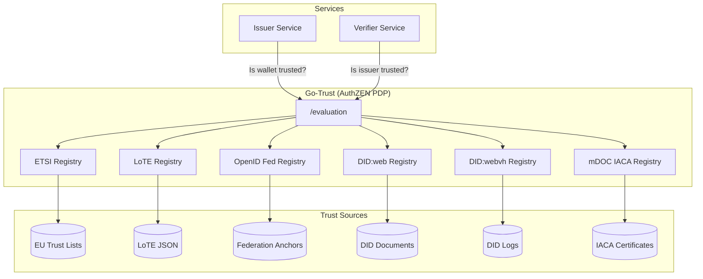
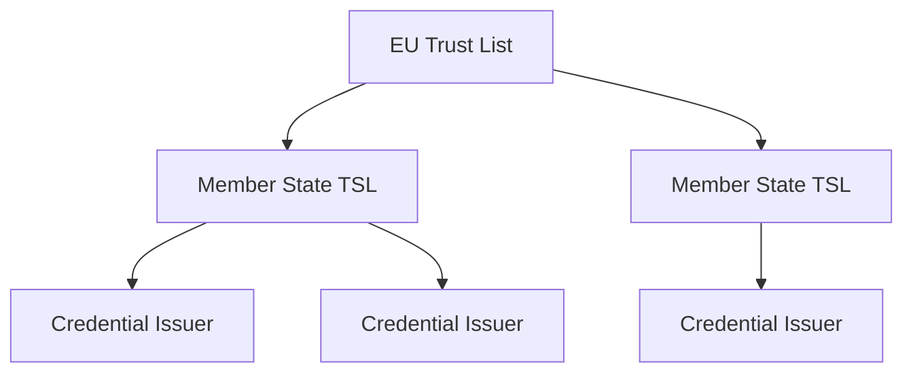
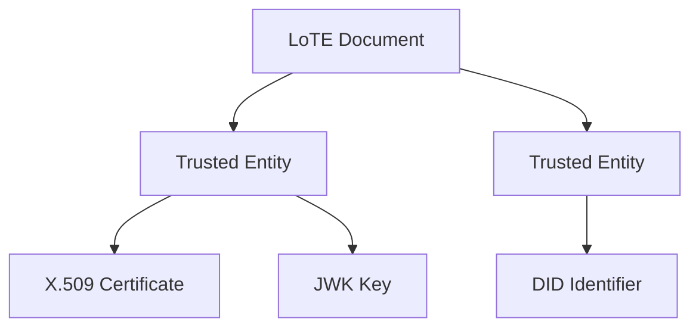
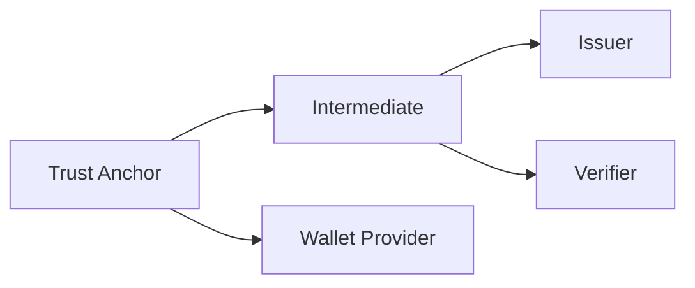
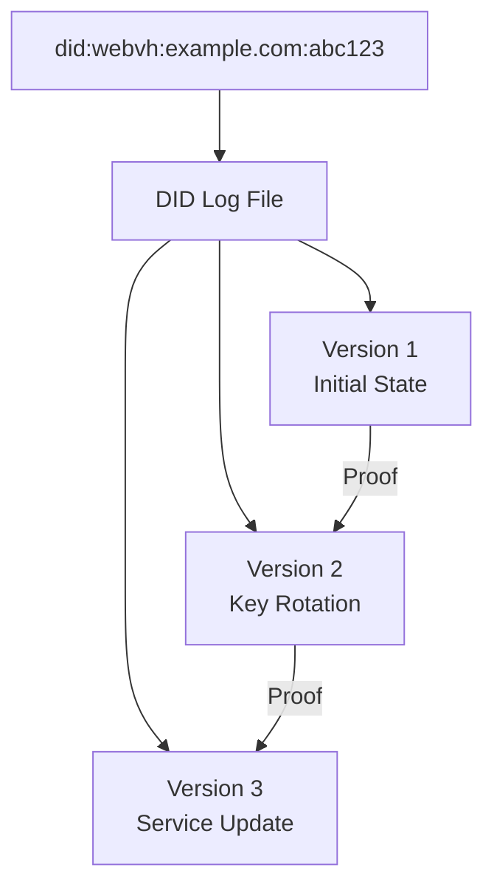
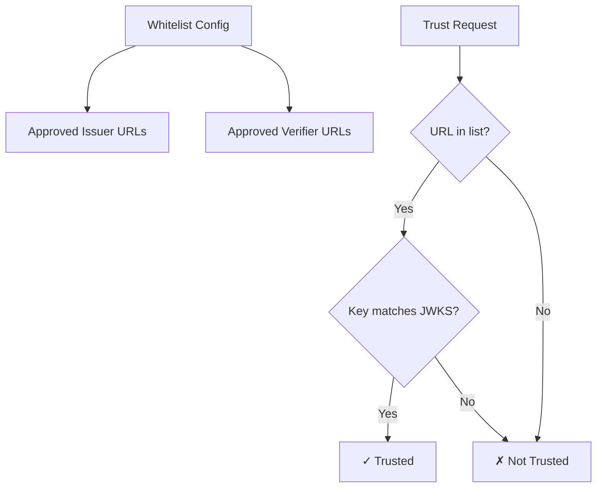
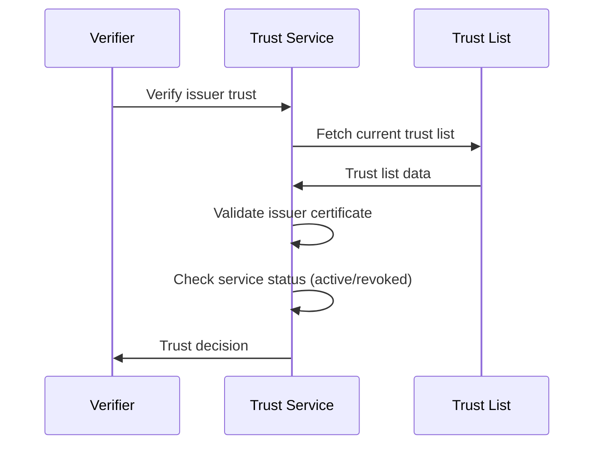

# Trust Services

A digital credential ecosystem requires mechanisms for issuers, wallets, and verifiers to recognize and trust each other. This is called **technical trust management**. SIROS ID supports multiple trust frameworks to meet different regulatory and deployment requirements.

:::tip Go-Trust Abstraction Layer
For production deployments, we recommend using **[Go-Trust](./go-trust)** as a trust abstraction layer. Go-Trust provides a unified AuthZEN API that handles the complexity of ETSI TSL, ETSI LoTE, OpenID Federation, and DID resolution, so your services don't need to implement trust logic directly. Each registry supports **multiple input sources** that are merged into a single trust pool — for example, combining trust lists from different countries or scheme operators.

All configuration snippets on this page are Go-Trust `config.yaml` fragments.
Registries live under a single top-level `registries:` map; per-role
constraints live under `policies:`. See the
[generated configuration reference](/sirosid/trust/go-trust-configuration) for
the authoritative key list.
:::

## Why Trust Matters

When a verifier receives a credential, it needs to answer:

1. **Is the issuer legitimate?** – Was this credential issued by an authorized entity?
2. **Is the credential valid?** – Has it been revoked or expired?
3. **Is the wallet trusted?** – Is the presenting wallet a recognized credential manager?

Trust services provide the infrastructure to answer these questions automatically.

## Trust Architecture



## Supported Trust Frameworks

### ETSI Trust Status Lists (TSL 119 612)

The EU standard for trust services. Used by eIDAS and the EU Digital Identity framework.



**Use when:**
- Deploying in EU/EEA regulated contexts
- Interoperating with government issuers
- Requiring legal recognition under eIDAS

**Configuration:**
```yaml
registries:
  etsi:
    enabled: true
    # Multiple sources can be combined — cert bundles, local files, and URLs
    cert_bundle: "/var/lib/go-trust/eu-certs.pem"
    tsl_files:
      - "/var/lib/go-trust/se-tsl.xml"
    # http(s) URLs require allow_network_access
    allow_network_access: true
    tsl_urls:
      - "https://ec.europa.eu/tools/lotl/eu-lotl.xml"
    follow_refs: true
    max_ref_depth: 3
```

### ETSI Lists of Trusted Entities (LoTE — TS 119 602)

The JSON-based successor to ETSI TSLs. LoTE documents list trusted entities with their digital identities (X.509, JWK, or DID) and signed with JWS instead of XML Digital Signatures.



**Use when:**
- Deploying in modern credential ecosystems using JSON/JWS
- Needing to publish trust lists with JWK or DID identities (not just X.509)
- Converting existing ETSI TSLs to a JSON-native format
- Requiring simpler tooling (JSON vs XML+XMLDsig)

**Configuration:**
```yaml
registries:
  lote:
    enabled: true
    # Multiple sources are merged into a single entity index
    sources:
      - "https://lote.example.org/lote-SE.json"
      - "https://lote.example.org/lote-DE.json"
      - "/etc/go-trust/local-lote.json"
    verify_jws: false
    fetch_timeout: "30s"
    refresh_interval: "1h"
```

:::info
LoTE documents can be created and published using `tsl-tool` from the [g119612](https://github.com/sirosfoundation/g119612) project. See the [LoTE Publishing Guide](./lote-publishing) for a complete walkthrough.
:::

### OpenID Federation

Dynamic trust management using OAuth 2.0 / OpenID Connect federation.



**Use when:**
- Building multi-organizational ecosystems
- Needing dynamic trust updates
- Integrating with OpenID-based infrastructure

:::tip
For detailed setup instructions including Trust Anchor deployment with [Inmor](https://github.com/SUNET/inmor), see the [OpenID Federation Guide](./openid-federation).
:::

**Configuration:**
```yaml
registries:
  oidfed:
    enabled: true
    trust_anchors:
      - entity_id: "https://federation.example.com"
    entity_types:
      - "openid_credential_issuer"
    cache_ttl: "5m"
    max_chain_depth: 5
```

### DID:web

Decentralized identifiers resolved via web infrastructure.

**Use when:**
- Simpler trust requirements
- Self-sovereign identity scenarios
- Rapid prototyping

**Configuration:**
```yaml
registries:
  didweb:
    enabled: true
    timeout: "30s"

policies:
  policies:
    credential-issuer:
      did:
        # Domain restrictions are a policy constraint, not a registry setting
        allowed_domains:
          - "*.example.com"
          - "issuer.trusted.org"
```

### DID:webvh (Verifiable History)

An extension of DID:web that adds cryptographic integrity through verifiable history. Each DID maintains a tamper-evident log of all changes, enabling:

- **Self-certifying identifiers (SCIDs)** – The identifier is derived from initial content
- **Version history** – Complete audit trail of DID document changes
- **Pre-rotation keys** – Secure key rotation with hash commitments
- **Witness support** – Third-party attestation of DID state



**Use when:**
- You need verifiable history of DID changes
- Key rotation security is critical (pre-rotation)
- Compliance requires audit trails
- Upgrading from DID:web with stronger guarantees

**Configuration:**
```yaml
registries:
  didwebvh:
    enabled: true
    timeout: "30s"
    # Allow HTTP only for testing (HTTPS required in production)
    allow_http: false
```

**How it works:**

1. The DID resolves to a JSON Lines log file at the web location
2. Each entry contains the DID document state and a cryptographic proof
3. Go-Trust verifies the entire chain from the first entry (which establishes the SCID)
4. Key bindings are validated against the current DID document

**Specification:** [did:webvh v1.0](https://identity.foundation/didwebvh/v1.0/)

### X.509 Certificate Chains

Traditional PKI-based trust using certificate chains.

**Use when:**
- Integrating with existing PKI infrastructure
- Requiring offline verification
- Connecting to legacy systems

Go-Trust has a **System Certificate Pool registry** that validates a presented
chain against the operating system's root CA store. It is fully implemented in
`pkg/registry/static`, but it has no `registries.*` key and `gt` never
instantiates it — it is reachable only by embedding the library:

```go
reg, _ := static.NewSystemCertPoolRegistry(static.SystemCertPoolConfig{
    Name: "system-ca",
})
```

For a server deployment, choose the configurable route that matches where your
trust anchors actually live:

- **A PEM bundle of roots** — load it through the ETSI registry's
  `cert_bundle`, which is just a trust pool of PEM certificates and needs no
  TSL XML at all. Unlike the OS pool, it can be narrowed per role by policy.
- **The OS root pool, for a whitelisted RP with no JWKS** — use
  `registries.whitelist` with `trust_x509_via_system_ca: true` (plus
  `additional_trusted_roots` for a private reader-CA root); see
  [Trusting X.509 Cert-Based Verifiers](./go-trust#trusting-x509-cert-based-verifiers-no-jwks).
  This reaches the same OS pool, but only for entities already on the
  whitelist — a narrower door than trusting everything the OS trusts.
- **ISO 18013-5 IACA / VICAL / RICAL roots** — use `registries.mdociaca`,
  `registries.vical` or `registries.mdocrical`.

**Configuration:**
```yaml
registries:
  etsi:
    enabled: true
    name: "private-pki"
    cert_bundle: "/certs/root-ca.pem"
```

See the [registry inventory](./go-trust#registry-inventory) for the full list,
including which registries are configurable and which are library-only.

### URL Whitelist

A file-based trust model where you maintain a list of trusted entity URLs. The whitelist registry also fetches and caches each entity's JWKS to perform cryptographic key validation.



**Use when:**
- You have a known, stable set of trusted partners
- You want simple, file-based trust management
- Standard JWKS metadata discovery works for your entities

**Configuration:**
```yaml
registries:
  whitelist:
    enabled: true
    config_file: "/config/trusted-entities.yaml"
    watch_file: true  # Auto-reload on changes
```

**Whitelist file format** (`/config/trusted-entities.yaml`; the same `lists:`
and `actions:` keys may also be written inline under `registries.whitelist`
instead of in a separate file):
```yaml
lists:
  issuers:
    - "https://issuer1.example.com"
    - "https://issuer2.example.org"
  verifiers:
    - "https://verifier.example.com"
actions:
  credential-issuer: "issuers"
  credential-verifier: "verifiers"
```

:::tip
The whitelist registry performs full key validation by fetching each entity's JWKS and computing key fingerprints. See [Go-Trust Whitelist Registry](./go-trust#whitelist-registry) for details on JWKS discovery and configuration options, including `trust_x509_via_system_ca` for whitelisting X.509 cert-authenticated verifiers (`x509_san_dns`/`x509_hash` client_id_schemes) that have no JWKS to fetch.
:::

## Trust Configuration

### For Issuers

Configure trust anchors that recognize your issuer:

1. **Obtain credentials** from a trust list operator
2. **Configure your signing certificate** chain
3. **Publish discovery metadata** at well-known endpoints

The signing chain the issuer presents lives in its ordinary key configuration
— there is no separate `issuer.trust` section, and no config key that
"registers" the issuer with a trust list (that is an out-of-band process with
the scheme operator):

```yaml
issuer:
  issuer_url: "https://issuer.example.org"
  key_config:
    private_key_path: "/pki/issuer-key.pem"
    chain_path: "/pki/issuer-chain.pem"
```

The issuer's *wallet-facing* access certificate (WRPAC), when the deployment
needs one, is configured separately under `issuer.access_certificate`.

### For Verifiers

Configure which issuers to trust:

```yaml
verifier:
  trust:
    # AuthZEN PDP URL — when set, operates in "default deny" mode
    pdp_url: "http://go-trust:6001"

    # Optional: restrict accepted signature algorithms.
    # Defaults to ES256/384/512, RS256/384/512, PS256/384/512, EdDSA.
    # "none" is never accepted.
    allowed_signature_algorithms:
      - "ES256"
      - "ES384"
      - "EdDSA"
```

The same `trust` block exists under `apigw` for the issuance side.

When `pdp_url` is configured, the verifier delegates all trust decisions to Go-Trust. When omitted, the verifier operates in "allow all" mode. Trust policies (which registries, ETSI service types, etc.) are configured in Go-Trust, not in the verifier itself.

### For Wallet Providers

Register your wallet with trust frameworks:

1. **Generate attestation key pair**
2. **Obtain wallet attestation** from an approved body
3. **Configure attestation in wallet backend**

```yaml
wallet_provider:
  wia:
    enabled: true
    # "etsi" (default): WIA carries an x5c chain, verified against the
    # Trusted List for Wallet Providers.
    # "ietf": WIA carries iss + kid, resolved via JWKS discovery.
    mode: "etsi"
    wallet_name: "Example Wallet"
    wallet_version: "1.4.0"
```

See the [Wallet Backend Configuration Reference](/wallet/wallet-backend-configuration)
for the full key list, and [Wallet Attestation](./wallet-attestation.md) for the
issuer side.

## Trust Evaluation Flow

When verifying a credential:



## Multi-Framework Support

Go-Trust can use several trust frameworks at once. Enable each registry you
need; the registry manager evaluates them in registration order and the first
positive decision wins (`first_match`). To restrict a particular role to a
subset of registries, name them in that role's policy:

```yaml
registries:
  etsi:
    enabled: true
    cert_bundle: "/var/lib/go-trust/eu-certs.pem"
  oidfed:
    enabled: true
    trust_anchors:
      - entity_id: "https://federation.example.com"
  whitelist:
    enabled: true
    config_file: "/config/trusted-entities.yaml"

policies:
  default_policy: credential-verifier
  policies:
    credential-issuer:
      # Only these registries may answer for this role
      registries: ["etsi", "oidfed"]
      etsi:
        service_statuses:
          - "http://uri.etsi.org/TrstSvc/TrustedList/Svcstatus/granted"
```

There is no `priority:` field and no `all_must_match` / `any_match` setting;
see [Resolution Strategy](./go-trust#resolution-strategy).

## RP Certificate Validation

Beyond verifying issuer trust, Go-Trust can validate **Relying Party** certificates to verify that a verifier is authorized to request specific attributes. This supports the EUDI Wallet framework's user consent model:

- **RP identity extraction** — structured identity from WRPAC certificates (organization, country, contact info)
- **Over-request detection** — checks requested claims against RP entitlements per [ETSI TS 119 475](https://www.etsi.org/deliver/etsi_ts/119400_119499/119475/)
- **Intermediary handling** — detects and validates proxy/broker presentation requests

See [X5C Enrichment](./go-trust#x5c-enrichment--certificate-policy-validation) and [Over-Request Detection](./go-trust#over-request-detection) for implementation details.

## Testing Trust

### Development Mode

There is no `development_mode` switch. To bypass trust while developing, use
one of these instead:

```yaml
# Go-Trust: allow everything
registries:
  always_trusted:
    enabled: true
```

`gt --registry always-trusted` does the same from the command line, and
`never-trusted` gives the opposite for testing rejection paths.

On the vc side, leaving `verifier.trust.pdp_url` (or `apigw.trust.pdp_url`)
unset puts the service in "allow all" mode: keys are still resolved, but are
always considered trusted.

:::danger
Both of these disable trust enforcement entirely. Never use them in production.
:::

## Troubleshooting

### "Issuer not trusted"

1. Check issuer certificate chain is complete
2. Verify trust list URL is accessible
3. Confirm issuer is active in trust list (not revoked)
4. Check certificate validity dates

### "Trust list fetch failed"

1. Verify network connectivity to trust list
2. Check for certificate errors (CA trust)
3. Increase timeout settings
4. Enable trust list caching

### "Certificate chain invalid"

1. Ensure intermediate certificates are included
2. Verify certificate order (leaf → root)
3. Check for expired certificates
4. Validate against trust anchor

## Best Practices

1. **Enable caching**: Trust lists don't change frequently
2. **Monitor expiry**: Set alerts for certificate expiration
3. **Use multiple frameworks**: Provide redundancy
4. **Audit trust decisions**: Log all trust evaluations
5. **Regular updates**: Keep trust list URLs current
6. **Use Go-Trust**: Abstract trust complexity behind AuthZEN API

## Next Steps

- [Go-Trust AuthZEN Service](./go-trust.md) – Deploy trust abstraction layer
- [Quick Start Guide](../quickstart)
- [Issuer Configuration](../issuers/issuer)
- [Verifier Configuration](../verifiers/verifier)
