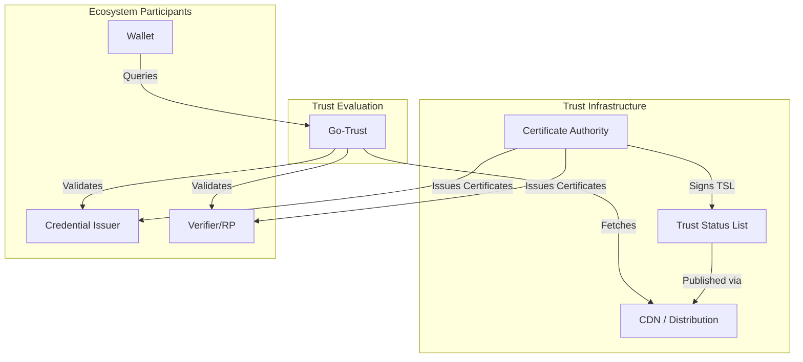
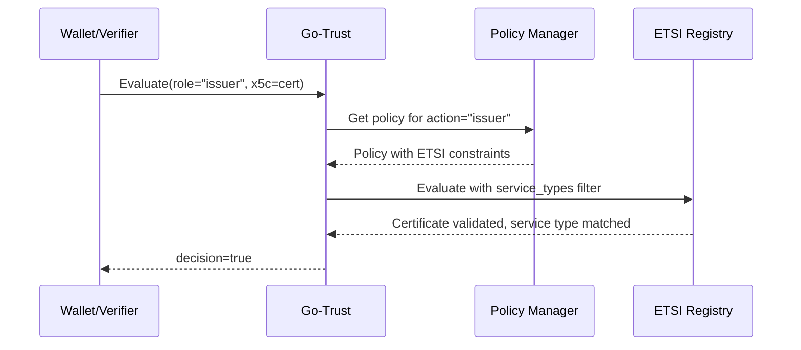
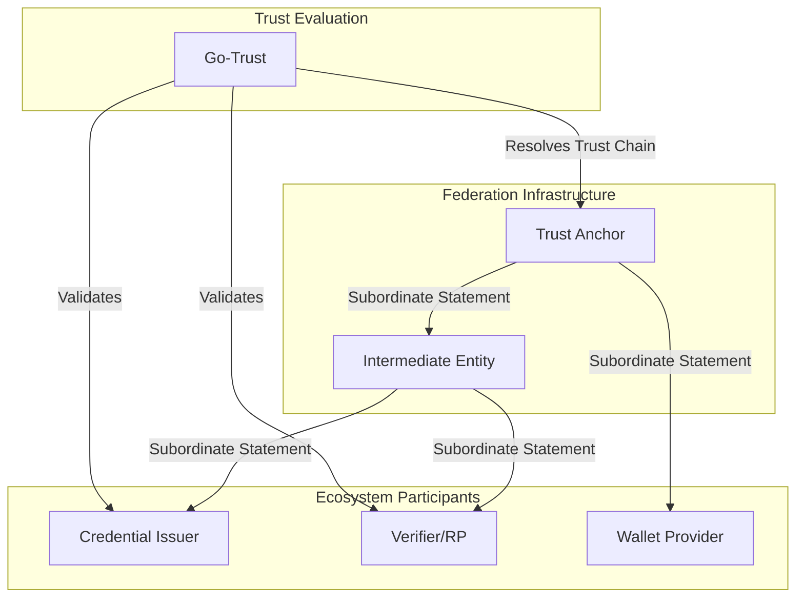
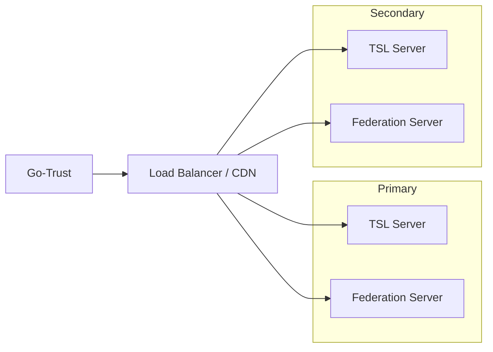

# Managing Trust Infrastructure

This guide covers how to set up and manage trust infrastructure for a wallet deployment. Trust infrastructure is the foundation that enables issuers, verifiers, and wallets to establish and verify trust relationships.

:::tip Prerequisites
Before setting up trust infrastructure, ensure you understand:
- [Trust Services Overview](./index.md) – Core concepts and supported frameworks
- [Go-Trust](./go-trust.md) – The trust abstraction layer that consumes trust sources
:::

## Choosing a Trust Framework

Two primary trust frameworks are commonly used in credential ecosystems, with a third option emerging:

| Framework | Best For | Complexity | Standards |
|-----------|----------|------------|-----------|
| **ETSI TSL (X.509)** | EU/eIDAS compliance, government deployments | Medium | ETSI TS 119 612 |
| **ETSI LoTE (JSON)** | Modern JSON-native ecosystems, JWK/DID identities | Low–Medium | ETSI TS 119 602 |
| **OpenID Federation** | Dynamic ecosystems, OAuth/OIDC integration | Higher | OpenID Federation 1.0 |

You can also use multiple frameworks simultaneously with Go-Trust acting as the unifying abstraction layer.

---

## X.509 / ETSI Trust Status Lists

ETSI Trust Status Lists (TSLs) provide a standardized way to publish and consume trust information based on X.509 certificates. This approach is mandated by eIDAS and the EU Digital Identity framework.

### Architecture Overview



### Components Required

1. **Certificate Authority (CA)** – Issues certificates to ecosystem participants
2. **Trust Status List (TSL)** – XML document listing trusted services and their certificates
3. **TSL Signing Key** – Private key used to sign the TSL (typically an HSM)
4. **Distribution Point** – Web server or CDN to publish the TSL

### Setting Up a Certificate Authority

For production, use an established CA or set up a proper PKI. For development/testing:

```bash
# Generate CA private key
openssl ecparam -genkey -name prime256v1 -out ca-key.pem

# Generate CA certificate
openssl req -new -x509 -key ca-key.pem -out ca-cert.pem -days 365 \
    -subj "/CN=My Trust Anchor CA/O=Example Org/C=SE"

# Issue a certificate for an issuer
openssl ecparam -genkey -name prime256v1 -out issuer-key.pem
openssl req -new -key issuer-key.pem -out issuer.csr \
    -subj "/CN=issuer.example.com/O=Example Issuer/C=SE"
openssl x509 -req -in issuer.csr -CA ca-cert.pem -CAkey ca-key.pem \
    -CAcreateserial -out issuer-cert.pem -days 365
```

### Generating Trust Status Lists with tsl-tool

The [g119612](https://github.com/sirosfoundation/g119612) project provides `tsl-tool`, a command-line tool for generating and processing ETSI TS 119 612 Trust Status Lists.

#### Installation

```bash
# Clone and build
git clone https://github.com/sirosfoundation/g119612.git
cd g119612
make build

# The binary is at ./tsl-tool
```

#### Creating a TSL Pipeline

The `generate` pipeline step creates a TSL from a directory of YAML metadata and certificate files:

```
tsl-source/
├── scheme.yaml              # TSL scheme metadata
└── providers/               # One subdirectory per trust service provider
    └── my-provider/
        ├── provider.yaml    # Provider metadata
        ├── cert1.pem        # X.509 certificate (PEM)
        └── cert1.yaml       # Service metadata for cert1.pem
```

**scheme.yaml:**
```yaml
operatorNames:
  - language: en
    value: "Trust List Operator"
type: "http://uri.etsi.org/TrstSvc/TrustedList/TSLType/EUgeneric"
sequenceNumber: 1    # Optional, defaults to 1
id: "MY-TSL-001"     # Optional, defaults to "TSL-NNN"
```

**provider.yaml:**
```yaml
names:
  - language: en
    value: "Example Trust Service Provider"
address:                      # Optional
  postal:
    streetAddress: "Example Street 123"
    locality: "Example City"
    postalCode: "12345"
    countryName: "SE"
  electronic:
    - "https://example.com"
    - "mailto:contact@example.com"
tradeName:                    # Optional
  - language: en
    value: "Example Corp"
informationURI:               # Optional
  - language: en
    value: "https://example.com/info"
```

**cert.yaml** (must match a `.pem` file by base name, e.g. `cert1.yaml` ↔ `cert1.pem`):
```yaml
serviceNames:
  - language: en
    value: "Example Signing Service"
serviceType: "http://uri.etsi.org/TrstSvc/Svctype/CA/QC"
status: "http://uri.etsi.org/TrstSvc/TrustedList/Svcstatus/granted"
serviceDigitalId:             # Optional additional digital IDs
  digitalIds:
    - "base64-encoded-cert..."
```

**Pipeline configuration:**
```yaml
- generate:
    - /path/to/tsl-source
- publish:
    - /var/www/html/tsl
    - /path/to/signing-cert.pem
    - /path/to/signing-key.pem
```

Or with PKCS#11/HSM signing:
```yaml
- generate:
    - /path/to/tsl-source
- publish:
    - /var/www/html/tsl
    - "pkcs11:module=/usr/lib/softhsm/libsofthsm2.so;pin=1234;token=trust-lists"
    - signing-key
    - signing-cert
    - "01"
```

To also produce a LoTE JSON conversion alongside the XML:
```yaml
- generate:
    - /path/to/tsl-source
- publish:
    - /var/www/html/tsl
    - /path/to/signing-cert.pem
    - /path/to/signing-key.pem
- convert-to-lote: []
- publish-lote:
    - /var/www/html/tsl
    - /path/to/signing-cert.pem
    - /path/to/signing-key.pem
    - xml
```

```bash
# Run the pipeline
./tsl-tool --log-level info pipeline.yaml
```

#### Processing Existing TSLs

You can also use `tsl-tool` to fetch, transform, and republish existing TSLs:

```yaml
# process-eu-tsl.yaml

# Configure HTTP client
- set-fetch-options:
    - user-agent: TSL-Tool/1.0
    - timeout: 60s

# Load the EU List of Trusted Lists
- load:
    - https://ec.europa.eu/tools/lotl/eu-lotl.xml

# Follow references to member state TSLs
- select:
    - reference-depth: 2

# Generate HTML documentation
- transform:
    - embedded: tsl-to-html.xslt
    - /var/www/html/trust-lists
    - html

# Create an index page
- generate_index:
    - /var/www/html/trust-lists
    - "EU Trust Lists"
```

### Publishing Your TSL

1. **Host on a reliable endpoint** – Use HTTPS with a valid certificate
2. **Enable caching** – TSLs change infrequently; set appropriate cache headers
3. **Consider a CDN** – For high-availability deployments
4. **Set up monitoring** – Alert on expiring TSLs or certificates

```nginx
# Example nginx configuration
location /trust-list.xml {
    root /var/www/html/tsl;
    add_header Cache-Control "public, max-age=3600";
    add_header Content-Type "application/xml";
}
```

### Configuring Go-Trust to Use Your TSL

```yaml
# go-trust config.yaml
registries:
  etsi:
    enabled: true
    name: "ETSI-TSL"
    description: "European Trust Status List"
    cert_bundle: "/etc/go-trust/trusted-certs.pem"
    # Or load from TSL URL (requires allow_network_access: true)
    # tsl_urls:
    #   - "https://tsl.example.org/trust-list.xml"
```

### Role-to-Service-Type Mapping

When `vc` and `go-wallet-backend` make trust evaluation requests, they use application-level roles like `issuer` and `verifier`. Go-Trust uses **policies** to map these roles to ETSI service types.

#### How Role Mapping Works



#### Standard Roles

The trust evaluation API uses these standard roles:

| Role | Description | Typical ETSI Service Types |
|------|-------------|---------------------------|
| `issuer` | Credential issuer (generic) | QCert, CA/QC, EDS/Q |
| `verifier` | Relying party/verifier | EDS/Q, TSA/QTST |
| `credential-issuer` | OpenID4VCI issuer | QCert, CA/QC |
| `credential-verifier` | OpenID4VP verifier | EDS/Q |
| `pid-provider` | PID (Person ID) provider | QCert (with PID constraints) |
| `wallet_provider` | Wallet unit attestation | CA/QC |

#### Configuring Role-Based Policies

Define policies in Go-Trust to map roles to registry-specific constraints:

```yaml
# go-trust config.yaml
policies:
  # Default policy when no role matches
  default_policy: credential-verifier

  policies:
    # Policy for credential issuers
    credential-issuer:
      description: "Validates credential issuers against qualified certificates"
      etsi:
        service_types:
          - "http://uri.etsi.org/TrstSvc/Svctype/QCert"
          - "http://uri.etsi.org/TrstSvc/Svctype/CA/QC"
        service_statuses:
          - "http://uri.etsi.org/TrstSvc/TrustedList/Svcstatus/granted"
      oidfed:
        entity_types:
          - "openid_credential_issuer"
        required_trust_marks:
          - "https://dc4eu.eu/tm/issuer"
      did:
        allowed_domains:
          - "*.eudiw.dev"
          - "*.example.com"
        require_verifiable_history: true
    
    # Policy for PID providers (stricter)
    pid-provider:
      description: "Validates PID providers with qualified certificate requirements"
      etsi:
        service_types:
          - "http://uri.etsi.org/TrstSvc/Svctype/QCert"
        countries:
          - "DE"
          - "FR"
          - "SE"
    
    # Policy for verifiers
    credential-verifier:
      description: "Validates relying parties"
      etsi:
        service_types:
          - "http://uri.etsi.org/TrstSvc/Svctype/EDS/Q"
          - "http://uri.etsi.org/TrstSvc/Svctype/TSA/QTST"
        service_statuses:
          - "http://uri.etsi.org/TrstSvc/TrustedList/Svcstatus/granted"
      oidfed:
        entity_types:
          - "openid_relying_party"
        required_trust_marks:
          - "https://dc4eu.eu/tm/verifier"
      did:
        allowed_domains:
          - "*.eudiw.dev"
          - "*.example.com"

    # Policy for mDL issuers
    mdl-issuer:
      description: "Validates mDL/mDOC issuers via IACA"
      mdociaca:
        issuer_allowlist:
          - "https://pid-issuer.eudiw.dev"
          - "https://mdl-issuer.example.com"
        require_iaca_endpoint: true
      registries:
        - "mdoc-iaca"
```

#### ETSI Service Type Reference

Common ETSI TS 119 612 service types:

| URI | Description |
|-----|-------------|
| `http://uri.etsi.org/TrstSvc/Svctype/CA/QC` | CA issuing qualified certificates |
| `http://uri.etsi.org/TrstSvc/Svctype/QCert` | Qualified certificate service |
| `http://uri.etsi.org/TrstSvc/Svctype/EDS/Q` | Qualified electronic delivery service |
| `http://uri.etsi.org/TrstSvc/Svctype/TSA/QTST` | Qualified timestamp authority |
| `http://uri.etsi.org/TrstSvc/Svctype/TSA/TSS-QC` | Timestamp for qualified certificates |
| `http://uri.etsi.org/TrstSvc/Svctype/PSES/Q` | Qualified preservation service |

#### Client-Side Usage

Applications don't need to know about ETSI service types – they just specify the role:

```go
// In vc package (issuer verification)
req := trust.NewEvaluationRequest(issuerURL, trust.KeyTypeX5C, certChain)
req.Role = trust.RoleIssuer
decision, err := evaluator.Evaluate(ctx, req)

// In go-wallet-backend (verifier verification)  
req := trust.NewEvaluationRequest(verifierURL, trust.KeyTypeX5C, certChain)
req.Role = trust.RoleVerifier
req.CredentialType = "PID"  // May influence policy selection
decision, err := evaluator.Evaluate(ctx, req)
```

The Go-Trust server maps the role to the appropriate policy and ETSI constraints.

---

## OpenID Federation

OpenID Federation provides dynamic, decentralized trust management where entities publish their own metadata and trust relationships are established through trust chains.

### Architecture Overview



### Key Concepts

| Term | Description |
|------|-------------|
| **Trust Anchor** | Root of trust; publishes entity configuration and subordinate statements |
| **Intermediate** | Optional organizational unit; can issue subordinate statements |
| **Leaf Entity** | End entity (issuer, verifier, wallet) with metadata |
| **Entity Configuration** | Self-signed JWT describing an entity's metadata |
| **Subordinate Statement** | JWT from superior entity attesting to a subordinate |
| **Trust Chain** | Chain of statements from leaf to trust anchor |
| **Trust Mark** | Attestation that an entity meets certain criteria |

### Components Required

1. **Trust Anchor Service** – Hosts federation endpoints and issues subordinate statements
2. **Entity Registration System** – Manages onboarding of participants
3. **Key Management** – Secure storage for signing keys
4. **Federation Endpoints** – Well-known endpoints for metadata discovery

### Running a Federation with Inmor

[Inmor](https://github.com/SUNET/inmor) is an open-source OpenID Federation implementation that can be used to run trust anchor and intermediate entity services.

#### Installation

```bash
# Clone the repository
git clone https://github.com/SUNET/inmor.git
cd inmor

# Follow the installation instructions in the README
# Typically involves:
# - Setting up a Python environment
# - Configuring the database
# - Setting up signing keys
```

#### Basic Configuration

Inmor requires configuration for:

1. **Entity ID** – The URL identifier for your trust anchor
2. **Signing Keys** – Keys for signing entity configurations and subordinate statements
3. **Storage** – Database for managing subordinates and trust marks
4. **Federation Policy** – Rules for what metadata policies to apply

#### Federation Endpoints

A properly configured OpenID Federation entity exposes these endpoints:

| Endpoint | Description |
|----------|-------------|
| `/.well-known/openid-federation` | Entity Configuration (self-signed JWT) |
| `/federation/fetch` | Fetch subordinate statement by entity ID |
| `/federation/list` | List all subordinate entities |
| `/federation/resolve` | Resolve complete trust chain |
| `/federation/trust_mark_status` | Check trust mark validity |

### Registering Entities

To add an entity (issuer, verifier, wallet) to your federation:

1. **Entity provides their Entity Configuration** – A self-signed JWT with their metadata
2. **Verify entity identity** – Out-of-band verification of ownership
3. **Issue Subordinate Statement** – Sign a statement attesting to the entity
4. **Entity publishes their configuration** – At their `/.well-known/openid-federation`

### Configuring Go-Trust for OpenID Federation

```yaml
# go-trust config.yaml
registries:
  - type: openid_federation
    config:
      trust_anchors:
        - entity_id: "https://trust-anchor.example.org"
          # Optional: pin the trust anchor's public key
          jwks_uri: "https://trust-anchor.example.org/jwks.json"
      cache_ttl: 5m
      max_chain_length: 5
      description: "Example Federation"
```

---

## Combining Trust Frameworks

For production deployments, you often need to support multiple trust frameworks simultaneously:

```yaml
# go-trust config.yaml with multiple frameworks
registries:
  # ETSI TSL for EU compliance
  - type: etsi_tsl
    config:
      trust_list_url: "https://ec.europa.eu/tools/lotl/eu-lotl.xml"
      description: "EU Trust Lists"
    
  # OpenID Federation for dynamic trust
  - type: openid_federation
    config:
      trust_anchors:
        - entity_id: "https://federation.example.org"
      description: "Example Federation"
    
  # Whitelist for known partners
  - type: whitelist
    config:
      file: "/config/trusted-entities.json"
      description: "Pre-approved entities"

# Query routing
query_routing:
  resolution_strategy: first_match
  routes:
    - match:
        resource_type: "x5c"
      registries: ["etsi_tsl"]
    - match:
        resource_type: "jwk"
      registries: ["openid_federation", "whitelist"]
```

---

## Operational Considerations

### Certificate/Key Lifecycle

| Asset | Typical Validity | Renewal Strategy |
|-------|------------------|------------------|
| CA Root Certificate | 10-20 years | Plan succession well in advance |
| Intermediate CA | 5-10 years | Rotate before expiry |
| TSL Signing Key | 2-5 years | HSM-protected, ceremony for rotation |
| Entity Certificates | 1-2 years | Automated renewal (ACME) |
| Federation Signing Keys | 1-2 years | Key rollover with overlap period |

### Monitoring and Alerting

- **Certificate expiry** – Alert 30, 14, 7 days before expiry
- **TSL validity** – Monitor `nextUpdate` field
- **Federation endpoint availability** – Health checks on well-known endpoints
- **Trust chain resolution failures** – Log and alert on resolution errors

### High Availability



### Disaster Recovery

1. **Backup signing keys** – Secure, offline backup with ceremony for recovery
2. **TSL snapshots** – Keep historical versions
3. **Federation database backups** – Regular backups of subordinate registrations
4. **Documented recovery procedures** – Test periodically

---

## Next Steps

- [Go-Trust Configuration Reference](./go-trust.md) – Detailed configuration options
- [LoTE Publishing Guide](./lote-publishing.md) – Set up, maintain, and publish LoTE lists
- [Trust Services Overview](./index.md) – Conceptual overview
- [g119612 Documentation](https://github.com/sirosfoundation/g119612) – TSL and LoTE tool reference
- [Inmor Documentation](https://github.com/SUNET/inmor) – OpenID Federation server
