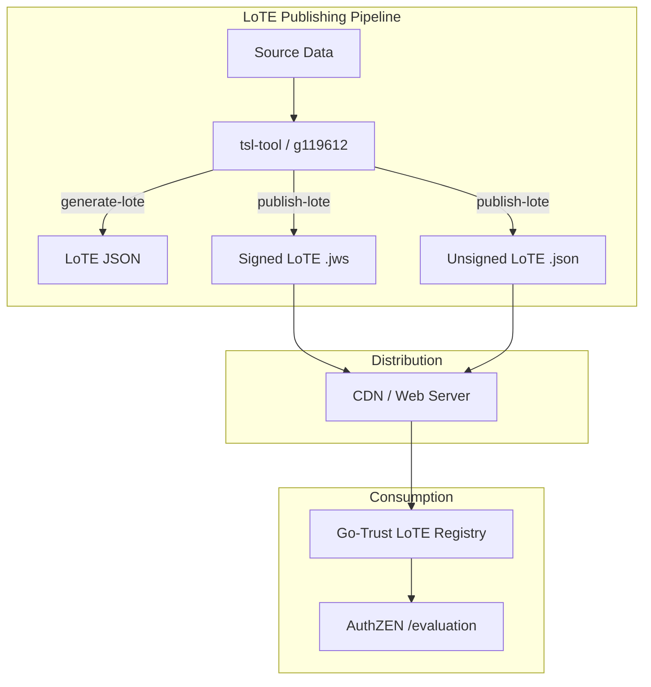

# Publishing Lists of Trusted Entities (LoTE)

This guide covers how to set up, maintain, and publish **ETSI TS 119 602 Lists of Trusted Entities (LoTE)** — the JSON-based trust list format for modern credential ecosystems. LoTE documents list trusted entities along with their digital identities (X.509 certificates, JWK keys, or DIDs) and can be signed using JWS (JSON Web Signature).

:::tip Prerequisites
Before setting up LoTE publishing, ensure you understand:
- [Trust Services Overview](./index.md) – Core concepts and supported frameworks
- [Trust Infrastructure](./infrastructure.md) – General trust infrastructure setup
:::

## Overview

LoTE (List of Trusted Entities) is the JSON successor to ETSI TS 119 612 XML Trust Status Lists. Key differences:

| Aspect | TSL (TS 119 612) | LoTE (TS 119 602) |
|--------|-------------------|---------------------|
| Format | XML | JSON |
| Signatures | XML Digital Signature | JWS (JSON Web Signature) |
| Identities | X.509 certificates only | X.509, JWK, DID |
| Tooling | XML processing (XSLT, XSD) | Standard JSON tooling |
| Adoption | EU Member States, eIDAS | Emerging standard |

### Architecture



## Installation

The [g119612](https://github.com/sirosfoundation/g119612) project provides `tsl-tool`, the command-line tool for creating and publishing LoTE documents.

```bash
# Clone and build
git clone https://github.com/sirosfoundation/g119612.git
cd g119612
make build

# The binary is at ./tsl-tool
```

## Creating a LoTE from Scratch

### Step 1: Set Up the Directory Structure

The `generate-lote` pipeline step reads a directory with YAML metadata and digital identity files:

```
my-trust-list/
├── scheme.yaml              # Scheme metadata
└── entities/                 # One subdirectory per trusted entity
    ├── example-issuer/
    │   ├── entity.yaml       # Entity metadata
    │   ├── signing-cert.pem  # X.509 certificate (PEM or DER)
    │   └── auth-key.jwk      # JWK public key (JSON)
    ├── example-verifier/
    │   ├── entity.yaml
    │   └── identity.did      # DID identifier
    └── example-ca/
        ├── entity.yaml
        └── ca-cert.pem
```

### Step 2: Create Scheme Metadata

Create `scheme.yaml` at the root of your directory:

```yaml
# scheme.yaml
operatorNames:
  - language: en
    value: "My Organization"
  - language: sv
    value: "Min Organisation"

schemeName:
  - language: en
    value: "My Trust Scheme"

schemeType: "http://uri.etsi.org/TrstSvc/TrustedList/TSLType/EUgeneric"

territory: "SE"

sequenceNumber: 1
```

**Required fields:**
- `operatorNames` — At least one name for the scheme operator
- `schemeType` — URI identifying the type of trust scheme

**Optional fields:**
- `schemeName` — Display name for the scheme
- `territory` — ISO 3166-1 alpha-2 country code
- `sequenceNumber` — Integer that should be incremented on each publication

### Step 3: Add Trusted Entities

For each trusted entity, create a subdirectory under `entities/` with an `entity.yaml` and one or more digital identity files.

**entity.yaml:**
```yaml
entityId: "https://issuer.example.com"

names:
  - language: en
    value: "Example Credential Issuer"

status: "http://uri.etsi.org/TrstSvc/TrustedList/Svcstatus/granted"  # Defaults to "granted" if omitted

# Optional: entity type classification
entityType: "credential-issuer"

# Optional: services provided by this entity
services:
  - serviceType: "http://uri.etsi.org/TrstSvc/Svctype/CA/QC"
    serviceNames:
      - language: en
        value: "Qualified Certificate Service"
    status: "http://uri.etsi.org/TrstSvc/TrustedList/Svcstatus/granted"
```

**Digital identity files** (place alongside `entity.yaml`):

| File Extension | Description | Example |
|---------------|-------------|---------|
| `.pem`, `.crt`, `.cer` | X.509 certificate (PEM-armored or raw DER) | `signing-cert.pem` |
| `.jwk` | JWK public key (JSON format) | `auth-key.jwk` |
| `.did` | DID identifier (text file containing a `did:` URI) | `identity.did` |

**Example JWK file (`auth-key.jwk`):**
```json
{
  "kty": "EC",
  "crv": "P-256",
  "x": "f83OJ3D2xF1Bg8vub9tLe1gHMzV76e8Tus9uPHvRVEU",
  "y": "x_FEzRu9m36HLN_tue659LNpXW6pCyStikYjKIWI5a0"
}
```

**Example DID file (`identity.did`):**
```
did:web:issuer.example.com
```

### Step 4: Create the Pipeline Configuration

Create a YAML pipeline file that generates and publishes the LoTE:

```yaml
# publish-lote.yaml

# Generate LoTE from directory structure
- generate-lote:
    - /path/to/my-trust-list

# Publish unsigned JSON
- publish-lote:
    - /var/www/html/lote
```

### Step 5: Run the Pipeline

```bash
./tsl-tool --log-level info publish-lote.yaml
```

This creates `/var/www/html/lote/lote-SE.json` (filename derived from territory).

## Signing LoTE Documents with JWS

For production use, LoTE documents should be signed. Two signing methods are supported.

### File-Based Signing

Provide paths to the signing certificate and private key:

```yaml
# publish-signed-lote.yaml
- generate-lote:
    - /path/to/my-trust-list
- publish-lote:
    - /var/www/html/lote
    - /path/to/signing-cert.pem
    - /path/to/signing-key.pem
```

This produces both `lote-SE.json` (unsigned) and `lote-SE.json.jws` (JWS compact serialization).

### PKCS#11 / HSM Signing

For production environments where private keys are stored in a Hardware Security Module:

```yaml
# publish-hsm-lote.yaml
- generate-lote:
    - /path/to/my-trust-list
- publish-lote:
    - /var/www/html/lote
    - "pkcs11:module=/usr/lib/softhsm/libsofthsm2.so;pin=1234"
    - my-signing-key         # Key label in the HSM
    - my-signing-cert        # Certificate label in the HSM
```

The PKCS#11 URI format supports:
- `module` — Path to the PKCS#11 module library
- `pin` — PIN for the token
- `token` — Token label (optional)
- `slot` — Slot ID (optional)

## Converting Existing TSLs to LoTE

If you have existing ETSI TS 119 612 Trust Status Lists, you can convert them to LoTE format:

```yaml
# convert-tsl-to-lote.yaml

# Configure HTTP client
- set-fetch-options:
    - user-agent: TSL-Tool/1.0
    - timeout: 60s

# Load existing TSL(s)
- load:
    - https://ec.europa.eu/tools/lotl/eu-lotl.xml

# Follow references to member state TSLs
- select:
    - reference-depth: 2

# Convert all loaded TSLs to LoTE format
- convert-to-lote:

# Optionally merge into a single LoTE
- merge-lote:

# Publish
- publish-lote:
    - /var/www/html/lote
```

The conversion preserves:
- Entity names and identifiers
- X.509 certificates and X.509 subject names
- Service types and statuses
- Service history
- TSP names, trade names, and addresses
- Pointer information (distribution points, digital identities)

## Merging Multiple LoTEs

The `merge-lote` step combines multiple LoTEs into a single document. This is useful when aggregating trust information from multiple sources:

```yaml
# merge-lotes.yaml

# Load LoTEs from multiple sources
- load-lote:
    - https://lote.example.se/lote-SE.json
- load-lote:
    - https://lote.example.de/lote-DE.json
- load-lote:
    - https://lote.example.fr/lote-FR.json

# Merge into a single LoTE
- merge-lote:

# Increment sequence number
- increment-lote-sequence:

# Publish the merged result
- publish-lote:
    - /var/www/html/lote
    - /path/to/signing-cert.pem
    - /path/to/signing-key.pem
```

The merged LoTE uses the scheme information from the first source, and concatenates all entities and pointers.

## Managing Sequence Numbers

Each LoTE has a `sequenceNumber` that should be incremented every time the list is republished. There are two approaches:

**Option 1: Automatic increment in the pipeline**
```yaml
- generate-lote:
    - /path/to/my-trust-list
- increment-lote-sequence:
- publish-lote:
    - /var/www/html/lote
```

**Option 2: Manual increment in scheme.yaml**

Update the `sequenceNumber` field in `scheme.yaml` before each publication.

:::warning
The `increment-lote-sequence` step increments the in-memory sequence number. It does not write back to `scheme.yaml`. For persistent tracking, update `scheme.yaml` as part of your release process.
:::

## Loading and Verifying LoTEs

The `load-lote` step can optionally verify JWS signatures when loading:

```yaml
# Load with JWS verification
- load-lote:
    - https://example.com/signed-lote.json.jws
    - /path/to/trusted-signer-cert.pem
```

If the document fails JSON parsing, the step automatically attempts JWS verification and payload extraction using the provided certificate.

## Validation

LoTE documents are automatically validated before publishing. The validation checks:

| Check | Description |
|-------|-------------|
| Version | Must be present |
| Scheme Operator | At least one operator name required |
| Scheme Type | Must be set |
| Issue Date | Must be set (auto-populated by `generate-lote`) |
| Entity ID | Every entity must have an identifier |
| Entity Status | Every entity must have a status |
| Digital Identity | Type must be one of: `x509`, `jwk`, `did`, `x509_subject_name` |
| JWK Content | JWK identities must have non-empty key material |
| DID Format | DID identities must start with `did:` |
| Service Type | Every service must have a type and status |
| Pointer Location | LoTE pointers must have a location URL |

If validation fails, the `publish-lote` step returns an error and no files are written.

## Publishing and Distribution

### Web Server Setup

Serve your LoTE documents over HTTPS:

```nginx
# nginx configuration
location /lote/ {
    root /var/www/html;
    add_header Cache-Control "public, max-age=3600";
    add_header Access-Control-Allow-Origin "*";

    # Serve .json files as application/json
    location ~ \.json$ {
        add_header Content-Type "application/json";
    }

    # Serve .jws files as application/jose
    location ~ \.jws$ {
        add_header Content-Type "application/jose";
    }
}
```

### Automated Publishing with Cron

Set up periodic republication:

```bash
# /etc/cron.d/lote-publish
0 */6 * * * root /usr/local/bin/tsl-tool /etc/lote/publish-lote.yaml >> /var/log/lote-publish.log 2>&1
```

### Distribution Points

LoTE documents can declare their distribution points in the scheme information. When distribution points are set, `publish-lote` uses the URL filename as the output filename:

```yaml
# If scheme information contains:
#   distributionPoints: ["https://tsl.example.org/trust-list.json"]
# Then the output file will be named "trust-list.json"
```

This ensures filenames match the URLs consumers will use to fetch the documents.

## XML Output

By default, `publish-lote` produces JSON output (`.json` and optionally `.json.jws`). To also generate an XML companion, add the `xml` flag:

```yaml
- publish-lote:
    - /path/to/output
    - /path/to/cert.pem
    - /path/to/key.pem
    - xml
```

This produces both `lote-<territory>.json` (with JWS) **and** `lote-<territory>.xml` (with XAdES signature). Use `xml-only` to skip JSON output entirely.

## Lists of Trusted Lists (LoTL)

A LoTL aggregates pointers to multiple LoTE documents. The `generate-lotl` step reads a `lotl.yaml` file that lists the LoTE locations:

```
my-lotl/
├── .pipeline.yaml
└── lotl.yaml
```

**lotl.yaml:**
```yaml
operatorNames:
  - language: en
    value: "My Trust Authority"
schemeName:
  - language: en
    value: "My List of Trusted Lists"
territory: "demo"
pointers:
  - location: "https://trust.example.org/lote-SE.json"
    territory: "SE"
    operatorName:
      - language: en
        value: "Swedish Trust Operator"
```

**Pipeline:**
```yaml
- generate-lotl:
    - ./my-lotl
- publish-lote:
    - /path/to/output
    - /path/to/cert.pem
    - /path/to/key.pem
```

The `publish-lote` step publishes both LoTEs and LoTLs from the context. LoTL output files are named `list_of_trusted_lists-<territory>.json`.

## Go-Trust Integration

Configure Go-Trust to consume your published LoTE documents:

```yaml
# go-trust config.yaml
registries:
  lote:
    enabled: true
    name: "My LoTE Registry"
    description: "LoTE-based trust evaluation"
    sources:
      - "https://lote.example.org/lote-SE.json"
      - "https://lote.example.org/lote-DE.json"
    verify_jws: false           # Set to true if LoTEs are JWS-signed
    fetch_timeout: "30s"
    refresh_interval: "1h"      # Re-fetch interval
```

Go-Trust's LoTE registry:
- Indexes entities by their identifiers and digital identity fingerprints
- Evaluates AuthZEN trust requests by matching subject IDs and resource keys
- Validates X.509 certificate chains (PKIX path validation) against entity certificates
- Matches JWK keys via SHA-256 fingerprints
- Supports resolution-only mode for looking up entity information without key binding

### Example AuthZEN Request

```bash
curl -X POST https://pdp.example.com/evaluation \
  -H "Content-Type: application/json" \
  -d '{
    "subject": {
      "type": "key",
      "id": "https://issuer.example.com"
    },
    "resource": {
      "type": "x5c",
      "key": ["MIIDQjCCAiqgAwIBAgIU..."]
    },
    "action": {
      "name": "credential-issuer"
    }
  }'
```

## Complete Example: End-to-End LoTE Workflow

This example walks through creating, signing, publishing, and consuming a LoTE.

### 1. Create the Source Directory

```bash
mkdir -p my-trust-list/entities/acme-issuer
```

**my-trust-list/scheme.yaml:**
```yaml
operatorNames:
  - language: en
    value: "ACME Trust Authority"
schemeType: "http://uri.etsi.org/TrstSvc/TrustedList/TSLType/EUgeneric"
territory: "SE"
sequenceNumber: 1
```

**my-trust-list/entities/acme-issuer/entity.yaml:**
```yaml
entityId: "https://issuer.acme.example.com"
names:
  - language: en
    value: "ACME Credential Issuer"
status: "http://uri.etsi.org/TrstSvc/TrustedList/Svcstatus/granted"
services:
  - serviceType: "http://uri.etsi.org/TrstSvc/Svctype/CA/QC"
    serviceNames:
      - language: en
        value: "ACME Qualified Certificate Service"
    status: "http://uri.etsi.org/TrstSvc/TrustedList/Svcstatus/granted"
```

Copy the issuer's certificate:
```bash
cp /path/to/issuer-cert.pem my-trust-list/entities/acme-issuer/cert.pem
```

### 2. Create a Signing Key Pair

```bash
# Generate signing key
openssl ecparam -genkey -name prime256v1 -out lote-signing-key.pem

# Generate self-signed certificate for the signing key
openssl req -new -x509 -key lote-signing-key.pem -out lote-signing-cert.pem \
    -days 365 -subj "/CN=LoTE Signer/O=ACME Trust Authority/C=SE"
```

### 3. Create the Pipeline

**publish-lote.yaml:**
```yaml
- generate-lote:
    - ./my-trust-list
- publish-lote:
    - ./output
    - ./lote-signing-cert.pem
    - ./lote-signing-key.pem
```

### 4. Run

```bash
./tsl-tool --log-level info publish-lote.yaml
```

Output:
```
output/
├── lote-SE.json       # Unsigned JSON
└── lote-SE.json.jws   # JWS compact serialization
```

### 5. Configure Go-Trust

```yaml
# go-trust config.yaml
registries:
  lote:
    enabled: true
    sources:
      - "https://lote.acme-trust.example.com/lote-SE.json"
    refresh_interval: "1h"
```

## Troubleshooting

| Problem | Cause | Solution |
|---------|-------|----------|
| "LoTE failed validation" | Missing required fields in scheme.yaml or entity.yaml | Check that `operatorNames`, `schemeType`, `entityId`, and `status` are all provided |
| "not valid DER or PEM certificate data" | Certificate file is in unexpected format | Ensure `.pem` files contain PEM-armored data or raw DER |
| "invalid DID: must start with 'did:'" | DID file doesn't start with `did:` prefix | Check `.did` file contains only the DID URI, e.g., `did:web:example.com` |
| "unexpected Content-Type" | HTTP server returns wrong content type | Ensure LoTE endpoint serves `application/json` or `application/jose` |
| "JWS verification failed" | Signing certificate doesn't match | Verify the certificate used for signing matches the one provided for verification |
| Filename collision on publish | Multiple LoTEs with same territory and no distribution points | Add unique distribution points or use `merge-lote` to combine them |

## Reference: Pipeline Steps

| Step | Arguments | Description |
|------|-----------|-------------|
| `generate-lote` | `<source-dir>` | Generate LoTE from directory structure |
| `generate-lotl` | `<source-dir>` | Generate a List of Trusted Lists (LoTL) from directory structure |
| `load-lote` | `<url-or-path> [cert.pem]` | Load LoTE from URL/file, optionally verify JWS |
| `load-lotl` | `<url-or-path> [cert.pem]` | Load LoTL from URL/file, optionally verify JWS |
| `publish-lote` | `<output-dir> [cert.pem key.pem] [xml]` or `<output-dir> [pkcs11:... key-label cert-label key-id] [xml]` | Write LoTE/LoTL JSON files, optionally sign. Also registered as `publish-lotl`. Pass `xml` for XML companion output. |
| `convert-to-lote` | (none) | Convert TSLs on context stack to LoTE format |
| `merge-lote` | (none) | Merge all LoTEs on context stack into one |
| `increment-lote-sequence` | (none) | Increment sequence number on all LoTEs |
| `validate-lote` | (none) | Validate all LoTEs on context stack |
| `validate-lotl` | (none) | Validate all LoTLs on context stack |

## Further Reading

- [ETSI TS 119 602](https://www.etsi.org/deliver/etsi_ts/119600_119699/119602/) – Lists of Trusted Entities specification
- [g119612 GitHub Repository](https://github.com/sirosfoundation/g119612) – Source code and API documentation
- [Go-Trust](./go-trust.md) – Trust evaluation server configuration
- [Trust Infrastructure](./infrastructure.md) – General trust infrastructure setup
