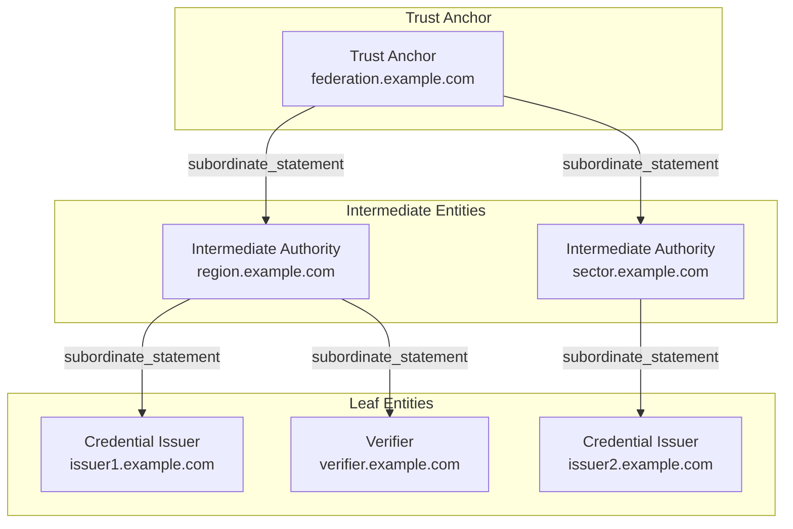
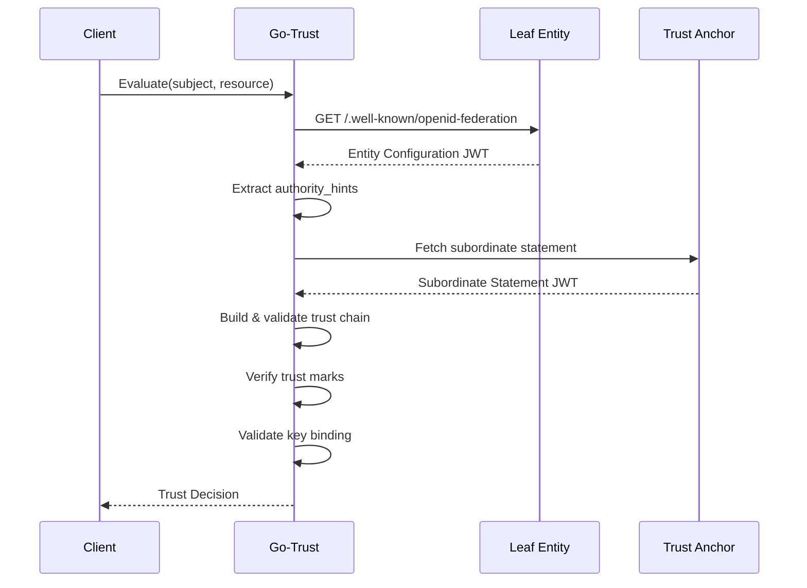

# OpenID Federation

This guide covers how to participate in and operate [OpenID Federation](https://openid.net/specs/openid-federation-1_0.html) trust networks for digital credential ecosystems. OpenID Federation enables dynamic trust establishment between issuers, verifiers, and wallets through cryptographically verified trust chains.

:::tip Prerequisites
Before setting up OpenID Federation, ensure you understand:
- [Trust Services Overview](./index.md) – Core concepts and supported frameworks
- [Go-Trust](./go-trust.md) – The trust abstraction layer that consumes federation trust chains
:::

## Overview

OpenID Federation is a trust framework where entities establish trust relationships through a hierarchy of **Trust Anchors**, **Intermediate Entities**, and **Leaf Entities**. Trust is verified by resolving and validating cryptographic **trust chains** from a leaf entity back to a known trust anchor.



### Key Concepts

| Term | Description |
|------|-------------|
| **Trust Anchor** | The root of trust in a federation. Publishes its own entity configuration and issues subordinate statements for intermediate entities or leaf entities. |
| **Entity Configuration** | A JWT at `/.well-known/openid-federation` containing the entity's keys, metadata, and authority hints. |
| **Subordinate Statement** | A JWT signed by a superior entity (TA or intermediate) asserting trust in a subordinate entity. |
| **Trust Chain** | The sequence of entity statements from a leaf entity to a trust anchor that establishes trust. |
| **Trust Mark** | A signed assertion that an entity has been evaluated and meets certain criteria (e.g., compliance certification). |

## Setting Up a Trust Anchor

A Trust Anchor (TA) is the root of trust for your federation. For production deployments, we recommend using **[Inmor](https://inmor.readthedocs.io)** — an open-source Trust Anchor implementation developed by SUNET.

### Using Inmor (Recommended)

[Inmor](https://github.com/SUNET/inmor) is a production-ready Trust Anchor implementation for OpenID Federation. It provides:

- **Entity Configuration endpoint** (`/.well-known/openid-federation`)
- **Subordinate Listing endpoint** (`/.well-known/openid-federation/list`)
- **Fetch endpoint** for subordinate statements
- **Trust Mark issuance** for certified entities
- **Key management** with automatic rotation support
- **PostgreSQL backend** for entity and trust mark storage
- **Docker deployment** for quick setup

#### Quick Start with Docker

```bash
# Clone the repository
git clone https://github.com/SUNET/inmor.git
cd inmor

# Start with Docker Compose (includes PostgreSQL)
docker-compose up -d
```

The development setup includes pre-generated signing keys. For production, generate your own keys:

```bash
# Generate Trust Anchor signing key
openssl ecparam -genkey -name prime256v1 -out ta-key.pem
openssl ec -in ta-key.pem -pubout -out ta-pub.pem
```

#### Configuration

Inmor uses environment variables or a configuration file. Key settings:

| Variable | Description | Example |
|----------|-------------|---------|
| `INMOR_ENTITY_ID` | The Trust Anchor's entity identifier (URL) | `https://federation.example.com` |
| `INMOR_SIGNING_KEY_PATH` | Path to the private signing key | `/keys/ta-key.pem` |
| `INMOR_DATABASE_URL` | PostgreSQL connection string | `postgresql://user:pass@db/inmor` |
| `INMOR_METADATA` | JSON metadata for the Trust Anchor | `{"organization_name": "Example Federation"}` |

For detailed configuration options, see the [Inmor documentation](https://inmor.readthedocs.io/en/latest/configuration/).

#### Federation Endpoints

Once running, Inmor exposes:

| Endpoint | Purpose |
|----------|---------|
| `/.well-known/openid-federation` | Entity configuration JWT |
| `/.well-known/openid-federation/list` | List of subordinate entity IDs |
| `/fetch?sub=<entity_id>` | Fetch subordinate statement for an entity |
| `/trust_mark` | Issue trust marks |
| `/trust_mark_status` | Check trust mark validity |

### Manual Trust Anchor Setup

If you need a minimal Trust Anchor without Inmor, you can create static entity configurations:

1. **Generate signing keys:**
   ```bash
   openssl ecparam -genkey -name prime256v1 -out ta-key.pem
   ```

2. **Create entity configuration JWT** at `/.well-known/openid-federation`:
   ```json
   {
     "iss": "https://federation.example.com",
     "sub": "https://federation.example.com",
     "iat": 1678886400,
     "exp": 1710422400,
     "jwks": {
       "keys": [{ "kty": "EC", "crv": "P-256", ... }]
     },
     "metadata": {
       "federation_entity": {
         "organization_name": "Example Federation"
       }
     }
   }
   ```

3. **Sign with the TA key** using a JWT library.

:::warning
Manual setup requires you to manage key rotation, subordinate statements, and trust marks yourself. Use Inmor for production deployments.
:::

## Registering Entities

### Onboarding an Issuer or Verifier

To add an entity to your federation:

1. **Entity creates its entity configuration** at `/.well-known/openid-federation`
2. **Entity requests registration** with the Trust Anchor
3. **Trust Anchor creates a subordinate statement** for the entity
4. **Trust Anchor adds entity to subordinate list**

With Inmor, use the admin API:

```bash
curl -X POST https://federation.example.com/admin/entities \
  -H "Authorization: Bearer <admin-token>" \
  -H "Content-Type: application/json" \
  -d '{
    "entity_id": "https://issuer.example.com",
    "entity_types": ["openid_credential_issuer"],
    "trust_marks": ["https://federation.example.com/tm/issuer"]
  }'
```

### Entity Types

OpenID Federation defines standard entity types for credential ecosystems:

| Entity Type | Description |
|-------------|-------------|
| `openid_provider` | OpenID Connect Provider |
| `openid_relying_party` | OpenID Connect Relying Party |
| `openid_credential_issuer` | Verifiable Credential Issuer (OpenID4VCI) |
| `oauth_authorization_server` | OAuth 2.0 Authorization Server |
| `wallet_provider` | Digital Wallet Provider |
| `federation_entity` | Federation entity (TA, intermediate) |

## Configuring Go-Trust for OpenID Federation

Go-Trust can validate trust chains against configured trust anchors. Add the OpenID Federation registry to your configuration:

```yaml
registries:
  oidfed:
    enabled: true
    name: "OpenID Federation"
    description: "OpenID Federation trust chain validation"
    
    # Trust Anchors - entities you trust as roots
    trust_anchors:
      - entity_id: "https://federation.example.com"
        # Optional: provide JWKS if you want to pin the TA keys
        # jwks: { "keys": [...] }
      
      - entity_id: "https://dc4eu.eu"
        # DC4EU pilot federation
    
    # Required trust marks (optional) - entities must have these marks
    required_trust_marks:
      - "https://federation.example.com/tm/certified"
    
    # Entity type filter (optional) - only trust these entity types
    entity_types:
      - "openid_credential_issuer"
      - "wallet_provider"
    
    # Caching
    cache_ttl: "5m"
    max_cache_size: 1000
    
    # Chain resolution limits
    max_chain_depth: 5
```

### Policy-Based Federation Trust

Define policies that require federation trust for specific actions:

```yaml
policies:
  policies:
    credential-issuer:
      description: "Trust requirements for credential issuers"
      oidfed:
        entity_types:
          - "openid_credential_issuer"
        required_trust_marks:
          - "https://dc4eu.eu/tm/issuer"
    
    wallet-provider:
      description: "Trust requirements for wallets"
      oidfed:
        entity_types:
          - "wallet_provider"
        required_trust_marks:
          - "https://dc4eu.eu/tm/wallet"
```

### Trust Evaluation Flow

When Go-Trust evaluates an OpenID Federation request:



## Trust Marks

Trust marks are signed attestations that an entity has been evaluated and meets certain criteria. They're useful for:

- **Certification**: Proving compliance with standards
- **Accreditation**: Membership in an industry group
- **Qualification**: Regulatory status (e.g., eIDAS qualified)

### Issuing Trust Marks with Inmor

```bash
curl -X POST https://federation.example.com/admin/trust_marks \
  -H "Authorization: Bearer <admin-token>" \
  -H "Content-Type: application/json" \
  -d '{
    "subject": "https://issuer.example.com",
    "trust_mark_id": "https://federation.example.com/tm/certified",
    "expires_at": "2025-12-31T23:59:59Z"
  }'
```

### Verifying Trust Marks

Go-Trust validates trust marks during trust chain resolution. Configure required trust marks:

```yaml
registries:
  oidfed:
    required_trust_marks:
      # Only trust entities with this mark
      - "https://federation.example.com/tm/certified"
```

## Integration with EU Digital Identity Wallet

The [DC4EU](https://dc4eu.eu) (Digital Credentials for Europe) consortium operates a pilot federation for EUDI Wallet interoperability. To integrate:

1. **Register with DC4EU** as an issuer or verifier
2. **Configure Go-Trust** with the DC4EU trust anchor:
   ```yaml
   registries:
     oidfed:
       trust_anchors:
         - entity_id: "https://dc4eu.eu"
       required_trust_marks:
         - "https://dc4eu.eu/tm/wallet"
         - "https://dc4eu.eu/tm/issuer"
   ```
3. **Obtain trust marks** for your issuer/verifier/wallet

## Further Reading

- [OpenID Federation 1.0 Specification](https://openid.net/specs/openid-federation-1_0.html)
- [Inmor Documentation](https://inmor.readthedocs.io/en/latest/)
- [Inmor GitHub Repository](https://github.com/SUNET/inmor)
- [DC4EU Federation](https://dc4eu.eu)
- [Go-Trust OpenID Federation Registry](./go-trust#openid-federation)
