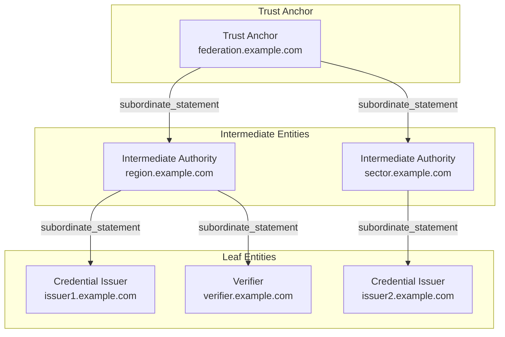
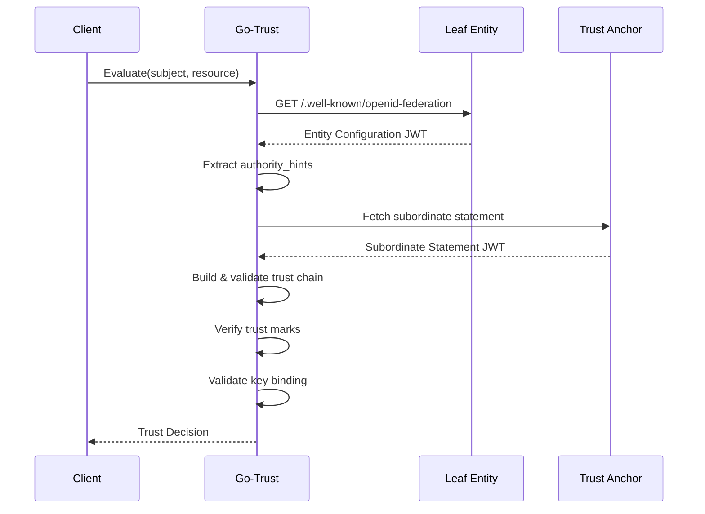

# OpenID Federation

This guide covers how to participate in and operate [OpenID Federation](https://openid.net/specs/openid-federation-1_0.html) trust networks for digital credential ecosystems. OpenID Federation enables dynamic trust establishment between issuers, verifiers, and wallets through cryptographically verified trust chains.

:::tip Prerequisites
Before setting up OpenID Federation, ensure you understand:
- [Trust Services Overview](./index.md) – Core concepts and supported frameworks
- [Go-Trust](./go-trust.md) – The trust abstraction layer that consumes federation trust chains
:::

## Overview

OpenID Federation is a trust framework where entities establish trust relationships through a hierarchy of **Trust Anchors**, **Intermediate Entities**, and **Leaf Entities**. Trust is verified by resolving and validating cryptographic **trust chains** from a leaf entity back to a known trust anchor.


```mermaid
flowchart TD
    subgraph "Trust Anchor"
        TA[Trust Anchor<br/>federation.example.com]
    end
    
    subgraph "Intermediate Entities"
        INT1[Intermediate Authority<br/>region.example.com]
        INT2[Intermediate Authority<br/>sector.example.com]
    end
    
    subgraph "Leaf Entities"
        ISS1[Credential Issuer<br/>issuer1.example.com]
        ISS2[Credential Issuer<br/>issuer2.example.com]
        VER1[Verifier<br/>verifier.example.com]
    end
    
    TA -->|subordinate_statement| INT1
    TA -->|subordinate_statement| INT2
    INT1 -->|subordinate_statement| ISS1
    INT1 -->|subordinate_statement| VER1
    INT2 -->|subordinate_statement| ISS2
```

### Key Concepts

| Term | Description |
|------|-------------|
| **Trust Anchor** | The root of trust in a federation. Publishes its own entity configuration and issues subordinate statements for intermediate entities or leaf entities. |
| **Entity Configuration** | A JWT at `/.well-known/openid-federation` containing the entity's keys, metadata, and authority hints. |
| **Subordinate Statement** | A JWT signed by a superior entity (TA or intermediate) asserting trust in a subordinate entity. |
| **Trust Chain** | The sequence of entity statements from a leaf entity to a trust anchor that establishes trust. |
| **Trust Mark** | A signed assertion that an entity has been evaluated and meets certain criteria (e.g., compliance certification). |

## Setting Up a Trust Anchor

A Trust Anchor (TA) is the root of trust for your federation. For production deployments, we recommend using **[Inmor](https://inmor.readthedocs.io)** — an open-source Trust Anchor implementation developed by SUNET.

### Using Inmor (Recommended)

[Inmor](https://github.com/SUNET/inmor) is a production-ready Trust Anchor implementation for OpenID Federation. It provides:

- **Entity Configuration endpoint** (`/.well-known/openid-federation`)
- **Federation endpoints**: fetch, list, resolve, trust mark, trust mark status, trust mark list and historical keys
- **Trust Mark issuance** for certified entities
- **Admin portal and REST API** for subordinates and trust marks
- **Redis storage** for federation data
- **Docker deployment** for quick setup

#### Quick Start with Docker

```bash
# Clone the repository
git clone https://github.com/SUNET/inmor.git
cd inmor

# Build and start all services (see the repository's installation guide)
just build
just build-rs
just up
```

The repository includes development signing keys, so no key generation is needed to get started. For production, generate your own keys (the repository's `scripts/create-keys.py` generates a key set) and follow the Inmor installation guide.

#### Configuration

The Trust Anchor reads `taconfig.toml`; the admin portal is configured through Django settings (`localsettings.py`). Key settings:

| Setting | Where | Description |
|---------|-------|-------------|
| `domain` | `taconfig.toml` | The Trust Anchor's entity identifier URL; must match its public URL |
| `redis_uri` | `taconfig.toml` | Redis connection URI |
| `tls_cert`, `tls_key` | `taconfig.toml` | TLS certificate and key (optional behind a reverse proxy) |
| `TA_DOMAIN` | admin `localsettings.py` | Trust Anchor entity ID; must match `domain` |
| `TRUSTMARK_PROVIDER` | admin `localsettings.py` | Endpoint for trust mark services (usually `TA_DOMAIN`) |

For detailed configuration options, see the [Inmor documentation](https://inmor.readthedocs.io/en/latest/configuration.html).

#### Federation Endpoints

Once running, Inmor exposes:

| Endpoint | Purpose |
|----------|---------|
| `/.well-known/openid-federation` | Entity configuration JWT |
| `/list` | List of subordinate entity IDs |
| `/fetch?sub=<entity_id>` | Fetch subordinate statement for an entity |
| `/resolve` | Resolve a trust chain |
| `/trust_mark` | Retrieve a trust mark |
| `/trust_mark_status` | Check trust mark validity |
| `/trust_mark_list` | List trust marks |

These URLs are advertised in the entity configuration's `federation_entity` metadata (`federation_fetch_endpoint`, `federation_list_endpoint`, and so on).

### Manual Trust Anchor Setup

If you need a minimal Trust Anchor without Inmor, you can create static entity configurations:

1. **Generate signing keys:**
   ```bash
   openssl ecparam -genkey -name prime256v1 -out ta-key.pem
   ```

2. **Create entity configuration JWT** at `/.well-known/openid-federation`:
   ```json
   {
     "iss": "https://federation.example.com",
     "sub": "https://federation.example.com",
     "iat": 1678886400,
     "exp": 1710422400,
     "jwks": {
       "keys": [{ "kty": "EC", "crv": "P-256", ... }]
     },
     "metadata": {
       "federation_entity": {
         "organization_name": "Example Federation"
       }
     }
   }
   ```

3. **Sign with the TA key** using a JWT library.

:::warning
Manual setup requires you to manage key rotation, subordinate statements, and trust marks yourself. Use Inmor for production deployments.
:::

## Registering Entities

### Onboarding an Issuer or Verifier

To add an entity to your federation:

1. **Entity creates its entity configuration** at `/.well-known/openid-federation`
2. **Entity requests registration** with the Trust Anchor
3. **Trust Anchor creates a subordinate statement** for the entity
4. **Trust Anchor adds entity to subordinate list**

With Inmor, register the entity as a subordinate through the admin API (authenticated with an API key):

```bash
curl -X POST http://localhost:8000/api/v1/subordinates \
  -H "X-API-Key: $INMOR_API_KEY" \
  -H "Content-Type: application/json" \
  -d '{
    "entityid": "https://issuer.example.com",
    "metadata": {"openid_credential_issuer": {"credential_issuer": "https://issuer.example.com"}},
    "jwks": {"keys": [{"kty": "EC", "crv": "P-256", "x": "...", "y": "..."}]},
    "forced_metadata": {}
  }'
```

See Inmor's admin API documentation for the full request schema and for the optional `fetch-config` helper.

### Entity Types

OpenID Federation defines standard entity types for credential ecosystems:

| Entity Type | Description |
|-------------|-------------|
| `openid_provider` | OpenID Connect Provider |
| `openid_relying_party` | OpenID Connect Relying Party |
| `openid_credential_issuer` | Verifiable Credential Issuer (OpenID4VCI) |
| `oauth_authorization_server` | OAuth 2.0 Authorization Server |
| `wallet_provider` | Digital Wallet Provider |
| `federation_entity` | Federation entity (TA, intermediate) |

## Configuring Go-Trust for OpenID Federation

Go-Trust can validate trust chains against configured trust anchors. Add the OpenID Federation registry to your configuration:

```yaml
registries:
  oidfed:
    enabled: true
    description: "OpenID Federation trust chain validation"
    
    # Trust Anchors - entities you trust as roots
    trust_anchors:
      - entity_id: "https://federation.example.com"
        # Optional: provide JWKS if you want to pin the TA keys
        # jwks: '{"keys":[...]}'   # a JWKS document as a JSON string
      
      - entity_id: "https://dc4eu.eu"
        # DC4EU pilot federation
    
    # Required trust marks (optional) - entities must have these marks
    required_trust_marks:
      - "https://federation.example.com/tm/certified"
    
    # Entity type filter (optional) - only trust these entity types
    entity_types:
      - "openid_credential_issuer"
      - "wallet_provider"
    
    # Caching
    cache_ttl: "5m"
    max_cache_size: 1000
    
    # Chain resolution limits
    max_chain_depth: 5
```

This registry always reports the name `oidfed-registry`; a `name:` key in the `oidfed` block is not used. Refer to it by that name in a policy's `registries:` list.

### Policy-Based Federation Trust

Define policies that require federation trust for specific actions:

```yaml
policies:
  policies:
    credential-issuer:
      description: "Trust requirements for credential issuers"
      oidfed:
        entity_types:
          - "openid_credential_issuer"
        required_trust_marks:
          - "https://dc4eu.eu/tm/issuer"
    
    wallet_provider:
      description: "Trust requirements for wallets"
      oidfed:
        entity_types:
          - "wallet_provider"
        required_trust_marks:
          - "https://dc4eu.eu/tm/wallet"
```

### Trust Evaluation Flow

When Go-Trust evaluates an OpenID Federation request:


```mermaid
sequenceDiagram
    participant Client
    participant GoTrust as Go-Trust
    participant Leaf as Leaf Entity
    participant TA as Trust Anchor
    
    Client->>GoTrust: Evaluate(subject, resource)
    GoTrust->>Leaf: GET /.well-known/openid-federation
    Leaf-->>GoTrust: Entity Configuration JWT
    GoTrust->>GoTrust: Extract authority_hints
    GoTrust->>TA: Fetch subordinate statement
    TA-->>GoTrust: Subordinate Statement JWT
    GoTrust->>GoTrust: Build & validate trust chain
    GoTrust->>GoTrust: Verify trust marks
    GoTrust->>GoTrust: Validate key binding
    GoTrust-->>Client: Trust Decision
```

## Trust Marks

Trust marks are signed attestations that an entity has been evaluated and meets certain criteria. They're useful for:

- **Certification**: Proving compliance with standards
- **Accreditation**: Membership in an industry group
- **Qualification**: Regulatory status (e.g., eIDAS qualified)

### Issuing Trust Marks with Inmor

```bash
curl -X POST http://localhost:8000/api/v1/trustmarks \
  -H "X-API-Key: $INMOR_API_KEY" \
  -H "Content-Type: application/json" \
  -d '{
    "tmt": 1,
    "domain": "https://issuer.example.com"
  }'
```

`tmt` is the id of a trust mark type previously created with `POST /api/v1/trustmarktypes`.

### Verifying Trust Marks

Go-Trust validates trust marks during trust chain resolution. Configure required trust marks:

```yaml
registries:
  oidfed:
    required_trust_marks:
      # Only trust entities with this mark
      - "https://federation.example.com/tm/certified"
```

## Integration with EU Digital Identity Wallet

The [DC4EU](https://dc4eu.eu) (Digital Credentials for Europe) consortium operates a pilot federation for EUDI Wallet interoperability. To integrate:

1. **Register with DC4EU** as an issuer or verifier
2. **Configure Go-Trust** with the DC4EU trust anchor:
   ```yaml
   registries:
     oidfed:
       trust_anchors:
         - entity_id: "https://dc4eu.eu"
       required_trust_marks:
         - "https://dc4eu.eu/tm/wallet"
         - "https://dc4eu.eu/tm/issuer"
   ```
3. **Obtain trust marks** for your issuer/verifier/wallet

## Further Reading

- [OpenID Federation 1.0 Specification](https://openid.net/specs/openid-federation-1_0.html)
- [Inmor Documentation](https://inmor.readthedocs.io/en/latest/)
- [Inmor GitHub Repository](https://github.com/SUNET/inmor)
- [DC4EU Federation](https://dc4eu.eu)
- [Go-Trust OpenID Federation Registry](./go-trust#openid-federation)
